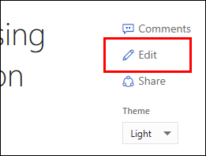
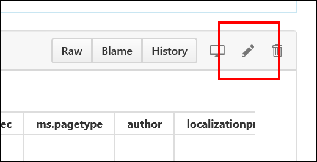
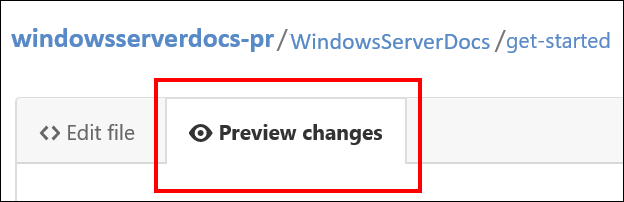
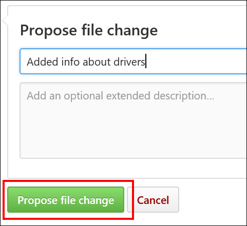
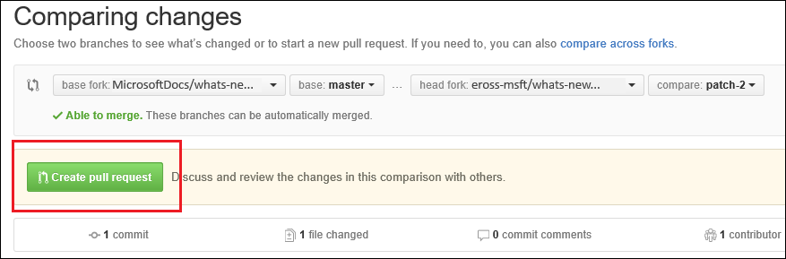

# Contributing to Windows Server technical documentation

Thank you for your interest in the Windows Server technical documentation! We appreciate your feedback, edits, and additions to our docs. There are two separate locations where we keep Windows Server technical content. One of the locations is public (windowsserverdocs) while the other is private (windowsserverdocs-pr). Who you are determines which location you contribute to:

- **I'm not a Microsoft employee.** As a non-Microsoft employee, you must contribute to the public location. For information about how to do that, continue reading this article.

- **I'm a Microsoft employee.** As a Microsoft employee, you have options, based on what you're trying to do:

    - **Create a brand-new article.** To create a brand-new article, you must create and set up your GitHub account and tools, fork and clone the windowsserverdocs-pr repo, set up your remote branch, create the article, and finally create a new pull request for approval and publishing. For these instructions, see the [Create new Windows Server articles using GitHub and Visual Studio Code](https://github.com/MicrosoftDocs/windowsserverdocs/blob/master/Contributor-guide/create-new-using-github.md) article.

    - **Make large changes to an existing article.** To make substantial changes to an existing article, you can follow the instructions in the [Edit an existing Windows Server article using GitHub and Visual Studio Code](https://github.com/MicrosoftDocs/windowsserverdocs/blob/master/Contributor-guide/edit-existing-using-github.md) article.

    - **Make minor changes to an existing article.** To make minor changes to an existing article, you can follow the instructions in the [Update existing Windows Server articles using a web browser and GitHub](https://github.com/MicrosoftDocs/windowsserverdocs/blob/master/Contributor-guide/github-browser-updates.md) article.

## Sign a CLA

All contributors who are ***not*** a Microsoft employee must [sign a Microsoft Contribution Licensing Agreement (CLA)](https://cla.microsoft.com/) before editing any Microsoft repositories. 
If you've already edited within Microsoft repositories in the past, congratulations!
You've already completed this step.

## Editing topics

We've tried to make editing an existing, public file as simple as possible.

### To edit a topic

1. Go to the page on https://docs.microsoft.com/windows-server that you want to update, and then select **Edit**.

    

2. Sign in to (or sign up for) a GitHub account.

    You must have a GitHub account to get to the page that lets you edit a topic.

3. Select the **Pencil** icon (in the red box) to edit the content.

    

4. Using Markdown language, make your changes to the topic. For info about how to edit content using Markdown, see:

    - **If you're linked to the Microsoft organization in GitHub:** [Windows Server Contributor's Guide](https://github.com/MicrosoftDocs/windowsserverdocs-pr/tree/master/Contributor-guide)

    - **If you're external to Microsoft:** [Mastering Markdown](https://guides.github.com/features/mastering-markdown/)

5. Make your suggested change, and then select **Preview Changes** to make sure it looks correct.

    

6. When you’re done editing the topic, scroll to the bottom of the page, type a descriptive name for your fork, and then click **Propose file change** to create the fork in your personal GitHub account.

    

    The **Comparing changes** screen appears to see what the changes are between your fork and the original content.

7. On the **Comparing changes** screen, you’ll see if there are any problems with the file you’re checking in.

    If there are no problems, you’ll see the message, **Able to merge**.

    

8. Select **Create pull request**.

    Pull requests let you tell others about changes you've pushed to a branch in a repository on GitHub. After a pull request is opened, you can discuss and review the potential changes with collaborators and add follow-up commits before your changes are merged into the base branch. For more information, see [About pull requests](https://help.github.com/articles/about-pull-requests)

9. Enter a title and description to give the approver the appropriate context about what’s in the request.

10. Scroll to the bottom of the page, making sure that only your changed files are in this pull request. Otherwise, you could overwrite changes from other people.

11. Select **Create pull request** again to actually submit the pull request.

    The pull request is sent to the writer of the topic and your edits are reviewed. If your request is accepted, your updates are published.

## Resources

- You can use your favorite text editor to edit Markdown. We recommend [Visual Studio Code](https://code.visualstudio.com/), a free lightweight open source editor from Microsoft.