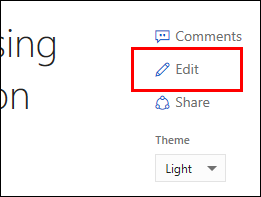
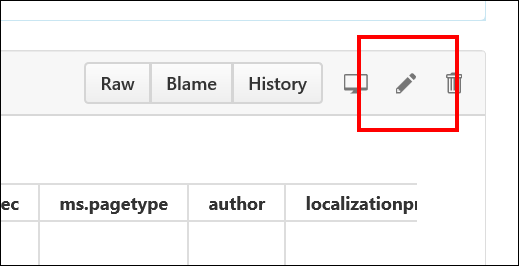
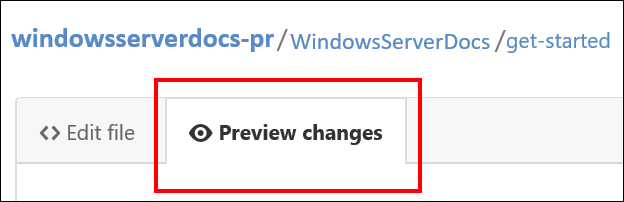
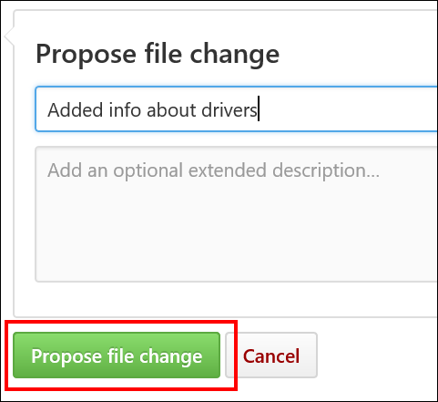
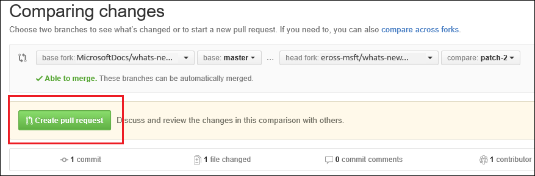

# Contributing to Windows Server technical documentation

Thank you for your interest in the Windows Server technical documentation! We appreciate your feedback, edits, and additions to our docs. There are a few ways to contribute, depending on the size of your change:

- **Create a brand-new article.** Create and set up your GitHub account and tools, fork and clone this repo, set up your remote branch, create the article, and then create a pull request for review and publishing. For these instructions, see the [Create new Windows Server articles using GitHub and Visual Studio Code](https://github.com/MicrosoftDocs/windowsserverdocs/blob/main/Contributor-guide/create-new-using-github.md) article.

- **Make large changes to an existing article.** To make substantial changes to an existing article, follow the instructions in the [Edit an existing Windows Server article using GitHub and Visual Studio Code](https://github.com/MicrosoftDocs/windowsserverdocs/blob/main/Contributor-guide/edit-existing-using-github.md) article.

- **Make minor changes to an existing article.** To make minor changes to an existing article, follow the instructions in the [Update existing Windows Server articles using a web browser and GitHub](https://github.com/MicrosoftDocs/windowsserverdocs/blob/main/Contributor-guide/github-browser-updates.md) article.

## How your pull request gets reviewed and merged

Every pull request (PR) goes through the same simple lifecycle:

1. **Open your PR.** If it's still a work in progress, open it as a **draft**. Draft pull requests don't get inactivity reminders, so take the time you need.
1. **Mark it ready.** When your changes are ready, comment `#sign-off` to request review and merge. Only the listed authors of the changed files can sign off.
1. **Review.** A member of the content team reviews your PR and might suggest changes. Reply to the comments and update your branch.
1. **Merge and publish.** After sign-off and review, your PR is merged and your changes publish to Microsoft Learn.

### Comment commands

Steer your pull request with these comments:

| Comment | What it does |
| --- | --- |
| `#sign-off` | Marks the pull request ready for review and merge. |
| `#hold-off` | Pauses merge. |
| `#please-close` | Closes the pull request. |
| `#please-open` | Reopens a closed pull request. |
| `#label:"keep-open"` | Pauses inactivity reminders (adds the `keep-open` label). |
| `#assign-reviewer:<github-account>` | Requests a review from a specific person. |

### Inactivity reminders

To help keep things moving, a pull request with no activity for 7 days gets an `inactive` label and a reminder comment. With no further activity, the pull request closes 14 days later. To avoid this:

- Keep a work-in-progress pull request as a **draft**.
- Comment `#label:"keep-open"` to pause reminders when a pull request is ready but long-running, such as a release.

You can reopen a closed pull request at any time.

## Sign a CLA

Most contributors need to [sign a Microsoft Contribution Licensing Agreement (CLA)](https://cla.microsoft.com/) before their first change can be merged. When a signature is needed, the CLA bot comments on your pull request with what to do. If you've contributed to a Microsoft repository before, you've already completed this step.

## Editing topics

We've tried to make editing an existing, public file as simple as possible.

### To edit a topic

1. Browse to the [Windows Server](https://learn.microsoft.com/windows-server) article that you want to update, and then select **Edit**.

    

2. Sign in to (or sign up for) a GitHub account.

    You must have a GitHub account to get to the page that lets you edit a topic.

3. Select the **Pencil** icon (in the red box) to edit the content.

    

4. Using Markdown language, make your changes to the topic. For info about how to edit content using Markdown, see:

    - [Windows Server Contributor's Guide](https://github.com/MicrosoftDocs/windowsserverdocs/tree/main/Contributor-guide)

    - [Mastering Markdown](https://guides.github.com/features/mastering-markdown/)

5. Make your suggested change, and then select **Preview Changes** to make sure it looks correct.

    

6. When you’re done editing the topic, scroll to the bottom of the page, type a descriptive name for your fork, and then click **Propose file change** to create the fork in your personal GitHub account.

    

    The **Comparing changes** screen appears to see what the changes are between your fork and the original content.

7. On the **Comparing changes** screen, you’ll see if there are any problems with the file you’re checking in.

    If there are no problems, you’ll see the message, **Able to merge**.

    

8. Select **Create pull request**.

    Pull requests let you tell others about changes you've pushed to a branch in a repository on GitHub. After a pull request is opened, you can discuss and review the potential changes with collaborators and add follow-up commits before your changes are merged into the base branch. For more information, see [About pull requests](https://help.github.com/articles/about-pull-requests)

9. Enter a title and description to give the approver the appropriate context about what’s in the request.

10. Scroll to the bottom of the page, making sure that only your changed files are in this pull request. Otherwise, you could overwrite changes from other people.

11. Select **Create pull request** again to actually submit the pull request.

    The pull request is sent to the writer of the topic and your edits are reviewed. If your request is accepted, your updates are published.

## Resources

- You can use your favorite text editor to edit Markdown. We recommend [Visual Studio Code](https://code.visualstudio.com/), a free lightweight open source editor from Microsoft.
