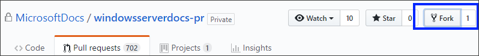
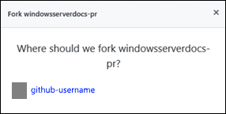

# Create new Windows Server articles using GitHub and Visual Studio Code

There are two separate locations where we keep Windows Server technical content. One of the locations is public (windowsserverdocs) while the other is private (windowsserverdocs-pr). Who you are determines which location you contribute to:

- **I'm a Microsoft employee.** As a Microsoft employee, you have options, based on what you're trying to do:

    - **Create a brand-new article.** To create a brand-new article, you must create and set up your GitHub account and tools, fork and clone the windowsserverdocs-pr repo, set up your remote branch, create the article, and finally create a new pull request for approval and publishing. For these instructions, continue reading this article.

    - **Make large changes to an existing article.** To make substantial changes to an existing article, you can follow the instructions in the [Edit an existing Windows Server article using GitHub and Visual Studio Code](edit-existing-using-github.md) article.

    - **Make minor changes to an existing article.** To make minor changes to an existing article, you can follow the instructions in the [Update existing Windows Server articles using a web browser and GitHub](github-browser-updates.md) article.

- **I'm not a Microsoft employee.** As a non-Microsoft employee, you must contribute to the public location. For information about how to do that, see the [Contributing to Windows Server technical documentation](https://github.com/MicrosoftDocs/windowsserverdocs/blob/master/CONTRIBUTING.md) article.

## Prerequisites

Before you can start working in the repo, you must create and set up your GitHub account, set up two-factor verification, and install and configure all the necessary tools. If you've already done this, you can skip down to the [Fork the repository section](#fork-the-repository) of this article.

1. [Create a GitHub account and profile](https://review.docs.microsoft.com/help/contribute/contribute-get-started-setup-github?branch=master#create-a-github-account-and-set-up-your-profile)

2. [Link your account to your Microsoft account and to the Microsoft and MicrosoftDocs organizations](https://review.docs.microsoft.com/help/contribute/contribute-get-started-setup-github?branch=master#link-your-github-and-microsoft-accounts)

3. [Turn on two-factor verification](https://review.docs.microsoft.com/help/contribute/contribute-get-started-setup-github?branch=master#enable-two-factor-authentication-and-create-an-access-token)

4. [Authorize the build system to access your GitHub account](https://review.docs.microsoft.com/help/contribute/contribute-get-started-setup-github?branch=master#authorize-the-ops-build-system-to-access-your-github-account)

5. [Install Visual Studio Code](https://review.docs.microsoft.com/help/contribute/contribute-get-started-setup-tools?branch=master#install-visual-studio-code)

6. [Install GitHub and its tools](https://review.docs.microsoft.com/help/contribute/contribute-get-started-setup-tools?branch=master#install-git-client-tools)

7. [Install the Docs Authoring Pack](https://review.docs.microsoft.com/help/contribute/contribute-get-started-setup-tools?branch=master#install-the-docs-authoring-pack)

## Set up your own version of the repo

After you've created and set up your GitHub account and tools, you can create a personal version of your repo. This is where you will create your branches and make all your changes.

### Fork the repository

You need a local copy of the source files, so you can create pull requests from your fork to the production repository.

#### To fork the repository

1. Sign in to your GitHub account and go to https://github.com/microsoftdocs/windowsserverdocs-pr.

2. Select **Fork**.

    

3. Select your GitHub account as the fork location.

    

### Clone the repository

You need to clone the repo get a local copy of the repo on to your local device.

#### To clone the repository

1. Go to https://github.com/settings/developers, and then select **Personal access tokens** from the left pane.

2. Select **Generate new token**, give your token a meaningful and unique name, select all the available scopes, and then select **Generate token**.

3. Copy the token and put it somewhere safe. You'll need this for the rest of the process and after you leave the page, you won't be able to get back to it.

4. Open a Git Bash command and change directories to where you want to store your repo. We recommend using, `C:\users\<your_name>\GitHub`.

5. Type the following commands using your specific information, one at a time, to clone your repo and set up your remote branches:

    ```markdown

    git clone https://<your_github_username>:<your_personal_access_token>@github.com/<your_github_username>/windowsserverdocs-pr.git

    cd windowsserverdocs-pr

    git remote add upstream https://<your_github_username>:<your_personal_access_token>@github.com/MicrosoftDocs/windowsserverdocs-pr.git

    git fetch upstream master
    ```

6. Run this command to make sure your remote is properly set up:

    `git remote -v`

7. You should see something like this output:

    ```markdown
    $ git remote -v

    origin https://github.com/<your_github_username>/windowsserverdocs-pr.git (fetch)
    origin https://github.com/<your_github_username>/windowsserverdocs-pr.git (push)
    upstream https://github.com/MicrosoftDocs/windowsserverdocs-pr.git (fetch)
    upstream https://github.com/MicrosoftDocs/windowsserverdocs-pr.git (push)
    ```

    If your remote output doesn't look like this, you can try again by first running `git remote remove upstream`.

## Create a branch and a new article

Follow these steps to create an article.

### Create a new branch and a new file

Before you can start to work on your content, you must create a new branch in your local repo.

#### To create a new branch in Git Bash

- Open Git Bash and type the commands (one at a time):

    ```markdown
    cd windowsserverdocs-pr

    git checkout –B <name_of_your_new_branch>

    git push origin <name_of_your_new_branch>
    ```

    >[!Note]
    >We highly recommend naming your branch something obvious and unique so you can find it again later.

    After the commands finish, you'll be in your new branch and ready to create your new file. You only need to change into the windowsserverdocs-pr repo once per instance of your Git Bash. If you close Git Bash, you will need to change directories again after you open it.

#### To create a new file in your branch

1. Open Windows Explorer, go to your GitHub directory, and create a new text file in the folder structure. Your file name must be all lowercase and separated by hyphens. For example, _what-is-windows-server.md_.

     You must also change the file extension from .txt to .md. In the error message that appears, select **Yes** to save the file with the new file extension.

2. Open Visual Studio Code and go to **File**, select **Open folder**, and then go to the GitHub location of the file you created in Step 1.

3. From the **Explorer** pane, select your new file.

4. Add your text to the page. If you're creating a new article, make sure you [Add the required metadata tags to your Windows Server-related article](metadata-requirements-for-articles.md).

5. Select **File** > **Save**.

### Preview your text

After you add your text to your new file, you must preview your changes to make sure they appear correctly.

#### To preview your text

1. In Visual Studio Code, select either of the **Preview** buttons from the upper right-hand corner.

    : Switches to a full-page preview of your content.

    : Opens the preview page next to your working page, side-by-side.

2. Make sure your article looks how you expect it to look.

    After you're sure it looks right, you can commit your changes and create a pull request for publication.

### Commit your changes

After you make sure your text looks right, you can commit your changes to your local version of your repo.

#### To commit your changes

- Open Git Bash and type the commands (one at a time, removing the OPTIONAL tags):

    ```markdown
    OPTIONAL: git status

    git add .

    git commit -m “public comment about what change is”

    OPTIONAL: git pull upstream master

    git push origin <name_of_your_new_branch>

    ```

    The optional git status command shows you which files have been modified as part of this commit. The optional git pull upstream master pulls down the latest content changes from the MicrosoftDocs master branch, syncing your local content with the primary master content. This helps to show you any potential merge conflicts ahead of time so you can fix them before you get to the PR stage.

### Submit a pull request for review and publication

After you've completed your article, you must get approval from your writer (allow some time for this) for publication.

#### To submit your pull request

1. Go to https://github.com/MicrosoftDocs/windowsserverdocs-pr and select the **Pull requests** tab.

2. In the **Reviewers** area of the right pane, select the gear icon, and then enter the _windowsservercontent_ alias for review.

    A member of the _windowsservercontent_ alias will review your changes or add comments about things that must be changed before merging can happen.

3. Type **#sign-off** into the comments so that the reviewers know you're handing off for both review and publishing. The **#sign-off** comment:

    - Updates the label for your pull request from **do-not-merge** to **ready-to merge**.

    - Lets the alias and writers know that you're ready to have your content reviewed.

    - Lets the admins know that after approval, your content is ready go live.

    >[!Important]
    >After you add the #sign-off comment, a member of the windowsservercontent team will review the text and push it to master so it will go out with the next scheduled publish to live (10:30am and 3:30pm weekdays).
    >
    >If you don't add #sign-off as a final comment to your PR, your content will remain in the queue without being pushed to Master and ultimately to Live.

## Related information

For more information about GitHub and the markdown language, see:

### Git concepts

- [GitHub Guides-Git Handbook Intro](https://guides.github.com/introduction/git-handbook/)

- [GitHub Guides-Forking projects](https://guides.github.com/activities/forking/)

- [GitHub Guides-Understanding the GitHub flow](https://guides.github.com/introduction/flow/)

- [Learn Git Branching](https://learngitbranching.js.org/ (Great for visual learners!))

### Markdown

- [Our internal markdown guidance](https://review.docs.microsoft.com/help/contribute/markdown-reference?branch=master)

- [External, GitHub tutorial](https://www.markdowntutorial.com/)
