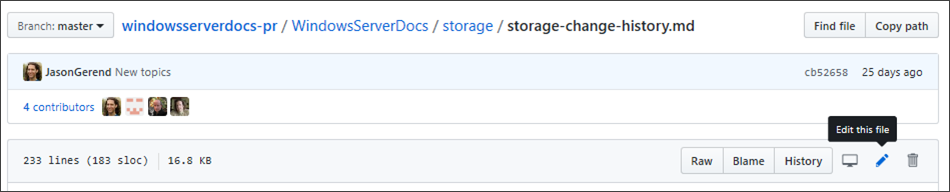
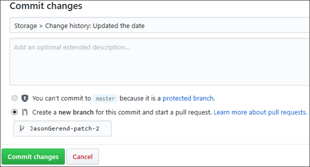

# Update existing Windows Server articles using a web browser and GitHub

The Microsoft Windows Server documentation set is open source and hosted on GitHub. This open source approach streamlines and improves communication between product engineers, content teams, and the customer.

The user experience on [docs.microsoft.com/windows-server](https://docs.microsoft.com/windows-server) integrates [GitHub](https://github.com) workflows directly to make it even easier for you to contribute as a Microsoft employee.

> [!IMPORTANT]
> All repositories that publish to docs.microsoft.com have adopted the [Microsoft Open Source Code of Conduct](https://opensource.microsoft.com/codeofconduct/) or the [.NET Foundation Code of Conduct](https://dotnetfoundation.org/code-of-conduct). For more information, see the [Code of Conduct FAQ](https://opensource.microsoft.com/codeofconduct/faq/). Or contact [opencode@microsoft.com](mailto:opencode@microsoft.com), or [conduct@dotnetfoundation.org](mailto:conduct@dotnetfoundation.org) with any questions or comments.
>
> Minor corrections or clarifications to documentation and code examples in public repositories are covered by the [docs.microsoft.com Terms of Use](https://docs.microsoft.com/legal/termsofuse). New or significant changes generate a comment in the pull request, asking you to submit an online Contribution License Agreement (CLA) if you are not an employee of Microsoft. We need you to complete the online form before we can review or accept your pull request.

## Quick edits to existing articles using GitHub and a web browser

Quick edits streamline the process to report and fix small errors and omissions in documents. Despite all efforts, small grammar and spelling errors _do_ make their way into our published documents.

1. Go to https://github.com/MicrosoftDocs/windowsserverdocs-pr/tree/master/WindowsServerDocs.

2. Navigate to the article you want to edit, and then select the **Edit this file** button.

   

3. Edit the topic, then scroll down to the bottom, briefly describe the changes, and then select **Commit changes**.

    

## Submit the pull request

After you create your pull request, you must submit it for approval and publishing.

### To submit your pull request

1. On the **Open a pull request** page, update your commit message to make it more appropriate for a PR. For example: Fix typo in first paragraph.

2. Make sure that only the commits and files you expect to be included are included. Also check that the PR goes to the correct branch in the upstream repository, either master (typically) or a release branch (occasionally).

3. In the **Reviewers** area of the right pane, select the gear icon, and then enter _windowsservercontent_. A member of the alias will be on point to review your changes and either merge your pull request or add comments about things to change before merging.

4. Select **Create pull request**. The new PR is linked to your working branch in your fork. Until the PR is merged, any new commits you push to the same working branch in your fork are automatically included in the PR. A new label is added to your pull request that says, **do-not-merge**. This simply means that your content is still in progress and shouldn't be reviewed or pushed to the live site.

5. When you're ready for someone from the alias to review your content, you must add the text, **#sign-off** to the comments. This comment:

    - Updates the label for your pull request from **do-not-merge** to **ready-to merge**.

    - Lets the alias and writers know that you're ready to have your content reviewed.

    - Lets the admins know that after approval, your content is ready go live.