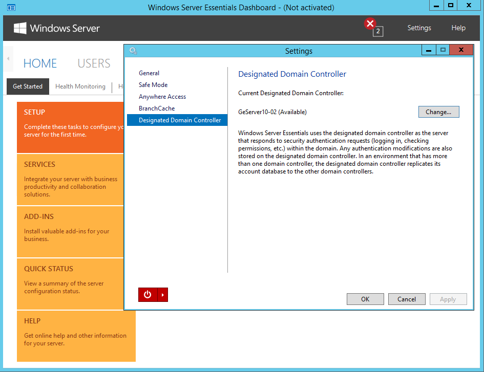

# Support for larger deployments

>Applies To: Windows Server 2016 Essentials

> [!IMPORTANT]  
> The features described in this topic only work on Windows Server 2016 with the Essentials Experience role enabled, and not with the Windows Server 2016 Essentials SKU.

Windows Server Essentials now supports larger deployments with:

- multiple domains
- multiple domain controllers
- ability to specify a designated domain controller
- support for up to 500 users and 500 devices

## Support for multiple domains

Windows server 2012 R2 Essentials supports only one domain per server, which is required, and the Essentials server must be the root of the forest. While a domain and forest are still required, the Windows Server 2016 Essentials Experience role can now be deployed on Windows Server 2016 Standard or Datacenter to support multiple domains.

## Support for multiple domain controllers

 Windows Server Essentials 2012 R2 blocks any services that leverage Azure Active Directory, such as Office 365, where more than one domain controller is deployed. The reason is that account and password synchronization between the local domain controllers and Azure Active Directory can lead to account credentials with passwords that are out of sync. This limitation has been removed in Windows Server 2016 Essentials.

## Ability to specify a designated domain controller

You can now choose a designated domain controller which will improve retrieval times for Active Directory domain objects, as well as coordinate synchronization of account change across other domain controllers in the domain.

Your default designated Domain Controller will be the same server that is running the Windows Server Essentials Experience server role. If that server is a member server, meaning it is not a domain controller, then the default designated domain controller will be automatically determined based on testing which domain controller in the domain has the lowest network latency to the server running the Windows Server Experience Server role. If you want to manually change which server is the designated domain controller, you can do so in **Settings** in the **Windows Server Essentials dashboard** as shown below.

## Support for 500 users and 500 devices
-------------------------------------

The maximum number of supported users and devices in  Windows Server 2012 R2 Essentials is 25 and 50, respectively. With the introduction of the Windows Server Essentials Experience server role, that limit was increased to 100 users and 200 devices.

Windows Server 2016 Essentials supports 500 users and 500  devices. Making this possible is an update to the provider framework and object list controls  so they cache and quickly render large user and device object lists. In addition, a search and filter feature has been added to quickly find the user or device you may be looking for (see Figure 5-2). You'll find search and filter functionality in the **Windows Server Essentials dashboard**, **Remote Web Access**, and the Windows and Windows Phone store **My Server** applications.

A screenshot showing the use of the Search feature of the Windows Server Essentials dashboard to search for the string "d5c". The results of this search include two files and folders and two users.

> [!NOTE]  
> While the supported user and device limit has increased for Windows Server Essentials Server role, the supported limit for client back-up remains at 75.

See also
--------
[Get started with Windows Server Essentials](get-started.md)