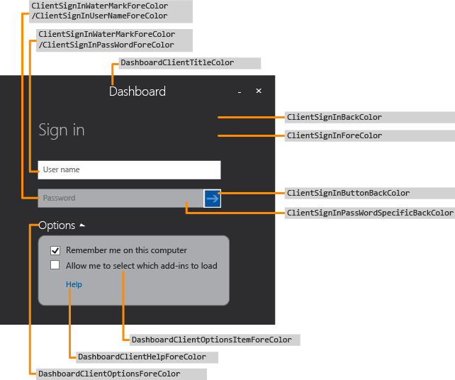
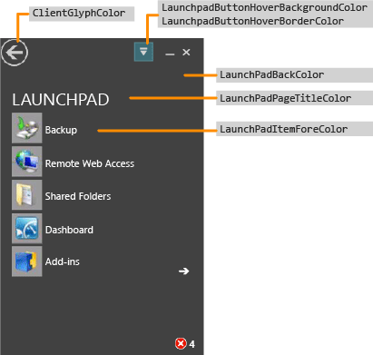
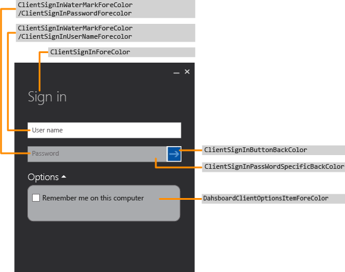
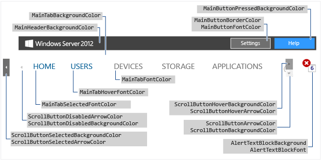
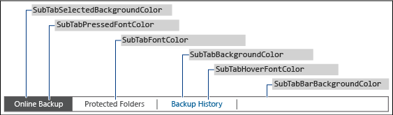
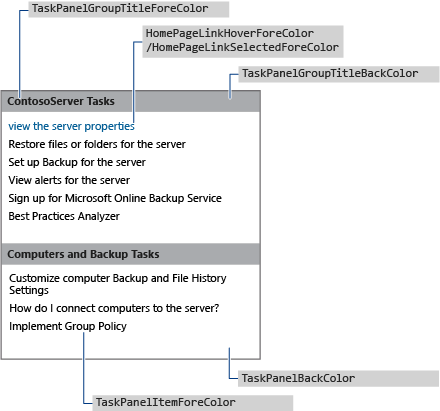
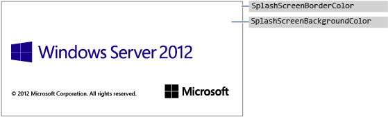
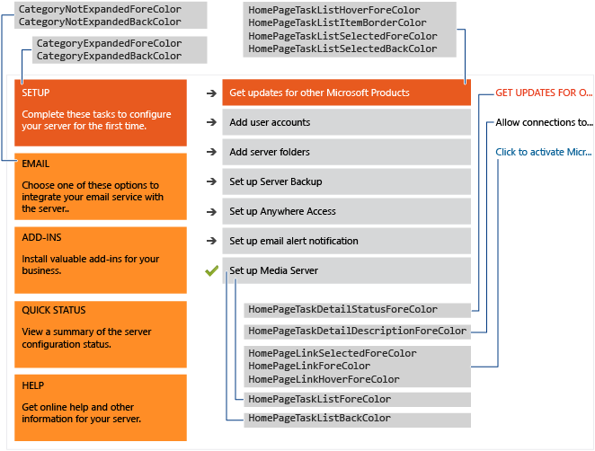

# Change the Color Scheme of the Dashboard and Launchpad

>Applies To: Windows Server 2016 Essentials, Windows Server 2012 R2 Essentials, Windows Server 2012 Essentials

You can change the color scheme of the Dashboard and the Launchpad by defining the colors that you want to use in an XML formatted file, installing the .xml file in a folder on the server, and by specifying the .xml file name in a registry entry.  
  
## Create the xml file  
 The following example shows the possible contents of the .xml file:  
  
```xml  
<DashboardTheme xmlns="https://www.microsoft.com/HSBS/Dashboard/Branding/2010">  
  
  <!-- Hex color values overwriting default SKU theme colors -->  
  
    <SplashScreenBackgroundColor HexValue="FFFFFFFF"/>  
    <SplashScreenBorderColor HexValue="FF000000"/>  
    <MainHeaderBackgroundColor HexValue="FF414141"/>  
    <MainTabBackgroundColor HexValue="FFFFFFFF"/>  
    <MainTabFontColor HexValue="FF999999"/>  
    <MainTabHoverFontColor HexValue="FF0072BC"/>  
    <MainTabSelectedFontColor HexValue="FF0072BC"/>  
    <MainButtonPressedBackgroundColor HexValue="FF0072BC"/>  
    <MainButtonFontColor HexValue="FFFFFFFF"/>  
    <MainButtonBorderColor HexValue="FF6E6E6E"/>  
    <ScrollButtonBackgroundColor HexValue="FFF0F0F0"/>  
    <ScrollButtonArrowColor HexValue="FF999999"/>  
    <ScrollButtonHoverBackgroundColor HexValue="FF999999"/>  
    <ScrollButtonHoverArrowColor HexValue="FF6E6E6E"/>  
    <ScrollButtonSelectedBackgroundColor HexValue="FF6E6E6E"/>  
    <ScrollButtonSelectedArrowColor HexValue="FFFFFFFF"/>  
    <ScrollButtonDisabledBackgroundColor HexValue="FFF8F8F8"/>  
    <ScrollButtonDisabledArrowColor HexValue="FFCCCCCC"/>  
    <AlertTextBlockBackground HexValue="FFFFFFFF"/>  
    <AlertTextBlockFont HexValue="FF000000"/>  
    <FontColor HexValue="FF000000"/>  
    <SubTabBarBackgroundColor HexValue="FFFFFFFF"/>  
    <SubTabBackgroundColor HexValue="FFFFFFFF"/>  
    <SubTabSelectedBackgroundColor HexValue="FF414141"/>  
    <SubTabBorderColor HexValue="FF787878"/>  
    <SubTabFontColor HexValue="FF787878"/>  
    <SubTabHoverFontColor HexValue="FF0072BC"/>  
    <SubTabPressedFontColor HexValue="FFFFFFFF"/>  
    <ListViewColor HexValue="FFFFFFFF"/>  
    <PageBorderColor HexValue="FF999999"/>      
    <LaunchpadButtonHoverBorderColor HexValue="FF6BA0B4"/>  
    <LaunchpadButtonHoverBackgroundColor HexValue="FF41788F"/>  
    <ClientArrowColor HexValue="FFFFFFFF"/>  
    <ClientGlyphColor HexValue="FFFFFFFF"/>  
    <SplitterColor HexValue="FF83C6E2"/>  
    <HomePageBackColor     HexValue="FFFFFFFF"/>  
    <CategoryNotExpandedBackColor HexValue="FFFFB343"/>  
    <CategoryExpandedBackColor HexValue="FFF26522"/>  
    <CategoryNotExpandedForeColor HexValue="FF2A2A2A"/>  
    <CategoryExpandedForeColor HexValue="FFFFFFFF"/>  
    <HomePageTaskListForeColor    HexValue="FF2A2A2A"/>  
    <HomePageTaskListBackColor HexValue="FFEAEAEA"/>  
    <HomePageTaskListHoverForeColor      HexValue="FF2A2A2A"/>  
    <HomePageTaskListItemBorderColor     HexValue="FF999999"/>  
    <HomePageTaskListSelectedForeColor   HexValue="FFFFFFFF"/>  
    <HomePageTaskListSelectedBackColor   HexValue="FFF26522"/>  
    <HomePageTaskDetailStatusForeColor   HexValue="FFF26522"/>  
    <HomePageTaskDetailDescriptionForeColor     HexValue="FF2A2A2A"/>  
    <HomePageLinkForeColor HexValue="FF0072BC"/>  
    <HomePageLinkSelectedForeColor HexValue="FF0054A6"/>  
    <HomePageLinkHoverForeColor   HexValue="FF0072BC"/>  
    <PropertyFormForeColor HexValue="FF2A2A2A"/>  
    <PropertyFormTabHoverColor HexValue="FF0072BC"/>  
    <PropertyFormTabSelectedColor HexValue="FFFFFFFF"/>  
    <PropertyFormTabSelectedBackColor HexValue="FF414141"/>  
    <TaskPanelBackColor HexValue="FFFFFFFF"/>  
    <TaskPanelItemForeColor HexValue="FF2A2A2A"/>  
    <TaskPanelGroupTitleForeColor HexValue="FF2A2A2A"/>  
    <TaskPanelGroupTitleBackColor HexValue="FFCCCCCC"/>  
    <DashboardClientBackColor HexValue="FF004050"/>  
    <DashboardClientTitleColor HexValue="FFFFFFFF"/>  
    <DashboardClientOptionsForeColor HexValue="FFFFFFFF"/>  
    <DashboardClientOptionsItemForeColor HexValue="FF2A2A2A"/>  
    <DashboardClientHelpForeColor HexValue="FF0054A6"/>  
    <ClientSignInForeColor HexValue="FFFFFFFF"/>  
    <ClientSignInWaterMarkForeColor HexValue="FF999999"/>  
    <ClientSignInUserNameForeColor HexValue="FF2A2A2A"/>  
    <ClientSignInPassWordSpecificBackColor HexValue="FFCCCCCC"/>  
    <ClientSignInButtonBackColor HexValue="FF004050"/>  
    <ClientSignInPassWordForeColor HexValue="FF2A2A2A"/>  
    <LaunchPadBackColor HexValue="FF004050"/>  
    <LaunchPadPageTitleColor HexValue="FFFFFFFF"/>  
    <LaunchPadItemForeColor HexValue="FFFFFFFF"/>  
  <LaunchPadItemHoverColor HexValue="33FFFFFF"/>  
  <LaunchPadItemIconBackgroundColor HexValue="F2004050"/>  
</DashboardTheme >  
  
```  
  
> [!IMPORTANT]
>  The xml elements must be specified in the order listed in the previous example.  
  
> [!NOTE]
>  All values of the HexValue attribute are examples of hexadecimal values for colors. You can enter any hexadecimal color value that you want to use.  
  
 Use Notepad or Visual Studio 2010 to create the .xml file that contains the tags for the areas that you want to customize. The file can be given any name, but it must have a .xml extension. For a description of the areas that can be customized on the Dashboard and Launchpad, see [Dashboard and Launchpad areas that can be changed](Change-the-Color-Scheme-of-the-Dashboard-and-Launchpad.md#BKMK_Dashboard).  
  
#### To install the .xml file  
  
1.  On the server, move your mouse to the upper right corner of the screen, and click **Search**.  
  
2.  In the Search box, type **regedit**, and then click the **Regedit** application.  
  
3.  In the left pane, expand **HKEY_LOCAL_MACHINE**, expand **SOFTWARE**, expand **Microsoft**, expand **Windows Server**. If the **OEM** key does not exist, you must complete the following steps to create it:  
  
    1.  Right-click **Windows Server**, point to **New**, and then click **Key**.  
  
    2.  Type **OEM** for the name of the key.  
  
4.  Right-click **OEM**, point to **New**, and then click **String Value**.  
  
5.  Enter **CustomColorScheme** as the name of the string, and then press **Enter**.  
  
6.  Right-click **CustomColorScheme** in the right pane, and then click **Modify**.  
  
7.  Enter the name of the file, and then click **OK**.  
  
8.  Copy the file to %programFiles%\Windows Server\Bin\OEM. If the OEM directory does not exist, create it.  
  
##  <a name="BKMK_Dashboard"></a> Dashboard and Launchpad areas that can be changed  
 This section includes examples of Dashboard and Launchpad areas that can be customized.  
  
### Examples  
  
####  <a name="BKMK_Figure1"></a> Figure 1: Sign-in page of the Dashboard  
   
  
####  <a name="BKMK_Figure2"></a> Figure 2: Launchpad  
   
  
####  <a name="BKMK_Figure3"></a> Figure 3: Sign-in page of the Launchpad  
   
  
####  <a name="BKMK_Figure4"></a> Figure 4: Dashboard text  
   
  
####  <a name="BKMK_Figure5"></a> Figure 5: Subtab border  
   
  
####  <a name="BKMK_Figure6"></a> Figure 6: Task pane  
   
  
####  <a name="BKMK_Figure9"></a> Figure 7a: Product Splash Screen  
   
  
#### Figure 7b: Home Page  
   
  
## See Also  
 [Creating and Customizing the Image](Creating-and-Customizing-the-Image.md)   
 [Additional Customizations](Additional-Customizations.md)   
 [Preparing the Image for Deployment](Preparing-the-Image-for-Deployment.md)   
 [Testing the Customer Experience](Testing-the-Customer-Experience.md)