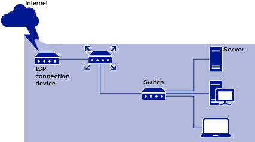

# Prepare your Source Server for Windows Server 2012 Essentials migration4
Complete the following preliminary steps to ensure that the settings and data on your Source Server migrate successfully to the Destination Server.  
  
#### To prepare for migration  
  
<<<<<<< HEAD
1.  [Back up your Source Server](Prepare-your-Source-Server-for-Windows-Server-2012-Essentials-migration4.md#BKMK_BackUpYourSourceServerToPrepareForMigration)  
  
2.  [Install the most recent service packs](Prepare-your-Source-Server-for-Windows-Server-2012-Essentials-migration4.md#BKMK_InstallTheMostRecentServicePacksToPrepareForMigration)  
  
3.  [Verify the network configuration](Prepare-your-Source-Server-for-Windows-Server-2012-Essentials-migration4.md#BKMK_VerifyTheNetworkConfigurationToPrepareForMigration)  
  
4.  [Use Windows SBS 2003 Best Practice Analyzer to evaluate the health of the Source Server](Prepare-your-Source-Server-for-Windows-Server-2012-Essentials-migration4.md#BKMK_UseWindowsBestPracticeAnalyzer)  
  
5.  [Synchronize the Source Server time with an external time source](Prepare-your-Source-Server-for-Windows-Server-2012-Essentials-migration4.md#BKMK_SynchronizeTheSourceServerTimeWithAnExternalTimeSource)  
  
6.  [Run the Migration Preparation Tool on the Source Server](Prepare-your-Source-Server-for-Windows-Server-2012-Essentials-migration4.md#BKMK_MigrationPrep)  
  
7.  [Create a plan to migrate line-of-business applications](Prepare-your-Source-Server-for-Windows-Server-2012-Essentials-migration4.md#BKMK_PlanToMigrateLineOfBusinessApplications)  
  
8.  [Create a plan to migrate email that is hosted on Windows Small Business Server 2003](Prepare-your-Source-Server-for-Windows-Server-2012-Essentials-migration4.md#BKMK_PlanToMigrateEmail)  
=======
1.  [Back up your Source Server](../migrate/Prepare-your-Source-Server-for-Windows-Server-2012-Essentials-migration4.md#BKMK_BackUpYourSourceServerToPrepareForMigration)  
  
2.  [Install the most recent service packs](../migrate/Prepare-your-Source-Server-for-Windows-Server-2012-Essentials-migration4.md#BKMK_InstallTheMostRecentServicePacksToPrepareForMigration)  
  
3.  [Verify the network configuration](../migrate/Prepare-your-Source-Server-for-Windows-Server-2012-Essentials-migration4.md#BKMK_VerifyTheNetworkConfigurationToPrepareForMigration)  
  
4.  [Use Windows SBS 2003 Best Practice Analyzer to evaluate the health of the Source Server](../migrate/Prepare-your-Source-Server-for-Windows-Server-2012-Essentials-migration4.md#BKMK_UseWindowsBestPracticeAnalyzer)  
  
5.  [Synchronize the Source Server time with an external time source](../migrate/Prepare-your-Source-Server-for-Windows-Server-2012-Essentials-migration4.md#BKMK_SynchronizeTheSourceServerTimeWithAnExternalTimeSource)  
  
6.  [Run the Migration Preparation Tool on the Source Server](../migrate/Prepare-your-Source-Server-for-Windows-Server-2012-Essentials-migration4.md#BKMK_MigrationPrep)  
  
7.  [Create a plan to migrate line-of-business applications](../migrate/Prepare-your-Source-Server-for-Windows-Server-2012-Essentials-migration4.md#BKMK_PlanToMigrateLineOfBusinessApplications)  
  
8.  [Create a plan to migrate email that is hosted on Windows Small Business Server 2003](../migrate/Prepare-your-Source-Server-for-Windows-Server-2012-Essentials-migration4.md#BKMK_PlanToMigrateEmail)  
>>>>>>> 4bac1739fd0378146de6c9af26f683b8076754b8
  
###   Back up your Source Server  
 Back up your Source Server before you begin the migration process. Making a backup helps protect your data from accidental loss if an unrecoverable error occurs during migration.  
  
##### To back up the Source Server  
  
1.  Perform a full backup of the Source Server. For more information about backing up Windows SBS 2003, see [Backing Up and Restoring Windows Small Business Server 2003](http://go.microsoft.com/fwlink/?LinkId=27140).  
  
2.  Verify that the backup ran successfully. To test the integrity of the backup, select random files from your backup, restore them to an alternate location, and then confirm that the restored files are the same as the original files.  
  
###   Install the most recent service packs  
 You must install the latest updates and service packs on the Source Server prior to migration. If updates or service packs are missed, the Source Server will not be eligible for migration, and the Migration Preparation Tool will report the problem and ask you to install the necessary updates before proceeding.  
  
 Before installing a service pack, back up your server.  
  
##### To install updates by using Windows Update  
  
1.  Click **Start**, click **All Programs**, and then click **Windows Update**.  
  
2.  Click **Check for updates**.  
  
3.  If you are asked to configure Windows Update settings, perform the following steps:  
  
    1.  Click **OK**.  
  
    2.  Click **Change settings**, which is located under the **Check for updates** link, and then configure the Windows Update settings.  
  
    3.  Click **Check for updates**.  
  
4.  Click **Install Updates** to apply identified updates.  
  
5.  For each Microsoft Software License Term that is displayed, review the text and click **Yes** to accept.  
  
6.  If prompted, restart the Source Server  
  
7.  To verify that the updates are installed, click **Start**, click **Control Panel**, click **Programs**, and then click **View installed updates**.  
  
 Next, install individual service packs by performing the following procedures that apply to your Source Server.  
  
##### Install Windows SBS 2003 Service Pack 1  
  
-   Install Windows SBS 2003 Service Pack 1 (SP1), if it is not yet installed. You can download Windows SBS 2003 SP1 at the [Microsoft Windows Small Business Server 2003 Service Pack 1 (SP1)](http://go.microsoft.com/fwlink/?LinkId=46690) website.  
  
    > [!IMPORTANT]
    >  To ensure that the correct version of Microsoft .NET Framework is installed, you must install Windows SBS 2003 SP1 before you install Windows Server 2003 Service Pack 2 (SP2).  
  
##### Install Windows Server 2003 Service Pack 2  
  
-   Install Windows Server 2003 SP2, if it is not yet installed. You can download Windows Server 2003 SP2 at the [Windows Server 2003 Service Pack 2](http://go.microsoft.com/fwlink/?LinkId=98932) website.  
  
    > [!NOTE]
    >  -   If you experience network-related issues after installing Windows Server 2003 SP2, see [article 948496](http://go.microsoft.com/fwlink/?LinkId=20167) in the Microsoft Knowledge Base.  
    > -   To learn more about the best practices and known issues that are related to SP2 for Windows Server 2003, see [article 939421](http://go.microsoft.com/fwlink/?LinkId=95431) in the Microsoft Knowledge Base.  
  
> [!NOTE]
>  Although Exchange Server and SharePoint® Services are not migrated during the process documented here, we recommend that you create a well-known configuration for these applications by applying the required service packs.  
  
##### Install Exchange Server 2003 Service Pack 2  
  
-   Install Exchange Server 2003 Service Pack 2 (SP2), if it is not installed. You can download Exchange Server 2003 SP 2 from the [Service Pack 2 for Exchange Server 2003](http://go.microsoft.com/fwlink/?LinkId=98933) website.  
  
    > [!NOTE]
    >   Windows Server 2012 Essentials does not directly support migrating Windows SharePoint Services 3.0 or Windows Server Update Services 3.0 from Windows SBS 2003 to  Windows Server 2012 Essentials. For information about migrating Windows SharePoint Services 3.0, see [Upgrading to SharePoint Foundation 2010](http://go.microsoft.com/fwlink/?LinkId=191541).  
  
##### Install Windows SharePoint Services 2.0 Service Pack 3  
  
-   Install Windows SharePoint Services 2.0 Service Pack 3, if it is not installed. Download it from the [Windows SharePoint Services Service Pack 3 (SP3)](http://go.microsoft.com/fwlink/?LinkId=211190) website, and then install it.  
  
##### Install Microsoft Core XML Services (MSXML) 6.0 Service Pack 1  
  
-   Download MSXML 6.0 from the [Microsoft Core XML Services (MSXML) 6.0 Service Pack 1](http://go.microsoft.com/fwlink/?LinkId=87548) website.  
  
###   Verify the network configuration  
 To prepare for migration, you must install a router on your network to use as a gateway to the Internet. You must also configure your Source Server to use one network adapter, and disable your virtual private network (VPN) on the Source Server (if it is running).  
  
#### Reconfiguring your existing network  
 Before you can migrate your network to  Windows Server 2012 Essentials, you must install and configure a router on your network and configure the Source Server to use one network adapter. When you are done, your network will look like the following figure:  
  
<<<<<<< HEAD
   
=======
   
>>>>>>> 4bac1739fd0378146de6c9af26f683b8076754b8
  
###### To configure the Source Server to use one network adapter  
  
1.  Unplug the network adapter from the broadband connection.  
  
2.  Install a router on your network as shown in the previous figure.  
  
3.  To make sure that the  Windows Server 2012 Essentials Installation Wizard can find the router on your network, ensure that the IP address on the network adapter within the router is set to 192.168.x.1 or 192.168.x.254, where x is a number from 1 to 254. This IP address is the default gateway address for your network.  
  
    > [!NOTE]
    >  For information about installing and configuring a router, see the documentation from your router manufacturer.  
  
4.  On the Source Server, run the **Configure E-mail and Internet Connection** Wizard to configure the Source Server for one network adapter, as follows:  
  
    ###### To configure the Source Server for one network adapter  
  
    1.  Click **Start**, and then click **Server Management**.  
  
    2.  In the console pane, click **To Do List**.  
  
    3.  In the details pane, click **Connect to the Internet**.  
  
    4.  Complete the wizard.  
  
5.  If you are using a VPN on the Source Server, disable it. To disable the VPN on the Source Server, run the Remote Access Wizard, as follows:  
  
    ###### To disable the VPN on the Source Server  
  
    1.  Click **Start**, and then click **Server Management**.  
  
    2.  In the console pane, click **Internet and E-mail**.  
  
    3.  In the details pane, click **Configure Remote Access**.  
  
    4.  Complete the wizard, and make sure that you click **Disable remote access** on the **Remote Access Method** page.  
  
6.  If you have computers or devices that are configured with static IP addresses or DHCP Server role settings, you must manually update each of them with the new default gateway IP address.  
  
####   Verify the settings for the DHCP Server role  
 Windows SBS 2003 is configured to run the DHCP Server role. However,  Windows Server 2012 Essentials does not use the DHCP Server role, and you will eventually need to move the DHCP Server role to the router. During migration, you can manage the DHCP Server role from the Source Server or from the router, depending on your current network configuration:  
  
-   If you are running the DHCP Server role on the Source Server, we recommend that you continue to run this role from the Source Server during migration. After you have removed the Source Server from the network, move the DHCP Server role to the router.  
  
-   If your network already runs the DHCP Server role from the router, and it is running without issues, we recommend that you continue to run the DHCP Server role from the router during migration.  
  
> [!NOTE]
>  Ensure that your Source Server is in a healthy state before you proceed by performing the procedures in the following section.  
  
###   Use Windows SBS 2003 Best Practice Analyzer to evaluate the health of the Source Server  
 If your Source Server is running Windows SBS 2003, you can run the Windows SBS 2003 Best Practices Analyzer (BPA) to verify that there are no issues on your server, network, or domain before you start the migration process.  
  
> [!NOTE]
>  If your Source Server is running Windows Server 2003 Standard Edition, you cannot use the Windows SBS 2003 BPA. In these cases, make sure that you run the Windows Support Tools to determine if there are any network issues that you need to resolve.  
  
### Run the Windows SBS 2003 Best Practices Analyzer  
  
> [!NOTE]
>  Your Source Server must be running Windows SBS 2003 to run the Windows SBS 2003 BPA.  
  
 The Windows SBS 2003 BPA collects configuration information from the following sources:  
  
-   Active Directory® Windows Management Instrumentation (WMI)  
  
-   The registry  
  
-   The Internet Information Services (IIS) metabase  
  
 The Windows SBS 2003 BPA checks the following services and applications:  
  
-   Exchange Server  
  
-   Update Services  
  
-   Network configuration  
  
-   Windows SharePoint Services  
  
-   Microsoft SQL Server™  
  
##### To use the Windows SBS 2003 BPA to analyze your Source Server  
  
1.  Download and install the Windows SBS 2003 BPA from the [Microsoft Windows Small Business Server 2003 Best Practices Analyzer](http://go.microsoft.com/fwlink/?LinkId=113752) website.  
  
2.  After the download is complete, click **Start**, click **All Programs**, and then click **SBS Best Practices Analyzer Tool**.  
  
    > [!NOTE]
    >  Check for updates before you scan the server.  
  
3.  In the navigation pane, click **Start a scan**.  
  
4.  In the details pane, type the scan label. The scan label is the name of the scan report, for example **BPA Scan 15May2012**. Click **Start scanning**.  
  
5.  After the scan finishes, click **View a report of this Best Practices scan**.  
  
 After the Windows SBS 2003 BPA collects and analyzes the information, it presents a list of issues that are sorted by severity. The Windows SBS 2003 BPA describes each issue that it encountered and suggests solutions. Three report types are available:  
  
|Report Type|Description|  
|-----------------|-----------------|  
|List Reports|Displays reports in a one-dimensional list.|  
|Tree Reports|Displays reports in a hierarchical list.|  
|Other Reports|Displays reports such as a Run-Time Log.|  
  
 To view the description and the solutions for an issue, click the issue in the report. Not all of the issues that are reported by the Windows SBS 2003 BPA affect migration, but you should solve as many of the issues as possible to ensure that the migration is successful.  
  
### Run the Windows Support Tools  
 To determine if there are any other problems with the network, run the Windows Support Tools after you run the Windows SBS 2003 BPA.  
  
 The following table lists the tools that you can use to diagnose issues on your server, network, and domain:  
  
|Tool|Description|  
|----------|-----------------|  
|Netdiag.exe|Helps isolate networking and connectivity issues. For more information and to download this tool, see [Netdiag](http://go.microsoft.com/fwlink/?LinkId=217388).|  
|Dcdiag.exe|Analyzes the state of domain controllers in a forest or enterprise, and reports issues to assist you in troubleshooting. For more information and to download this tool, see [Dcdiag](http://go.microsoft.com/fwlink/?LinkId=217389).|  
|Repadmin.exe|Assists you in diagnosing replication issues between domain controllers. This tool requires command-line parameters to run. For more information and to download this tool, see [Repadmin](http://go.microsoft.com/fwlink/?LinkId=217387).|  
  
 You should correct all the issues that these tools report before you proceed with the migration.  
  
###   Synchronize the Source Server time with an external time source  
 The time on the Source Server must be set to within five minutes of the time on the Destination Server, and the date and time zone must be the same on both servers. If the Source Server is running in a virtual machine, the date, time, and time zone on the host server must match that of the Source Server and the Destination Server. To help ensure that  Windows Server 2012 Essentials is installed successfully, you must synchronize the Source Server time to the Network Time Protocol (NTP) server on the Internet.  
  
##### To synchronize the Source Server time with the NTP server  
  
1.  Log on to the Source Server with a domain administrator account and password.  
  
2.  Click **Start**, click **Run**, type **cmd** in the text box, and then press ENTER.  
  
3.  At the command prompt, type w32tm /config /syncfromflags:domhier /reliable:no /update, and then press ENTER.  
  
4.  At the command prompt, type net stop w32time, and then press ENTER.  
  
5.  At the command prompt, type net start w32time, and then press ENTER.  
  
> [!IMPORTANT]
>  During the  Windows Server 2012 Essentials installation, you have an opportunity to verify the time on the Destination Server and change it, if necessary. Ensure that the time is within five minutes of the time that is set on the Source Server. When the installation finishes, the Destination Server synchronizes with the NTP. All domain-joined computers, including the Source Server, synchronize to the Destination Server, which assumes the role of the primary domain controller (PDC) emulator master.  
  
###   Run the Migration Preparation Tool on the Source Server  
 You cannot perform a migration mode install without first running the Migration Preparation Tool on your Source Server. This tool is designed to prepare your Source Server and domain to be migrated to  Windows Server® 2012 Essentials.  
  
> [!IMPORTANT]
>  Back up your Source Server before you run the Migration Preparation Tool. All changes that the Migration Preparation Tool makes to the schema are irreversible. If you experience issues during the migration, the only way to return the Source Server to the state it was in before you ran the tool is to restore the server from a system backup.  
  
 To run the Migration Preparation Tool, you must be a member of the Enterprise Admins group, the Schema Admins group, and the Domain Admins group.  
  
##### To verify that you have the appropriate permissions to run the tool on the Source Server  
  
1.  On the Source Server, click **Start**,and then click **Server Management**.  
  
2.  In the navigation pane, click Users.  
  
3.  Right-click the administrator account that you are using for the migration, and then click **Properties**.  
  
4.  Click the **Member Of** tab, and then verify that Enterprise Admins, Schema Admins, and Domain Admins are listed in the **Member of** text box.  
  
5.  If the groups are not listed, click **Add**, and then add each group that is not listed.  
  
    > [!NOTE]
    >  -   You might receive a permission error if the Netlogon service is not started.  
    > -   You must log off and log back on the server for the changes to take effect.  
  
     You can use the latest version of the Windows Update Agent to ensure that the server update process works properly.  
  
     Before you can install Windows Update Agent on the Source Server, you must first install Microsoft PowerShell 2.0 and Microsoft Baseline Configuration Analyzer 2.0.  
  
 You can use the latest version of the Windows Update Agent to ensure that the server update process works properly.  
  
 Before you can install Windows Update Agent on the Source Server, you must first install Microsoft PowerShell 2.0 and Microsoft Baseline Configuration Analyzer 2.0.  
  
-   To download and install Microsoft PowerShell 2.0, see “[Windows Management Framework (Windows PowerShell 2.0, WinRM 2.0, and BITS 4.0](http://go.microsoft.com/fwlink/p/?LinkId=241483))�? at the Microsoft Support website (http://go.microsoft.com/fwlink/p/?LinkId=241483).  
  
-   To download and install Microsoft Baseline Configuration Analyzer 2.0, visit the [Microsoft Baseline Configuration Analyzer 2.0 page](http://go.microsoft.com/fwlink/p/?LinkId=241484) at the Microsoft Download Center (http://go.microsoft.com/fwlink/p/?LinkId=241484).  
  
-   To download and install the latest version of Windows Update Agent, see “[How to obtain the latest version of the Windows Update Agent to help manage updates on a computer](http://go.microsoft.com/fwlink/p/?LinkId=237493)�? at the Microsoft Support website (http://go.microsoft.com/fwlink/p/?LinkId=237493).  
  
##### To install and run the Migration Preparation Tool on the Source Server  
  
1.  Insert  Windows Server 2012 Essentials DVD1 in the DVD drive on the Source Server.  
  
2.  Open Windows Explorer, browse to the **\support\tools** folder of the DVD, and then double click the **sourcetool.msi** file.  
  
    > [!NOTE]
    >  -   If the Migration Preparation Tool is already installed on the server, run the tool from the **Start** menu.  
    > -   To ensure that you are prepared for the best possible migration experience, it is recommended that you always choose to install the most recent update.  
  
     The wizard installs the Migration Preparation Tool on the Source Server. When the installation is complete, the Migration Preparation Tool runs automatically and installs the latest updates.  
  
3.  In the **Migration Preparation Tool**, select **I have a backup and am ready to proceed**, and then click **Next**.  
  
     The Migration Preparation Tool prepares the source domain for migration by extending the Active Directory schema. After the task is completed, click **Next** to continue.  
  
    > [!NOTE]
    >  If you receive an error message relating to hotfix installation, follow the instructions in “Method 2: Rename the Catroot2 Folder�? in the Microsoft Knowledge Base article “[You cannot install some updates or programs](http://go.microsoft.com/FWLink/p/?LinkID=118672)�? (http://go.microsoft.com/FWLink/p/?LinkID=118672).  
  
4.  After preparing the source domain, the Migration Preparation Tool scans the Source Server to identify two types of potential issues.  
  
    -   **Errors** Issues found on the Source Server that can block the migration or cause the migration to fail. Follow the instructions in the error message to fix the issues, and then click **Scan Again**.  
  
    -   **Warnings** Issues found on the Source Server that can cause functional problems during migration. It is strongly recommended that you follow the instructions in the error message to fix issues before proceeding with the migration.  
  
     After you fix or acknowledge all of the issues, click **Next**.  
  
5.  In the Migration Preparation Tool, click **Finish**.  
  
6.  When the Migration Preparation Tool finishes, you may be prompted to restart the Source Server before you can begin migrating to  Windows Server 2012 Essentials.  
  
> [!NOTE]
>  You must complete a successful run of the Migration Preparation Tool on the Source Server within two weeks of installing  Windows Server 2012 Essentials on the Destination Server. Otherwise, installation of  Windows Server 2012 Essentials on the Destination Server will be blocked. If this occurs, you must run the Migration Preparation Tool on the Source Server again.  
  
###   Create a plan to migrate line-of-business applications  
 A line-of-business (LOB) application is a critical computer application that is vital to running a business. LOB applications include accounting, supply-chain management, and resource-planning applications.  
  
 When you plan to migrate your LOB applications, consult with the LOB application providers to determine the appropriate method for migrating each application. You also must locate the media that is used to install the LOB applications on the Destination Server.  
  
 You can fill in the following table as you collect LOB application information. A good place to start collecting information is to run Windows Control Panel, click **Programs** and look in the **Program Files (x86)** and the **Program Files** folders.  
  
|Application or general data folder name|Path to data|Notes|  
|---------------------------------------------|------------------|-----------|  
||||  
||||  
||||  
  
###   Create a plan to migrate email that is hosted on Windows Small Business Server 2003  
 In Windows SBS 2003, email is provided through Exchange Server. However,  Windows Server 2012 Essentials does not provide an inbox email service. If you are currently using Windows SBS 2003 to host your company’s email, you will need to migrate to an alternate on-premises or hosted solution.  
  
> [!NOTE]
>  After you update and prepare your Source Server for migration, we recommend that you create a backup of the updated server before you continue the migration process.  
  
#### Migrate email to Microsoft Office 365  
<<<<<<< HEAD
 If you have chosen to use Microsoft Office 365 as the email solution for your domain, follow the guidance in the topic  “[Migrate All Mailboxes to the Cloud with a Cutover Exchange Migration](http://go.microsoft.com/fwlink/p/?LinkId=248619)�? to start the email migration to Office 365. We recommend that you complete the email migration before you [Install Windows Server 2012 Essentials in migration mode](Install-Windows-Server-2012-Essentials-in-migration-mode1.md).  
=======
 If you have chosen to use Microsoft Office 365 as the email solution for your domain, follow the guidance in the topic  “[Migrate All Mailboxes to the Cloud with a Cutover Exchange Migration](http://go.microsoft.com/fwlink/p/?LinkId=248619)�? to start the email migration to Office 365. We recommend that you complete the email migration before you [Install Windows Server 2012 Essentials in migration mode](../migrate/Install-Windows-Server-2012-Essentials-in-migration-mode1.md).  
>>>>>>> 4bac1739fd0378146de6c9af26f683b8076754b8
  
> [!NOTE]
>  The step to remove the on-premises Exchange Server on the Source Server is optional.  
>   
>  Office 365 does not support the use of public folders. For information about how to move messages from Exchange Public Folders to Office 365, see [Migrate from Exchange Public Folders to Microsoft Office 365](http://www.microsoft.com/download/en/details.aspx?id=27582)  
>   
<<<<<<< HEAD
>  After you [Install Windows Server 2012 Essentials in migration mode](Install-Windows-Server-2012-Essentials-in-migration-mode1.md), you should turn on the Office 365 Integration feature on  Windows Server 2012 Essentials.  
=======
>  After you [Install Windows Server 2012 Essentials in migration mode](../migrate/Install-Windows-Server-2012-Essentials-in-migration-mode1.md), you should turn on the Office 365 Integration feature on  Windows Server 2012 Essentials.  
>>>>>>> 4bac1739fd0378146de6c9af26f683b8076754b8
  
> [!IMPORTANT]
>  To allow the Office 365 migration tool to connect to the Exchange Server running on the Source Server, you must enable RPC over HTTP on the Source Server. For information about how to enable RPC over HTTP, see [How to Deploy RPC over HTTP for the First Time in Small Business Server 2003 (Standard or Premium)](http://go.microsoft.com/fwlink/p/?LinkId=263968). If you cannot successfully run the Office 365 migration tool after enabling RPC over HTTP, view the **ValidPorts** setting in the registry at **HKEY_LOCAL_MACHINE\Software\Microsoft\Rpc\RpcProxy**, and make sure that the fully qualified domain name (FQDN) for the Source Server is listed. If the FQDN is not listed, add it manually using the following example:  
>   
>  remote.*contoso*.com:6001-6002;remote. *contoso*.com:6004  (replace *contoso* with the name of your domain)  
  
#### Migrate email to another on-premises Exchange Server  
<<<<<<< HEAD
 For information about how to migrate email to another on-premises Exchange Server, see [Integrate an On-Premises Exchange Server with Windows Server Essentials](../manage/Integrate-an-On-Premises-Exchange-Server-with-Windows-Server-Essentials.md). We recommend that you set up the new on-premises Exchange Server after you [Install Windows Server 2012 Essentials in migration mode](Install-Windows-Server-2012-Essentials-in-migration-mode1.md), and then finish the email migration before demoting the Source Server.  
=======
 For information about how to migrate email to another on-premises Exchange Server, see [Integrate an On-Premises Exchange Server with Windows Server Essentials](../manage/Integrate-an-On-Premises-Exchange-Server-with-Windows-Server-Essentials.md). We recommend that you set up the new on-premises Exchange Server after you [Install Windows Server 2012 Essentials in migration mode](../migrate/Install-Windows-Server-2012-Essentials-in-migration-mode1.md), and then finish the email migration before demoting the Source Server.  
>>>>>>> 4bac1739fd0378146de6c9af26f683b8076754b8
  
> [!NOTE]
>  The Windows Small Business Server POP3 Connector is not included with Exchange Server. After you migrate email data to another Exchange Server, you can no longer use the POP3 Connector feature.  
  
> [!NOTE]
>  After you update and prepare your Source Server for migration, you should create a backup of the updated server before you continue the migration process.
