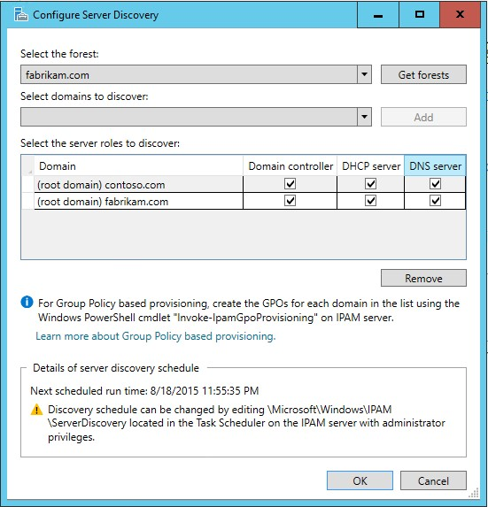

# Manage Resources in Multiple Active Directory Forests
You can use this topic to learn how to use IPAM to manage domain controllers, DHCP servers, and DNS servers in multiple Active Directory forests.

To use IPAM to manage resources in remote Active Directory forests, each forest that you want to manage must have a two way trust with the forest where IPAM is installed.

To start the discovery process for different Active Directory forests, open Server Manager and click IPAM. In the IPAM client console, click **Configure Server Discovery**, and then click **Get forests**. This initiates a background task that discovers trusted forests and their domains. After the discovery process completes, click **Configure Server Discovery**, which opens the following dialog box.

In the **Configure Server Discovery** dialog box, click **Select the forest**, and then choose the forest that you want to manage with IPAM. Also select the domains that you want to manage, and then click **Add**.

In **Select the server roles to discover**, for each domain that you want to manage, specify the type of servers to discover. The options are **Domain controller**, **DHCP server**, and **DNS server**.

By default, domain controllers, DHCP servers, and DNS servers are discovered \- so if you do not want to discover one of these types of servers, ensure that you deselect the checkbox for that option.

In the example illustration above, the IPAM server is installed in the contoso.com forest, and the root domain of the fabrikam.com forest is added for IPAM management. The selected server roles allow IPAM to discover and manage domain controllers, DHCP servers, and DNS servers in the fabrikam.com root domain and the contoso.com root domain.

After you have specified forests, domains, and server roles, click **OK**. IPAM performs discovery, and when discovery completes, you can manage resources in both the local and remote forest.

