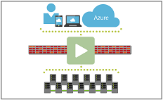
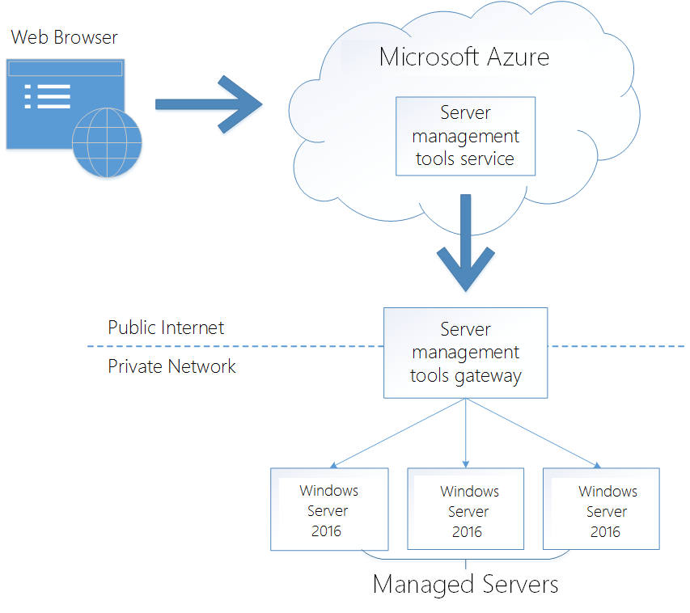
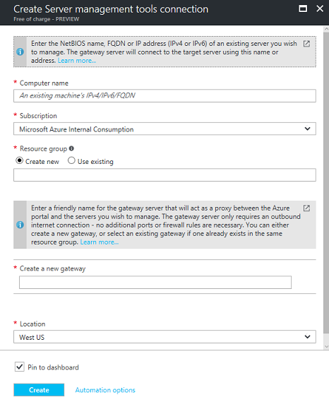

# Get started with Server Management Tools (SMT)

>Applies to: Windows Server 2016, Windows Server 2012 R2

Server management tools is a set of web-based GUI and command-line tools to manage on-premises Windows Servers from Azure. 

The following video (3:46) highlights SMT features:

## What is SMT?

[SMT](https://portal.azure.com/#create/Microsoft.RSMTNodes/preview), hosted in Azure, enables management of headless Windows Servers, such as Nano Server and Server Core, providing rapid access to your Azure and on-premises Windows Server 2016 servers.

With SMT, you can do the following:

-   View and change system configurations

-   View performance across various resources and manage processes and services

-   Manage devices attached to the server

-   View event logs

-   View the list of installed roles and features

-   Use a PowerShell console to manage and automate

## How is SMT different from Remote Server Administrative Tools (RSAT)? 

RSAT is a set of remote server management tools that you can download and install on Windows 10. They include support for remote management of computers that are running the Server Core installation option or the Minimal Server Interface configuration of Windows Server 2016, Windows Server 2012 R2, and in limited cases, the Server Core installation options of Windows Server 2012. For more information about RSAT, see [Remote Server Administration Tools](https://technet.microsoft.com/windows-server-docs/management/remote-server-administration-tools).

## SMT gateway

An SMT gateway is required to enable communication between the Microsoft Azure portal and your Windows Server 2016 machines. A gateway is typically deployed and configured on the same local network as the Windows Server machine(s) you want to manage. The on-premises machine must have an internet connection to communicate with the Azure portal as shown in the following illustration:

Although SMT can only manage Windows Server 2016, you can set up the SMT gateway on Windows Server 2012 R2 or Windows Server 2016. If the machine hosting the gateway is running Windows Server 2012 R2, you will need to [install WMF 5.0](http://aka.ms/wmf5download) on the gateway server to use PowerShell for management.

If the machine hosting the gateway is running Windows Server 2016, no additional preparation is required.

You will also need an Azure subscription to use Server Management Tools.

### How to setup the gateway

**Step 1: Create a new Server Management Tools connection**

To begin, log in to your [Azure portal](https://portal.azure.com/) account and search for **Server Management Tools** in **Marketplace** or [navigate directly to SMT](https://portal.azure.com/#create/Microsoft.RSMTNodes/preview).

Next, select **Server Management Tools**, read the description, review the terms of use, and then click **Create**.

This will open a form prompting you to fill out the information for the connection you are establishing, as follows:

Provide the NAME/IP/FQDN of the machine you want to connect to. If you have an existing resource group and gateway, you may opt to select them here rather than create a new group or gateway.

If this is the first SMT connection you are creating, you will also need to create a new SMT gateway and give it a name. You will be prompted to complete the gateway configuration after the SMT connection is created.

Once the form has been completed, click **Create** at the bottom of the screen and you will be taken back to the **Azure Startboard**. Assuming **Pin to Startboard** was checked, you will see a tile appear that will indicate the deployment is in progress. Note that you are not actually creating the connection to the machine -- just a resource in Azure. The connection to the machine is initiated once you provide the credentials on the main SMT blade.

Once the deployment succeeds, you will be taken to the SMT blade where you can provide credentials and connect to the machine. The User Name and Password will not be created by the connection, and must already exist on the machine and have proper permissions.  For example, you could connect with a user account that is a member of the local Administrators group on the target server.

**Step 2: Configure a new SMT gateway**

If you are creating a new gateway, you will see the following status:

Click to open the **Gateway Configuration** page and read carefully and follow the directions to set up your on-premises machine or Azure VM as the gateway.

Unzip the zip file and run the gateway MSI installer from the folder you unzipped to. If you run the MSI from the zip file without unzipping first, you will need to also specify the profile .json file.

After installing the gateway MSI, return to Azure and click **Refresh**. You will now be prompted to enter the credentials to start managing the machine. You will see the following status:

You have established a remote connection to your resource and are now able to perform management tasks on it through Azure.

## Managing workgroup machines

To connect to workgroup machines (e.g. non-domain-joined Nano servers), run the following command in PowerShell or at a Command Prompt as Administrator:

**PowerShell**: `winrm set winrm/config/client ‘@{ TrustedHosts=”TargetMachineNameOrAddress” }`

**Command Prompt**: `winrm set winrm/config/client @{ TrustedHosts=”TargetMachineNameOrAddress” }` 

**TargetMachineNameOrAddress** should be the NetBIOS name, FQDN, or IP address (IPv4 or IPv6) that you specified when creating the SMT connection in Azure (which is also the name displayed at the top of the blade). You can also add multiple machines by separating them with commas.

> [!NOTE]
> The commands above will replace any previous list of registered trusted hosts with the host(s) you specify in the command. You can use the following command in PowerShell with the **Concatenate** parameter to add a computer name to an existing list of trusted hosts: `Set-Item wsman:\localhost\Client\TrustedHosts TargetMachineNameOrAddress –Concatenate`

### Additional connectivity requirements

If you want to connect using the local Administrator account, you will need to enable this policy on the target machine by running the following command in an administrator session on the target machine:

`REG ADD HKLM\SOFTWARE\Microsoft\Windows\CurrentVersion\Policies\System /v LocalAccountTokenFilterPolicy /t REG\_DWORD /d 1`

If you will connect to a workgroup machine that is not on the same subnet as the gateway, run the following command in an administrator session on the target machine:

`NETSH advfirewall firewall add rule name=”WinRM 5985” protocol=TCP dir=in localport=5985 action=allow`
