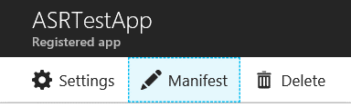

# Protect your Honolulu-managed Hyper-V Virtual Machines with Azure Site Recovery 

>Applies To: Windows Server, Windows Server 2016, Windows Server 2012 R2, Windows Server 2012 and Windows 10

Project Honolulu streamlines the process of replicating your virtual machines on your Hyper-V servers or clusters, making it easier to leverage the power of Azure from your own datacenter. To automate setup, you can connect the Honolulu gateway to Azure.

## What is Azure Site Recovery and how does it work with Honolulu? 

**Azure Site Recovery** is an Azure service that replicates workloads running on VMs so that your business-critical infrastructure is protected in case of a disaster.  [Learn more about Azure Site Recovery](https://docs.microsoft.com/en-us/azure/site-recovery/site-recovery-overview).

Azure Site Recovery consists of two components: **replication** and f**ailover**. The replication portion protects your VMs in case of disaster by replicating the target VM’s VHD to an Azure storage account. You can use the failover option to recover these VMs and run them in Azure in the event of a disaster. You can also perform a test failover without impacting your primary VMs to test the recovery process in Azure.

Completing setup for the replication component alone is sufficient to protect your VM in the case of disaster. However, you will not be able to start the VM in Azure until you have configured the failover portion. The failover portion can be setup at the time you wish to failover to an Azure VM, and is not required as part of initial setup. If the host server goes down and you haven’t yet configured the failover component, you can configure it at that time and access the workloads of the protected VM. However, it is a good practice to configure the failover related settings before a disaster.
 
## In this guide

This guide outlines the steps to configure failover settings and create a recovery plan from within the Azure portal, enabling Honolulu to start VM replication and protect your VMs.

## Prerequisites and planning

- The target servers hosting the VMs you wish to protect must have Internet access to replicate to Azure.
- You must have an Azure account and subscription to set up Azure Site Recovery service.
- [Review the capacity planning tool to evaluate the requirements for successful replication and failover](https://docs.microsoft.com/en-us/azure/site-recovery/hyper-v-site-walkthrough-capacity).

## Step 1: Connect your Gateway to Azure (you only need to do this step one time)

**To Connect your Gateway to Azure**

1. Run the **New-AadAsrApp.ps1** script included in the .zip file of the 1.0.6 release, with the following considerations:
    - If the Honolulu gateway host is installed on a Windows 10 machine and running in desktop mode, and is internet connected, run this script **without any parameters** from the Honolulu gateway host machine.
    - If the Honolulu gateway is not internet connected or is installed on a Windows Server 2016 running as a service, run the script on any internet connected client and provide the Honolulu gateway server name in the **-GatewayEndpoint** parameter.
    - This script requires two Azure PowerShell modules: **AzureRM **and **AzureAD**. If you do not have these modules installed, execute the following commands in an elevated PowerShell console:
    
    PS C:\>Install-Module AzureRM
    PS C:\>Install-Module AzureAD

2. Grant the AAD Application permissions
    1.  Log into Azure at <https://portal.azure.com>.
    2.  Go to **Azure Active Directory** > **App Registrations**.
    3.  Search for **asr-honolulu**.
    4.  Select the **ASR-Honolulu-gateway** application that appears in the search results.
    5.  In the **Settings**, select **Required Permissions** and then select **Grant Permissions**.
    6.  Select **Yes**.

    >[!TIP]
    >- If the Azure portal login popup dialog does not close automatically, close the dialog and click **Protect VM** again.
    >- If the sign-in dialog does not open in a pop-up and it instead opens in a new window, try using Chrome.

3. Refresh the Honolulu portal page
   
    This step automatically creates an Azure Active Directory application for Honolulu to talk to Azure and configure Site Recovery on your behalf.
  
    Alternatively, you can manually create the AAD Application in the Azure portal and register it with the Honolulu gateway by following the steps in the Appendix.

## Step 2: Install the ASR agent onto your target host and setup ASR requirements in Azure

> [!NOTE] 
> You need to do this step once per host server or cluster containing VMs targeted
for protection.

1. Navigate to the server or cluster hosting VMs you wish to protect (either with Server Manager or Hyper-Converged Cluster Manager).
2. Go to **Virtual Machines** > **Inventory**.
3. Select any VM (this doesn’t need to be the VM you want to protect).
4. Select **More** > **Protect VM**.
5. Login to your Azure Account in the popup dialog.
6. Enter the required parameters:

 - **Subscription:** The Azure subscription you want to use for replication of VMs on this host.
 - **Location:** The Azure region where the ASR resources should be created.
 - **Storage Account:** The storage account where replicated VM workloads on this host will be saved.
 - **Vault:** Choose a name for the Azure Site Recovery vault for protected VMs on this host.

7.  Select **Setup ASR**.
8.  Wait until you see the notification: **Site Recovery Setting Completed**.
 
This could take up to 10 minutes. You can watch the progress by going to **Notifications** (the bell icon at the top right).

This step automatically installs the ASR agent onto the target server or nodes (if configuring on a cluster), creates a **Resource Group** with the **Storage Account** and **Vault** specified, in the **Location** specified. This will also register the target host with the ASR service and configure a default replication policy.

## Step 3: Select Virtual Machines to protect

1. Navigate back to the server or cluster you configured in step 2 above, and go to **Virtual Machines > Inventory**.
2. Select the VM you want to protect.
3. Select **More** > **Protect VM**.
4. Review the [capacity requirements for protecting the VM](https://docs.microsoft.com/en-us/azure/site-recovery/site-recovery-capacity-planner).

    If you want to use a premium storage account, [create one in the Azure portal](https://docs.microsoft.com/en-us/azure/storage/common/storage-premium-storage). The **Create New** option provided in the Honolulu pane will create a standard storage account.

5. Enter the name of the **Storage Account** to use for this VM’s replication and select **Protect VM**. This step enables replication for the selected Virtual Machine. 

6. ASR will start replication. Replication is completed and the VM is protected when the value in the **Protected** column of the **Virtual Machine Inventory** grid changes to **Yes**. This can take several minutes.  

## Step 4: Configure and run a test failover in the Azure Portal

 Although this step does not need to be completed when starting VM replication (the VM will already be protected with just replication), we recommend you configure failover settings when setting up Azure Site Recovery. If you want to prepare for failover to an Azure VM, complete the following steps:

1. [Set up an Azure network](https://docs.microsoft.com/en-us/azure/site-recovery/hyper-v-site-walkthrough-prepare-azure)– the failed-over VM will attach to this VNET. Note that the other steps listed in the linked page are completed automatically by Honolulu;  you only need to set up the Azure network.

2. [Run a test failover](https://docs.microsoft.com/en-us/azure/site-recovery/hyper-v-site-walkthrough-test-failover).

## Step 5: Create Recovery plans

**Recovery Plan** is a feature in Azure Site Recovery that lets you failover and recover an entire application comprising a collection of VMs. While it is possible to recover protected VMs individually, by adding the VMs comprising an application to a recovery plan, you'll be able to failover the entire application through the recovery plan. You can also use the test failover feature of Recovery Plan to test the recovery of the application. Recovery Plan lets you group VMs, sequence the order in which they should be brought up during a failover, and automate additional steps to be performed as part of the recovery process. Once you've protected your VMs, you can go to the Azure Site Recovery vault in the Azure portal and create recovery plans for these VMs. [Learn more about recovery plans](https://docs.microsoft.com/en-us/azure/site-recovery/site-recovery-create-recovery-plans).

## Monitoring replicated VMs in Azure ##

**To verify there are no failures in server registration**

Go to the **Azure portal** > **All resources** > **Recovery Services Vault ** (the one you specified in Step 2) > **Jobs** > **Site Recovery Jobs**.

You can monitor VM replication by going to the **Recovery Services Vault** > **Replicated Items**.

To see all servers that are registered to the vault, go to **Recovery Services Vault** > **Site Recovery Infrastructure** > **Hyper-V hosts** (under the Hyper-V sites
section).

## Known issue ##

When registering ASR with a cluster, if a node fails to install ASR or register to the ASR service, your VMs may not be protected. Verify that all nodes in the cluster are registered in the Azure portal by going to the **Recovery Services vault** > **Jobs** > **Site Recovery Jobs**.

## Appendix: Manual steps to create AAD application

1. Log into the Azure Portal at **https://portal.azure.com**.
2. Go to **Azure Active Directory** > **App Registrations**.
3. Click **New application registration** to create a new app, and then specify:
     - **Name:** your choice (ex: “ASR-Honolulu-App”)
     - **Application type:** 'Web app API'
     - **Sign-on URL:** http://localhost:<port>
4. Click **Create**.
5.  Select the new app, and then click **Manifest** from the top toolbar:

    

6.  Change the value of **oauth2AllowImplicitFlow** to **true**.

    

7. Click **Save**.
8. Click **Settings** > **Reply URLs**. Add the gateway endpoint to the list with the path ending: “*” (eg: <http://localhost:4200*>) and then click **Save**.
9. Click **Settings** > **Required permissions**. Click **Add** > Select an API > **Windows Azure Service Management API** > **Select**. In the **Enable Access** form, check **Delegated Permissions** and then click **Done**.
10. Click '**Settings** > **Required permissions**, and then click **Grant Permissions**.
11. Find the parameters for **Tenant** and **Client ID** for a PowerShell script you will run in the next step:
  
  1. In the AAD Application you just created, copy the **Application ID** listed in the **app pane**. This will be the parameter for **ClientId**
  2. Click **Azure Active Directory** > **Properties**, and then copy the **Directory ID** listed on the page. This will be the parameter for **Tenant**.

12. Open a PowerShell console and go to folder **C:\Program Files\Project 'Honolulu' (Private Preview)** on the machine where the gateway is installed. Run the PowerShell script [**New-AadAsrApp.ps1**](https://github.com/MicrosoftDocs/windowsserverdocs/blob/master/WindowsServerDocs/administration/honolulu/new-aadasrapp.ps1) with the following parameters:

    - **gatewayEndpoint:** this is the gateway endpoint, eg: <http://localhost:4200>.
    - **Tenant:** (from step 5 above)
    - **ClientId:** (from step 5 above)

for example:  
        PS C:\Program Files\Project 'Honolulu' (Private Preview)
    .New-AadAsrApp.ps1 -gatewayEndpoint **http://localhost:4200** -Tenant <tenantID> -ClientId <client ID>
    
    <#########################################################################################################

    File: Set-AadApp.ps1

    Copyright (c) Microsoft Corp 2017.

    .SYNOPSIS
    Creates a web app in AAD. If the script is run on the Honolulu gateway, the script will also register the web app to the Honolulu gateway.

    .DESCRIPTION
    Create a web application in Azure AD with the name "ASR-Honolulu-<gateway>" (if one does not already exist) and add the application settings to Project 'Honolulu' to enable Azure Site Recovery.

    This script requires internet connectivity and depends on Azure RM and Azure AD powershell modules.

    If the Honolulu gateway server is internet connected: 
        Run this script **without any parameters** from the Honolulu gateway server. 

    If the Honolulu gateway server does not have internet connectivity: 
        Run this script on any internet connected client with the required Azure modules (installation cmdlets below).
       Provide the Honolulu gateway server in the parameter -GatewayEndpoint 

    Upon completion, the script will return the tenant ID where the app was created as well as the web app client ID.

    This script depends on 2 powershell modules: Azure RM and Azure AD, to get them execute 2 following commands

    PS C:\>Install-Module AzureRM
    PS C:\>Install-Module AzureAD

    .PARAMETER GatewayEndpoint
    Optional
    If not running locally on the Honolulu gateway server, provide the gateway endpoint name

    .EXAMPLE
    .\AsrHonoluluSetup.ps1                                                   #running on internet-connected Honolulu gateway
    .\AsrHonoluluSetup.ps1 -GatewayEndpoint "https://gateway.contoso.com"    #not running on Honolulu gateway
    #>

    #Requires -Version 4.0
    #Requires -Modules @{ModuleName="AzureRM.Resources";ModuleVersion="3.5.0.0"}
    #Requires -Modules @{ModuleName="AzureRM.Storage";ModuleVersion="2.5.0.0"}
    #Requires -Modules @{ModuleName="AzureAD";ModuleVersion="2.0.0.115"}

    #########################################################################################################> 

    param (
        [Parameter(Mandatory = $false)]
        [String]
        $GatewayEndpoint
    )

    # return access token with the resource ID pointing to AAD Graph endpoint
    function Get-AadGraphApiToken
    {
        param
        (
            [Parameter(Mandatory=$true)]
            [ValidateNotNullOrEmpty()]
            $TenantName
        )
        $PowerShellClientId = "1950a258-227b-4e31-a9cf-717495945fc2"
        $PowerShellRedirectUri = "urn:ietf:wg:oauth:2.0:oob"
        $ResourceAppIdURI = "https://graph.windows.net"
        $Authority = "https://login.windows.net/$TenantName"

        # Microsoft.IdentityModel.Clients should be already loaded
        $authContext = New-Object "Microsoft.IdentityModel.Clients.ActiveDirectory.AuthenticationContext" -ArgumentList $Authority
        $authResult = $authContext.AcquireToken($ResourceAppIdURI, $PowerShellClientId, $PowerShellRedirectUri, "Auto")

        return $authResult.AccessToken
    }

    ###################
    # Setup & Module verification
    ###################

    # Validate the AzureRM.profile module can be found.
    $profileModule = Get-Module -Name AzureRM.profile -ListAvailable | Select-Object -First 1
    if (!$profileModule) {
        throw "AzureRMProfile Module NotFound"
    }
    # Import and then store the AzureRM.profile module.
    Write-Output "##[command]Import-Module -Name $($profileModule.Path) -Global"
    $script:azureRMProfileModule = Import-Module -Name $profileModule.Path -Global -PassThru
    Write-Verbose "Imported module version: $($script:azureRMProfileModule.Version)"

    # Load "System.Web" assembly in PowerShell console
    [Reflection.Assembly]::LoadWithPartialName("System.Web") | Out-Null

    $script:azureADModule = Import-Module -Name AzureAD -Global -PassThru
    Write-Verbose "Imported module version: $($script:azureADModule.Version)"

    ###################
    # Azure login and subscription selection
    ###################

    Login-AzureRmAccount

    # re-check that we actually logged in
    $current_context = Get-AzureRmContext
    if (!$current_context -or !(Get-Member -inputobject $current_context -name "Subscription" -Membertype Properties) -or !$current_context.Subscription)
    {
        $err = "Please login using 'Login-AzureRmAccount'"
        throw $err
    }

    #Select Azure Subscription
    $selectedSub = Get-AzureRmSubscription | Out-GridView -Title "Select an Azure Subscription ..." -PassThru
    if($selectedSub.SubscriptionId) 
    {
        $subscriptionId = $selectedSub.SubscriptionId
    }
    else {
        $subscriptionId = $selectedSub.Id
    }  
    if (!$selectedSub) 
    {
        $err = "Cannot find selected subscription in Azure AD"
        throw $err
    } 

    # get the context again, since we selected specific subscription
    $current_context = Get-AzureRmContext
    if ($script:azureRMProfileModule.Version -lt ([version]'3.0.0'))
    {
        # get the unique subscription ID used to generate instance names or other metadata if it is not provided by enduser
        $subscription_id = $current_context.Subscription.SubscriptionId
        $tenant_id = $current_context.Tenant.TenantId
    } else 
    {
        # get the unique subscription ID used to generate instance names or other metadata if it is not provided by enduser
        $subscription_id = $current_context.Subscription.Id
        $tenant_id = $current_context.Tenant.Id
    }

    # now we need to login into AzureAD since it is using different token audience
    $ad_tenant_info = $null
    try {
        # check if we can get the tenant info, if we can then AzureAD has cached credentials
        # just continue to use them
        $ad_tenant_info = Get-AzureADTenantDetail -ErrorAction Continue
    } catch
    {
    }

    if (!$ad_tenant_info)
    {
        #if no credentials were found then get the token from ADAL, usually it uses the cookie and will not prompt for credentials twice
        # since we already entered our credentials for Azure RM
        $ad_graph_api_token = Get-AadGraphApiToken $tenant_id

        #now pass this token to AzureAD powershell
        Connect-AzureAD -AadAccessToken $ad_graph_api_token -AccountId "1950a258-227b-4e31-a9cf-717495945fc2" -TenantId $tenant_id | Out-Null
    }

    #check if providers enabled in Azure subscription
    $rm_provider_namespace_web = "Microsoft.Web"
    $rm_provider = Get-AzureRmResourceProvider -ProviderNamespace $rm_provider_namespace_web -ErrorAction SilentlyContinue
    if (($rm_provider -eq $null) -or ($rm_provider[0].RegistrationState -eq "NotRegistered")) {
        Register-AzureRmResourceProvider -ProviderNamespace  Microsoft.Web | Out-Null
    }

    $rm_provider_namespace_cert = "Microsoft.CertificateRegistration"
    $rm_provider = Get-AzureRmResourceProvider -ProviderNamespace $rm_provider_namespace_cert -ErrorAction SilentlyContinue
    if (($rm_provider -eq $null) -or ($rm_provider[0].RegistrationState -eq "NotRegistered")) {
        Register-AzureRmResourceProvider -ProviderNamespace  Microsoft.CertificateRegistration | Out-Null
    }

    #wait until resource providers are registered
    $timeout = New-TimeSpan -Minutes 5
    $sw = [diagnostics.stopwatch]::StartNew()
    do {
    $rm_provider_web = Get-AzureRmResourceProvider -ProviderNamespace $rm_provider_namespace_web 
    $rm_provider_cert = Get-AzureRmResourceProvider -ProviderNamespace $rm_provider_namespace_cert
    $registered = ($rm_provider_web[0].RegistrationState -eq "Registered") -and ($rm_provider_cert[0].RegistrationState -eq "Registered")
    }
    until ($registered -or ($sw.elapsed -gt $timeout))
    if (!$registered){
        $err = "Couldn't register Azure RM Resource Providers"
        throw $err
    }

    ###################
    # Create AAD App
    ###################

    # if script is running on the gateway, get port number from gateway reg key
    if (!$GatewayEndpoint) {
        # Get port number
        $Port = (Get-ItemProperty -path HKLM:\SOFTWARE\Microsoft\ServerManagementGateway -Name "SmePort").SmePort
        if (!$Port) {
            Write-Warning "Configuration registry key not found.`nis Honolulu installed?"
            Exit
        }
        $GatewayEndpoint = "http://localhost:$Port"
    } 

    # generate the display names for web app in AAD
    $app_display_name = "ASR-Honolulu-$GatewayEndpoint"

    # build redirect and reply URLs for AAD Application
    $redirect_url = "$GatewayEndpoint/"
    $reply_urls = "$GatewayEndpoint/*"

    $web_aad_app = Get-AzureRmADApplication -DisplayNameStartWith $app_display_name -Verbose

    if (!$web_aad_app)
    {
        Write-Output "Creating AAD Application $app_display_name ..."
        # get required resource access for the following Azure service principals
        $MsftWebApiSP = Get-AzureRmADServicePrincipal -ServicePrincipalName "Windows Azure Service Management API"
        $AadSP = Get-AzureRmADServicePrincipal -ServicePrincipalName "Microsoft.Azure.ActiveDirectory"
    
        $req1 = [Microsoft.Open.AzureAD.Model.RequiredResourceAccess]@{
        ResourceAppId= $MsftWebApiSP.ApplicationId.Guid ;
        ResourceAccess=[Microsoft.Open.AzureAD.Model.ResourceAccess]@{
        Id = "41094075-9dad-400e-a0bd-54e686782033"; #access scope: Delegated permission to Access Azure Service Management as organization users 
        Type = "Scope"}} ;
    
        $req2 = [Microsoft.Open.AzureAD.Model.RequiredResourceAccess]@{
        ResourceAppId= $AadSP.ApplicationId.Guid ;
        ResourceAccess=[Microsoft.Open.AzureAD.Model.ResourceAccess]@{
        Id = "311a71cc-e848-46a1-bdf8-97ff7156d8e6"; #access scope: Delegated permission to sign in and read user profile
        Type = "Scope"}}
    
        $web_aad_app = New-AzureADApplication -DisplayName $app_display_name -IdentifierUris $redirect_url -ReplyUrls $reply_urls -Oauth2AllowImplicitFlow $true -RequiredResourceAccess $req1, $req2

        # re-fetch the client app after creation
        $web_aad_app = Get-AzureRmADApplication -DisplayNameStartWith $app_display_name -Verbose

        if (!$web_aad_app)
        {
            $err = "Cannot create application '$app_display_name' in Azure AD"
            write-warning $err
            throw $err
        } else {
            Write-Output "Successfully created AAD Application $app_display_name"
        }

        # we need to sleep for a while to make sure AAD is update
        Sleep 20
    } else {
        Write-Output "AAD Application already exists for $app_display_name. Application not created"
    }

    #############################
    # Register AAD App with Honolulu Gateway if script is running on the gateway
    # Else output Set-AadApp.ps1 parameters.
    #############################
    $client_id = $web_aad_app.ApplicationId.Guid.ToString()

    [System.Net.ServicePointManager]::ServerCertificateValidationCallback = { $true }

    $url = "$GatewayEndpoint/api/siterecovery/aadappConfig";
    $body=@"
    {'properties':{
                'tenant': '$tenant_id',
                'clientId': '$client_id'
            }
    }
    "@;

    $response = Invoke-WebRequest -Uri $url -Body $body -Method Put -UseDefaultCredentials -UseBasicParsing
    if ($response.StatusCode -eq 200 ) 
    {
        Write-Output 'AAD Application successfully registered with Honolulu Gateway'
    }

    Write-Output "ASR Honolulu Setup Complete `nTenant ID: $tenant_id `nClient ID: $client_id"