# Deploy Windows Server Hybrid Cloud Print

>Applies To: Windows Server 2016

This topic, for IT administrators, describes the end-to-end deployment of the Microsoft Hybrid Cloud Print (HCP) solution. This solution layers on top of existing Windows Server(s) running as Print Server, and enables Azure Active Directory (Azure AD) joined, and MDM managed, devices to discover and print to organization managed printers.

## Pre-requisites

There are a number of subscriptions, services, and computers you'll need to acquire before starting this installation. They are as follows:

- Azure AD premium subscription.

  See [Get started with an Azure subscription](https://azure.microsoft.com/trial/get-started-active-directory/) for a trial subscription to Azure.

- MDM service, such as Intune.

  See [Microsoft Intune](https://www.microsoft.com/cloud-platform/microsoft-intune) for a trial subscription to Intune.

- Windows Server 2016 or later machine running Active Directory.

  See [Step-By-Step: Setting up Active Directory in Windows Server 2016](https://blogs.technet.microsoft.com/canitpro/2017/02/22/step-by-step-setting-up-active-directory-in-windows-server-2016/) for help setting up Active Directory.

- A dedicated, domain-joined Windows Server 2016 or later machine running as Print Server.

- A dedicated, domain-joined Windows Server 2016 or later machine running as Connector Server.

  See [Understand Azure AD Application Proxy connectors](https://docs.microsoft.com/azure/active-directory/manage-apps/application-proxy-connectors) for more information.

- A Windows 10 Fall Creator Update or later machine for publishing printers.

- Public facing domain name.

  You can use the domain name created for you by Azure (*domainname*.onmicrosoft.com), or purchase your own domain name. See [Add your custom domain name using the Azure Active Directory portal](https://docs.microsoft.com/azure/active-directory/fundamentals/add-custom-domain).

## Deployment steps

The steps below are for a typical Hybrid Cloud Print deployment.

### Step 1 - Install Azure AD Connect

1. Azure AD connect synchronizes Azure AD to on-premises AD. On the Windows Server machine with Active Directory, download and install the Azure AD Connect software with express settings. See [Getting started with Azure AD Connect using express settings](https://docs.microsoft.com/azure/active-directory/hybrid/how-to-connect-install-express).

### Step 2 - Install Application Proxy

1. Application proxy allows users in your organization to access on-premise applications from the cloud. Install Application Proxy on the Connector Server.
    - For installation instruction, see [Tutorial: Add an on-premises application for remote access through Application Proxy in Azure Active Directory](https://docs.microsoft.com/azure/active-directory/manage-apps/application-proxy-add-on-premises-application).
    - A dedicated connector group is recommended if the organization has complex network topology. See [Publish applications on separate networks and locations using connector groups](https://docs.microsoft.com/azure/active-directory/manage-apps/application-proxy-connector-groups).

### Step 3 - Register and configure applications

To enable authenticated communication with the HCP services, we need to create 3 applications: 2 Web applications to represent the two HCP services, and 1 Native application to communicate with those services.

1. Login to Azure portal to register web apps.
    - Under Azure Active Directory, go to **App registrations** > **New registration**.

    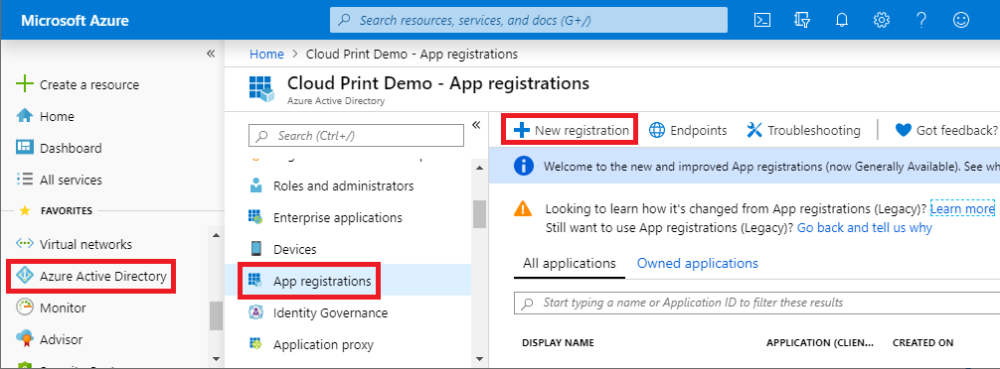

    - Enter an app name for Mopria Discovery service. Click **Register** to finish.

    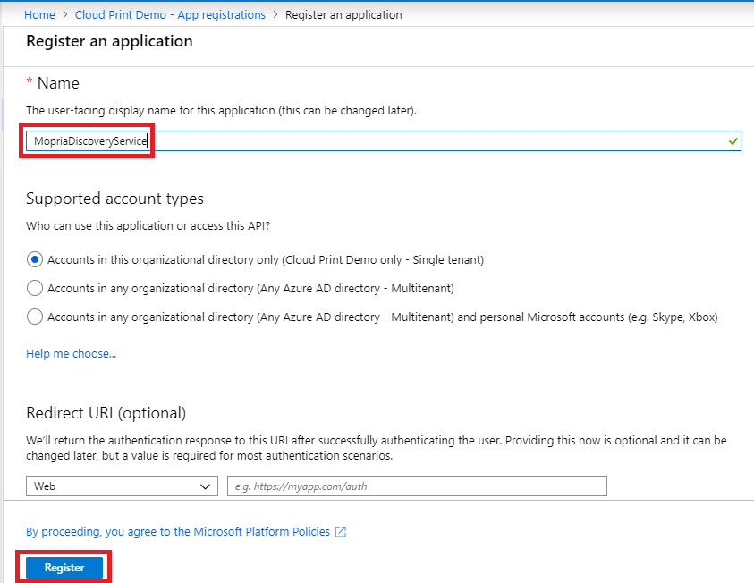

    - Repeat for Enterprise Cloud Print service.
    - Repeat for Native app.
    - The three applications should be displayed under **App registrations**.

    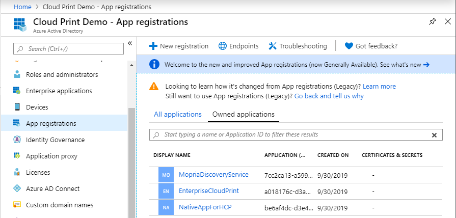

2. Expose API for the 2 Web applications.
    - While still in the **App registrations** blade, click on the Mopria Discovery Service app, select **Expose an API**, then click on **Set** next to Application ID URI.

    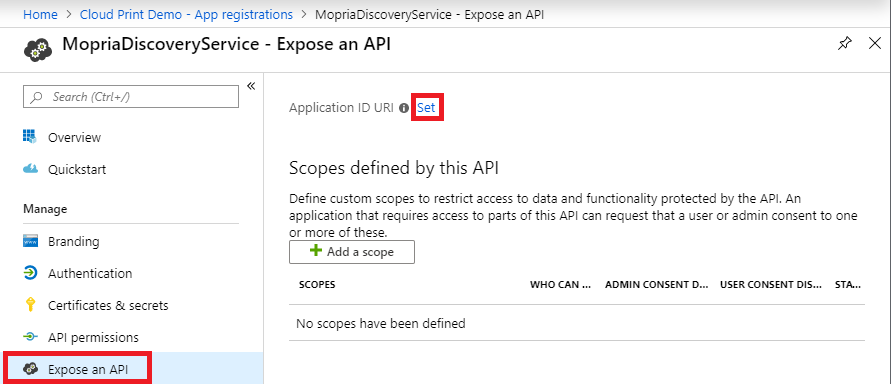

    - Click on **Save** without changing the default value for Application ID URI. This value just needs to be set now and will be changed later.

    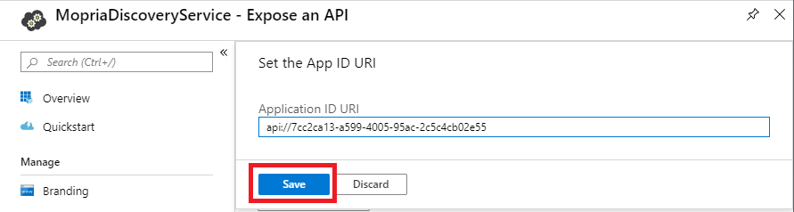

    - Click on **Add a scope**.

    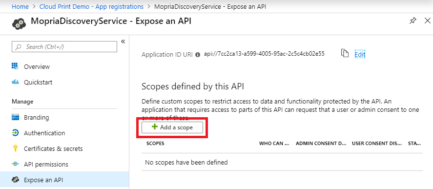

    - Provide a scope name, allow both admins and users to consent, enter consent description, and then click on **Add scope** to finish.

    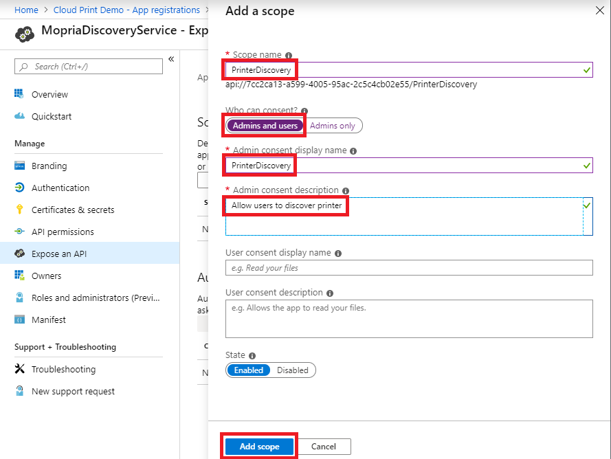

    - Repeat for Enterprise Cloud Print service. Use a different scope name and consent description.

    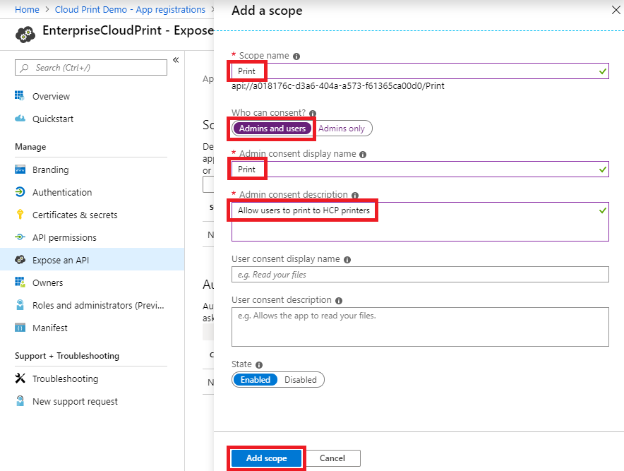

3. Add API permissions
    - Return to App registrations blade. Click on the Native app and select API permissions. Click on **Add a permission**.

    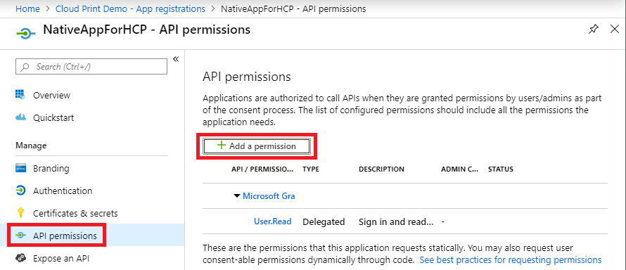

    - Switch to **APIs my organization uses**, then use the search box to find Mopria Discovery Service added earlier. Click on the service from the search result.

    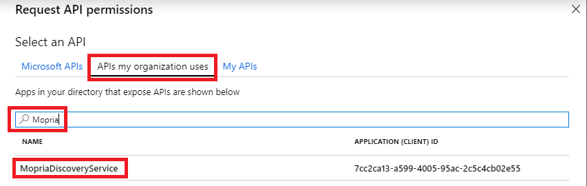

    - Select **Delegated permissions**. Check the box next to the API scope. Click on **Add permissions**.

    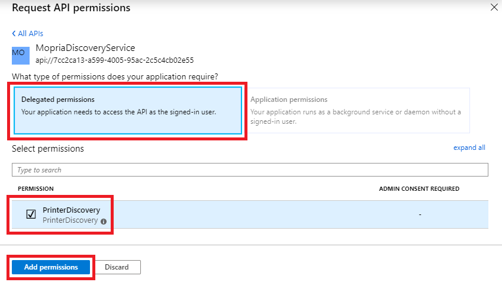

    - Repeat to add permissions to Enterprise Cloud Print Service.

    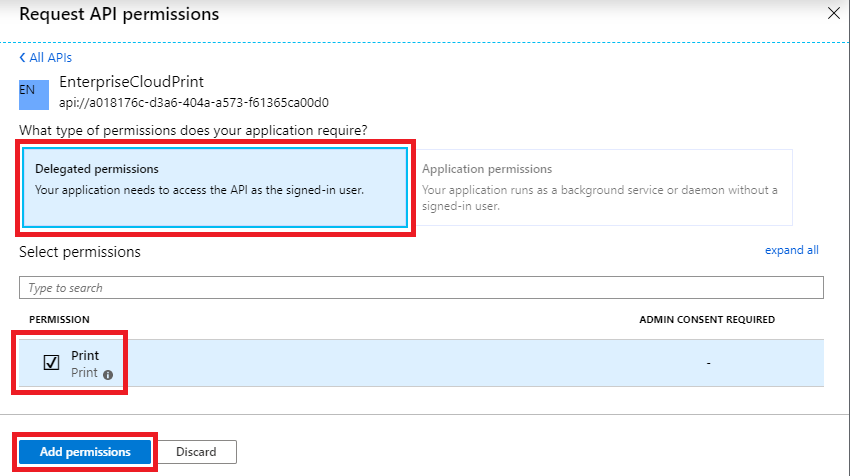

    - Once returned to the API permissions blade, wait 10 seconds before clicking on **Grand admin consent...**.

    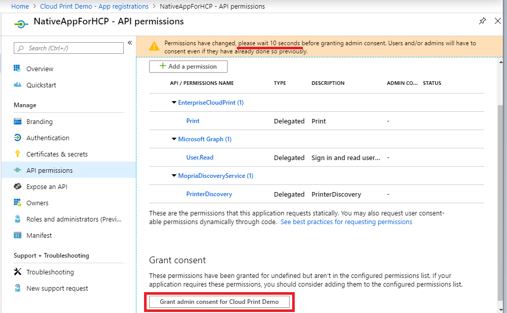

    - Click on **Yes** when prompted.

    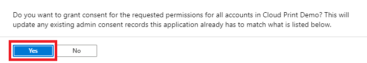

    - Verify that the status column of the API permission is displayed with green check marks.

    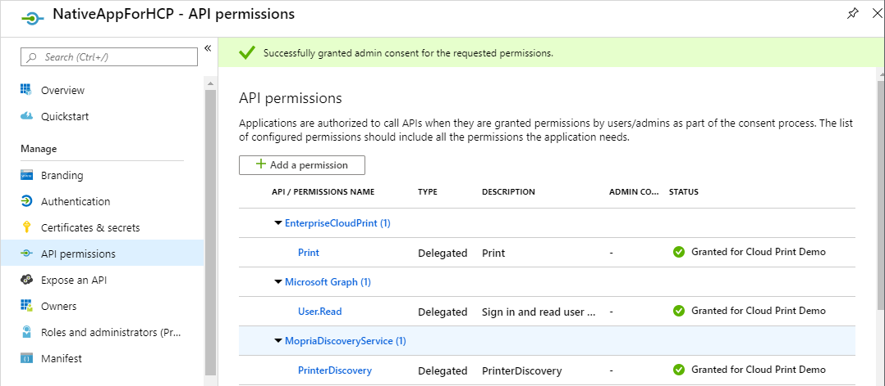

4. Configure Application Proxy for the Web applications
    - Go to **Azure Active Directory** > **Enterprise applications** > **All applications**. Search for the Mopria Discovery Service and click on it.

    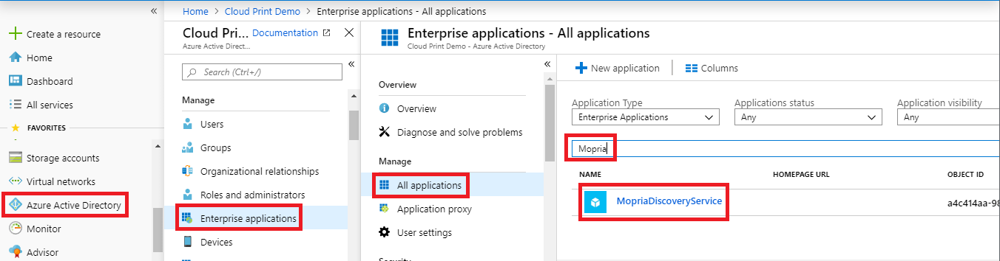

    - Click on **Application proxy**. Enter internal Url using the format `https://<fully qualified domain name of the Print Server>/mcs/`. Click on **Save** to finish.

    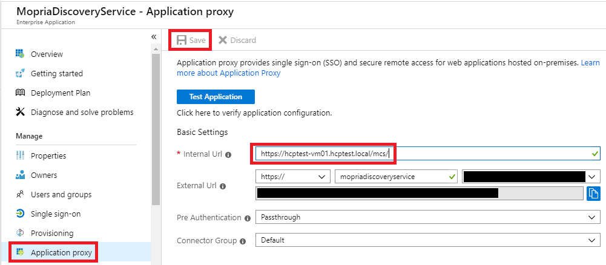

    - Repeat for Enterprise Cloud Print service. Note the internal URL is `https://<fully qualified domain name of the Print Server>/ecp/`.

    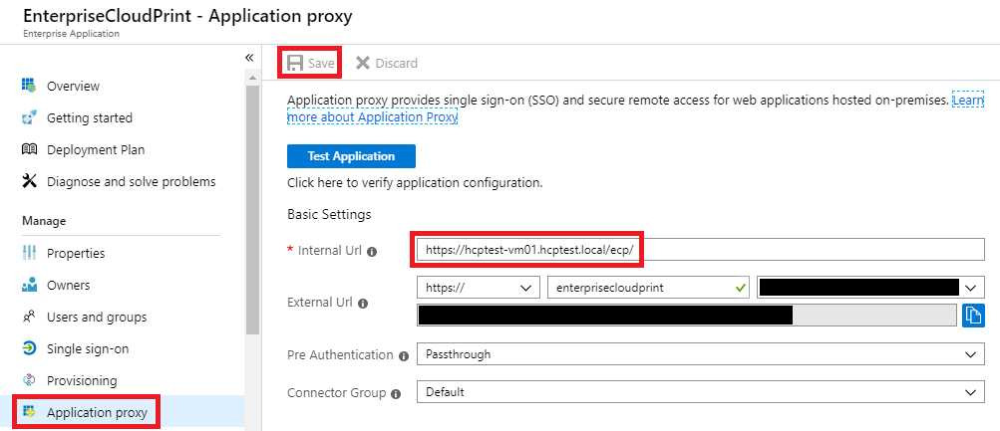

    - Go to **Azure Active Directory** > **App registrations**. Click on the Mopria Discovery Service. Under **Overview**, note that the Application ID URI has been changed from the default to the external URL under **Application proxy**. The URI will be used during Print Server setup, in client MDM policy, and for publishing printer.

    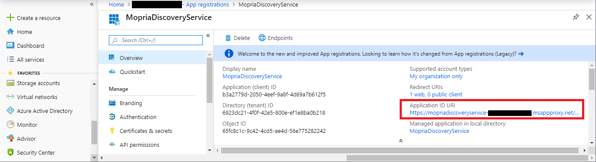

5. Assign users to applications
    - Go to **Azure Active Directory** > **Enterprise applications** > **All applications**. Search for the Mopria Discovery Service and click on it
    - Either click on **Users and groups** and assign users, or click on **Properties** and change **User assignment required?** to **No**
    - Repeat for Enterprise Cloud Print service.

6. Configure redirect URI in the Native app
    - Go to **Azure Active Directory** > **App registrations**. Click on the Native app. Go to **Overview** and copy the **Application (client) ID**.

    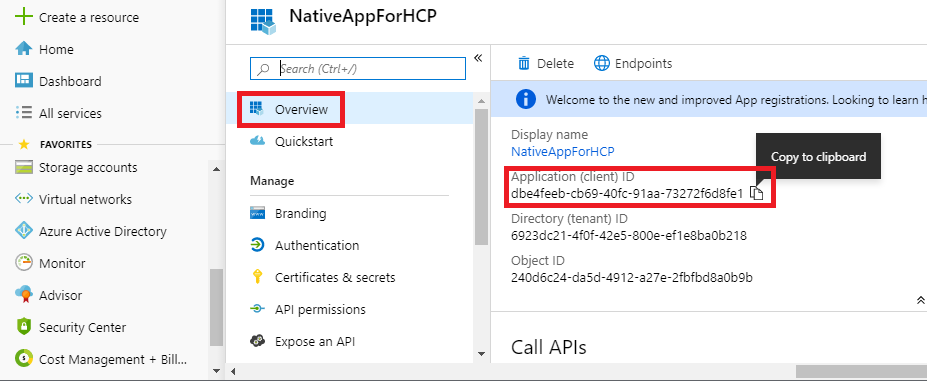

    - Go to **Authentication**. Change the **TYPE** dropdown box to `Public...`, and enter two redirect URIs using the format below, where `<NativeClientAppID>` is from the previous step:

        `ms-appx-web://Microsoft.AAD.BrokerPlugin/<NativeClientAppID>`

        `ms-appx-web://Microsoft.AAD.BrokerPlugin/S-1-15-2-3784861210-599250757-1266852909-3189164077-45880155-1246692841-283550366`

    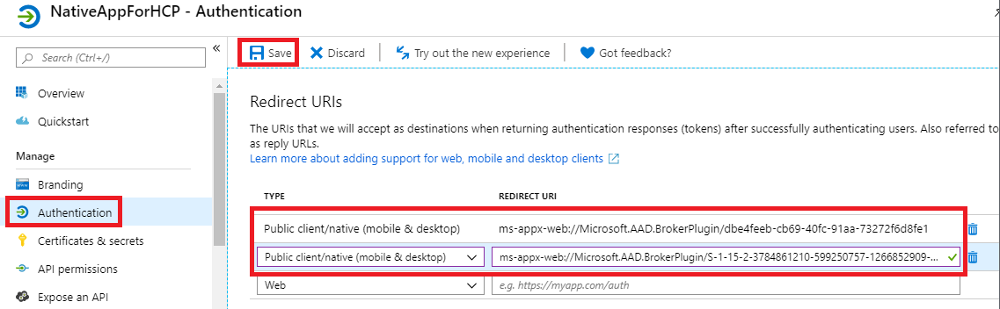

    - Click **Save** to finish.

### Step 4 - Setup the Print Server

1. Make sure the Print Server has all the available Windows Update installed. Note: Server 2019 must be patched to build 17763.165 or later.
    - Install the following server roles:
        - Print Server role
        - Internet Information Service (IIS)
    - See [Install roles, role services, and features by using the add Roles and Features Wizard](https://docs.microsoft.com/windows-server/administration/server-manager/install-or-uninstall-roles-role-services-or-features#BKMK_installarfw) for details on how to install server roles.

    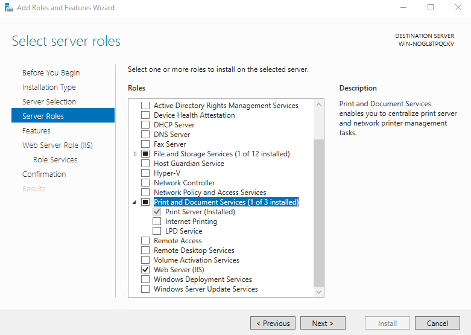

2. Install the Hybrid Cloud Print PowerShell modules.
    - Run the following commands from an elevated PowerShell command prompt:

        `find-module -Name "PublishCloudPrinter"` to confirm that the machine can reach the PowerShell Gallery (PSGallery)

        `install-module -Name "PublishCloudPrinter"`

    > NOTE: You may see a messaging stating that 'PSGallery' is an untrusted repository.  Enter 'y' to continue with the installation.

    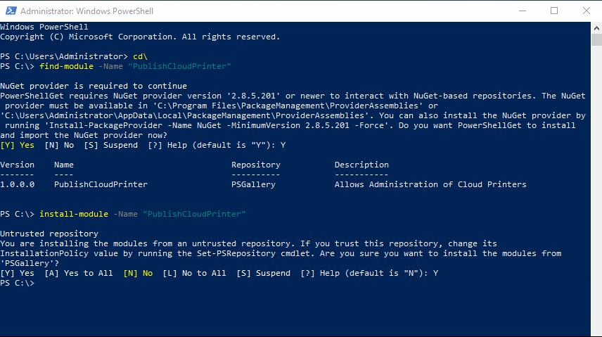

3. Install the Hybrid Cloud Print solution.
    - In the same elevated PowerShell command prompt, change directory to the one below (quotation marks needed):

        `"C:\Program Files\WindowsPowerShell\Modules\PublishCloudPrinter\1.0.0.0"`

    - Run

        `.\CloudPrintDeploy.ps1 -AzureTenant <Azure Active Directory domain name> -AzureTenantGuid <Azure Active Directory ID>`

    - Refer to the screenshot below to find the Azure Active Directory domain name.

    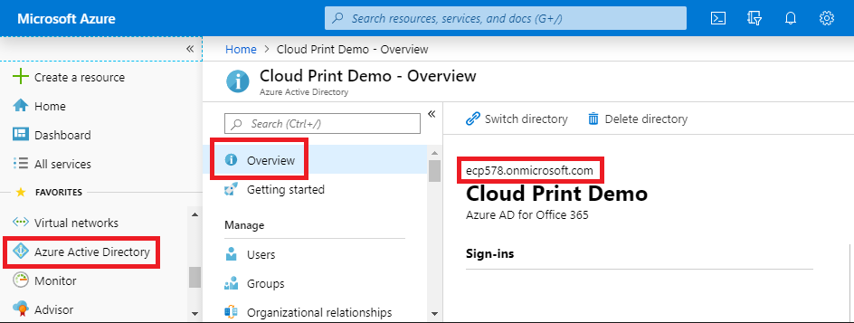

    - Refer to the screenshot below to find the Azure Active Directory ID.

    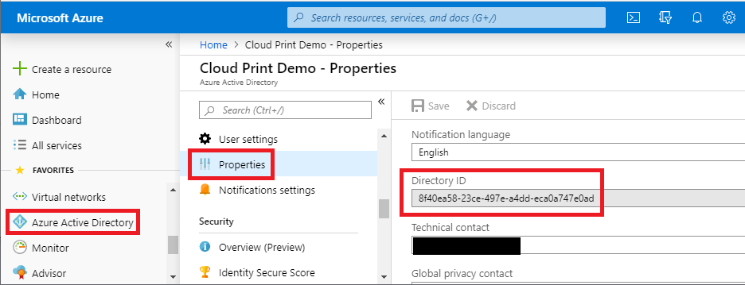

    - The output of the CloudPrintDeploy script looks like this:

    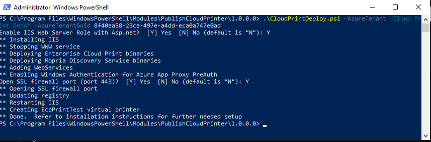

    - Check the log file to see if there is any error:
    `C:\Program Files\WindowsPowerShell\Modules\PublishCloudPrinter\1.0.0.0\CloudPrintDeploy.log`

4. Run **RegitEdit** in an elevated command prompt. Go to Computer\HKEY_LOCAL_MACHINE\SOFTWARE\Microsoft\Windows\CurrentVersion\CloudPrint\EnterpriseCloudPrintService.
    - Make sure AzureAudience is set to the Application ID URI of Enterprise Cloud Print app.
    - Make sure AzureTenant is set to the Azure AD domain name.

    

5. Go to Computer\HKEY_LOCAL_MACHINE\SOFTWARE\Microsoft\Windows\CurrentVersion\CloudPrint\MopriaDiscoveryService.
    - Make sure AzureAudience is the Application ID URI of Mopria Discovery Service app.
    - Make sure AzureTenant is the Azure AD domain name.
    - Make sure URL is the Application ID URI of Mopria Discovery Service app.

    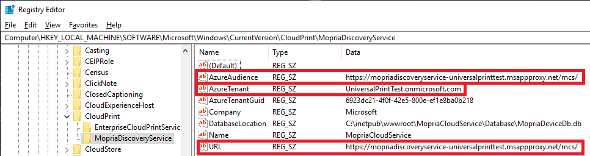

6. Run **iisreset** in an elevate Powershell command prompt. This will ensure any registry change made in the previous step takes effect.

7. Configure the IIS endpoints to support SSL.
    - The SSL certificate can be a self-signed cert or one issued from a trusted Certificate Authority (CA).
    - If using self-signed cert, **make sure the cert is imported to the client machine(s)**.
    - If you register your domain with 3rd party provider, you will need to configure the IIS endpoints with SSL certificate. See this [guide](https://www.sslsupportdesk.com/microsoft-server-2016-iis-10-10-5-ssl-installation/) for detail.

8. Install SQLite package.
   - Open an elevated PowerShell command prompt.
   - Run the following command to download System.Data.SQLite nuget packages.

        `Register-PackageSource -Name nuget.org -ProviderName NuGet -Location https://www.nuget.org/api/v2/ -Trusted -Force`

   - Run the following command to install the packages.

        `Install-Package system.data.sqlite [-requiredversion x.x.x.x] -providername nuget`

   > NOTE: It is recommended to download and install the latest version by leaving out the "-requiredversion" option.

    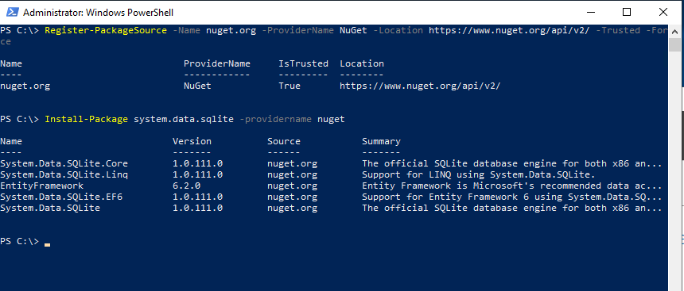

9. Copy the SQLite dlls to the MopriaCloudService Webapp bin folder (C:\inetpub\wwwroot\MopriaCloudService\bin).
    - Create a .ps1 file containing the PowerShell script below.
    - Change the $version variable to the SQLite version installed in previous step.
    - Run the .ps1 file in an elevated PowerShell command prompt.

    ```powershell
    $source = "\Program Files\PackageManagement\NuGet\Packages"
    $core = "System.Data.SQLite.Core"
    $linq = "System.Data.SQLite.Linq"
    $ef6 = "System.Data.SQLite.EF6"
    $version = "x.x.x.x"
    $target = "C:\inetpub\wwwroot\MopriaCloudService\bin"

    xcopy /y "$source\$core.$version\lib\net46\System.Data.SQLite.dll" "$target\"
    xcopy /y "$source\$core.$version\build\net46\x86\SQLite.Interop.dll" "$target\x86\"
    xcopy /y "$source\$core.$version\build\net46\x64\SQLite.Interop.dll" "$target\x64\"
    xcopy /y "$source\$linq.$version\lib\net46\System.Data.SQLite.Linq.dll" "$target\"
    xcopy /y "$source\$ef6.$version\lib\net46\System.Data.SQLite.EF6.dll" "$target\"
    ```

10. Update the c:\inetpub\wwwroot\MopriaCloudService\web.config file to include the SQLite version x.x.x.x in the following `<runtime>/<assemblyBinding>` sections. This is the same version used in the previous step.

    ```xml
    ...
    <dependentAssembly>
    assemblyIdentity name="System.Data.SQLite" culture="neutral" publicKeyToken="db937bc2d44ff139" /
    <bindingRedirect oldVersion="0.0.0.0-x.x.x.x" newVersion="x.x.x.x" />
    </dependentAssembly>
    <dependentAssembly>
    <assemblyIdentity name="System.Data.SQLite.Core" culture="neutral" publicKeyToken="db937bc2d44ff139" />
    <bindingRedirect oldVersion="0.0.0.0-x.x.x.x" newVersion="x.x.x.x" />
    </dependentAssembly>
    <dependentAssembly>
    <assemblyIdentity name="System.Data.SQLite.EF6" culture="neutral" publicKeyToken="db937bc2d44ff139" />
    <bindingRedirect oldVersion="0.0.0.0-x.x.x.x" newVersion="x.x.x.x" />
    </dependentAssembly>
    <dependentAssembly>
    <assemblyIdentity name="System.Data.SQLite.Linq" culture="neutral" publicKeyToken="db937bc2d44ff139" />
    <bindingRedirect oldVersion="0.0.0.0-x.x.x.x" newVersion="x.x.x.x" />
    </dependentAssembly>
    ...
    ```

11. Create the SQLite database.
    - Download and install the SQLite Tools binaries from `https://www.sqlite.org/`.
    - Go to `c:\inetpub\wwwroot\MopriaCloudService\Database` directory.
    - Execute the following command to create the database in this directory:

        `sqlite3.exe MopriaDeviceDb.db ".read MopriaSQLiteDb.sql"`

    - From File Explorer, open up the MopriaDeviceDb.db file properties to add users or groups which are allowed to publish to Mopria database in the Security tab. The users or groups must exist in on-premises Active Directory, and synchronized with Azure AD.
    - If the solution is deployed to a non-routable domain (e.g. *mydomain*.local), the Azure AD domain (e.g. *domainname*.onmicrosoft.com, or one purchased from third-party vendor) needs to be added as a UPN suffix to on-premises Active Directory. This is so the exact same user who will be publishing printers (e.g. admin@*domainname*.onmicrosoft.com) can be added in the security setting of the database file. See [Prepare a non-routable domain for directory synchronization](https://docs.microsoft.com/office365/enterprise/prepare-a-non-routable-domain-for-directory-synchronization).

    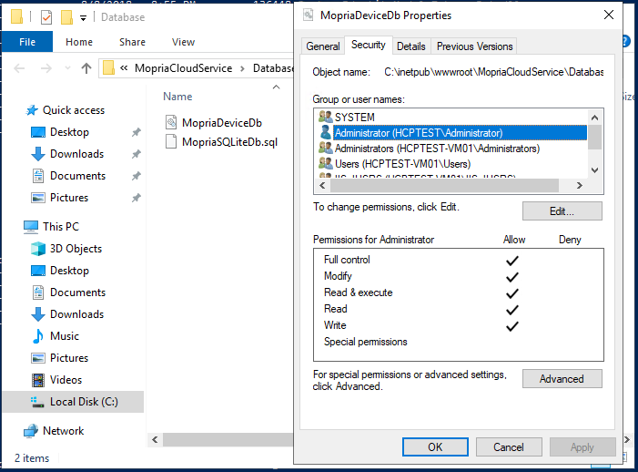

### Step 5 \[Optional\] - Configure pre-authentication with Azure AD

1. Review the document [Kerberos Constrained Delegation for single sign-on to your apps with Application Proxy](https://docs.microsoft.com/azure/active-directory/manage-apps/application-proxy-configure-single-sign-on-with-kcd).

2. Configure on-premises Active Directory.
    - On the Active Directory machine, open Server Manager and go to **Tools** > **Active Directory Users and Computers**.
    - Navigate to the **Computers** node and select the Connector Server.
    - Right-click and select **Properties** -> **Delegation** tab.
    - Select **Trust this computer for delegation to specified services only**.
    - Select **Use any authentication protocol**.
    - Under **Services to which this account can present delegated credentials**.
        - Add the Service Principal Name (SPN) of the Print Server machine.
        - Select HOST for service type.
    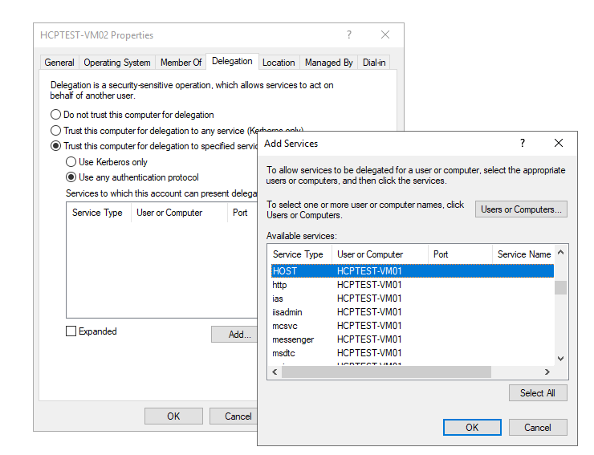

3. Verify that Windows Authentication is enabled in IIS.
    - On the Print Server, open Server Manager > Tools > Internet Information Service (IIS) Manager.
    - Navigate to the site.
    - Double click **Authentication**.
    - Click **Windows Authentication** and click **Enable** under **Actions**.
    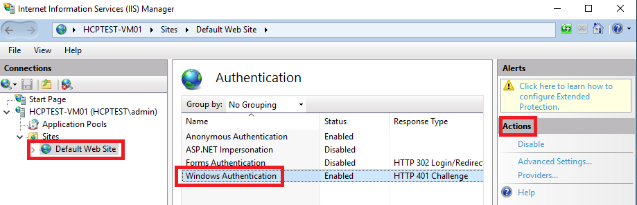

4. Configure Single Sign-On.
    - On Azure portal, go to **Azure Active Directory** > **Enterprise applications** > **All applications**.
    - Select MopriaDiscoveryService app.
    - Go to **Application proxy**. Change Pre Authentication method to **Azure Active Directory**.
    - Go to **Single sign-on**. Select "Integrated Windows Authentication" as the single sign-on method.
    - Set **Internal Application SPN** to the SPN of the Print Server machine.
    - Set **Delegated Login Identity** to "User principle name".
    - Repeat for EntperiseCloudPrint app.
    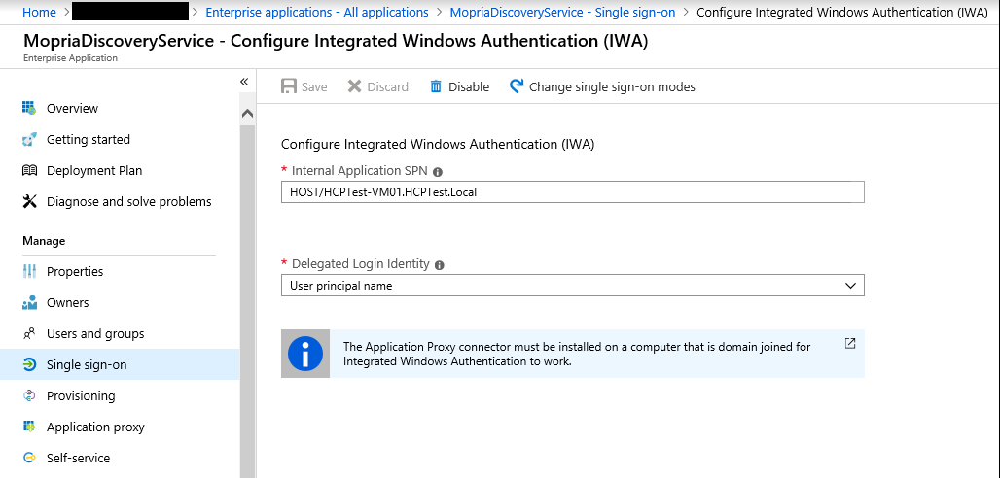

### Step 6 - Configure the required MDM policies

1. Login to your MDM provider.
2. Find the Enterprise Cloud Print policy group and configure the policies following the guidelines below:
    - CloudPrintOAuthAuthority = `https://login.microsoftonline.com/<Azure AD Directory ID>`. The directory ID can be found under Azure Active Directory > Properties.
    - CloudPrintOAuthClientId = "Application \(client\) ID" value of the Native app. You can find this under Azure Active Directory > App registrations > Select the Native app > Overview.
    - CloudPrinterDiscoveryEndPoint = External URL of the Mopria Discovery Service app. You can find this under Azure Active Directory > Enterprise applications > Select the Mopria Discovery Service app > Application proxy. **It must be exactly the same but without the trailing "/"**.
    - MopriaDiscoveryResourceId = The Application ID URI of the Mopria Discovery Service app. You can find this under Azure Active Directory > App registrations > Select the Mopria Discovery Service app > Overview. **It must be exactly the same with the trailing "/"**.
    - CloudPrintResourceId = The Application ID URI of the Enterprise Cloud Print app. You can find this under Azure Active Directory > App registrations > Select the Enterprise Cloud Print app > Overview. **It must be exactly the same with the trailing "/"**.
    - DiscoveryMaxPrinterLimit = \<a positive integer\>.

> Note: If you are using Microsoft Intune service, you can find these settings under the "Cloud Printer" category.

|Intune Display Name                     |Policy                         |
|----------------------------------------|-------------------------------|
|Printer discovery URL                   |CloudPrinterDiscoveryEndpoint  |
|Printer access authority URL            |CloudPrintOAuthAuthority       |
|Azure Native client app GUID            |CloudPrintOAuthClientId        |
|Print service resource URI              |CloudPrintResourceId           |
|Maximum printers to query(Mobile only)  |DiscoveryMaxPrinterLimit       |
|Printer discovery service resource URI  |MopriaDiscoveryResourceId      |

> Note: If the Cloud Print policy group is not available, but the MDM provider supports OMA-URI settings, then you can set the same policies.  Please refer to [this](https://docs.microsoft.com/windows/client-management/mdm/policy-csp-enterprisecloudprint#enterprisecloudprint-cloudprintoauthauthority) for additional info.

    - Values for OMA-URI
        - CloudPrintOAuthAuthority = ./Vendor/MSFT/Policy/Config/EnterpriseCloudPrint/CloudPrintOAuthAuthority
            - Value = https://login.microsoftonline.com/<Azure AD Directory ID>
        - CloudPrintOAuthClientId = ./Vendor/MSFT/Policy/Config/EnterpriseCloudPrint/CloudPrintOAuthClientId
            - Value = <Azure AD Native App's Application ID>
        - CloudPrinterDiscoveryEndPoint = ./Vendor/MSFT/Policy/Config/EnterpriseCloudPrint/CloudPrinterDiscoveryEndPoint
            - Value = External URL of the Mopria Discovery Service app (must be exactly the same but without the trailing "/")
        - MopriaDiscoveryResourceId = ./Vendor/MSFT/Policy/Config/EnterpriseCloudPrint/MopriaDiscoveryResourceId
            - Value = The Application ID URI of the Mopria Discovery Service app
        - CloudPrintResourceId = ./Vendor/MSFT/Policy/Config/EnterpriseCloudPrint/CloudPrintResourceId
            - Value = The Application ID URI of the Enterprise Cloud Print app
        - DiscoveryMaxPrinterLimit = ./Vendor/MSFT/Policy/Config/EnterpriseCloudPrint/DiscoveryMaxPrinterLimit
            - Value = A positive integer
    
### Step 7 - Publish the shared printer

1. Install desired printer on the Print Server.
2. Share the printer through the Printer Properties UI.
3. Select the desired set of users to grant access.
4. Save the changes and close out the printer properties window.
5. Prepare a Windows 10 Fall Creator Update or later machine. Join the machine to Azure AD, and login as a user who is synchronized with on-premises Active Directory and has been given proper permission to the MopriaDeviceDb.db file.
6. From the Windows 10 machine, open an elevated Windows PowerShell command prompt.
    - Run the following commands.
        - `find-module -Name "PublishCloudPrinter"` to confirm that the machine can reach the PowerShell Gallery (PSGallery)
        - `install-module -Name "PublishCloudPrinter"`

            > NOTE: You may see a messaging stating that 'PSGallery' is an untrusted repository.  Enter 'y' to continue with the installation.

        - `Publish-CloudPrinter`
        - Printer = The shared printer name. This name must match exactly the share name shown in the printer properties' **Sharing** tab, opened on the Print Server.

        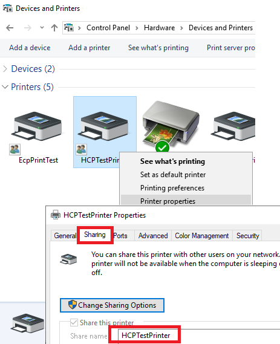

        - Manufacturer = Printer manufacturer.
        - Model = Printer model.
        - OrgLocation = A JSON string specifying the printer location,
            e.g.

            `{"attrs": [{"category":"country", "vs":"USA", "depth":0}, {"category":"organization", "vs":"Microsoft", "depth":1}, {"category":"site", "vs":"Redmond, WA", "depth":2}, {"category":"building", "vs":"Building 1", "depth":3}, {"category":"floor_number", "vs":1, "depth":4}, {"category":"room_name", "vs":"1111", "depth":5}]}`

        - Sddl = SDDL string representing permissions for the printer.
            - Log on to the Print Server as an administrator, and then run the following PowerShell command against the printer that you want to publish:
            `(Get-Printer PrinterName -full).PermissionSDDL`.
            - Add **O:BA** as prefix to the result from the command above. E.g. if the string returned by the previous command is "G:DUD:(A;OICI;FA;;;WD)", then SDDL = "O:BAG:DUD:(A;OICI;FA;;;WD)".
        - DiscoveryEndpoint = Log in to Azure portal and then get the string from Enterprise applications > Mopria Discovery Service app > Application proxy > External URL. Omit the trailing "/".
        - PrintServerEndpoint = Log in to Azure portal and then get the string from Enterprise applications > Enterprise Cloud Print app > Application proxy > External URL. Omit the trailing "/".
        - AzureClientId = Application ID of the registered Native application.
        - AzureTenantGuid = Directory ID of your Azure AD tenant.
        - DiscoveryResourceId = Application ID URI of the Mopria Discovery Service application.

    - You can enter all of the required parameter values in the command line as well. The syntax is:

        `Publish-CloudPrinter -Printer <string> -Manufacturer <string> -Model <string> -OrgLocation <string> -Sddl <string> -DiscoveryEndpoint <string> -PrintServerEndpoint <string> -AzureClientId <string> -AzureTenantGuid <string> -DiscoveryResourceId <string>`

        Sample command:

        `Publish-CloudPrinter -Printer HcpTestPrinter -Manufacturer Manufacturer1 -Model Model1 -OrgLocation '{"attrs": [{"category":"country", "vs":"USA", "depth":0}, {"category":"organization", "vs":"MyCompany", "depth":1}, {"category":"site", "vs":"MyCity, State", "depth":2}, {"category":"building", "vs":"Building 1", "depth":3}, {"category":"floor_name", "vs":1, "depth":4}, {"category":"room_name", "vs":"1111", "depth":5}]}' -Sddl "O:BAG:DUD:(A;OICI;FA;;;WD)" -DiscoveryEndpoint "https://mopriadiscoveryservice-contoso.msappproxy.net/mcs" -PrintServerEndpoint "https://enterprisecloudprint-contoso.msappproxy.net/ecp" -AzureClientId "dbe4feeb-cb69-40fc-91aa-73272f6d8fe1" -AzureTenantGuid "8de6a14a-5a23-4c1c-9ae4-1481ce356034" -DiscoveryResourceId "https://mopriadiscoveryservice-contoso.msappproxy.net/mcs/"`

    - Use the following command to verify that the printer is published.

        `Publish-CloudPrinter -Query -DiscoveryEndpoint <string> -AzureClientId <string> -AzureTenantGuid <string> -DiscoveryResourceId <string>`

        Sample command:

        `Publish-CloudPrinter -Query -DiscoveryEndpoint "https://mopriadiscoveryservice-contoso.msappproxy.net/mcs" -AzureClientId "dbe4feeb-cb69-40fc-91aa-73272f6d8fe1" -AzureTenantGuid "8de6a14a-5a23-4c1c-9ae4-1481ce356034" -DiscoveryResourceId "https://mopriadiscoveryservice-contoso.msappproxy.net/mcs/"`

## Verify the deployment

On an Azure AD joined device that has the MDM policies configured:
- Open a web browser and to go to https://mopriadiscoveryservice-*tenant-name*.msappproxy.net/mcs/services.
- You should see the JSON text describing the set of functionality of this endpoint.
- Go to **Settings** > **Devices** > **Printers & scanners**.
    - Click on **Add printer or scanner**.
    - You should see a "Search for cloud printers" (or "Search for printers in my organization" on a more recent Windows 10 machine) link.
    - Click on the link.
    - Click the “Please select a search location” link.
        - You should see the device location hierarchy.
    - Pick a location and click **OK** and then click **Search** button to find the printers.
    - Select printer and click **Add device** button.
    - After successful printer installation, print to the printer from your favorite app.

> Note: If using the “EcpPrintTest” printer, you can find the output file in the Print Server machine under “C:\\ECPTestOutput\\EcpTestPrint.xps” location.

## Troubleshooting

Below are common issues during HCP deployment

|Error |Recommended steps |
|------|------|
|CloudPrintDeploy PowerShell script failed | <ul><li>Ensure Windows Server has the latest update.</li><li>If Windows Server Update Services (WSUS) is used, please see [How to make Features on Demand and language packs available when you're using WSUS/SCCM](https://docs.microsoft.com/windows/deployment/update/fod-and-lang-packs).</li></ul> |
|SQLite installation failed with message: Dependency loop detected for package 'System.Data.SQLite' | Install-Package system.data.sqlite.core -providername nuget -SkipDependencies<br>Install-Package system.data.sqlite.EF6 -providername nuget -SkipDependencies<br>Install-Package system.data.sqlite.Linq -providername nuget -SkipDependencies<br><br>After the packages have been successfully downloaded, make sure that they are all the same version. If not, add the -requiredversion parameter to the commands above and set them to be the same version. |
|Publishing printer failed | <ul><li>For passthrough pre authentication, ensure the user publishing the printer is given proper permission to the publishing database.</li><li>For Azure AD pre authentication, ensure Windows authentication is enabled in IIS. See Step 5.3. In addition, try passthrough pre authentication first. If passthrough pre authentication works, the issue is likely related to application proxy. See [Troubleshoot Application Proxy problems and error messages](https://docs.microsoft.com/azure/active-directory/manage-apps/application-proxy-troubleshoot). Note that switching to passthrough resets the single sign-on setting; revisit Step 5 to setup Azure AD pre authentication again.</li></ul> |
|Print jobs stay in "Sent to printer" state | <ul><li>Ensure TLS 1.2 is enabled on the connector server. See the linked article in Step 2.1.</li><li>Ensure HTTP2 is disabled on the connector server. See the linked article in Step 2.1.</li></ul> |

Below are locations of logs that can help troubleshooting

|Component |Log location |
|------|------|
|Windows 10 Client | <ul><li>Use Event Viewer to see log of Azure AD operations. Click on **Start** and type "Event Viewer". Navigate to Applications and Services Logs > Microsoft > Windows > AAD > Operation.</li><li>Use Feedback Hub to collect logs. See [Send feedback to Microsoft with the Feedback Hub app](https://support.microsoft.com/help/4021566/windows-10-send-feedback-to-microsoft-with-feedback-hub-app)</li></ul> |
|Connector Server | Use Event Viewer to see log of Application Proxy. Click on **Start** and type "Event Viewer". Navigate to Applications and Services Logs > Microsoft > AadApplicationProxy > Connector > Admin. |
|Print Server | Logs for Mopria Discovery Service app and Enterprise Cloud Print app can be found at C:\inetpub\logs\LogFiles\W3SVC1. |
