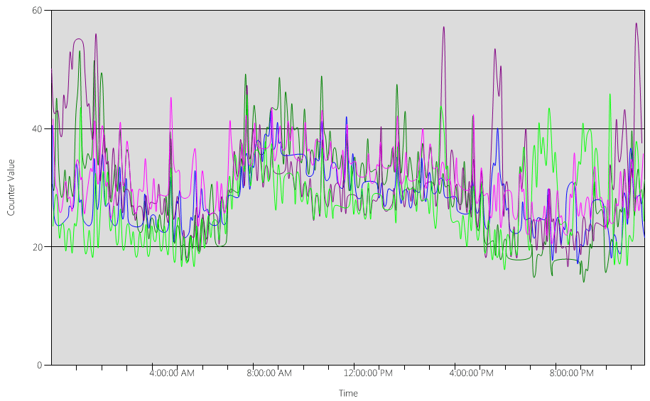
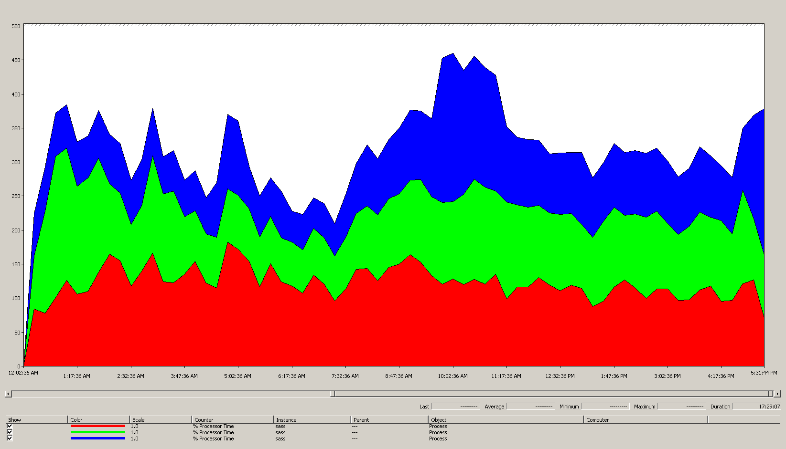
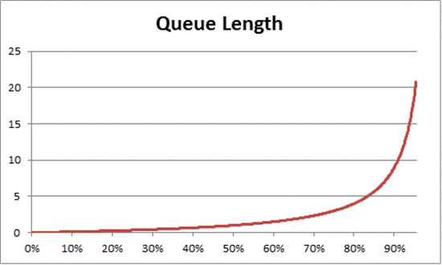
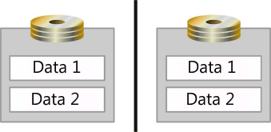
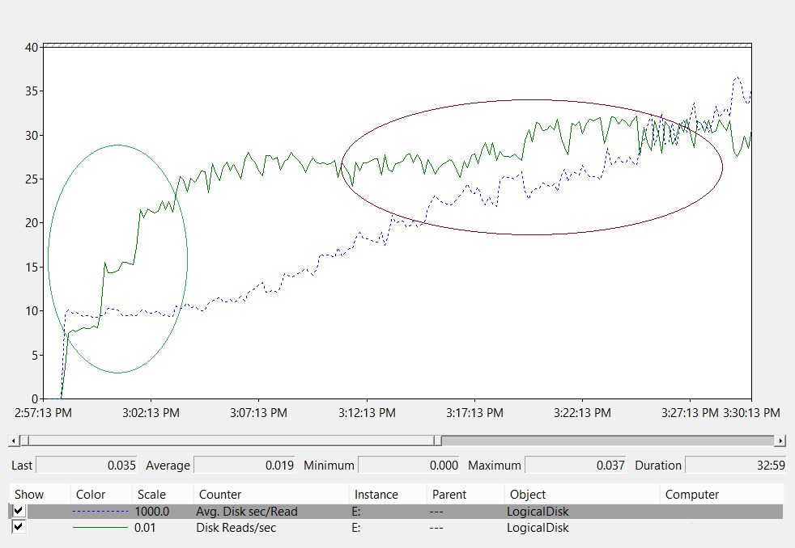

# Capacity planning for Active Directory Domain Services

This topic is originally written by Ken Brumfield, Senior Premier Field Engineer at Microsoft, and provides recommendations for capacity planning for Active Directory Domain Services (AD DS).

## Goals of capacity planning

Capacity planning is not the same as troubleshooting performance incidents. They are closely related, but quite different. The goals of capacity planning are:  

- Properly implement and operate an environment 
- Minimize the time spent troubleshooting performance issues.  
  
In capacity planning, an organization might have a baseline target of 40% processor utilization during peak periods in order to meet client performance requirements and accommodate the time necessary to upgrade the hardware in the datacenter. Whereas, to be notified of abnormal performance incidents, a monitoring alert threshold might be set at 90% over a 5 minute interval.

The difference is that when a capacity management threshold is continually exceeded (a one-time event is not a concern), adding capacity (that is, adding in more or faster processors) would be a solution or scaling the service across multiple servers would be a solution. Performance alert thresholds indicate that client experience is currently suffering and immediate steps are needed to address the issue.

As an analogy: capacity management is about preventing a car accident (defensive driving, making sure the brakes are working properly, and so on) whereas performance troubleshooting is what the police, fire department, and emergency medical professionals do after an accident. This is about “defensive driving,” Active Directory-style.

Over the last several years, capacity planning guidance for scale-up systems has changed dramatically. The following changes in system architectures have challenged fundamental assumptions about designing and scaling a service:

- 64-bit server platforms  
- Virtualization  
- Increased attention to power consumption  
- SSD storage  
- Cloud scenarios  

Additionally, the approach is shifting from a server-based capacity planning exercise to a service-based capacity planning exercise. Active Directory Domain Services (AD DS), a mature distributed service that many Microsoft and third-party products use as a backend, becomes one the most critical products to plan correctly to ensure the necessary capacity for other applications to run.

### Baseline requirements for capacity planning guidance

Throughout this article, the following baseline requirements are expected:

- Readers have read and are familiar with [Performance Tuning Guidelines for Windows Server 2012 R2](https://docs.microsoft.com/previous-versions//dn529133(v=vs.85)).
- The Windows Server platform is an x64 based architecture. But even if your Active Directory environment is installed on Windows Server 2003 x86 (now beyond the end of the support lifecycle) and has a directory information tree (DIT) that is less 1.5 GB in size and that can easily be held in memory, the guidelines from this article are still applicable.
- Capacity planning is a continuous process and you should regularly review how well the environment is meeting expectations.
- Optimization will occur over multiple hardware lifecycles as hardware costs change. For example, memory becomes cheaper, the cost per core decreases, or the price of different storage options change.
- Plan for the peak busy period of the day. It is recommended to look at this in either 30 minute or hour intervals. Anything greater may hide the actual peaks and anything less may be distorted by “transient spikes.”
- Plan for growth over the course of the hardware lifecycle for the enterprise. This may include a strategy of upgrading or adding hardware in a staggered fashion, or a complete refresh every three to five years. Each will require a “guess” as how much the load on Active Directory will grow. Historical data, if collected, will help with this assessment. 
- Plan for fault tolerance. Once an estimate *N* is derived, plan for scenarios that include *N* &ndash; 1, *N* &ndash; 2, *N* &ndash; *x*.
  - Add in additional servers according to organizational need to ensure that the loss of a single or multiple servers does not exceed maximum peak capacity estimates.
  - Also consider that the growth plan and fault tolerance plan need to be integrated. For example, if one DC is required to support the load, but the estimate is that the load will be doubled in the next year and require two DCs total, there will not be enough capacity to support fault tolerance. The solution would be to start with three DCs. One could also plan to add the third DC after 3 or 6 months if budgets are tight.

    >[!NOTE]
    >Adding Active Directory-aware applications might have a noticeable impact on the DC load, whether the load is coming from the application servers or clients.

### Three-step process for the capacity planning cycle

In capacity planning, first decide what quality of service is needed. For example, a core datacenter supports a higher level of concurrency and requires more consistent experience for users and consuming applications, which requires greater attention to redundancy and minimizing system and infrastructure bottlenecks. In contrast, a satellite location with a handful of users does not need the same level of concurrency or fault tolerance. Thus, the satellite office might not need as much attention to optimizing the underlying hardware and infrastructure, which may lead to cost savings. All recommendations and guidance herein are for optimal performance, and can be selectively relaxed for scenarios with less demanding requirements.

The next question is: virtualized or physical? From a capacity planning perspective, there is no right or wrong answer; there is only a different set of variables to work with. Virtualization scenarios come down to one of two options:

- “Direct mapping” with one guest per host (where virtualization exists solely to abstract the physical hardware from the server)
- “Shared host”

Testing and production scenarios indicate that the “direct mapping” scenario can be treated identically to a physical host. “Shared host,” however, introduces a number of considerations spelled out in more detail later. The “shared host” scenario means that AD DS is also competing for resources, and there are penalties and tuning considerations for doing so.

With these considerations in mind, the capacity planning cycle is an iterative three-step process:

1. Measure the existing environment, determine where the system bottlenecks currently are, and get environmental basics necessary to plan the amount of capacity needed.
1. Determine the hardware needed according to the criteria outlined in step 1.
1. Monitor and validate that the infrastructure as implemented is operating within specifications. Some data collected in this step becomes the baseline for the next cycle of capacity planning.

### Applying the process

To optimize performance, ensure these major components are correctly selected and tuned to the application loads:

1. Memory
1. Network
1. Storage
1. Processor
1. Net Logon

The basic storage requirements of AD DS and the general behavior of well written client software allow environments with as many as 10,000 to 20,000 users to forego heavy investment in capacity planning with regards to physical hardware, as almost any modern server class system will handle the load. That said, the following table summarizes how to evaluate an existing environment in order to select the right hardware. Each component is analyzed in detail in subsequent sections to help AD DS administrators evaluate their infrastructure using baseline recommendations and environment-specific principals.

In general:

- Any sizing based on current data will only be accurate for the current environment.
- For any estimates, expect demand to grow over the lifecycle of the hardware.
- Determine whether to oversize today and grow into the larger environment, or add capacity over the lifecycle.
- For virtualization, all the same capacity planning principals and methodologies apply, except that the overhead of the virtualization needs to be added to anything domain related.
- Capacity planning, like anything that attempts to predict, is NOT an accurate science. Do not expect things to calculate perfectly and with 100% accuracy. The guidance here is the leanest recommendation; add in capacity for additional safety and continuously validate that the environment remains on target.

### Data collection summary tables

#### New environment

| Component | Estimates |
|-|-|
|Storage/Database Size|40 KB to 60 KB for each user|
|RAM|Database Size Base operating system recommendations Third-party applications|
|Network|1 GB|
|CPU|1000 concurrent users for each core|

#### High-level evaluation criteria

| Component | Evaluation criteria | Planning considerations |
|-|-|-|
|Storage/Database size|The section entitled “To activate logging of disk space that is freed by defragmentation” in [Storage Limits](https://docs.microsoft.com/previous-versions/windows/it-pro/windows-2000-server/cc961769(v=technet.10))| |
|Storage/ Database performance|<ul><li>"LogicalDisk(*\<NTDS Database Drive\>*)\Avg Disk sec/Read," "LogicalDisk(*\<NTDS Database Drive\>*)\Avg Disk sec/Write," "LogicalDisk(*\<NTDS Database Drive\>*)\Avg Disk sec/Transfer"</li><li>"LogicalDisk(*\<NTDS Database Drive\>*)\Reads/sec," "LogicalDisk(*\<NTDS Database Drive\>*)\Writes/sec," "LogicalDisk(*\<NTDS Database Drive\>*)\Transfers/sec"</li></ul>|<ul><li>Storage has two concerns to address<ul><li>Space available, which with the size of today’s spindle based and SSD based storage is irrelevant for most AD environments.</li> <li>Input/Output (IO) Operations available – In many environments, this is often overlooked. But it is important to evaluate only environments where there is not enough RAM to load the entire NTDS Database into memory.</li></ul><li>Storage can be a complex topic and should involve hardware vendor expertise for proper sizing. Particularly with more complex scenarios such as SAN, NAS, and iSCSI scenarios. However, in general, cost per Gigabyte of storage is often in direct opposition to cost per IO:<ul><li>RAID 5 has lower cost per Gigabyte than Raid 1, but Raid 1 has lower cost per IO</li><li>Spindle-based hard drives have lower cost per Gigabyte, but SSDs have a lower cost per IO</li></ul><li>After a restart of the computer or the Active Directory Domain Services service, the Extensible Storage Engine (ESE) cache is empty and performance will be disk bound while the cache warms.</li><li>In most environments AD is read intensive I/O in a random pattern to disks, negating much of the benefit of caching and read optimization strategies.  Plus, AD has a way larger cache in memory than most storage system caches.</li></ul>
|RAM|<ul><li>Database size</li><li>Base operating system recommendations</li><li>Third-party applications</li></ul>|<ul><li>Storage is the slowest component in a computer. The more that can be resident in RAM, the less it is necessary to go to disk.</li><li>Ensure enough RAM is allocated to store the operating system, Agents (antivirus, backup, monitoring), NTDS Database and growth over time.</li><li>For environments where maximizing the amount of RAM is not cost effective (such as a satellite locations) or not feasible (DIT is too large), reference the Storage section to ensure that storage is properly sized.</li></ul>|
|Network|<ul><li>“Network Interface(\*)\Bytes Received/sec”</li><li>“Network Interface(\*)\Bytes Sent/sec”|<ul><li>In general, traffic sent from a DC far exceeds traffic sent to a DC.</li><li>As a switched Ethernet connection is full-duplex, inbound and outbound network traffic need to be sized independently.</li><li>Consolidating the number of DCs will increase the amount of bandwidth used to send responses back to client requests for each DC, but will be close enough to linear for the site as a whole.</li><li>If removing satellite location DCs, don’t forget to add the bandwidth for the satellite DC into the hub DCs as well as use that to evaluate how much WAN traffic there will be.</li></ul>|
|CPU|<ul><li>“Logical Disk(*\<NTDS Database Drive\>*)\Avg Disk sec/Read”</li><li>“Process(lsass)\\% Processor Time”</li></ul>|<ul><li>After eliminating storage as a bottleneck, address the amount of compute power needed.</li><li>While not perfectly linear, the number of processor cores consumed across all servers within a specific scope (such as a site) can be used to gauge how many processors are necessary to support the total client load. Add the minimum necessary to maintain the current level of service across all the systems within the scope.</li><li>Changes in processor speed, including power management related changes, impact numbers derived from the current environment. Generally, it is impossible to precisely evaluate how going from a 2.5 GHz processor to a 3 GHz processor will reduce the number of CPUs needed.</li></ul>|
|NetLogon|<ul><li>“Netlogon(\*)\Semaphore Acquires”</li><li>“Netlogon(\*)\Semaphore Timeouts”</li><li>“Netlogon(\*)\Average Semaphore Hold Time”</li></ul>|<ul><li>Net Logon Secure Channel/MaxConcurrentAPI only affects environments with NTLM authentications and/or PAC Validation. PAC Validation is on by default in operating system versions before Windows Server 2008. This is a client setting, so the DCs will be impacted until this is turned off on all client systems.</li><li>Environments with significant cross trust authentication, which includes intra-forest trusts, have greater risk if not sized properly.</li><li>Server consolidations will increase concurrency of cross-trust authentication.</li><li>Surges need to be accommodated, such as cluster fail-overs, as users re-authenticate en masse to the new cluster node.</li><li>Individual client systems (such as a cluster) might need tuning too.</li></ul>|

## Planning

For a long time, the community’s recommendation for sizing AD DS has been to “put in as much RAM as the database size.” For the most part, that recommendation is all that most environments needed to be concerned about. But the ecosystem consuming AD DS has gotten much bigger, as have the AD DS environments themselves, since its introduction in 1999. Although the increase in compute power and the switch from x86 architectures to x64 architectures has made the subtler aspects of sizing for performance irrelevant to a larger set of customers running AD DS on physical hardware, the growth of virtualization has reintroduced the tuning concerns to a larger audience than before.

The following guidance is thus about how to determine and plan for the demands of Active Directory as a service regardless of whether it is deployed in a physical, a virtual/physical mix, or a purely virtualized scenario. As such, we will break down the evaluation to each of the four main components: storage, memory, network, and processor. In short, in order to maximize performance on AD DS, the goal is to get as close to processor bound as possible.

## RAM

Simply, the more that can be cached in RAM, the less it is necessary to go to disk. To maximize the scalability of the server the minimum amount of RAM should be the sum of the current database size, the total SYSVOL size, the operating system recommended amount, and the vendor recommendations for the agents (antivirus, monitoring, backup, and so on). An additional amount should be added to accommodate growth over the lifetime of the server. This will be environmentally subjective based on estimates of database growth based on environmental changes.

For environments where maximizing the amount of RAM is not cost effective (such as a satellite locations) or not feasible (DIT is too large), reference the Storage  section to ensure that storage is properly designed.

A corollary that comes up in the general context in sizing memory is sizing of the page file. In the same context as everything else memory related, the goal is to minimize going to the much slower disk. Thus the question should go from, “how should the page file be sized?” to “how much RAM is needed to minimize paging?” The answer to the latter question is outlined in the rest of this section. This leaves most of the discussion for sizing the page file to the realm of general operating system recommendations and the need to configure the system for memory dumps, which are unrelated to AD DS performance.

### Evaluating

The amount of RAM that a domain controller (DC) needs is actually a complex exercise for these reasons:

- High potential for error when trying to use an existing system to gauge how much RAM is needed as LSASS will trim under memory pressure conditions, artificially deflating the need.
- The subjective fact that an individual DC only needs to cache what is “interesting” to its clients. This means that the data that needs to be cached on a DC in a site with only an Exchange server will be very different than the data that needs to be cached on a DC that only authenticates users.
- The labor to evaluate RAM for each DC on a case-by-case basis is prohibitive and changes as the environment changes.
- The criteria behind the recommendation will help to make informed decisions: 
- The more that can be cached in RAM, the less it is necessary to go to disk. 
- Storage is by far the slowest component of a computer. Access to data on spindle-based and SSD storage media is on the order of 1,000,000x slower than access to data in RAM.

Thus, in order to maximize the scalability of the server, the minimum amount of RAM is the sum of the current database size, the total SYSVOL size, the operating system recommended amount, and the vendor recommendations for the agents (antivirus, monitoring, backup, and so on). Add additional amounts to accommodate growth over the lifetime of the server. This will be environmentally subjective based on estimates of database growth. However, for satellite locations with a small set of end users, these requirements can be relaxed as these sites will not need to cache as much to service most of the requests.

For environments where maximizing the amount of RAM is not cost effective (such as a satellite locations) or not feasible (DIT is too large), reference the Storage section to ensure that storage is properly sized.

> [!NOTE]
> A corollary while sizing memory is sizing of the page file. Because the goal is to minimize going to the much slower disk, the question goes from “how should the page file be sized?” to “how much RAM is needed to minimize paging?” The answer to the latter question is outlined in the rest of this section. This leaves most of the discussion for sizing the page file to the realm of general operating system recommendations and the need to configure the system for memory dumps, which are unrelated to AD DS performance.

### Virtualization considerations for RAM

Avoid memory over-commit at the host. The fundamental goal behind optimizing the amount of RAM is to minimize the amount of time spent going to disk. In virtualization scenarios, the concept of memory over-commit exists where more RAM is allocated to the guests then exists on the physical machine. This in and of itself is not a problem. It becomes a problem when the total memory actively used by all the guests exceeds the amount of RAM on the host and the underlying host starts paging. Performance becomes disk-bound in cases where the domain controller is going to the NTDS.dit to get data, or the domain controller is going to the page file to get data, or the host is going to disk to get data that the guest thinks is in RAM.

### Calculation summary example

|Component|Estimated memory (example)|
|-|-|
|Base operating system recommended RAM (Windows Server 2008)|2 GB|
|LSASS internal tasks|200 MB|
|Monitoring agent|100 MB|
|Antivirus|100 MB|
|Database (Global Catalog)|8.5 GB are you sure ???|
|Cushion for backup to run, administrators to log on without impact|1 GB|
|Total|12 GB|

**Recommended: 16 GB**

Over time, the assumption can be made that more data will be added to the database and the server will probably be in production for 3 to 5 years. Based on an estimate of growth of 33%, 16 GB would be a reasonable amount of RAM to put in a physical server. In a virtual machine, given the ease with which settings can be modified and RAM can be added to the VM, starting at 12 GB with the plan to monitor and upgrade in the future is reasonable.

## Network

### Evaluating
This section is less about evaluating the demands regarding replication traffic, which is focused on traffic traversing the WAN and is thoroughly covered in [Active Directory Replication Traffic](https://docs.microsoft.com/previous-versions/windows/it-pro/windows-2000-server/bb742457(v=technet.10)), than it is about evaluating total bandwidth and network capacity needed, inclusive of client queries, Group Policy applications, and so on. For existing environments, this can be collected by using performance counters “Network Interface(\*)\Bytes Received/sec,” and “Network Interface(\*)\Bytes Sent/sec.” Sample intervals for Network Interface counters in either 15, 30, or 60 minutes. Anything less will generally be too volatile for good measurements; anything greater will smooth out daily peeks excessively.

> [!NOTE]
> Generally, the majority of network traffic on a DC is outbound as the DC responds to client queries. This is the reason for the focus on outbound traffic, though it is recommended to evaluate each environment for inbound traffic also. The same approaches can be used to address and review inbound network traffic requirements. For more information, see Knowledge Base article [929851: The default dynamic port range for TCP/IP has changed in Windows Vista and in Windows Server 2008](http://support.microsoft.com/kb/929851).

### Bandwidth needs

Planning for network scalability covers two distinct categories: the amount of traffic and the CPU load from the network traffic. Each of these scenarios is straight-forward compared to some of the other topics in this article.

In evaluating how much traffic must be supported, there are two unique categories of capacity planning for AD DS in terms of network traffic. The first is replication traffic that traverses between domain controllers and is covered thoroughly in the reference [Active Directory Replication Traffic](https://docs.microsoft.com/previous-versions/windows/it-pro/windows-2000-server/bb742457(v=technet.10)) and is still relevant to current versions of AD DS. The second is the intrasite client-to-server traffic. One of the simpler scenarios to plan for, intrasite traffic predominantly receives small requests from clients relative to the large amounts of data sent back to the clients. 100 MB will generally be adequate in environments up to 5,000 users per server, in a site. Using a 1 GB network adapter and Receive Side Scaling (RSS) support is recommended for anything above 5,000 users. To validate this scenario, particularly in the case of server consolidation scenarios, look at Network Interface(\*)\Bytes/sec across all the DCs in a site, add them together, and divide by the target number of domain controllers to ensure that there is adequate capacity. The easiest way to do this is to use the “Stacked Area” view in Windows Reliability and Performance Monitor (formerly known as Perfmon), making sure all of the counters are scaled the same.

Consider the following example (also known as, a really, really complex way to validate that the general rule is applicable to a specific environment). The following assumptions are made:

- The goal is to reduce the footprint to as few servers as possible. Ideally, one server will carry the load and an additional server is deployed for redundancy (*N* + 1 scenario). 
- In this scenario, the current network adapter supports only 100 MB and is in a switched environment.  
  The maximum target network bandwidth utilization is 60% in an N scenario (loss of a DC).
- Each server has about 10,000 clients connected to it.

Knowledge gained from the data in the chart (Network Interface(\*)\Bytes Sent/sec):

1. The business day starts ramping up around 5:30 and winds down at 7:00 PM.
1. The peak busiest period is from 8:00 AM to 8:15 AM, with greater than 25 Bytes sent/sec on the busiest DC.  
   > [!NOTE]
   > All performance data is historical. So the peak data point at 8:15 indicates the load from 8:00 to 8:15.
1. There are spikes before 4:00 AM, with more than 20 Bytes sent/sec on the busiest DC, which could indicate either load from different time zones or background infrastructure activity, such as backups. Since the peak at 8:00 AM exceeds this activity, it is not relevant.
1. There are five Domain Controllers in the site.
1. The max load is about 5.5 MB/s per DC, which represents 44% of the 100 MB connection. Using this data, it can be estimated that the total bandwidth needed between 8:00 AM and 8:15 AM is 28 MB/s.
   >[!NOTE]
   >Be careful with the fact that Network Interface sent/receive counters are in bytes and network bandwidth is measured in bits. 100 MB &divide; 8 = 12.5 MB, 1 GB &divide; 8 = 128 MB.
  
Conclusions:

1. This current environment does meet the N+1 level of fault tolerance at 60% target utilization. Taking one system offline will shift the bandwidth per server from about 5.5 MB/s (44%) to about 7 MB/s (56%).
1. Based on the previously stated goal of consolidating to one server, this both exceeds the maximum target utilization and theoretically the possible utilization of a 100 MB connection.
1. With a 1 GB connection this will represent 22% of the total capacity.
1. Under normal operating conditions in the *N* + 1 scenario, client load will be relatively evenly distributed at about 14 MB/s per server or 11% of total capacity.
1. To ensure that capacity is adequate during unavailability of a DC, the normal operating targets per server would be about 30% network utilization or 38 MB/s per server. Failover targets would be 60% network utilization or 72 MB/s per server.  
  
In short, the final deployment of systems must have a 1 GB network adapter and be connected to a network infrastructure that will support said load. A further note is that given the amount of network traffic generated, the CPU load from network communications can have a significant impact and limit the maximum scalability of AD DS. This same process can be used to estimate the amount of inbound communication to the DC. But given the predominance of outbound traffic relative to inbound traffic, it is an academic exercise for most environments. Ensuring hardware support for RSS is important in environments with greater than 5,000 users per server. For scenarios with high network traffic, balancing of interrupt load can be a bottleneck. This can be detected by Processor(\*)\% Interrupt Time being unevenly distributed across CPUs. RSS enabled NICs can mitigate this limitation and increase scalability.

> [!NOTE]
> A similar approach can be used to estimate the additional capacity necessary when consolidating data centers, or retiring a domain controller in a satellite location. Simply collect the outbound and inbound traffic to clients and that will be the amount of traffic that will now be present on the WAN links.  
>  
> In some cases, you might experience more traffic than expected because traffic is slower, such as when certificate checking fails to meet aggressive time-outs on the WAN. For this reason, WAN sizing and utilization should be an iterative, ongoing process.

### Virtualization considerations for network bandwidth

It is easy to make recommendations for a physical server: 1 GB for servers supporting greater than 5000 users. Once multiple guests start sharing an underlying virtual switch infrastructure, additional attention is necessary to ensure that the host has adequate network bandwidth to support all the guests on the system, and thus requires the additional rigor. This is nothing more than an extension of ensuring the network infrastructure into the host machine. This is regardless whether the network is inclusive of the domain controller running as a virtual machine guest on a host with the network traffic going over a virtual switch, or whether connected directly to a physical switch. The virtual switch is just one more component where the uplink needs to support the amount of data being transmitted. Thus the physical host physical network adapter linked to the switch should be able to support the DC load plus all other guests sharing the virtual switch connected to the physical network adapter.

### Calculation summary example

|System|Peak bandwidth|
|-|-|
DC 1|6.5 MB/s|
DC 2|6.25 MB/s|
|DC 3|6.25 MB/s|
|DC 4|5.75 MB/s|
|DC 5|4.75 MB/s|
|Total|28.5 MB/s|

**Recommended: 72 MB/s** (28.5 MB/s divided by 40%)

|Target system(s) count|Total bandwidth (from above)|
|-|-|
|2|28.5 MB/s|
|Resulting normal behavior|28.5 &divide; 2 = 14.25 MB/s|

As always, over time the assumption can be made that client load will increase and this growth should be planned for as best as possible. The recommended amount to plan for would allow for an estimated growth in network traffic of 50%.

## Storage

Planning storage constitutes two components:

- Capacity, or storage size
- Performance

A great amount of time and documentation is spent on planning capacity, leaving performance often completely overlooked. With current hardware costs, most environments are not large enough that either of these is actually a concern, and the recommendation to “put in as much RAM as the database size” usually covers the rest, though it may be overkill for satellite locations in larger environments.

### Sizing

#### Evaluating for storage

Compared to 13 years ago when Active Directory was introduced, a time when 4 GB and 9 GB drives were the most common drive sizes, sizing for Active Directory is not even a consideration for all but the largest environments. With the smallest available hard drive sizes in the 180 GB range, the entire operating system, SYSVOL, and NTDS.dit can easily fit on one drive. As such, it is recommended to deprecate heavy investment in this area.

The only recommendation for consideration is to ensure that 110% of the NTDS.dit size is available in order to enable defrag. Additionally, accommodations for growth over the life of the hardware should be made.

The first and most important consideration is evaluating how large the NTDS.dit and SYSVOL will be. These measurements will lead into sizing both fixed disk and RAM allocation. Due to the (relatively) low cost of these components, the math does not need to be rigorous and precise. Content about how to evaluate this for both existing and new environments can be found in the [Data Storage](https://docs.microsoft.com/previous-versions/windows/it-pro/windows-2000-server/cc961771(v=technet.10)) series of articles. Specifically, refer to the following articles:

- **For existing environments &ndash;** The section titled “To activate logging of disk space that is freed by defragmentation” in the article [Storage Limits](https://docs.microsoft.com/en-us/previous-versions/windows/it-pro/windows-2000-server/cc961769(v=technet.10)).
- **For new environments &ndash;** The article titled [Growth Estimates for Active Directory Users and Organizational Units](https://docs.microsoft.com/en-us/previous-versions/windows/it-pro/windows-2000-server/cc961779(v=technet.10)).

  > [!NOTE]
  > The articles are based on data size estimates made at the time of the release of Active Directory in Windows 2000. Use object sizes that reflect the actual size of objects in your environment.

When reviewing existing environments with multiple domains, there may be variations in database sizes. Where this is true, use the smallest global catalog (GC) and non-GC sizes.  

The database size can vary between operating system versions. DCs that run earlier operating systems such as Windows Server 2003 has a smaller database size than a DC that runs a later operating system such as Windows Server 2008 R2, especially when features such Active Directory Recycle Bin or Credential Roaming are enabled.

> [!NOTE]  
  >
>- For new environments, notice that the estimates in Growth Estimates for Active Directory Users and Organizational Units indicate that 100,000 users (in the same domain) consume about 450 MB of space. Please note that the attributes populated can have a huge impact on the total amount. Attributes will be populated on many objects by both third-party and Microsoft products, including Microsoft Exchange Server and Lync. An evaluation based on the portfolio of the products in the environment is preferred, but the exercise of detailing out the math and testing for precise estimates for all but the largest environments may not actually be worth significant time and effort.
>- Ensure that 110% of the NTDS.dit size is available as free space in order to enable offline defrag, and plan for growth over a three to five year hardware lifespan. Given how cheap storage is, estimating storage at 300% the size of the DIT as storage allocation is safe to accommodate growth and the potential need for offline defrag.

#### Virtualization considerations for storage

In a scenario where multiple Virtual Hard Disk (VHD) files are being allocated on a single volume use a fixed sized disk of at least 210% (100% of the DIT + 110% free space) the size of the DIT to ensure that there is adequate space reserved.  

#### Calculation summary example

|Data collected from evaluation phase| |
|-|-|
|NTDS.dit size|35 GB|
|Modifier to allow for offline defrag|2.1|
|Total storage needed|73.5 GB|

> [!NOTE]
> This storage needed is in addition to the storage needed for SYSVOL, operating system, page file, temporary files, local cached data (such as installer files), and applications.

### Storage performance

#### Evaluating performance of storage

As the slowest component within any computer, storage can have the biggest adverse impact on client experience. For those environments large enough for which the RAM sizing recommendations are not feasible, the consequences of overlooking planning storage for performance can be devastating.  Also, the complexities and varieties of storage technology further increase the risk of failure as the relevance of long standing best practices of “put operating system, logs, and database” on separate physical disks is limited in it’s useful scenarios.  This is because the long standing best practice is based on the assumption that is that a “disk” is a dedicated spindle and this allowed I/O to be isolated.  This assumptions that make this true are no longer relevant with the introduction of:

- New storage types and virtualized and shared storage scenarios
- Shared spindles on a Storage Area Network (SAN)
- VHD file on a SAN or network-attached storage
- Solid State Drives
- Tiered storage architectures (i.e. SSD storage tier caching larger spindle based storage)

In short, the end goal of all storage performance efforts, regardless of underlying storage architecture and design, is to ensure the needed amount of Input/Output Operations per Second (IOPS) are available and that those IOPS happen within an acceptable time frame. This section covers how to evaluate what AD DS demands of the underlying storage in order to ensure storage solutions are properly designed.  Given the variability of today’s storage technologies, it is best to work with the storage vendors to ensure adequate IOPS.  For those scenarios with locally attached storage, reference the Appendix C for the basics in how to design traditional local storage scenarios.  This principals are generally applicable to more complex storage tiers and will also help in dialog with the vendors supporting backend storage solutions.

- Given the wide breadth of storage options available, it is recommended to engage the expertise of hardware support teams or vendors to ensure that the specific solution meets the needs of AD DS. The following numbers are the information that would be provided to the storage specialists.

For environments where the database is too large to be held in RAM, use the performance counters to determine how much I/O needs to be supported:

- LogicalDisk(\*)\Avg Disk sec/Read (for example, if NTDS.dit is stored on the D:/ drive, the full path would be LogicalDisk(D:)\Avg Disk sec/Read)
- LogicalDisk(\*)\Avg Disk sec/Write
- LogicalDisk(\*)\Avg Disk sec/Transfer
- LogicalDisk(\*)\Reads/sec
- LogicalDisk(\*)\Writes/sec
- LogicalDisk(\*)\Transfers/sec

These should be sampled in 15/30/60 minute intervals to benchmark the demands of the current environment.

#### Evaluating the results

> [!NOTE]
> The focus is on reads from the database as this is usually the most demanding component, the same logic can be applied to writes to the log file by substituting LogicalDisk(*\<NTDS Log\>*)\Avg Disk sec/Write and LogicalDisk(*\<NTDS Log\>*)\Writes/sec):
>  
> - LogicalDisk(*\<NTDS\>*)\Avg Disk sec/Read indicates whether or not the current storage is adequately sized.  If the results are roughly equal to the Disk Access Time for the disk type, LogicalDisk(*\<NTDS\>*)\Reads/sec is a valid measure.  Check the manufacturer specifications for the storage on the back end, but good ranges for LogicalDisk(*\<NTDS\>*)\Avg Disk sec/Read would roughly be:
>   - 7200 – 9 to 12.5 milliseconds (ms)
>   - 10,000 – 6 to 10 ms
>   - 15,000 – 4 to 6 ms  
>   - SSD – 1 to 3 ms  
>   - >[!NOTE]
>     >Recommendations exist stating that storage performance is degraded at 15ms to 20ms (depending on source).  The difference between the above values and the other guidance is that the above values are the normal operating range.  The other recommendations are troubleshooting guidance to identify when client experience significantly degrades and becomes noticeable.  Reference Appendix C for a deeper explanation.
> - LogicalDisk(*\<NTDS\>*)\Reads/sec is the amount of I/O that is being performed.
>   - If LogicalDisk(*\<NTDS\>*)\Avg Disk sec/Read is within the optimal range for the backend storage, LogicalDisk(*\<NTDS\>*)\Reads/sec can be used directly to size the storage.
>   - If LogicalDisk(*\<NTDS\>*)\Avg Disk sec/Read is not within the optimal range for the backend storage, additional I/O is needed according to the following formula:
>     > (LogicalDisk(*\<NTDS\>*)\Avg Disk sec/Read) &divide; (Physical Media Disk Access Time) &times; (LogicalDisk(*\<NTDS\>*)\Avg Disk sec/Read)

Considerations:

- Note that if the server is configured with a sub-optimal amount of RAM, these values will be inaccurate for planning purposes.  They will be erroneously on the high side and can still be used as a worst case scenario.
- Adding/Optimizing RAM specifically will drive a decrease in the amount of read I/O (LogicalDisk(*\<NTDS\>*)\Reads/Sec.  This means the storage solution may not have to be as robust as initially calculated.  Unfortunately, anything more specific than this general statement is environmentally dependent on client load and general guidance cannot be provided.  The best option is to adjust storage sizing after optimizing RAM.

#### Virtualization considerations for performance

Similar to all of the preceding virtualization discussions, the key here is to ensure that the underlying shared infrastructure can support the DC load plus the other resources using the underlying shared media and all pathways to it. This is true whether a physical domain controller is sharing the same underlying media on a SAN, NAS, or iSCSI infrastructure as other servers or applications, whether it is a guest using pass through access to a SAN, NAS, or iSCSI infrastructure that shares the underlying media, or if the guest is using a VHD file that resides on shared media locally or a SAN, NAS, or iSCSI infrastructure. The planning exercise is all about making sure that the underlying media can support the total load of all consumers.

Also, from a guest perspective, as there are additional code paths that must be traversed, there is a performance impact to having to go through a host to access any storage. Not surprisingly, storage performance testing indicates that the virtualizing has an impact on throughput that is subjective to the processor utilization of the host system (see Appendix A: CPU Sizing Criteria), which is obviously influenced by the resources of the host demanded by the guest. This contributes to the virtualization considerations regarding processing needs in a virtualized scenario (see [Virtualization considerations for processing](#virtualization-considerations-for-processing)).

Making this more complex is that there are a variety of different storage options that are available that all have different performance impacts. As a safe estimate when migrating from physical to virtual, use a multiplier of 1.10 to adjust for different storage options for virtualized guests on Hyper-V, such as pass-through storage, SCSI Adapter, or IDE. The adjustments that need to be made when transferring between the different storage scenarios are irrelevant as to whether the storage is local, SAN, NAS, or iSCSI.

#### Calculation summary example

Determining the amount of I/O needed for a healthy system under normal operating conditions:

- LogicalDisk(*\<NTDS Database Drive\>*)\Transfers/sec during the peak period 15 minute period 
- To determine the amount of I/O needed for storage where the capacity of the underlying storage is exceeded:
  >*Needed IOPS* = (LogicalDisk(*\<NTDS Database Drive\>*)\Avg Disk sec/Read &divide; *\<Target Avg Disk sec/Read\>*) &times; LogicalDisk(*\<NTDS Database Drive\>*)\Read/sec

|Counter|Value|
|-|-|
|Actual LogicalDisk(*\<NTDS Database Drive\>*)\Avg Disk sec/Transfer|.02 seconds (20 milliseconds)|
|Target LogicalDisk(*\<NTDS Database Drive\>*)\Avg Disk sec/Transfer|.01 seconds|
|Multiplier for change in available IO|0.02 &divide; 0.01 = 2|  
  
|Value name|Value|
|-|-|
|LogicalDisk(*\<NTDS Database Drive\>*)\Transfers/sec|400|
|Multiplier for change in available IO|2|
|Total IOPS needed during peak period|800|

To determine the rate at which the cache is desired to be warmed:

- Determine the maximum acceptable time to warm the cache. It is either the amount of time that it should take to load the entire database from disk, or for scenarios where the entire database cannot be loaded in RAM, this would be the maximum time to fill RAM.
- Determine the size of the database, excluding white space.  For more information, see [Evaluating for storage](#evaluating-for-storage).  
- Divide the database size by 8 KB; that will be the total IOs necessary to load the database.
- Divide the total IOs by the number of seconds in the defined time frame.

Note that the rate calculated, while accurate, will not be exact because previously loaded pages are evicted if ESE is not configured to have a fixed cache size, and AD DS by default uses variable cache size.

|Data points to collect|Values
|-|-|
|Maximum acceptable time to warm|10 minutes (600 seconds)
|Database size|2 GB|  
  
|Calculation step|Formula|Result|
|-|-|-|
|Calculate size of database in pages|(2 GB &times; 1024 &times; 1024) = *Size of database in KB*|2,097,152 KB|
|Calculate number of pages in database|2,097,152 KB &divide; 8 KB = *Number of pages*|262,144 pages|
|Calculate IOPS necessary to fully warm the cache|262,144 pages &divide; 600 seconds = *IOPS needed*|437 IOPS|

## Processing

### Evaluating Active Directory processor usage

For most environments, after storage, RAM, and networking are properly tuned as described in the Planning section, managing the amount of processing capacity will be the component that deserves the most attention. There are two challenges in evaluating CPU capacity needed:

- Whether or not the applications in the environment are being well-behaved in a shared services infrastructure, and is discussed in the section titled “Tracking Expensive and Inefficient Searches” in the article Creating More Efficient Microsoft Active Directory-Enabled Applications or migrating away from down-level SAM calls to LDAP calls.  
  
  In larger environments, the reason this is important is that poorly coded applications can drive volatility in CPU load, “steal” an inordinate amount of CPU time from other applications, artificially drive up capacity needs, and unevenly distribute load against the DCs.  
- As AD DS is a distributed environment with a large variety of potential clients, estimating the expense of a “single client” is environmentally subjective due to usage patterns and the type or quantity of applications leveraging AD DS. In short, much like the networking section, for broad applicability, this is better approached from the perspective of evaluating the total capacity needed in the environment.

For existing environments, as storage sizing was discussed previously, the assumption is made that storage is now properly sized and thus the data regarding processor load is valid. To reiterate, it is critical to ensure that the bottleneck in the system is not the performance of the storage. When a bottleneck exists and the processor is waiting, there are idle states that will go away once the bottleneck is removed.  As processor wait states are removed, by definition, CPU utilization increases as it no longer has to wait on the data. Thus, collect performance counters “Logical Disk(*\<NTDS Database Drive\>*)\Avg Disk sec/Read” and “Process(lsass)\\% Processor Time”. The data in “Process(lsass)\\% Processor Time” will be artificially low if “Logical Disk(*\<NTDS Database Drive\>*)\Avg Disk sec/Read” exceeds 10 to 15 ms, which is a general threshold that Microsoft support uses for troubleshooting storage-related performance issues. As before, it is recommended that sample intervals be either 15, 30, or 60 minutes. Anything less will generally be too volatile for good measurements; anything greater will smooth out daily peeks excessively.

### Introduction

In order to plan capacity planning for domain controllers, processing power requires the most attention and understanding. When sizing systems to ensure maximum performance, there is always a component that is the bottleneck and in a properly sized Domain Controller this will be the processor.

Similar to the networking section where the demand of the environment is reviewed on a site-by-site basis, the same must be done for the compute capacity demanded. Unlike the networking section, where the available networking technologies far exceed the normal demand, pay more attention to sizing CPU capacity.  As any environment of even moderate size; anything over a few thousand concurrent users can put significant load on the CPU.

Unfortunately, due to the huge variability of client applications that leverage AD, a general estimate of users per CPU is woefully inapplicable to all environments. Specifically, the compute demands are subject to user behavior and application profile. Therefore, each environment needs to be individually sized.

#### Target site behavior profile

As mentioned previously, when planning capacity for an entire site, the goal is to target a design with an *N* + 1 capacity design, such that failure of one system during the peak period will allow for continuation of service at a reasonable level of quality. That means that in an “*N*” scenario, load across all the boxes should be less than 100% (better yet, less than 80%) during the peak periods.

Additionally, if the applications and clients in the site are using best practices for locating domain controllers (that is, using the [DsGetDcName function](http://msdn.microsoft.com/en-us/library/windows/desktop/ms675983(v=vs.85).aspx)), the clients should be relatively evenly distributed with minor transient spikes due to any number of factors.

In the next example, the following assumptions are made:

- Each of the five DCs in the site has four of CPUs.
- Total target CPU usage during business hours is 40% under normal operating conditions (“*N* + 1”) and 60% otherwise (“*N*”). During non-business hours, the target CPU usage is 80% because backup software and other maintenance are expected to consume all available resources.

Analyzing the data in the chart (Processor Information(_Total)\% Processor Utility) for each of the DCs:

- For the most part, the load is relatively evenly distributed which is what would be expected when clients use DC locator and have well written searches. 
- There are a number of five-minute spikes of 10%, with some as large as 20%. Generally, unless they cause the capacity plan target to be exceeded, investigating these is not worthwhile.  
- The peak period for all systems is between about 8:00 AM and 9:15 AM. With the smooth transition from about 5:00 AM through about 5:00 PM, this is generally indicative of the business cycle. The more randomized spikes of CPU usage on a box-by-box scenario between 5:00 PM and 4:00 AM would be outside of the capacity planning concerns.

  >[!NOTE]
  >On a well-managed system, said spikes are might be backup software running, full system antivirus scans, hardware or software inventory, software or patch deployment, and so on. Because they fall outside the peak user business cycle, the targets are not exceeded.

- As each system is about 40% and all systems have the same numbers of CPUs, should one fail or be taken offline, the remaining systems would run at an estimated 53% (System D's 40% load is evenly split and added to System A's and System C’s existing 40% load). For a number of reasons, this linear assumption is NOT perfectly accurate, but provides enough accuracy to gauge.  

  **Alternate scenario –** Two domain controllers running at 40%: One domain controller fails, estimated CPU on the remaining one would be an estimated 80%. This far exceeds the thresholds outlined above for capacity plan and also starts to severely limit the amount of head room for the 10% to 20% seen in the load profile above, which means that the spikes would drive the DC to 90% to 100% during the “*N*” scenario and definitely degrade responsiveness.

### Calculating CPU demands

The “Process\\% Processor Time” performance object counter sums the total amount of time that all of the threads of an application spend on the CPU and divides by the total amount of system time that has passed. The effect of this is that a multi-threaded application on a multi-CPU system can exceed 100% CPU time, and would be interpreted VERY differently than “Processor Information\\% Processor Utility”. In practice the “Process(lsass)\\% Processor Time” can be viewed as the count of CPUs running at 100% that are necessary to support the process’s demands. A value of 200% means that 2 CPUs, each at 100%, are needed to support the full AD DS load. Although a CPU running at 100% capacity is the most cost efficient from the perspective of money spent on CPUs and power and energy consumption, for a number of reasons detailed in Appendix A, better responsiveness on a multi-threaded system occurs when the system is not running at 100%.

To accommodate transient spikes in client load, it is recommended to target a peak period CPU of between 40% and 60% of system capacity. Working with the example above, that would mean that between 3.33 (60% target) and 5 (40% target) CPUs would be needed for the AD DS (lsass process) load. Additional capacity should be added in according to the demands of the base operating system and other agents required (such as antivirus, backup, monitoring, and so on). Although the impact of agents needs to be evaluated on a per environment basis, an estimate of between 5% and 10% of a single CPU can be made. In the current example, this would suggest that between 3.43 (60% target) and 5.1 (40% target) CPUs are necessary during peak periods.

The easiest way to do this is to use the “Stacked Area” view in Windows Reliability and Performance Monitor (perfmon), making sure all of the counters are scaled the same.

Assumptions:

- Goal is to reduce footprint to as few servers as possible. Ideally, one server would carry the load and an additional server added for redundancy (*N* + 1 scenario).

Knowledge gained from the data in the chart (Process(lsass)\\% Processor Time):

- The business day starts ramping up around 7:00 and decreases at 5:00 PM.
- The peak busiest period is from 9:30 AM to 11:00 AM. 
  > [!NOTE]
  > All performance data is historical. The peak data point at 9:15 indicates the load from 9:00 to 9:15.
- There are spikes before 7:00 AM which could indicate either load from different time zones or background infrastructure activity, such as backups. Because the peak at 9:30 AM exceeds this activity, it is not relevant.
- There are three domain controllers in the site.

At maximum load, lsass consumes about 485% of one CPU, or 4.85 CPUs running at 100%. As per the math earlier, this means the site needs about 12.25 CPUs for AD DS. Add in the above suggestions of 5% to 10% for background processes and that means replacing the server today would need approximately 12.30 to 12.35 CPUs to support the same load. An environmental estimate for growth now needs to be factored in.

### When to tune LDAP weights

There are several scenarios where tuning [LdapSrvWeight](https://docs.microsoft.com/en-us/previous-versions/windows/it-pro/windows-2000-server/cc957291(v=technet.10)) should be considered. Within the context of capacity planning, this would be done when the application or user loads are not evenly balanced, or the underlying systems are not evenly balanced in terms of capability. Reasons to do so beyond capacity planning are outside of the scope of this article.

There are two common reasons to tune LDAP Weights:

- The PDC emulator is an example that affects every environment for which user or application load behavior is not evenly distributed. As certain tools and actions target the PDC emulator, such as the Group Policy management tools, second attempts in the case of authentication failures, trust establishment, and so on, CPU resources on the PDC emulator may be more heavily demanded than elsewhere in the site.
  - It is only useful to tune this if there is a noticeable difference in CPU utilization in order  to reduce the load on the PDC emulator and increase the load on other domain controllers will allow a more even distribution of load.
  - In this case, set LDAPSrvWeight between 50 and 75 for the PDC emulator.
- Servers with differing counts of CPUs (and speeds) in a site.  For example, say there are two eight-core servers and one four-core server.  The last server has half the processors of the other two servers.  This means that a well distributed client load will increase the average CPU load on the four-core box to roughly twice that of the eight-core boxes.
  - For example, the two eight-core boxes would be running at 40% and the four-core box would be running at 80%.
  - Also, consider the impact of loss of one eight-core box in this scenario, specifically the fact that the four-core box would now be overloaded.

#### Example 1 - PDC

| |Utilization with defaults|New LdapSrvWeight|Estimated new utilization|
|-|-|-|-|
|DC 1 (PDC emulator)|53%|57|40%|
|DC 2|33%|100|40%|
|DC 3|33%|100|40%|

The catch here is that if the PDC emulator role is transferred or seized, particularly to another domain controller in the site, there will be a dramatic increase on the new PDC emulator.

Using the example from the section [Target site behavior profile](#target-site-behavior-profile), an assumption was made that all three domain controllers in the site had four CPUs. What should happen, under normal conditions, if one of the domain controllers had eight CPUs? There would be two domain controllers at 40% utilization and one at 20% utilization. While this is not bad, there is an opportunity to balance the load a little bit better. Leverage LDAP weights to accomplish this.  An example scenario would be:

#### Example 2 - Differing CPU counts

| |Processor Information\\ %&nbsp;Processor Utility(_Total) Utilization with defaults|New LdapSrvWeight|Estimated new utilization|
|-|-|-|-|
|4-CPU DC 1|40|100|30%|
|4-CPU DC 2|40|100|30%|
|8-CPU DC 3|20|200|30%|

Be very careful with these scenarios though. As can be seen above, the math looks really nice and pretty on paper. But throughout this article, planning for an “*N* + 1” scenario is of paramount importance. The impact of one DC going offline must be calculated for every scenario. In the immediately preceding scenario where the load distribution is even, in order to ensure a 60% load during an “*N*” scenario, with the load balanced evenly across all servers, the distribution will be fine as the ratios stay consistent. Looking at the PDC emulator tuning scenario, and in general any scenario where user or application load is unbalanced, the effect is very different:

| |Tuned Utilization|New LdapSrvWeight|Estimated New Utilization|
|-|-|-|-|
|DC 1 (PDC emulator)|40%|85|47%|
|DC 2|40%|100|53%|
|DC 3|40%|100|53%|

### Virtualization considerations for processing

There are two layers of capacity planning that need to be done in a virtualized environment. At the host level, similar to the identification of the business cycle outlined for the domain controller processing previously, thresholds during the peak period need to be identified. Because the underlying principals are the same for a host machine scheduling guest threads on the CPU as for getting AD DS threads on the CPU on a physical machine, the same goal of 40% to 60% on the underlying host are recommended. At the next layer, the guest layer, since the principals of thread scheduling have not changed, the goal within the guest remains in the 40% to 60% range.

In a direct mapped scenario, one guest per host, all the capacity planning done to this point needs to be added to the requirements (RAM, disk, network) of the underlying host operating system. In a shared host scenario, testing indicates that there is 10% impact on the efficiency of the underlying processors. That means if a site needs 10 CPUs at a target of 40%, the recommended amount of virtual CPUs to allocate across all the “*N*” guests would be 11. In a site with a mixed distribution of physical servers and virtual servers, the modifier only applies to the VMs. For example, if a site has an “*N* + 1” scenario, one physical or direct-mapped server with 10 CPUs would be about equivalent to one guest with 11 CPUs on a host, with 11 CPUs reserved for the domain controller.

Throughout the analysis and calculation of the CPU quantities necessary to support AD DS load, the numbers of CPUs that map to what can be purchased in terms physical hardware do not necessarily map cleanly. Virtualization eliminates the need to round up. Virtualization decreases the effort necessary to add compute capacity to a site, given the ease with which a CPU can be added to a VM. It does not eliminate the need to accurately evaluate the compute power needed so that the underlying hardware is available when additional CPUs need to be added to the guests.  As always, remember to plan and monitor for growth in demand.

### Calculation summary example

|System|Peak CPU|
|-|-|-|
|DC 1|120%|
|DC 2|147%|
|Dc 3|218%|
|Total CPU being used|485%|  
  
|Target system(s) count|Total bandwidth (from above)|
|-|-|
|CPUs needed at 40% target|4.85 &divide; .4 = 12.25|

Repeating due to the importance of this point, *remember to plan for growth*. Assuming 50% growth over the next three years, this environment will need 18.375 CPUs (12.25 &times; 1.5) at the three-year mark. An alternate plan would be to review after the first year and add in additional capacity as needed.

### Cross-trust client authentication load for NTLM

#### Evaluating cross-trust client authentication load

Many environments may have one or more domains connected by a trust. An authentication request for an identity in another domain that does not use Kerberos authentication needs to traverse a trust using the domain controller’s secure channel to another domain controller either in the destination domain or the next domain in the path to the destination domain. The number of concurrent calls using the secure channel that a domain controller can make to a domain controller in a trusted domain is controlled by a setting known as **MaxConcurrentAPI**. For domain controllers, ensuring that the secure channel can handle the amount of load is accomplished by one of two approaches: tuning **MaxConcurrentAPI** or, within a forest, creating shortcut trusts. To gauge the volume of traffic across an individual trust, refer to [How to do performance tuning for NTLM authentication by using the MaxConcurrentApi setting](https://support.microsoft.com/kb/2688798).

During data collection, this, as with all the other scenarios, must be collected during the peak busy periods of the day for the data to be useful.

> [!NOTE]
> Intraforest and interforest scenarios may cause the authentication to traverse multiple trusts and each stage would need to be tuned.

#### Planning

There are a number of applications that use NTLM authentication by default, or use it in a certain configuration scenario. Application servers grow in capacity and service an increasing number of active clients. There is also a trend that clients keep sessions open for a limited time and rather reconnect on a regular basis (such as email pull sync). Another common example for high NTLM load is web proxy servers that require authentication for Internet access.

These applications can cause a significant load for NTLM authentication, which can put significant stress on the DCs, especially when users and resources are in different domains.

There are multiple approaches to managing cross-trust load, which in practice are used in conjunction rather than in an exclusive either/or scenario. The possible options are:

- Reduce cross-trust client authentication by locating the services that a user consumes in the same domain that the user is resident in.
- Increase the number of secure-channels available. This is relevant to intraforest and cross-forest traffic and are known as shortcut trusts.
- Tune the default settings for **MaxConcurrentAPI**.

For tuning **MaxConcurrentAPI** on an existing server, the equation is:

> *New_MaxConcurrentApi_setting* &ge; (*semaphore_acquires* + *semaphore_time-outs*) &times; *average_semaphore_hold_time* &divide; *time_collection_length*

For more information, see [KB article 2688798: How to do performance tuning for NTLM authentication by using the MaxConcurrentApi setting](http://support.microsoft.com/kb/2688798).

## Virtualization considerations

None, this is an operating system tuning setting.

### Calculation summary example

|Data type|Value|
|-|-|
|Semaphore Acquires (Minimum)|6,161|
|Semaphore Acquires (Maximum)|6,762|
|Semaphore Timeouts|0|
|Average Semaphore Hold Time|0.012|
|Collection Duration (seconds)|1:11 minutes (71 seconds)|
|Formula (from KB 2688798)|((6762 &ndash; 6161) + 0) &times; 0.012 /|
|Minimum value for **MaxConcurrentAPI**|((6762 &ndash; 6161) + 0) &times; 0.012 &divide; 71 = .101|

For this system for this time period, the default values are acceptable.

## Monitoring for compliance with capacity planning goals

Throughout this article, it has been discussed that planning and scaling go towards utilization targets. Here is a summary chart of the recommended thresholds that must be monitored to ensure the systems are operating within adequate capacity thresholds. Keep in mind that these are not performance thresholds, but capacity planning thresholds. A server operating in excess of these thresholds will work, but is time to start validating that all the applications are well behaved. If said applications are well behaved, it is time to start evaluating hardware upgrades or other configuration changes.

|Category|Performance counter|Interval/Sampling|Target|Warning|
|-|-|-|-|-|
|Processor|Processor Information(_Total)\\% Processor Utility|60 min|40%|60%|
|RAM (Windows Server 2008 R2 or earlier)|Memory\Available MB|< 100 MB|N/A|< 100 MB|
|RAM (Windows Server 2012)|Memory\Long-Term Average Standby Cache Lifetime(s)|30 min|Must be tested|Must be tested|
|Network|Network Interface(\*)\Bytes Sent/sec  Network Interface(\*)\Bytes Received/sec|30 min|40%|60%|
|Storage|LogicalDisk(*\<NTDS Database Drive\>*)\Avg Disk sec/Read  LogicalDisk(*\<NTDS Database Drive\>*)\Avg Disk sec/Write|60 min|10 ms|15 ms|
|AD Services|Netlogon(\*)\Average Semaphore Hold Time|60 min|0|1 second|

## Appendix A: CPU sizing criteria

### Definitions

**Processor (microprocessor) –** a component that reads and executes program instructions  

**CPU –** Central Processing Unit  

**Multi-Core processor –** multiple CPUs on the same integrated circuit  

**Multi-CPU –** multiple CPUs, not on the same integrated circuit  

**Logical Processor –** one logical computing engine from the perspective of the operating system  

This includes hyper-threaded, one core on multi-core processor, or a single core processor.  

As today’s server systems have multiple processors, multiple multi-core processors, and hyper-threading, this information is generalized to cover both scenarios. As such, the term logical processor will be used as it represents the operating system and application perspective of the available computing engines.

### Thread-level parallelism

Each thread is an independent task, as each thread has its own stack and instructions. Because AD DS is multi-threaded and the number of available threads can be tuned by using [How to view and set LDAP policy in Active Directory by using Ntdsutil.exe](http://support.microsoft.com/kb/315071), it scales well across multiple logical processors.

### Data-level parallelism

This involves sharing data across multiple threads within one process (in the case of the AD DS process alone) and across multiple threads in multiple processes (in general). With concern to over-simplifying the case, this means that any changes to data are reflected to all running threads in all the various levels of cache (L1, L2, L3) across all cores running said threads as well as updating shared memory. Performance can degrade during write operations while all the various memory locations are brought consistent before instruction processing can continue.

### CPU speed vs. multiple-core considerations

The general rule of thumb is faster logical processors reduce the duration it takes to process a series of instructions, while more logical processors means that more tasks can be run at the same time. These rules of thumb break down as the scenarios become inherently more complex with considerations of fetching data from shared-memory, waiting on data-level parallelism, and the overhead of managing multiple threads. This is also why scalability in multi-core systems is not linear.

Consider the following analogies in these considerations: think of a highway, with each thread being an individual car, each lane being a core, and the speed limit being the clock speed.

1. If there is only one car on the highway, it doesn’t matter if there are two lanes or 12 lanes. That car is only going to go as fast as the speed limit will allow.
1. Assume that the data the thread needs is not immediately available. The analogy would be that a segment of road is shutdown. If there is only one car on the highway, it doesn’t matter what the speed limit is until the lane is reopened (data is fetched from memory).
1. As the number of cars increase, the overhead to manage the number of cars increases. Compare the experience of driving and the amount of attention necessary when the road is practically empty (such as late evening) versus when the traffic is heavy (such as mid-afternoon, but not rush hour). Also, consider the amount of attention necessary when driving on a two-lane highway, where there is only one other lane to worry about what the drivers are doing, versus a six-lane highway where one has to worry about what a lot of other drivers are doing.
   > [!NOTE]
   > The analogy about the rush hour scenario is extended in the next section: Response Time/How the System Busyness Impacts Performance.

As a result, specifics about more or faster processors become highly subjective to application behavior, which in the case of AD DS is very environmentally specific and even varies from server to server within an environment. This is why the references earlier in the article do not invest heavily in being overly precise, and a margin of safety is included in the calculations. When making budget-driven purchasing decisions, it is recommended that optimizing usage of the processors at 40% (or the desired number for the environment) occurs first, before considering buying faster processors. The increased synchronization across more processors reduces the true benefit of more processors from the linear progression (2&times; the number of processors provides less than 2&times; available additional compute power).

> [!NOTE]
> Amdahl’s Law and Gustafson’s Law are the relevant concepts here.

### Response time/How the system busyness impacts performance

Queuing theory is the mathematical study of waiting lines (queues). In queuing theory, the Utilization Law is represented by the equation:

*U* k = *B* &divide; *T*

Where *U* k is the utilization percentage, *B* is the amount of time busy, and *T* is the total time the system was observed. Translated into the context of Windows, this means the number of 100-nanosecond (ns) interval threads that are in a Running state divided by how many 100-ns intervals were available in given time interval. This is exactly the formula for calculating % Processor Utility (reference [Processor Object](https://docs.microsoft.com/previous-versions/ms804036(v=msdn.10)) and [PERF_100NSEC_TIMER_INV](https://docs.microsoft.com/previous-versions/windows/embedded/ms901169(v=msdn.10))).

Queuing theory also provides the formula: *N* = *U* k &divide; (1 &ndash; *U* k) to estimate the number of waiting items based on utilization ( *N* is the length of the queue). Charting this over all utilization intervals provides the following estimates to how long the queue to get on the processor is at any given CPU load.

It is observed that after 50% CPU load, on average there is always a wait of one other item in the queue, with a noticeably rapid increase after about 70% CPU utilization.

Returning to the driving analogy used earlier in this section:

- The busy times of “mid-afternoon” would, hypothetically, fall somewhere into the 40% to 70% range. There is enough traffic such that one’s ability to pick any lane is not majorly restricted, and the chance of another driver being in the way, while high, does not require the level of effort to “find” a safe gap between other cars on the road.
- One will notice that as traffic approaches rush hour, the road system approaches 100% capacity. Changing lanes can become very challenging because cars are so close together that increased caution must be exercised to do so.

This is why the long term averages for capacity conservatively estimated at 40% allows for head room for abnormal spikes in load, whether said spikes transitory (such as poorly coded queries that run for a few minutes) or abnormal bursts in general load (the morning of the first day after a long weekend).

The above statement regards % Processor Time calculation being the same as the Utilization Law is a bit of a simplification for the ease of the general reader. For those more mathematically rigorous:  
- Translating the [PERF_100NSEC_TIMER_INV](https://docs.microsoft.com/en-us/previous-versions/windows/embedded/ms901169(v=msdn.10))
  - *B* = The number of 100-ns intervals “Idle” thread spends on the logical processor. The change in the “*X*” variable in the [PERF_100NSEC_TIMER_INV](https://docs.microsoft.com/en-us/previous-versions/windows/embedded/ms901169(v=msdn.10)) calculation
  - *T* = the total number of 100-ns intervals in a given time range. The change in the “*Y*” variable in the [PERF_100NSEC_TIMER_INV](https://docs.microsoft.com/en-us/previous-versions/windows/embedded/ms901169(v=msdn.10)) calculation.
  - *U* k = The utilization percentage of the logical processor by the “Idle Thread” or % Idle Time.  
- Working out the math:
  - *U* k = 1 – %Processor Time
  - %Processor Time = 1 – *U* k
  - %Processor Time = 1 – *B* / *T*
  - %Processor Time = 1 – *X1* – *X0* / *Y1* – *Y0*

### Applying the concepts to capacity planning

The preceding math may make determinations about the number of logical processors needed in a system seem overwhelmingly complex. This is why the approach to sizing the systems is focused on determining maximum target utilization based on current load and calculating the number of logical processors required to get there. Additionally, while logical processor speeds will have a significant impact on performance, cache efficiencies, memory coherence requirements, thread scheduling and synchronization, and imperfectly balanced client load will all have significant impacts on performance that will vary on a server-by-server basis. With the relatively cheap cost of compute power, attempting to analyze and determine the perfect number of CPUs needed becomes more an academic exercise than it does provide business value.

Forty percent is not a hard and fast requirement, it is a reasonable start. Various consumers of Active Directory require various levels of responsiveness. There may be scenarios where environments can run at 80% or 90% utilization as a sustained average, as the increased wait times for access to the processor will not noticeably impact client performance. It is important to re-iterate that there are many areas in the system that are much slower than the logical processor in the system, including access to RAM, access to disk, and transmitting the response over the network. All of these items need to be tuned in conjunction. Examples:

- Adding more processors to a system running 90% that is disk-bound is probably not going to significantly improve performance. Deeper analysis of the system will probably identify that there are a lot of threads that are not even getting on the processor because they are waiting on I/O to complete.
- Resolving the disk-bound issues potentially means that threads that were previously spending a lot of time in a waiting state will no longer be in a waiting state for I/O and there will be more competition for CPU time, meaning that the 90% utilization in the previous example will go to 100% (because it can not go higher). Both components need to be tuned in conjunction.
  > [!NOTE]
  > Processor Information(*)\\% Processor Utility can exceed 100% with systems that have a "Turbo" mode.  This is where the CPU exceeds the rated processor speed for short periods.  Reference CPU manufacturers documentation and description of the counter for greater insight.  

Discussing whole system utilization considerations also brings into the conversation domain controllers as virtualized guests. [Response time/How the system busyness impacts performance](#response-timehow-the-system-busyness-impacts-performance) applies to both the host and the guest in a virtualized scenario. This is why in a host with only one guest, a domain controller (and generally any system) has near the same performance it does on physical hardware. Adding additional guests to the hosts increases the utilization of the underlying host, thereby increasing the wait times to get access to the processors as explained previously. In short, logical processor utilization needs to be managed at both the host and at the guest levels.

Extending the previous analogies, leaving the highway as the physical hardware, the guest VM will be analogized with a bus (an express bus that goes straight to the destination the rider wants). Imagine the following four scenarios:

- It is off hours, a rider gets on a bus that is nearly empty, and the bus gets on a road that is also nearly empty. As there is no traffic to contend with, the rider has a nice easy ride and gets there just as fast as if the rider had driven instead. The rider’s travel times are still constrained by the speed limit.
- It is off hours so the bus is nearly empty but most of the lanes on the road are closed, so the highway is still congested. The rider is on an almost-empty bus on a congested road. While the rider does not have a lot of competition in the bus for where to sit, the total trip time is still dictated by the rest of the traffic outside.
- It is rush hour so the highway and the bus are congested. Not only does the trip take longer, but getting on and off the bus is a nightmare because people are shoulder to shoulder and the highway is not much better. Adding more busses (logical processors to the guest) does not mean they can fit on the road any more easily, or that the trip will be shortened.
- The final scenario, though it may be stretching the analogy a little, is where the bus is full, but the road is not congested. While the rider will still have trouble getting on and off the bus, the trip will be efficient after the bus is on the road. This is the only scenario where adding more busses (logical processors to the guest) will improve guest performance.

From there it is relatively easy to extrapolate that there are a number of scenarios in between the 0%-utilized and the 100%-utilized state of the road and the 0%- and 100%-utilized state of the bus that have varying degrees of impact.

Applying the principals above of 40% CPU as reasonable target for the host as well as the guest is a reasonable start for the same reasoning as above, the amount of queuing.

## Appendix B: Considerations regarding different processor speeds, and the effect of processor power management on processor speeds

Throughout the sections on processor selection the assumption is made that the processor is running at 100% of clock speed the entire time the data is being collected and that the replacement systems will have the same speed processors. Despite both assumptions in practice being false, particularly with Windows Server 2008 R2 and later, where the default power plan is **Balanced**, the methodology still stands as it is the conservative approach. While the potential error rate may increase, it only increases the margin of safety as processor speeds increase.

- For example, in a scenario where 11.25 CPUs are demanded, if the processors were running at half speed when the data was collected, the more accurate estimate might be 5.125 &divide; 2.
- It is impossible to guarantee that doubling the clock speeds would double the amount of processing that happens for a given time period. This is due to the fact the amount of time that the processors spend waiting on RAM or other system components could stay the same. The net effect is that the faster processors might spend a greater percentage of the time idle while waiting on data to be fetched. Again, it is recommended to stick with the lowest common denominator, being conservative, and avoid trying to calculate a potentially false level of accuracy by assuming a linear comparison between processor speeds.

Alternatively, if processor speeds in replacement hardware are lower than current hardware, it would be safe to increase the estimate of processors needed by a proportionate amount. For example, it is calculated that 10 processors are needed to sustain the load in a site, and the current processors are running at 3.3 Ghz and replacement processors will run at 2.6 Ghz, this is a 21% decrease in speed. In this case, 12 processors would be the recommended amount.

That said, this variability would not change the Capacity Management processor utilization targets. As processor clock speeds will be adjusted dynamically based on the load demanded, running the system under higher loads will generate a scenario where the CPU spends more time in a higher clock speed state, making the ultimate goal to be at 40% utilization in a 100% clock speed state at peak. Anything less than that will generate power savings as CPU speeds will be throttled back during off peak scenarios.

> [!NOTE]
> An option would be to turn off power management on the processors (setting the power plan to **High Performance**) while data is collected. That would give a more accurate representation of the CPU consumption on the target server.

To adjust estimates for different processors, it used to be safe, excluding other system bottlenecks outlined above, to assume that doubling processor speeds doubled the amount of processing that could be performed.  Today, the internal architecture of processors is different enough between processors, that a safer way to gauge the effects of using different processors than data was taken from is to leverage the SPECint_rate2006 benchmark from Standard Performance Evaluation Corporation.

1. Find the SPECint_rate2006 scores for the processor that are in use and that plan to be used.
    1. On the website of the Standard Performance Evaluation Corporation, select **Results**, highlight **CPU2006**, and select **Search all SPECint_rate2006 results**.
    1. Under **Simple Request**, enter the search criteria for the target processor, for example **Processor Matches E5-2630 (baselinetarget)** and **Processor Matches E5-2650 (baseline)**.
    1. Find the server and processor configuration to be used (or something close, if an exact match is not available) and note the value in the **Result** and **# Cores** columns.
1. To determine the modifier use the following equation:
   >((*Target platform per-core score value*) &times; (*MHz per-core of baseline platform*)) &divide; ((*Baseline per-core score value*) &times; (*MHz per-core of target platform*))  

    Using the above example:
   >(35.83 &times; 2000) &divide; (33.75 &times; 2300) = 0.92
1. Multiply the estimated number of processors by the modifier.  In the above case to go from the E5-2650 processor to the E5-2630 processor multiply the calculated 11.25 CPUs &times; 0.92 = 10.35 processors needed.

## Appendix C: Fundamentals regarding the operating system interacting with storage

The queuing theory concepts outlined in [Response time/How the system busyness impacts performance](#response-timehow-the-system-busyness-impacts-performance) are also applicable to storage. Having a familiarity of how the operating system handles I/O is necessary to apply these concepts. In the Microsoft Windows operating system, a queue to hold the I/O requests is created for each physical disk. However, a clarification on physical disk needs to be made. Array controllers and SANs present aggregations of spindles to the operating system as single physical disks. Additionally, array controllers and SANs can aggregate multiple disks into one array set and then split this array set into multiple “partitions”, which is in turn presented to the operating system as multiple physical disks (ref. figure).

  

In this figure the two spindles are mirrored and split into logical areas for data storage (Data 1 and Data 2). These logical areas are viewed by the operating system as separate physical disks.

Although this can be highly confusing, the following terminology is used throughout this appendix to identify the different entities:

- **Spindle –** the device that is physically installed in the server.
- **Array –** a collection of spindles aggregated by controller.
- **Array partition –** a partitioning of the aggregated array
- **LUN –** an array, used when referring to SANs
- **Disk –** What the operating system observes to be a single physical disk.
- **Partition –** a logical partitioning of what the operating system perceives as a physical disk.

### Operating system architecture considerations

The operating system creates a First In/First Out (FIFO) I/O queue for each disk that is observed; this disk may be representing a spindle, an array, or an array partition. From the operating system perspective, with regard to handling I/O, the more active queues the better. As a FIFO queue is serialized, meaning that all I/Os issued to the storage subsystem must be processed in the order the request arrived. By correlating each disk observed by the operating system with a spindle/array, the operating system now maintains an I/O queue for each unique set of disks, thereby eliminating contention for scarce I/O resources across disks and isolating I/O demand to a single disk. As an exception, Windows Server 2008 introduces the concept of I/O prioritization, and applications designed to use the “Low” priority fall out of this normal order and take a back seat. Applications not specifically coded to leverage the “Low” priority default to “Normal.”

### Introducing simple storage subsystems

Starting with a simple example (a single hard drive inside a computer) a component-by-component analysis will be given. Breaking this down into the major storage subsystem components, the system consists of:

- **1 –** 10,000 RPM Ultra Fast SCSI HD (Ultra Fast SCSI has a 20 MB/s transfer rate)
- **1 –** SCSI Bus (the cable)
- **1 –** Ultra Fast SCSI Adapter
- **1 –** 32-bit 33 MHz PCI bus

Once the components are identified, an idea of how much data can transit the system, or how much I/O can be handled, can be calculated. Note that the amount of I/O and quantity of data that can transit the system is correlated, but not the same. This correlation depends on whether the disk I/O is random or sequential and the block size. (All data is written to the disk as a block, but different applications using different block sizes.) On a component-by-component basis:

- **The hard drive –** The average 10,000-RPM hard drive has a 7-millisecond (ms) seek time and a 3 ms access time. Seek time is the average amount of time it takes the read/write head to move to a location on the platter. Access time is the average amount of time it takes to read or write the data to disk, once the head is in the correct location. Thus, the average time for reading a unique block of data in a 10,000-RPM HD constitutes a seek and an access, for a total of approximately 10 ms (or .010 seconds) per block of data.

  When every disk access requires movement of the head to a new location on the disk, the read/write behavior is referred to as “random.” Thus, when all I/O is random, a 10,000-RPM HD can handle approximately 100 I/O per second (IOPS) (the formula is 1000 ms per second divided by 10 ms per I/O or 1000/10=100 IOPS).

  Alternatively, when all I/O occurs from adjacent sectors on the HD, this is referred to as sequential I/O. Sequential I/O has no seek time because when the first I/O is complete, the read/write head is at the start of where the next block of data is stored on the HD. Thus a 10,000-RPM HD is capable of handling approximately 333 I/O per second (1000 ms per second divided by 3 ms per I/O).

  >[!NOTE]
  >This example does not reflect the disk cache, where the data of one cylinder is typically kept. In this case, the 10 ms are needed on the first I/O and the disk reads the whole cylinder. All other sequential I/O is satisfied from the cache. As a result, in-disk caches might improve sequential I/O performance.
  
  So far, the transfer rate of the hard drive has been irrelevant. Whether the hard drive is 20 MB/s Ultra Wide or an Ultra3 160 MB/s, the actual amount of IOPS the can be handled by the 10,000-RPM HD is ~100 random or ~300 sequential I/O. As block sizes change based on the application writing to the drive, the amount of data that is pulled per I/O is different. For example, if the block size is 8 KB, 100 I/O operations will read from or write to the hard drive a total of 800 KB. However, if the block size is 32 KB, 100 I/O will read/write 3,200 KB (3.2 MB) to the hard drive. As long as the SCSI transfer rate is in excess of the total amount of data transferred, getting a “faster” transfer rate drive will gain nothing. See the following tables for comparison.

  | |7200 RPM 9ms seek, 4ms access|10,000 RPM 7ms seek, 3ms access|15,000 RPM 4ms seek, 2ms access
  |-|-|-|-|
  |Random I/O|80|100|150|
  |Sequential I/O|250|300|500|  
  
  |10,000 RPM drive|8 KB block size (Active Directory Jet)|
  |-|-|
  |Random I/O|800 KB/s|
  |Sequential I/O|2400 KB/s|

- **SCSI backplane (bus) –** Understanding how the “SCSI backplane (bus)”, or in this scenario the ribbon cable, impacts throughput of the storage subsystem depends on knowledge of the block size. Essentially the question would be, how much I/O can the bus handle if the I/O is in 8 KB blocks? In this scenario, the SCSI bus is 20 MB/s, or 20480 KB/s. 20480 KB/s divided by 8 KB blocks yields a maximum of approximately 2500 IOPS supported by the SCSI bus.

  >[!NOTE]
  >The figures in the following table represent an example. Most attached storage devices currently use PCI Express, which provides much higher throughput.  
  
  |I/O supported by SCSI bus per block size|2 KB block size|8 KB block size (AD Jet) (SQL Server 7.0/SQL Server 2000)
  |-|-|-|
  |20 MB/s|10,000|2,500|
  |40 MB/s|20,000|5,000|
  |128 MB/s|65,536|16,384|
  |320 MB/s|160,000|40,000|

  As can be determined from this chart, in the scenario presented, no matter what the use, the bus will never be a bottleneck, as the spindle maximum is 100 I/O, well below any of the above thresholds.

  >[!NOTE]
  >This assumes that the SCSI bus is 100% efficient.
  
- **SCSI adapter –** For determining the amount of I/O that this can handle, the manufacturer’s specifications need to be checked. Directing I/O requests to the appropriate device requires processing of some sort, thus the amount of I/O that can be handled is dependent on the SCSI adapter (or array controller) processor.

  In this example, the assumption that 1,000 I/O can be handled will be made.

- **PCI bus –** This is an often overlooked component. In this example, this will not be the bottleneck; however as systems scale up, it can become a bottleneck. For reference, a 32 bit PCI bus operating at 33Mhz can in theory transfer 133 MB/s of data. Following is the equation:  
  > 32 bits &divide; 8 bits per byte &times; 33 MHz = 133 MB/s.  

  Note that is the theoretical limit; in reality only about 50% of the maximum is actually reached, although in certain burst scenarios, 75% efficiency can be obtained for short periods.

  A 66Mhz 64-bit PCI bus can support a theoretical maximum of (64 bits &divide; 8 bits per byte &times; 66 Mhz) = 528 MB/sec. Additionally, any other device (such as the network adapter, second SCSI controller, and so on) will reduce the bandwidth available as the bandwidth is shared and the devices will contend for the limited resources.

After analysis of the components of this storage subsystem, the spindle is the limiting factor in the amount of I/O that can be requested, and consequently the amount of data that can transit the system. Specifically, in an AD DS scenario, this is 100 random I/O per second in 8 KB increments, for a total of 800 KB per second when accessing the Jet database. Alternatively, the maximum throughput for a spindle that is exclusively allocated to log files would suffer the following limitations: 300 sequential I/O per second in 8 KB increments, for a total of 2400 KB (2.4 MB) per second.

Now, having analyzed a simple configuration, the following table demonstrates where the bottleneck will occur as components in the storage subsystem are changed or added.

|Notes|Bottleneck analysis|Disk|Bus|Adapter|PCI bus|
|-|-|-|-|-|-|
|This is the domain controller configuration after adding a second disk. The disk configuration represents the bottleneck at 800 KB/s.|Add 1 disk (Total=2)  I/O is random  4 KB block size  10,000 RPM HD|200 I/Os total 800 KB/s total.| | | |
|After adding 7 disks, the disk configuration still represents the bottleneck at 3200 KB/s.|**Add 7 disks (Total=8)**    I/O is random  4 KB block size  10,000 RPM HD|800 I/Os total. 3200 KB/s total| | | |
|After changing I/O to sequential, the network adapter becomes the bottleneck because it is limited to 1000 IOPS.|Add 7 disks (Total=8)  **I/O is sequential**  4 KB block size  10,000 RPM HD| | |2400 I/O sec can be read/written to disk, controller limited to 1000 IOPS| |
|After replacing the network adapter with a SCSI adapter that supports 10,000 IOPS, the bottleneck returns to the disk configuration.|Add 7 disks (Total=8)  I/O is random  4 KB block size  10,000 RPM HD  **Upgrade SCSI adapter (now supports 10,000 I/O)**|800 I/Os total. 3,200 KB/s total| | | |
|After increasing the block size to 32 KB, the bus becomes the bottleneck because it only supports 20 MB/s.|Add 7 disks (Total=8)  I/O is random  **32 KB block size**  10,000 RPM HD| |800 I/Os total. 25,600 KB/s (25 MB/s) can be read/written to disk.  The bus only supports 20 MB/s| | |
|After upgrading the bus and adding more disks, the disk remains the bottleneck.|**Add 13 disks (Total=14)**  Add second SCSI adapter with 14 disks  I/O is random  4 KB block size  10,000 RPM HD  **Upgrade to 320 MB/s SCSI bus**|2800 I/Os  11,200 KB/s (10.9 MB/s)| | | |
|After changing I/O to sequential, the disk remains the bottleneck.|Add 13 disks (Total=14)  Add second SCSI Adapter with 14 disks  **I/O is sequential**  4 KB block size  10,000 RPM HD  Upgrade to 320 MB/s SCSI bus|8,400 I/Os  33,600 KB\s  (32.8 MB\s)| | | |
|After adding faster hard drives, the disk remains the bottleneck.|Add 13 disks (Total=14)  Add second SCSI adapter with 14 disks  I/O is sequential  4 KB block size  **15,000 RPM HD**  Upgrade to 320 MB/s SCSI bus|14,000 I/Os  56,000 KB/s  (54.7 MB/s)| | | |
|After increasing the block size to 32 KB, the PCI bus becomes the bottleneck.|Add 13 disks (Total=14)  Add second SCSI adapter with 14 disks  I/O is sequential  **32 KB block size**  15,000 RPM HD  Upgrade to 320 MB/s SCSI bus| | | |14,000 I/Os  448,000 KB/s  (437 MB/s) is the read/write limit to the spindle.  The PCI bus supports a theoretical maximum of 133 MB/s (75% efficient at best).|

### Introducing RAID

The nature of a storage subsystem does not change dramatically when an array controller is introduced; it just replaces the SCSI adapter in the calculations. What does change is the cost of reading and writing data to the disk when using the various array levels (such as RAID 0, RAID 1, or RAID 5).

In RAID 0, the data is striped across all the disks in the RAID set. This means that during a read or a write operation, a portion of the data is pulled from or pushed to each disk, increasing the amount of data that can transit the system during the same time period. Thus, in one second, on each spindle (again assuming 10,000-RPM drives), 100 I/O operations can be performed. The total amount of I/O that can be supported is N spindles times 100 I/O per second per spindle (yields 100*N I/O per second).

In RAID 1, the data is mirrored (duplicated) across a pair of spindles for redundancy. Thus, when a read I/O operation is performed, data can be read from both of the spindles in the set. This effectively makes the I/O capacity from both disks available during a read operation. The caveat is that write operations gain no performance advantage in a RAID 1. This is because the same data needs to be written to both drives for the sake of redundancy. Though it does not take any longer, as the write of data occurs concurrently on both spindles, because both spindles are occupied duplicating the data, a write I/O operation in essence prevents two read operations from occurring. Thus, every write I/O costs two read I/O. A formula can be created from that information to determine the total number of I/O operations that are occurring:  

> *Read I/O* + 2 &times; *Write I/O* = *Total available disk I/O consumed*  

When the ratio of reads to writes and the number of spindles are known, the following equation can be derived from the above equation to identify the maximum I/O that can be supported by the array:  

> *Maximum IOPS per spindle* &times; 2 spindles &times; [(*%Reads* + *%Writes*) &divide; (*%Reads* + 2 &times; *%Writes*)] = *Total IOPS*

RAID 1+ 0, behaves exactly the same as RAID 1 regarding the expense of reading and writing. However, the I/O is now striped across each mirrored set. If  

> *Maximum IOPS per spindle* &times; 2 spindles &times; [(*%Reads* + *%Writes*) &divide; (*%Reads* + 2 &times; *%Writes*)] = *Total I/O*  

in a RAID 1 set, when a multiplicity (*N*) of RAID 1 sets are striped, the Total I/O that can be processed becomes N &times; I/O per RAID 1 set:  

> *N* &times; {*Maximum IOPS per spindle* &times; 2 spindles &times; [(*%Reads* + *%Writes*) &divide; (*%Reads* + 2 &times; *%Writes*)] } = *Total IOPS*

In RAID 5, sometimes referred to as *N* + 1 RAID, the data is striped across *N* spindles and parity information is written to the “+ 1” spindle. However, RAID 5 is much more expensive when performing a write I/O than RAID 1 or 1 + 0. RAID 5 performs the following process every time a write I/O is submitted to the array:

1. Read the old data
1. Read the old parity
1. Write the new data
1. Write the new parity

As every write I/O request that is submitted to the array controller by the operating system requires four I/O operations to complete, write requests submitted take four times as long to complete as a single read I/O. To derive a formula to translate I/O requests from the operating system perspective to that experienced by the spindles:  

> *Read I/O* + 4 &times; *Write I/O* = *Total I/O*  

Similarly in a RAID 1 set, when the ratio of reads to writes and the number of spindles are known, the following equation can be derived from the above equation to identify the maximum I/O that can be supported by the array (Note that total number of spindles does not include the “drive” lost to parity):  

> *IOPS per spindle* &times; (*Spindles* – 1) &times; [(*%Reads* + *%Writes*) &divide; (*%Reads* + 4 &times; *%Writes*)] = *Total IOPS*

### Introducing SANs

Expanding the complexity of the storage subsystem, when a SAN is introduced into the environment, the basic principles outlined do not change, however I/O behavior for all of the systems connected to the SAN needs to be taken into account. As one of the major advantages in using a SAN is an additional amount of redundancy over internally or externally attached storage, capacity planning now needs to take into account fault tolerance needs. Also, more components are introduced that need to be evaluated. Breaking a SAN down into the component parts:

- SCSI or Fibre Channel hard drive
- Storage unit channel backplane
- Storage units
- Storage controller module
- SAN switch(es)
- HBA(s)
- The PCI bus

When designing any system for redundancy, additional components are included to accommodate the potential of failure. It is very important, when capacity planning, to exclude the redundant component from available resources. For example, if the SAN has two controller modules, the I/O capacity of one controller module is all that should be used for total I/O throughput available to the system. This is due to the fact that if one controller fails, the entire I/O load demanded by all connected systems will need to be processed by the remaining controller. As all capacity planning is done for peak usage periods, redundant components should not be factored into the available resources and planned peak utilization should not exceed 80% saturation of the system (in order to accommodate bursts or anomalous system behavior). Similarly, the redundant SAN switch, storage unit, and spindles should not be factored into the I/O calculations.

When analyzing the behavior of the SCSI or Fibre Channel hard drive, the method of analyzing the behavior as outlined previously does not change. Although there are certain advantages and disadvantages to each protocol, the limiting factor on a per disk basis is the mechanical limitation of the hard drive.

Analyzing the channel on the storage unit is exactly the same as calculating the resources available on the SCSI bus, or bandwidth (such as 20 MB/s) divided by block size (such as 8 KB). Where this deviates from the simple previous example is in the aggregation of multiple channels. For example, if there are 6 channels, each supporting 20 MB/s maximum transfer rate, the total amount of I/O and data transfer that is available is 100 MB/s (this is correct, it is not 120 MB/s). Again, fault tolerance is a major player in this calculation, in the event of the loss of an entire channel, the system is only left with 5 functioning channels. Thus, to ensure continuing to meet performance expectations in the event of failure, total throughput for all of the storage channels should not exceed 100 MB/s (this assumes load and fault tolerance is evenly distributed across all channels). Turning this into an I/O profile is dependent on the behavior of the application. In the case of Active Directory Jet I/O, this would correlate to approximately 12,500 I/O per second (100 MB/s &divide; 8 KB per I/O).

Next, obtaining the manufacturer’s specifications for the controller modules is required in order to gain an understanding of the throughput each module can support. In this example, the SAN has two controller modules that support 7,500 I/O each. The total throughput of the system may be 15,000 IOPS if redundancy is not desired. In calculating maximum throughput in the case of failure, the limitation is the throughput of one controller, or 7,500 IOPS. This threshold is well below the 12,500 IOPS (assuming 4 KB block size) maximum that can be supported by all of the storage channels, and thus, is currently the bottleneck in the analysis. Still for planning purposes, the desired maximum I/O to be planned for would be 10,400 I/O.

When the data exits the controller module, it transits a Fibre Channel connection rated at 1 GB/s (or 1 Gigabit per second). To correlate this with the other metrics, 1 GB/s turns into 128 MB/s (1 GB/s &divide; 8 bits/byte). As this is in excess of the total bandwidth across all channels in the storage unit (100 MB/s), this will not bottleneck the system. Additionally, as this is only one of the two channels (the additional 1 GB/s Fibre Channel connection being for redundancy), if one connection fails, the remaining connection still has enough capacity to handle all the data transfer demanded.

En route to the server, the data will most likely transit a SAN switch. As the SAN switch has to process the incoming I/O request and forward it out the appropriate port, the switch will have a limit to the amount of I/O that can be handled, however, manufacturers specifications will be required to determine what that limit is. For example, if there are two switches and each switch can handle 10,000 IOPS, the total throughput will be 20,000 IOPS. Again, fault tolerance being a concern, if one switch fails, the total throughput of the system will be 10,000 IOPS. As it is desired not to exceed 80% utilization in normal operation, using no more than 8000 I/O should be the target.

Finally, the HBA installed in the server would also have a limit to the amount of I/O that it can handle. Usually, a second HBA is installed for redundancy, but just like with the SAN switch, when calculating maximum I/O that can be handled, the total throughput of *N* &ndash; 1 HBAs is what the maximum scalability of the system is.

### Caching considerations

Caches are one of the components that can significantly impact the overall performance at any point in the storage system. Detailed analysis about caching algorithms is beyond the scope of this article; however, some basic statements about caching on disk subsystems are worth illuminating:

- Caching does improved sustained sequential write I/O as it can buffer many smaller write operations into larger I/O blocks and de-stage to storage in fewer, but larger block sizes. This will reduce total random I/O and total sequential I/O, thus providing more resource availability for other I/O.
- Caching does not improve sustained write I/O throughput of the storage subsystem. It only allows for the writes to be buffered until the spindles are available to commit the data. When all the available I/O of the spindles in the storage subsystem is saturated for long periods, the cache will eventually fill up. In order to empty the cache, enough time between bursts, or extra spindles, need to be allotted in order to provide enough I/O to allow the cache to flush.

  Larger caches only allow for more data to be buffered. This means longer periods of saturation can be accommodated.

  In a normally operating storage subsystem, the operating system will experience improved write performance as the data only needs to be written to cache. Once the underlying media is saturated with I/O, the cache will fill and write performance will return to disk speed.

- When caching read I/O, the scenario where the cache is most advantageous is when the data is stored sequentially on the disk, and the cache can read-ahead (it makes the assumption that the next sector contains the data that will be requested next).
- When read I/O is random, caching at the drive controller is unlikely to provide any enhancement to the amount of data that can be read from the disk. Any enhancement is non-existent if the operating system or application-based cache size is greater than the hardware-based cache size.

  In the case of Active Directory, the cache is only limited by the amount of RAM.

### SSD considerations

SSDs are a completely different animal than spindle-based hard disks. Yet the two key criteria remain: “How many IOPS can it handle?” and “What is the latency for those IOPS?” In comparison to spindle-based hard disks, SSDs can handle higher volumes of I/O and can have lower latencies. In general and as of this writing, while SSDs are still expensive in a cost-per-Gigabyte comparison, they are very cheap in terms of cost-per-I/O and deserve significant consideration in terms of storage performance.

Considerations:

- Both IOPS and latencies are very subjective to the manufacturer designs and in some cases have been observed to be poorer performing than spindle based technologies. In short, it is more important to review and validate the manufacturer specs drive by drive and not assume any generalities.
- IOPS types can have very different numbers depending on whether it is read or write. AD DS services, in general, being predominantly read-based, will be less affected than some other application scenarios.
- “Write endurance” – this is the concept that SSD cells will eventually wear out. Various manufacturers deal with this challenge different fashions. At least for the database drive, the predominantly read I/O profile allows for downplaying the significance of this concern as the data is not highly volatile.

### Summary

One way to think about storage is picturing household plumbing. Imagine the IOPS of the media that the data is stored on is the household main drain. When this is clogged (such as roots in the pipe) or limited (it is collapsed or too small), all the sinks in the household back up when too much water is being used (too many guests). This is perfectly analogous to a shared environment where one or more systems are leveraging shared storage on an SAN/NAS/iSCSI with the same underlying media. Different approaches can be taken to resolve the different scenarios:

- A collapsed or undersized drain requires a full scale replacement and fix. This would be similar to adding in new hardware or redistributing the systems using the shared storage throughout the infrastructure.
- A “clogged” pipe usually means identification of one or more offending problems and removal of those problems. In a storage scenario this could be storage or system level backups, synchronized antivirus scans across all servers, and synchronized defragmentation software running during peak periods.

In any plumbing design, multiple drains feed into the main drain. If anything stops up one of those drains or a junction point, only the things behind that junction point back up. In a storage scenario, this could be an overloaded switch (SAN/NAS/iSCSI scenario), driver compatibility issues (wrong driver/HBA Firmware/storport.sys combination), or backup/antivirus/defragmentation. To determine if the storage “pipe” is big enough, IOPS and I/O size needs to be measured. At each joint add them together to ensure adequate “pipe diameter.”

## Appendix D - Discussion on storage troubleshooting - Environments where providing at least as much RAM as the database size is not a viable option

It is helpful to understand why these recommendations exist so that the changes in storage technology can be accommodated. These recommendations exist for two reasons. The first is isolation of IO, such that performance issues (that is, paging) on the operating system spindle do not impact performance of the database and I/O profiles. The second is that log files for AD DS (and most databases) are sequential in nature, and spindle-based hard drives and caches have a huge performance benefit when used with sequential I/O as compared to the more random I/O patterns of the operating system and almost purely random I/O patterns of the AD DS database drive. By isolating the sequential I/O to a separate physical drive, throughput can be increased. The challenge presented by today’s storage options is that the fundamental assumptions behind these recommendations are no longer true. In many virtualized storage scenarios, such as iSCSI, SAN, NAS, and Virtual Disk image files, the underlying storage media is shared across multiple hosts, thus completely negating both the “isolation of IO” and the “sequential I/O optimization” aspects. In fact these scenarios add an additional layer of complexity in that other hosts accessing the shared media can degrade responsiveness to the domain controller.

In planning storage performance, there are three categories to consider: cold cache state, warmed cache state, and backup/restore. The cold cache state occurs in scenarios such as when the domain controller is initially rebooted or the Active Directory service is restarted and there is no Active Directory data in RAM. Warm cache state is where the domain controller is in a steady state and the database is cached. These are important to note as they will drive very different performance profiles, and having enough RAM to cache the entire database does not help performance when the cache is cold. One can consider performance design for these two scenarios with the following analogy, warming the cold cache is a “sprint” and running a server with a warm cache is a “marathon.”

For both the cold cache and warm cache scenario, the question becomes how fast the storage can move the data from disk into memory. Warming the cache is a scenario where, over time, performance improves as more queries reuse data, the cache hit rate increases, and the frequency of needing to go to disk decreases. As a result the adverse performance impact of going to disk decreases. Any degradation in performance is only transient while waiting for the cache to warm and grow to the maximum, system-dependent allowed size. The conversation can be simplified to how quickly the data can be gotten off of disk, and is a simple measure of the IOPS available to Active Directory, which is subjective to IOPS available from the underlying storage. From a planning perspective, because warming the cache and backup/restore scenarios happen on an exceptional basis, normally occur off hours, and are subjective to the load of the DC, general recommendations do not exist except in that these activities be scheduled for non-peak hours.

AD DS, in most scenarios, is predominantly read IO, usually a ratio of 90% read/10% write. Read I/O often tends to be the bottleneck for user experience, and with write IO, causes write performance to degrade. As I/O to the NTDS.dit is predominantly random, caches tend to provide minimal benefit to read IO, making it that much more important to configure the storage for read I/O profile correctly.

For normal operating conditions, the storage planning goal is minimize the wait times for a request from AD DS to be returned from disk. This essentially means that the number of outstanding and pending I/O is less than or equivalent to the number of pathways to the disk. There are a variety of ways to measure this. In a performance monitoring scenario, the general recommendation is that LogicalDisk(*\<NTDS Database Drive\>*)\Avg Disk sec/Read be less than 20 ms. The desired operating threshold must be much lower, preferably as close to the speed of the storage as possible, in the 2 to 6 millisecond (.002 to .006 second) range depending on the type of storage.

Example:

Analyzing the chart:

- **Green oval on the left –** The latency remains consistent at 10 ms. The load increases from 800 IOPS to 2400 IOPS. This is the absolute floor to how quickly an I/O request can be processed by the underlying storage. This is subject to the specifics of the storage solution.
- **Burgundy oval on the right –** The throughput remains flat from the exit of the green circle through to the end of the data collection while the latency continues to increase. This is demonstrating that when the request volumes exceed the physical limitations of the underlying storage, the longer the requests spend sitting in the queue waiting to be sent out to the storage subsystem.

Applying this knowledge:

- **Impact to a user querying membership of a large group –** Assume this requires reading 1 MB of data from the disk, the amount of I/O and how long it takes can be evaluated as follows:
  - Active Directory database pages are 8 KB in size. 
  - A minimum of 128 pages need to be read in from disk. 
  - Assuming nothing is cached, at the floor (10 ms) this is going to take a minimum 1.28 seconds to load the data from disk in order to return it to the client. At 20 ms, where the throughput on storage has long since maxed out and is also the recommended maximum, it will take 2.5 seconds to get the data from disk in order to return it to the end user.  
- **At what rate will the cache be warmed –** Making the assumption that the client load is going to maximize the throughput on this storage example, the cache will warm at a rate of 2400 IOPS &times; 8 KB per IO. Or, approximately 20 MB/s per second, loading about 1 GB of database into RAM every 53 seconds.

> [!NOTE]
> It is normal for short periods to observe the latencies climb when components aggressively read or write to disk, such as when the system is being backed up or when AD DS is running garbage collection. Additional head room on top of the calculations should be provided to accommodate these periodic events. The goal being to provide enough throughput to accommodate these scenarios without impacting normal function.

As can be seen, there is a physical limit based on the storage design to how quickly the cache can possibly warm. What will warm the cache are incoming client requests up to the rate that the underlying storage can provide. Running scripts to “pre-warm” the cache during peak hours will provide competition to load driven by real client requests. That can adversely affect delivering data that clients need first because, by design, it will generate competition for scarce disk resources as artificial attempts to warm the cache will load data that is not relevant to the clients contacting the DC.
