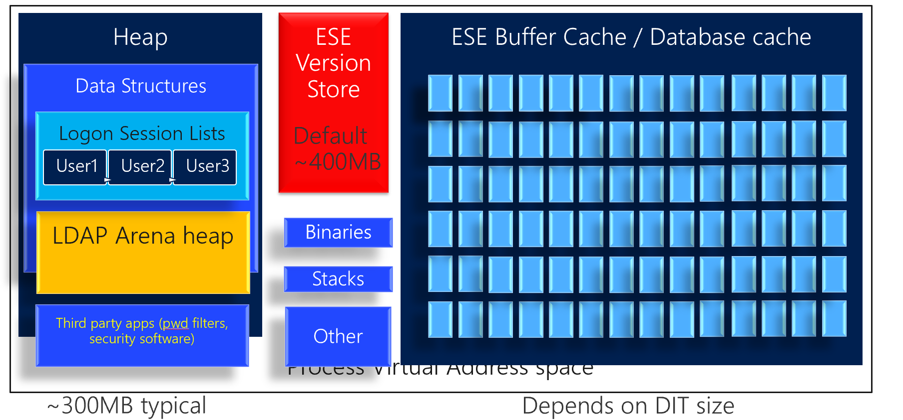

# Memory usage considerations for AD DS performance tuning

This article describes some basics of the Local Security Authority Subsystem Service (LSASS, also known as the Lsass.exe process), best practices for the configuration of LSASS, and expectations for memory usage. This article should be used as a guide in the analysis of LSASS performance and memory use on domain controllers (DCs). The information in this article may be useful if you have questions about how to tune and configure servers and DCs to optimize this engine.  

LSASS is responsible for management of local security authority (LSA) domain authentication and Active Directory management. LSASS handles authentication for both the client and the server, and it also governs the Active Directory engine. LSASS is responsible for the following components:  

- Local Security Authority
- NetLogon service
- Security Accounts Manager (SAM) service
- LSA Server service
- Secure Sockets Layer (SSL)
- Kerberos v5 authentication protocol
- NTLM authentication protocol
- Other authentication packages that load into LSA

The Active Directory database services (NTDSAI.dll) work with the Extensible Storage Engine (ESE, ESENT.dll).

Here is a visual diagram of LSASS memory usage on a DC:

  

The amount of memory that LSASS uses on a DC increases in accordance with Active Directory usage. When data is queried, it is cached in memory. As a result, it is normal to see LSASS using an amount of memory that is larger than the size of the Active Directory database file (NTDS.dit).

As illustrated in the diagram, LSASS memory usage can be divided into several parts, including the ESE database buffer cache, the ESE version store, and others. The rest of this article provides insight into each of these parts.

## ESE database buffer cache  
The largest variable memory usage within LSASS is the ESE database buffer cache. The size of the cache can range from less than 1 MB to the size of the entire database. Because a larger cache improves performance, the database engine for Active Directory (ESENT) attempts to keep the cache as large as possible. While the size of the cache varies with memory pressure in the computer, the maximum size of the ESE database buffer cache is *only* limited by physical RAM installed in the computer. As long as there is no other memory pressure, the cache can grow to the size of the Active Directory NTDS.dit database file. The more of the database that can be cached, the better the performance of the DC will be.  
  
> [!NOTE]
> Because of the way that the database caching algorithm works, on a 64-bit system on which the database size is smaller than the available RAM, the database cache can grow larger than the database size by 30 to 40 percent.

## ESE version store

There is variable memory usage by the ESE version store (the red part in the diagram above). The amount of memory used depends on whether you have Windows Server 2019 or older versions of Windows.

- In Windows Server versions predating Windows Server 2019, by default LSASS may use up to around 400MB of memory (depending on the number of CPUs) on a 64-bit machine for the ESE version store. For more information about how the version store is used see the following ASKDS blog post by Ryan Ries: [The Version Store Called and They're All Out of Buckets](https://techcommunity.microsoft.com/t5/Ask-the-Directory-Services-Team/The-Version-Store-Called-and-They-8217-re-All-Out-of-Buckets/ba-p/400415).

- In Windows Server 2019, this is simplified and when NTDS service first starts, the ESE version store size is now calculated as 10% of physical RAM, with a minimum of 400MB and a maximum of 4GB. For great details about this and version store troubleshooting, see another great blog from Ryan Ries: [Deep Dive: Active Directory ESE Version Store Changes in Server 2019](https://techcommunity.microsoft.com/t5/Ask-the-Directory-Services-Team/Deep-Dive-Active-Directory-ESE-Version-Store-Changes-in-Server/ba-p/400510).

## Other memory use

Finally, there is code, stacks, heaps, and various fixed size data structures (for example, the schema cache). The amount of memory that LSASS uses may vary, depending on the load on the computer. As the number of running threads increases, so does the number of memory stacks. On average, LSASS  uses 100 MB to 300 MB of memory for these fixed components. When a larger amount of RAM is installed, LSASS can use more RAM and less virtual memory.

**Limit or minimize the number of programs on your domain controller OR add additional RAM where appropriate**

For optimum performance, LSASS takes as much RAM as possible on a given DC. LSASS relinquishes that RAM as other processes ask for it. The idea is to optimize performance of LSASS while still accounting for other processes that might run on a computer. The list of programs to watch out for includes monitoring agents. Some customers have separate agents for various server functions which can consume considerable RAM resources. Some may issue many WMI queries, for which we have a few details below.

Because of this and to increase performance, it is a good practice to limit or minimize the number of programs on a DC. If there are no memory requests, LSASS uses this memory to cache the Active Directory database and therefore achieve optimum performance.

When you notice that a DC has performance problems, also watch for processes with significant memory utilization. These may have a problem you need to troubleshoot. They may include Microsoft components. Please make sure you keep up with recent servicing updates&mdash;Microsoft includes solutions for excessive memory utilization as part of the quality updates, which may also help your DC performance.

There are built-in OS facilities that can consume significant RAM depending on the usage profile:

- **File server**. DCs are also file servers for SYSVOL and Netlogon shares, servicing group policy and scripts for policy and startup/logon scripts.
  However, we see customers use DCs to service other file content. The SMB file server would then consume RAM to track the active clients, but foremost, the file content would make the OS file cache grow, and compete with the ESE database cache for RAM.  

- **WMI queries**. Monitoring solutions often make many WMI queries. An individual query may be cheap to execute. Often it is the volume of calls that incurs some overhead, especially as the monitoring solutions extract new events from the various event logs that Windows manages.  

  The event log that produces the most volume is typically the Security Event log. And this is also the event log that security administrators want to collect, especially from DCs.  

  The WMI service uses a dynamic memory allocation scheme that optimizes queries. Therefore, the WMI service may allocate a lot of memory, again competing with the ESE database cache.  
