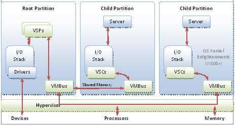

# Hyper-V architecture

Hyper-V features a Type 1 hypervisor-based architecture. The hypervisor virtualizes processors and memory. It provides mechanisms for the virtualization stack in the root partition to manage child partitions, virtual machines (VMs) and expose services such as I/O (input/output) devices to the VMs.

The root partition owns and has direct access to the physical I/O devices. The virtualization stack in the root partition provides a memory manager for VMs, management APIs, and virtualized I/O devices. It also implements emulated devices, such as the integrated device electronics (IDE) disk controller and PS/2 input device port. And it supports Hyper-V-specific synthetic devices for increased performance and reduced overhead.

The Hyper-V-specific I/O architecture consists of virtualization service providers (VSPs) in the root partition and virtualization service clients (VSCs) in the child partition. Each service is exposed as a device over VM Bus, which acts as an I/O bus and enables high-performance communication between VMs that use mechanisms such as shared memory. The guest operating system's Plug and Play manager enumerates these devices, including VM Bus, and loads the appropriate device drivers, virtual service clients. Services other than I/O are also exposed through this architecture.

## Windows Server 2008 operating system features

With Windows Server 2008, the operating system has features to optimize its behavior when it's running in VMs. The benefits include reducing the cost of memory virtualization, improving multicore scalability, and decreasing the background CPU usage of the guest operating system.

The following links suggest best practices that increase performance on servers running Hyper-V role.

## Related links

- [Hyper-V terminology](terminology.md)

- [Hyper-V server configuration](configuration.md)

- [Hyper-V processor performance](processor-performance.md)

- [Hyper-V memory performance](memory-performance.md)

- [Hyper-V storage I/O performance](storage-io-performance.md)

- [Hyper-V network I/O performance](network-io-performance.md)

- [Detecting bottlenecks in a virtualized environment](detecting-virtualized-environment-bottlenecks.md)

- [Linux VMs](linux-virtual-machine-considerations.md)
