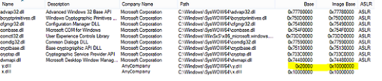

# Performance Tuning Remote Desktop Session Hosts

This topic discusses how to select Remote Desktop Session Host (RD Session Host) hardware, tune the host, and tune applications.

**In this topic:**

-   [Selecting the proper hardware for performance](#selecting-the-proper-hardware-for-performance)

-   [Tuning applications for Remote Desktop Session Host](#tuning-applications-for-remote-desktop-session-host)

-   [Remote Desktop Session Host tuning parameters](#remote-desktop-session-host-tuning-parameters)

## Selecting the proper hardware for performance

For an RD Session Host server deployment, the choice of hardware is governed by the application set and how users use them. The key factors that affect the number of users and their experience are CPU, memory, disk, and graphics. This section contains additional guidelines that are specific to RD Session Host servers and is mostly related to the multi-user environment of RD Session Host servers.

### CPU configuration

CPU configuration is conceptually determined by multiplying the required CPU to support a session by the number of sessions that the system is expected to support, while maintaining a buffer zone to handle temporary spikes. Multiple logical processors can help reduce abnormal CPU congestion situations, which are usually caused by a few overactive threads that are contained by a similar number of logical processors.

Therefore, the more logical processors on a system, the lower the cushion margin that must be built in to the CPU usage estimate, which results in a larger percentage of active load per CPU. One important factor to remember is that doubling the number of CPUs does not double CPU capacity.

### Memory configuration

Memory configuration is dependent on the applications that users employ; however, the required amount of memory can be estimated by using the following formula: TotalMem = OSMem + SessionMem \* NS

OSMem is how much memory the operating system requires to run (such as system binary images, data structures, and so on), SessionMem is how much memory processes running in one session require, and NS is the target number of active sessions. The amount of required memory for a session is mostly determined by the private memory reference set for applications and system processes that are running inside the session. Shared code or data pages have little effect because only one copy is present on the system.

One interesting observation (assuming the disk system that is backing up the page file does not change) is that the larger the number of concurrent active sessions the system plans to support, the bigger the per-session memory allocation must be. If the amount of memory that is allocated per session is not increased, the number of page faults that active sessions generate increases with the number of sessions. These faults eventually overwhelm the I/O subsystem. By increasing the amount of memory that is allocated per session, the probability of incurring page faults decreases, which helps reduce the overall rate of page faults.

### Disk configuration

Storage is one of the most overlooked aspects when you configure RD Session Host servers, and it can be the most common limitation in systems that are deployed in the field.

The disk activity that is generated on a typical RD Session Host server affects the following areas:

-   System files and application binaries

-   Page files

-   User profiles and user data

Ideally, these areas should be backed up by distinct storage devices. Using striped RAID configurations or other types of high-performance storage further improves performance. We highly recommend that you use storage adapters with battery-backed write caching. Controllers with disk write caching offer improved support for synchronous write operations. Because all users have a separate hive, synchronous write operations are significantly more common on an RD Session Host server. Registry hives are periodically saved to disk by using synchronous write operations. To enable these optimizations, from the Disk Management console, open the **Properties** dialog box for the destination disk and, on the **Policies** tab, select the **Enable write caching on the disk** and **Turn off Windows write-cache buffer flushing** on the device check boxes.

### Network configuration

Network usage for an RD Session Host server includes two main categories:

-   RD Session Host connection traffic usage is determined almost exclusively by the drawing patterns that are exhibited by the applications running inside the sessions and the redirected devices I/O traffic.

    For example, applications handling text processing and data input consume bandwidth of approximately 10 to 100 kilobits per second, whereas rich graphics and video playback cause significant increases in bandwidth usage.

-   Back-end connections such as roaming profiles, application access to file shares, database servers, e-mail servers, and HTTP servers.

    The volume and profile of network traffic is specific to each deployment.

## Tuning applications for Remote Desktop Session Host

Most of the CPU usage on an RD Session Host server is driven by apps. Desktop apps are usually optimized toward responsiveness with the goal of minimizing how long it takes an application to respond to a user request. However in a server environment, it is equally important to minimize the total amount of CPU usage that is needed to complete an action to avoid adversely affecting other sessions.

Consider the following suggestions when you configure apps that are to be used on an RD Session Host server:

-   Minimize background idle loop processing

    Typical examples are disabling background grammar and spell check, data indexing for search, and background saves.

-   Minimize how often an app performs a state check or update.

    Disabling such behaviors or increasing the interval between polling iterations and timer firing significantly benefits CPU usage because the effect of such activities is quickly amplified for many active sessions. Typical examples are connection status icons and status bar information updates.

-   Minimize resource contention between apps by reducing their synchronization frequency.

    Examples of such resources include registry keys and configuration files. Examples of application components and features are status indicator (like shell notifications), background indexing or change monitoring, and offline synchronization.

-   Disable unnecessary processes that are registered to start with user sign-in or a session startup.

    These processes can significantly contribute to the cost of CPU usage when creating a new user session, which generally is a CPU-intensive process, and it can be very expensive in morning scenarios. Use MsConfig.exe or MsInfo32.exe to obtain a list of processes that are started at user sign-in. For more detailed info, you can use [Autoruns for Windows](https://technet.microsoft.com/sysinternals/bb963902.aspx).

For memory consumption, you should consider the following:

-   Verify that DLLs loaded by an app are not relocated.

    -   Relocated DLLs can be verified by selecting Process DLL view, as shown in the following figure, by using [Process Explorer](https://technet.microsoft.com/sysinternals/bb896653.aspx).

    -   Here we can see that y.dll was relocated because x.dll already occupied its default base address and ASLR was not enabled

        

        If DLLs are relocated, it is impossible to share their code across sessions, which significantly increases the footprint of a session. This is one of the most common memory-related performance issues on an RD Session Host server.

-   For common language runtime (CLR) applications, use Native Image Generator (Ngen.exe) to increase page sharing and reduce CPU overhead.

    When possible, apply similar techniques to other similar execution engines.

## Remote Desktop Session Host tuning parameters

### Page file

Insufficient page file size can cause memory allocation failures in apps or system components. You can use the memory-to-committed bytes performance counter to monitor how much committed virtual memory is on the system.

### Antivirus

Installing antivirus software on an RD Session Host server greatly affects overall system performance, especially CPU usage. We highly recommend that you exclude from the active monitoring list all the folders that hold temporary files, especially those that services and other system components generate.

### Task Scheduler

Task Scheduler lets you examine the list of tasks that are scheduled for different events. For an RD Session Host server, it is useful to focus specifically on the tasks that are configured to run on idle, at user sign-in, or on session connect and disconnect. Because of the specifics of the deployment, many of these tasks might be unnecessary.

### Desktop notification icons

Notification icons on the desktop can have fairly expensive refreshing mechanisms. You should disable any notifications by removing the component that registers them from the startup list or by changing the configuration on apps and system components to disable them. You can use **Customize Notifications Icons** to examine the list of notifications that are available on the server.

### Remote Desktop Protocol data compression

Remote Desktop Protocol compression can be configured by using Group Policy under **Computer Configuration** &gt; **Administrative Templates** &gt; **Windows Components** &gt; **Remote Desktop Services** &gt; **Remote Desktop Session Host** &gt; **Remote Session Environment** &gt; **Configure compression for RemoteFX data**. Three values are possible:

-   **Optimized to use less memory** Consumes the least amount of memory per session but has the lowest compression ratio and therefore the highest bandwidth consumption.

-   **Balances memory and network bandwidth** Reduced bandwidth consumption while marginally increasing memory consumption (approximately 200 KB per session).

-   **Optimized to use less network bandwidth** Further reduces network bandwidth usage at a cost of approximately 2 MB per session. If you want to use this setting, you should assess the maximum number of sessions and test to that level with this setting before you place the server in production.

You can also choose to not use a Remote Desktop Protocol compression algorithm, so we only recommend using it with a hardware device designed to optimize network traffic. Even if you choose not to use a compression algorithm, some graphics data will be compressed.

### Device redirection

Device redirection can be configured by using Group Policy under **Computer Configuration** &gt; **Administrative Templates** &gt; **Windows Components** &gt; **Remote Desktop Services** &gt; **Remote Desktop Session Host** &gt; **Device and Resource Redirection** or by using the **Session Collection** properties box in Server Manager.

Generally, device redirection increases how much network bandwidth RD Session Host server connections use because data is exchanged between devices on the client computers and processes that are running in the server session. The extent of the increase is a function of the frequency of operations that are performed by the applications that are running on the server against the redirected devices.

Printer redirection and Plug and Play device redirection also increases CPU usage at sign-in. You can redirect printers in two ways:

-   Matching printer driver-based redirection when a driver for the printer must be installed on the server. Earlier releases of Windows Server used this method.

-   Introduced in Windows Server 2008, Easy Print printer driver redirection uses a common printer driver for all printers.

We recommend the Easy Print method because it causes less CPU usage for printer installation at connection time. The matching driver method causes increased CPU usage because it requires the spooler service to load different drivers. For bandwidth usage, Easy Print causes slightly increased network bandwidth usage, but not significant enough to offset the other performance, manageability, and reliability benefits.

Audio redirection causes a steady stream of network traffic. Audio redirection also enables users to run multimedia apps that typically have high CPU consumption.

### Client experience settings

By default, Remote Desktop Connection (RDC) automatically chooses the right experience setting based on the suitability of the network connection between the server and client computers. We recommend that the RDC configuration remain at **Detect connection quality automatically**.

For advanced users, RDC provides control over a range of settings that influence network bandwidth performance for the Remote Desktop Services connection. You can access the following settings by using the **Experience** tab in Remote Desktop Connection or as settings in the RDP file.

The following settings apply when connecting to any computer:

-   **Disable wallpaper** (Disable wallpaper:i:0) Does not show desktop wallpaper on redirected connections. This setting can significantly reduce bandwidth usage if desktop wallpaper consists of an image or other content with significant costs for drawing.

-   **Bitmap cache** (Bitmapcachepersistenable:i:1) When this setting is enabled, it creates a client-side cache of bitmaps that are rendered in the session. It provides a significant improvement on bandwidth usage, and it should always be enabled (unless there are other security considerations).

-   **Show contents of windows while dragging** (Disable full window drag:i:1) When this setting is disabled, it reduces bandwidth by displaying only the window frame instead of all the content when the window is dragged.

-   **Menu and window animation** (Disable menu anims:i:1 and Disable cursor setting:i:1): When these settings are disabled, it reduces bandwidth by disabling animation on menus (such as fading) and cursors.

-   **Font smoothing** (Allow font smoothing:i:0) Controls ClearType font-rendering support. When connecting to computers running Windows 8 or Windows Server 2012 and above, enabling or disabling this setting does not have a significant impact on bandwidth usage. However, for computers running versions earlier than Windows 7 and Windows 2008 R2, enabling this setting affects network bandwidth consumption significantly.

The following settings only apply when connecting to computers running Windows 7 and earlier operating system versions:

-   **Desktop composition** This setting is supported only for a remote session to a computer running Windows 7 or Windows Server 2008 R2.

-   **Visual styles** (disable themes:i:1) When this setting is disabled, it reduces bandwidth by simplifying theme drawings that use the Classic theme.

By using the **Experience** tab within Remote Desktop Connection, you can choose your connection speed to influence network bandwidth performance. The following lists the options that are available to configure your connection speed:

-   **Detect connection quality automatically** (Connection type:i:7) When this setting is enabled, Remote Desktop Connection automatically chooses settings that will result in optimal user experience based on connection quality. (This configuration is recommended when connecting to computers running Windows 8 or Windows Server 2012 and above).

-   **Modem (56 Kbps)** (Connection type:i:1) This setting enables persistent bitmap caching.

-   **Low Speed Broadband (256 Kbps - 2 Mbps)** (Connection type:i:2) This setting enables persistent bitmap caching and visual styles.

-   **Cellular/Satellite (2Mbps - 16 Mbps with high latency)** (Connection type:i:3) This setting enables desktop composition, persistent bitmap caching, visual styles, and desktop background.

-   **High-speed broadband (2 Mbps – 10 Mbps )** (Connection type:i:4) This setting enables desktop composition, show contents of windows while dragging, menu and window animation, persistent bitmap caching, visual styles, and desktop background.

-   **WAN (10 Mbps or higher with high latency)** (Connection type:i:5) This setting enables desktop composition, show contents of windows while dragging, menu and window animation, persistent bitmap caching, visual styles, and desktop background.

-   **LAN (10 Mbps or higher)** (Connection type:i:6) This setting enables desktop composition, show contents of windows while dragging, menu and window animation, persistent bitmap caching, themes, and desktop background.

### Desktop Size

Desktop size for remote sessions can be controlled by using the Display tab in Remote Desktop Connection or by using the RDP configuration file (desktopwidth:i:1152 and desktopheight:i:864). The larger the desktop size, the greater the memory and bandwidth consumption that is associated with that session. The current maximum desktop size is 4096 x 2048.
