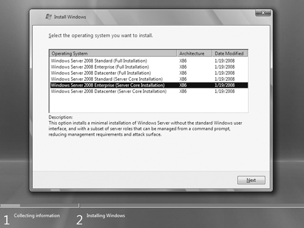
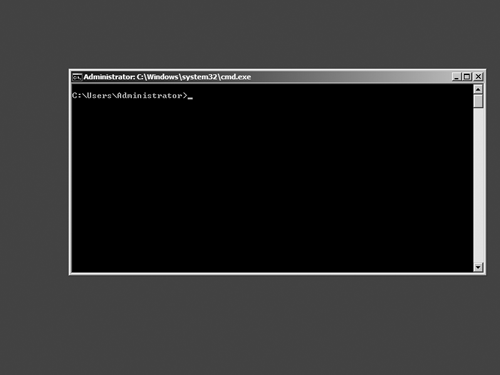

# What is Server Core 2008?
>Applies To: Windows Server 2008

>[!NOTE]
>This information applies to Windows Server 2008. For information about Server Core in Windows Server, see [What is the Server Core Installation in Windows Server](https://docs.microsoft.com/windows-server/administration/server-core/what-is-server-core). 

The Server Core option is a new minimal installation option that is available when you are deploying the Standard, Enterprise, or Datacenter edition of Windows Server 2008. Server Core provides you with a minimal installation of Windows Server 2008 that supports installing only certain server roles, as described later in this chapter. Contrast this with the Full installation option for Windows Server 2008, which supports installing all available server roles and also other Microsoft or third-party server applications, such as Microsoft Exchange Server or SAP. 

Before we go any further, the phrase "installation option" needs to be explained. Normally, when you purchase a copy of Windows Server 2008, you purchase a license to use certain editions or stock-keeping units (SKUs). Table 1-1 lists the various editions of Windows Server 2008 that are available. The table also indicates which installation options (Full, Server Core, or both) are available for each edition.

**Table 1-1** Windows Server 2008 editions and their support for installation options

| Edition       | Full          | Server Core  |
| ------------- | :-------------: | :------------: |
| Windows Server 2008 Standard (x86 and x64)       | X | X        |
| Windows Server 2008 Enterprise (x86 and x64)       | X | X        |
| Windows Server 2008 Datacenter (x86 and x64)        | X | X       |
| Windows Web Server 2008 (x86 and x64)       | X | X  |
| Windows Server 2008 For Itanium-based systems       | X |     |
| Windows HPC Server 2008 (x64 only)       | X |   |
| Windows Server 2008 Standard without Hyper-V (x86 and x64) | X | X |
| Windows Server 2008 Enterprise without Hyper-V (x86 and x64)  | X | X |
| Windows Server 2008 Standard without Hyper-V (x86 and x64) | X | X |

To understand what an "installation option" is, let's say you've purchased a volume license that lets you install a copy of Windows Server 2008 Enterprise Edition. When you insert your volume-licensed media into a system and begin the installation process, one of the screens you'll see, as shown in Figure 1-1, presents you with a choice of editions and installation options.

**Figure 1-1** Selecting a Server Core installation option to install

In Figure 1-1, your volume license (or product key, for retail media) gives you two installation options you can choose between: the second option (a Full Installation of Windows Server 2008 Enterprise) and the fifth option (a Server Core Installation of Windows Server 2008 Enterprise), with the latter selected in this example. 

## Full vs. Server Core 
Since the early days of the Microsoft Windows platform, Windows servers were essentially "everything" servers that included all kinds of features, some of which you might never actually use in your networking environment. For instance, when you installed Windows Server 2003 on a system, the binaries for Routing and Remote Access Service (RRAS) were installed on your server even if you had no need for this service (although you still had to configure and enable RRAS before it would work). Windows Server 2008 improves earlier versions by installing the binaries needed by a server role only if you choose to install that particular role on your server. However, the Full installation option of Windows Server 2008 still installs many services and other components that are often not needed for a particular usage scenario. 

That's the reason Microsoft created a second installation option—Server Core—for Windows Server 2008: to eliminate any services and other features that are not essential for the support of certain commonly used server roles. For example, a Domain Name System (DNS) server really doesn't need Windows Internet Explorer installed on it because you wouldn't want to browse the Web from a DNS server for security reasons. And a DNS server doesn't even need a graphical user interface (GUI), because you can manage virtually all aspects of DNS either from the command line using the powerful Dnscmd.exe command, or remotely using the DNS Microsoft Management Console (MMC) snap-in.

To avoid this, Microsoft decided to strip everything from Windows Server 2008 that was not absolutely essential for running core network services like Active Directory Domain Services (AD DS), DNS, Dynamic Host Configuration Protocol (DHCP), File and Print, and a few other server roles. The result is the new Server Core installation option, which can be used to create a server that supports only a limited number of roles and features. 

## The Server Core GUI
When you finish installing Server Core on a system and log on for the first time, you're in for a bit of a surprise. Figure 1-2 shows the Server Core user interface after first logon.

**Figure 1-2** Server Core user interface

There's no desktop! That is, there is no Windows Explorer shell, with its Start menu, Taskbar, and the other features you may be used to seeing. All you have is a command prompt, which means that you have to do most of the work of configuring a Server Core installation either by typing commands one at a time, which is slow, or by using scripts and batch files, which can help you speed up and simplify your configuration tasks by automating them. You can also perform some initial configuration tasks using answer files when you perform an unattended installation of Server Core. 

For administrators who are experts in using command-line tools like Netsh.exe, Dfscmd.exe, and Dnscmd.exe, configuring and managing a Server Core installation can be easy, even fun. For those who are not experts, however, all is not lost. You can still use the standard Windows Server 2008 MMC tools for managing a Server Core installation. You just need to use them on a different system running either a full installation of Windows Server 2008 or Windows Vista with Service Pack 1. 

You'll learn more about configuring and managing a Server Core installation in Chapters 3 to 6 of this book, while later chapters deal with how to manage specific server roles and other components. To learn more about the various Windows command-line tools and how to use them, there are two good resources to consult:
* The Command Reference section of the Windows Server 2008 Technical Library () 
* *The Windows Command-Line Administrator's Pocket Consultant* by William R. Stanek (Microsoft Press, 2008) 

Table 1-2 lists the main GUI applications, together with their executables, that are available in a Server Core installation.

**Table 1-2** GUI applications available in a Server Core installation

| GUI application | Executable with path |
| -------------   | -------------       | 
| Command prompt | %WINDIR%\System32\Cmd.exe |
| Microsoft Support Diagnostic Tool | %WINDIR%\System32\MSdt.exe |
| Notepad | %WINDIR%\System32\Notepad.exe |
| Registry editor | %WINDIR%\System32\Regedt32.exe |
| System information | %WINDIR%\System32\MSinfo32.exe |
| Task manager | %WINDIR%\System32\Taskmgr.exe |
| Windows Installer | %WINDIR%\System32\MSiexec.exe |

That's a pretty short list! Now here's a list of user interface elements that are not included in Server Core:
* The Windows Explorer desktop shell (Explorer.exe) and any supporting features such as Themes 
* All MMC consoles 
* All Control Panel utilities, with the exception of Regional And Language Options (Intl.cpl) and Date And Time (Timedate.cpl) 
* All Hypertext Markup Language (HTML) rendering engines, including Internet Explorer and HTML Help 
* Windows Mail 
* Windows Media Player 
* Most accessories such as Paint, Calculator, and Wordpad

The .NET Framework is also not present in Server Core, which means there's no support for running managed code on a Server Core installation. Only native code—code written using Windows application programming interfaces (APIs)—can run on Server Core. In summary, any GUI applications that depend on either the .NET Framework or on the Explorer.exe shell won't run on Server Core. 

>[!NOTE]
>Because Windows PowerShell requires the .NET Framework, you cannot install Windows PowerShell onto Server Core. You can, however, manage a Server Core installation remotely using Windows PowerShell so long as you use only PowerShell WMI commands.

## Supported server roles 
A Server Core installation includes only a limited number of server roles compared with a Full installation of Windows Server 2008. Table 1-3 compares the roles available for both Full and Server Core installations of Windows Server 2008 Enterprise Edition. 

**Table 1-3** Comparison of server roles for Full and Server Core installations of Windows Server 2008 Enterprise Edition

| Server role  | Available in Full installation  | Available in Server Core  |
| ------------- | :-------------: | :------------: |
| Active Directory Certificate Services (AD CS)  | X |  |
| Active Directory Domain Services (AD DS)  | X  | X |
| Active Directory Federation Services (AD FS)  | X  |  |
| Active Directory Lightweight Directory Services (AD LDS)  | X  | X |
| Active Directory Rights Management Services (AD RMS)  | X  |  |
| Application Server  | X  |  |
| DHCP Server  | X  | X |
| DNS Server  | X  | X |
| Fax Server  | X  |  |
| File Services  | X  | X |
| Hyper-V  | X | X |
| Network Policy and Access Services  | X  |  |
| Print Services  | X  | X |
| Streaming Media Services  | X  | X |
| Terminal Services  | X  |  |
| UDDI Services  | X  |  |
| Web Server (IIS) | X | X |
| Windows Deployment Services  | X |  |

While the roles available for Server Core are generally the same regardless of architecture (x86 or x64) and product edition, there are a few exceptions:
* The Hyper-V (virtualization) role is available only if you purchased Windows Server 2008 with Hyper-V product media (Hyper-V is available only for x64 versions). If you do not need this role, you can purchase Windows Server 2008 without Hyper-V product media instead. 
* The File Services role on Standard Edition is limited to one standalone Distributed File System (DFS) root and does not support Cross-File Replication (DFS-R). 
* Before you can install the Streaming Media Services role on Server Core, you need to download and install the appropriate Microsoft Update Standalone Package (.msu file) for your server's architecture (x86 or x64) from the Microsoft Download Center.
* The Web Server (IIS) role does not support ASP.NET. This is because the .NET Framework is not supported on Server Core, which limits what you can do with a Server Core Web server. 

## Supported optional features
A Server Core installation also supports only a limited subset of the features available on a Full installation of Windows Server 2008. Table 1-4 compares the features available for both Full and Server Core installations of Windows Server 2008 Enterprise Edition.

**Table 1-4** Comparison of features for Full and Server Core installations of Windows Server 2008 Enterprise Edition

| Feature  | Available in Full installation  | Available in Server Core  |
| ------------- | :-------------: | :------------: |
| .NET Framework 3.0 Features  | X  |  |
| BitLocker Drive Encryption  | X  | X |
| BITS Server Extensions  | X  |  |
| Connection Manager Administration Kit  | X |  |
| Desktop Experience  | X |  |
| Failover Clustering  | X  | X |
| Group Policy Management  | X  |  |
| Internet Printing Client  | X  |  |
| Internet Storage Name Server  | X  |  |
| LPR Port Monitor  | X  |  |
| Message Queuing  | X  |  |
| Multipath IO  | X  | X |
| Network Load Balancing  | X  | X |
| Peer Name Resolution Protocol  | X  |  |
| Quality Windows Audio Video Experience  | X |  |
| Remote Assistance  | X  |  |
| Remote Differential Compression | X  |  |
| Remote Server Administration Tools  | X  |  |
| Removable Storage Manager | X  | X |
| RPC Over HTTP Proxy | X  |  |
| Simple TCP/IP Services  | X  |  |
| SMTP Server  | X  |  |
| SMNP Services  | X  | X  |
| Storage Manager for SANs  | X  |  |
| Subsystem for UNIX-based Applications | X | X  |
| Telnet Client  | X | X  |
| Telnet Server  | X   |  |
| TFTP Client  | X   |  |
| Windows Internal Database  | X  |  |
| Windows PowerShell  | X  |  |
| Windows Product Activation Service  | X   |  |
| Windows Server Backup Features  | X  | X  |
| Windows System Resource Manager  | X  |  |
| WINS Server  | X | X |
| Wireless LAN Service | X  |  |

Again, there are some points you need to know about concerning the features available on Server Core:
* Some features may require special hardware to function properly (or at all) on Server Core. These features include BitLocker Drive Encryption, Failover Clustering, Multipath IO, Network Load Balancing, and Removable Storage. 
* Failover Clustering is not available on Standard Edition.

## Server Core architecture
Digging deeper into Server Core, let's briefly look at the architecture of a Server Core installation of Windows Server 2008 by comparing it with that of a Full installation. First, remember that Server Core is not a different version of Windows Server 2008 but simply an installation option that you can select when installing Windows Server 2008 onto a system. This implies the following:
* The kernel on a Server Core installation is the same one found on a Full installation of the same hardware architecture (x86 or x64) and edition. 
* If a binary is present on a Server Core installation, a Full installation of the same hardware architecture (x86 or x64) and edition has the same version of that particular binary (with two exceptions discussed later). 
* If a particular setting (for example, a specific firewall exception or the startup type of a particular service) has a certain default configuration on a Server Core installation, that setting is configured exactly the same way on a Full installation of the same hardware architecture (x86 or x64) and edition.

Figure 1-3 shows a simplified view of the architecture of both a Full installation and a Server Core installation of Windows Server 2008. The dotted line indicates the architecture of Server Core, while the entire diagram represents the architecture of a Full installation. 

The diagram illustrates the modular architecture of Windows Server 2008, with Server Core being constructed upon a subset of the core operating system features. For the same hardware architecture and edition, every file present on a clean install of Server Core is also present on a Full installation, with the exception of two special files (Scregedit.wsf and Oclist.exe), which are present only on Server Core. These special files were included on Server Core to simplify the initial configuration of a Server Core installation and the addition or removal of roles and optional components. 

**Figure 1-3** The architectures of Server Core and Full installations

## Driver support
The architectural diagram of Server Core shown in Figure 1-3 is obviously simplified; one thing it doesn't show is the difference in device driver support between Server Core and Full installations. A Full installation of Windows Server 2008 contains thousands of in-box drivers for different types of devices, which enable you to install products on a wide variety of different hardware configurations. (Client operating systems like Windows Vista include even more drivers to support devices such as digital cameras and scanners that are normally not used with servers.) 

If a new device is connected to (or installed in) a Full installation of Windows Server 2008, the Plug and Play (PnP) subsystem first checks whether an in-box driver for the device is present. If a compatible in-box driver is found, the PnP subsystem automatically installs the driver and the device then operates. On a Full installation of Windows Server 2008, a balloon popup notification may be displayed, indicating that the driver has been installed and the device is ready for use. 

On a Server Core installation, the driver installation process is the same (the PnP subsystem is present on Server Core) with two qualifications. First, Server Core includes only a minimal number of in-box drivers, and only for the following types of devices:
* A standard Video Graphics Array (VGA) video driver 
* Drivers for storage devices 
* Drivers for network adapters

Note that for each of the three device categories shown here, Server Core includes the same in-box drivers that are found on a corresponding Full installation (for the same hardware architecture). 

Also, when the PnP subsystem automatically installs a driver for a new device, it does so silently—no balloon popup notification is displayed. Why not? Because there is no GUI on Server Core there's no taskbar, so there's no notification area on the taskbar! 

So what do you do when you add the Print Services role to a Server Core installation and you want to install a printer? You add the printer driver manually to the server—Server Core has no in-box print drivers.

## Service footprint
Because Server Core is a minimal installation, it has a smaller system service footprint than a corresponding Full installation of the same hardware architecture and edition. For example, about 75 system services are installed by default on a Full installation of Windows Server 2008, of which approximately 50 are configured for automatic startup. By contrast, Server Core has only about 70 services installed by default, and fewer than 40 of these start automatically. 

Table 1-5 lists the services that are installed by default on a Server Core installation, with the startup mode for and account used by each service.

**Table 1-5** System services installed by default on Server Core

| Service name  | Display name  | Startup mode  | Account  |
| ------------- | ------------- | ------------ | ------------ |
| AeLookupSvc  | Application Experience  | Auto | LocalSystem |
| AppMgmt  | Application Management  | Manual | LocalSystem |
| BFE | Base Filtering Engine  | Auto | LocalService |
| BITS | Background Intelligent Transfer Service  | Auto | LocalSystem |
| Browser | Computer Browser  | Manual | LocalSystem |
| CertPropSvc | Certificate Propagation  | Manual | LocalSystem |
| COMSysApp  | COM+ System Application  | Manual | LocalSystem |
| CryptSvc  | Cryptographic Services  | Auto | Network-Service |
| DcomLaunch  | DCOM Server Process Launcher  | Auto | LocalSystem |
| Dhcp  | DHCP Client  | Auto | LocalService |
| Dnscache | DNS Client  | Auto | Network-Service |
| DPS  | Diagnostic Policy Service  | Auto | LocalService |
| Eventlog | Windows Event Log  | Auto | LocalService |
| EventSystem  | COM+ Event System  | Auto | LocalService |
| FCRegSvc  | Microsoft Fibre Channel Platform Registration Service  | Manual | LocalService |
| gpsvc  | Group Policy Client  | Auto | LocalSystem |
| hidserv | Human Interface Device Access  | Manual | LocalSystem |
| hkmsvc  | Health Key and Certificate Management  | Manual | LocalSystem |
| IKEEXT  | IKE and AuthIP IPsec Keying Modules  | Auto | LocalSystem |
| iphlpsvc  | IP Helper  | Auto | LocalSystem |
| KeyIso | CNG Key Isolation  | Manual | LocalSystem |
| KtmRm  | KtmRm for Distributed Transaction Coordinator  | Auto | Network-Service |
| LanmanServer  | Server  | Auto | LocalSystem |
| LanmanWorkstation  | Workstatione  | Auto | LocalService |
| lltdsvc  | Link-Layer Topology Discovery Mapper  | Manual | LocalService |
| lmhosts  | TCP/IP NetBIOS Helper  | Auto | LocalService |
| MpsSvc  | Windows Firewall  | Auto | LocalService |
| MSDTC  | Distributed Transaction Coordinator  | Auto | Network-Service |
| MSiSCSI  | Microsoft iSCSI Initiator Service  | Manual | LocalSystem |
| msiserver  | Windows Installer  | Manual | LocalSystem |
| napagent  | Network Access Protection Agent  | Manual | Network-Service |
| Netlogon  | Netlogon  | Manual | LocalSystem |
| netprofm  | Network List Service  | Auto | LocalService |
| NlaSvc  | Network Location Awareness  | Auto | Network-Service |
| nsi  | Network Store Interface Service  | Auto | LocalService |
| pla  | Performance Logs & Alerts  | Manual | LocalService |
| PlugPlay  | Plug and Play  | Auto | LocalSystem |
| PolicyAgent  | IPsec Policy Agent  | Auto | Network-Service |
| ProfSvc  | User Profile Service  | Auto | LocalSystem |
| ProtectedStorage  | Protected Storage  | Manual | LocalSystem |
| RemoteRegistry  | Remote Registry  | Auto | LocalService |
| RpcSs  | Remote Procedure Call (RPC)  | Auto | Network-Service |
| RSoPProv | Resultant Set of Policy Provider  | Manual | LocalSystem |
| sacsvr  | Special Administration Console Helper  | Manual | LocalSystem |
| SamSs  | Security Accounts Manager  | Auto | LocalSystem |
| SCardSvr | Smart Card  | Manual | LocalService |
| Schedule | Task Scheduler  | Auto | LocalSystem |
| SCPolicySvc | Smart Card Removal Policy  | Manual | LocalSystem |
| seclogon | Secondary Logon  | Auto | LocalSystem |
| SENS | System Event Notification Service  | Auto | LocalSystem |
| SessionEnv | Terminal Services Configuration  | Manual | LocalSystem |
| slsvc  | Software Licensing | Auto | Network-Service |
| SNMPTRAP  | SNMP Trap  | Manual | LocalService |
| swprv  | Microsoft Software Shadow Copy Provider | Manual | LocalSystem |
| TBS | TPM Base Services  | Manual | LocalService |
| TermService  | Terminal Services | Auto | Network-Service |
| TrustedInstaller | Windows Modules Installer  | Auto | LocalSystem |
| UmRdpService | Terminal Services UserMode Port Redirector  | Manual | LocalSystem |
| vds | Virtual Disk  | Manual | LocalSystem |
| VSS | Volume Shadow Copy  | Manual | LocalSystem |
| W32Time | Windows Time  | Auto | LocalService |
| WcsPlugInService  | Windows Color System  | Manual | LocalService |
| WdiServiceHost  | Diagnostic Service Host  | Manual | LocalService |
| WdiSystemHost  | Diagnostic System Host  | Manual | LocalSystem |
| Wecsvc | Windows Event Collector  | Manual | Network-Service |
| WinHttpAuto-ProxySvc  | WinHTTP Web Proxy Auto-Discovery Service  | Auto | LocalService |
| Winmgmt | Windows Management Instrumentation | Auto | LocalSystem |
| WinRM  | Windows Remote Management (WS-Management) | Auto | Network-Service |
| wmiApSrv  | WMI Performance Adapter  | Manual | LocalSystem |
| wuauserv | Windows Update | Auto | LocalSystem |