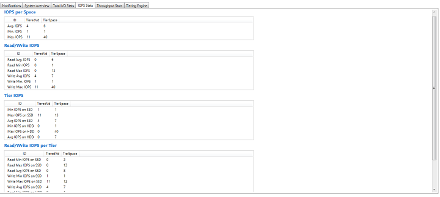
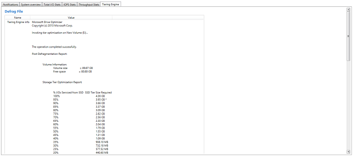
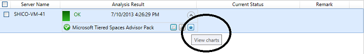
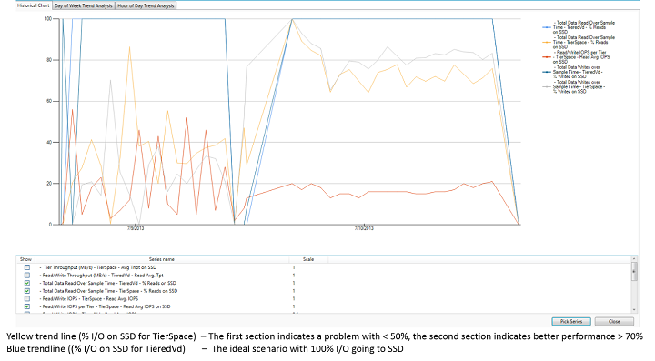
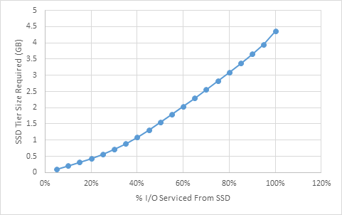

# Server Performance Advisor Pack for Tiered Storage Spaces

>Applies To: Windows Server (Semi-Annual Channel), Windows Server 2016, Windows Server 2012 R2, Windows Server 2012

Tiered Storage Spaces, introduced in Windows Server 2012 R2, dynamically move chunks of stored data between different classes of storage, such as fast SSDs and slower hard drives to optimize data placement with respect to common access patterns. Provisioning decisions such as the size of the SSD tier and the ratio of SSD to HDD heavily affect the performance of the system in response to the system s workloads. The Server Performance Advisor (SPA) Pack for Tiered Storage Spaces collects and exposes performance data for tiered storage spaces deployed on a system and provides you with useful statistics and recommendations for configuring the system to maximize performance.

## Goals


The SPA Pack for Tiered Storage Spaces aims to expose relevant information about the performance of the system for a given tiered storage space. Using this SPA Advisor Pack, you can get insight into the performance (throughput, IOPS, total data read/written) of your tiered storage system. This data further allows you to understand how the tiered storage configuration is responding to the workload on the deployed system, and identify configuration changes that would improve storage performance. The SPA Pack for Tiered Storage Spaces also exposes historical (weekly) statistics from the Storage Optimizer which provides insight into the expected performance gains with increasing the size of the SSD tier.

## Setup


You can download the SPA Pack for Tiered Storage Spaces [here](https://go.microsoft.com/fwlink/p/?linkid=327754). Once the folder is downloaded, place it into *&lt;SPA INSTALL dir&gt;*/APs folder and it will automatically appear when SPA is restarted.

**Note**
The computer running SPA should have administrative rights to the system under test.

 

Once you have the SPA Advisor Pack for Tiered Storage Spaces Pack installed, you need to run the following from an elevated command prompt. This command modifies the routine storage tier optimization pack to pipe out to a file that can be read by using SPA:

``` syntax
schtasks /change /TN  \Microsoft\Windows\Storage Tiers Management\Storage Tiers Optimization  /TR  cmd /C %windir%\System32\defrag.exe /c /h /g -# > %windir%\tieringOut.txt 
```

The SPA Advisor Pack for Tiered Storage Spaces expects to find the results of the optimizer in the Windows folder. The report will not collect this file if it is moved to another location.

The Storage Tier Optimization task is configured to run daily on all tiered volumes by default. The Windows PowerShell command above only modifies this scheduled task to save the output. There is no artificial constraint introduced on the system, only the latest version of the output is stored and uses a constant amount of memory.

The recommended setup for using the SPA Pack for Tiered Storage Spaces is running the analysis for 10-20 minute durations every hour or two hours when testing the system response with a tiered storage space. This will minimize network traffic and give a time series view of the system state over the day or week. This allows you to get a picture of the workload running on the system and how the tiering setup performed at different points in the workload.

**Caution**
The SPA Advisor Pack for Tiered Storage Spaces collects data about tiered spaces by reading ETW traces. Due to the detailed nature of ETW traces, the trace file generated can grow large relatively quickly (~5GB in 30 minutes on a heavy workload). This might lead to network traffic and very minimal loss in performance.

 

## Using the SPA Advisor Pack for Tiered Storage Spaces


Each time the SPA Advisor Pack for Tiered Storage Space runs on a server, a report is generated which can be viewed by using SPA. This report provides analysis for all tiered volumes on the system. All the information is presented on a per space basis, with the space being identified by their friendly names. The report is divided into 5 sections.

1.  **System overview**

    This pane shows basic configuration information about all of the Storage Spaces installed on the server. This includes the total size and the ratio of SSD to HDD. The total sample time for the run can be seen below the title of the report.

    

2.  **Total I/O Stats**

    This pane shows the total data read/written to each space over the total time the server was sampled. The data that is read and written is split by tiers, which give us an indication of where most of our reads and writes are happening and if it matches our expectations.

    

3.  **IOPS Stats**

    This pane displays the IOPS statistics for all the spaces. The first section displays the minimum, maximum, and average IOPS over each space. The information is then split by read and write types of I/O per space, and by I/O going to each tier on each space. The last section gives finer information about separate Read/Write IOPS for each tier of each space.

    

4.  **Throughput Stats**

    This pane displays throughput data (MB/s) and is organized in the same layout as the **IOPS Stats** pane. Throughput per space, split by Read/Write, split by Tier, and the finer information about read/write throughput going to each tier for each space.

    

5.  **Tiering Engine**

    This pane shows collected statistics from the Storage Optimizer, which can be printed to the console during regularly scheduled runs of the Storage Optimizer. If the previous configuration steps were performed correctly, and the regularly scheduled storage optimizer has run since the last analysis, you should see a file with a format similar to that shown below. If you see a **&lt;null&gt;** instead, make sure that you ran the setup commands described earlier on the server being analyzed, and that the new scheduled task has run at least once.

    

### Interpreting the data

Use the following sections to interpret the data from the SPA Advisor Pack for Tiered Storage Spaces.

### Performance data using historical charts

The SPA console has a historical chart viewer which can be accessed by clicking the **View charts** button next to the SPA Advisor Pack for Tiered Storage Spaces.



The chart is shown in the following figure:



A good indicator of the basic performance of the Tiered Storage Space is the % read/writes on SSD, which can be viewed on a per-space basis.

-   if the working set size for the workload is comparable to the size of the installed SSD tier, you should expect the % of read/writes on SSD to be high (&gt; 70 %).

-   if the read/writes on SSD are &lt; 50 %, it could mean the following:

    -   The Storage Optimizer hasn t run and optimized the tiers on the volume yet. To fix this, repeat the readings after the Storage Optimizer has run. You can also run the Storage Optimizer task manually by using Task Scheduler.

    -   The Storage Optimizer does not have enough heat information yet about the workload or the workload is perfectly random. Fix: Let the Storage Optimizer run for a few days. If the workload is not mostly random, there should be improvements in the SSD read/write %.

    -   The working set size is too large compared to the size of the SSD tier provisioned. To fix this, increase the size of the SSD tier in accordance with the Storage Optimizer Report described in the next section. The amount to increase and the expected gains are also described in the Storage Optimizer report.

Once the Tiered Storage Space is working as expected, the SPA Advisor Pack for Tiered Storage Spaces can be used to analyze the performance of the system. The IOPS and throughput data is reported on a per-tier basis. The reported performance of the tiers should be similar to that expected from the underlying hardware installed.

The threshold for detecting warnings for % of I/O going to the SSD tier can be adjusted to suit the workload. On a perfectly uniform workload, we would expect the % of I/O going to the SSD tier to be at least the % of the SSD installed. This is a baseline for performance, and most systems should perform significantly better.

### Storage Optimizer tier analysis report

The Storage Optimizer contains useful information about the expected performance gains with differed SSD tier provisioning options. The report has the following format for each tiered storage space on the server.


The report from the storage optimizer is based on data from the previous week of heat information and data movements made by the storage optimizer.

The last section of the report refers to the size of all files manually pinned to a storage tier. These files do not get moved from the assigned tier.


The main section of the report is the table of percentage I/Os serviced from SSD vs. the SSD tier size required. The 100% I/O s SSD size is a good indication of the working set size for the workload on the system. If the SSD tier was this size (4.36 GB in the example) then given the past week s pattern of I/O s seen, you would get close to all of the I/O s going to the SSD tier.

The distribution of this data is non-linear and the exact distribution depends on the characteristics of the workload. The sample data was imported into Microsoft Excel, and, after normalizing to gigabytes, the data gave the following distribution:



Looking at the distribution, you can make an informed decision about how much SSD storage to add to the Tiered Storage Space, and what are the expected gains from the change in configuration, given that the workload remains similar.
