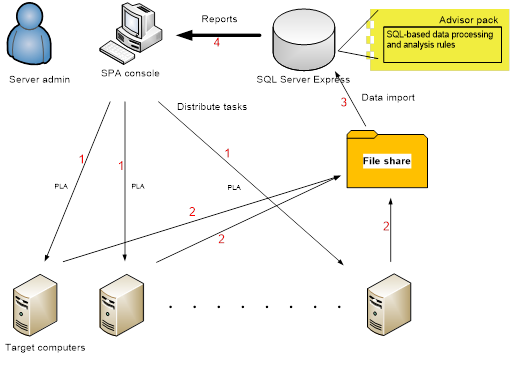
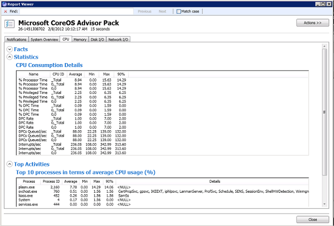

# Server Performance Advisor User's Guide

>Applies To: Windows Server (Semi-Annual Channel), Windows Server 2016, Windows Server 2012 R2, Windows Server 2012, Windows 10, Windows 8

This user guide for Microsoft Server Performance Advisor (SPA) provides guidelines about how to use SPA to identify performance bottlenecks in systems deployed in various server roles.

SPA can help you with the following things:

* Manage your server performance and troubleshoot server performance issues.

* Provide data reports and recommendations about common configuration and performance issues.

* Provide best pratice recommendations based on the data collected.

> [!NOTE]
> The SPA Console does not make any changes to the servers.

For more info about developing SPA Advisor Packs, see [Server Performance Advisor Pack Development Guide](server-performance-advisor-pack-development-guide.md).

## Server Performance Advisor overview


This section explains the history of SPA, describes its target audience and scenarios, and presents an architectural overview of the tool.

### History of SPA

The original version of Microsoft Server Performance Advisor (SPA) was released in 2005-2006. It primarily targeted Windows Server 2003, including the core operating system and server roles such as Internet Information Services (IIS) and active directory. The goal of the tool is to help you assess your server performance and troubleshoot server performance issues.

SPA provides data reports and recommendations to system administrators about common configuration and performance issues. SPA gathers performance-related data from various sources on servers, for example, performance counters, registry keys, WMI queries, configuration files, and Event Tracing for Windows (ETW). Based on the server performance data that it collects, SPA can provide an in-depth look at the current server performance situation and issue recommendations about what can be improved.

There have been more than one million downloads of the original SPA tool, and it helped many system administrators manage the performance of their servers. It has been a very successful performance troubleshooting tool.

Since the release of the original SPA, there are several major changes in the server performance world. Most notably, the release of Windows Server 2012 R2, Windows Server 2012, Windows Server 2008 R2, and Windows Server 2008, with new versions of corresponding server roles such as Internet Information Services (IIS) 8.5. Newer versions of Server Performance Advisor extend the capability of the original SPA to the recent server operating systems and server roles.

Although SPA 3.1 shares the same design goals and performance analysis paradigm as the original tool, it has been rewritten with the latest technology. It also has the following key improvements:

* Can perform analysis against servers running Windows Server 2012 R2, Windows Server 2012, Windows Server 2008 R2, and Windows Server 2008.

* Supports remote analysis capability, which allows SPA 3.1 to collect and analyze data from a central console, with no need to install code on the servers to be analyzed.

* Uses a Microsoft SQL Server for data analysis and storage, which enables processing and storing large amount of data.

* Separates the tool from the Advisor Packs. Performance analysis logic for each server role is released in the form of an advisor pack, which can be released or updated separately from the tool.

* Provides Advisor Packs that are developed in SQL scripts with an open architecture. Non-Microsoft parties can develop advisor packs or extend the existing advisor packs from Microsoft to cover special needs.

* Supports new features like side-by-side comparison reports, and trend and historical charts to help you find abnormalities.

* Provides features such as modify, import, and export thresholds to help you fine tune the reports and notifications and share those tunings with other SPA users.

* Supports multiple projects, which can be used to group targeted servers.

* Provides recurring data collection from within the SPA console.

* Enables custom queries and report generation by using Microsoft SQL Server (for advanced users).

* Customized Windows PowerShell cmdlets are available to use with SPA

* Backward compatible for importing and viewing reports from a SPA 3.0 database

### Target audience

The SPA tool is primarily designed for system administrators who manage fewer than 100 servers in various server roles. It can also be used by support engineers to gather performance data and to troubleshoot performance issues for customers.

SPA offers recommendations to help you solve performance problems; however, it is based on assumptions that may not be applicable to your specific server environment. The recommendations that are offered through SPA should be considered suggestions. We expect that SPA users have a good understanding of their system configuration, use cases, and the impact of system tuning on the overall system behavior. System administrators should decide if the SPA recommendations should be applied to their environment.

### <a href="" id="what-s-new-in-spa-3-1-"></a>What s new in SPA 3.1?

The following features and enhancements were added in SPA 3.1:

* Active directory Advisor Pack helps analyze the general performance of the server s active directory Domain Services server role.

* Support for developers to add lost ETW event notifications alert in the advisor packs and making the alert visible when a report has been generated and events were lost due to high frequency logging on a slow or heavily contended disk

### Target scenarios

The following are the target scenarios for SPA:

* **Server environment**

    SPA is designed to easily set up and maintain. It applies to server environments that use 1 to 100 servers. SPA does not scale well if you are trying to manage performance for more than 100 servers. For larger or more sophisticated environments, you should consider using System Center Operations Manager.

* **Performance troubleshooting**

    You can use SPA as a performance troubleshooting tool. It provides the ability to collect high-level performance data, it performs a thorough post processing on the data to give you a better understanding of their overall system behavior, and it flags any anomalies. When a performance issue is suspected by a customer, you can use SPA to collect and analyze performance data from the server.

    SPA generates a report that you can view. SPA reports provide a notification list that highlights potential issues, and a data section that includes various performance index, configurations, and settings for the server. You can use this report to identify the specific performance issue and use the recommendations to find solutions for the issue. Reports can be compared with other reports that were generated at a different time or by a different server. Using this side-by-side comparison, you can determine differences between baseline  normal  versus  abnormal  behavior.

    **Note**
    SPA is not designed to be a debugging or metering tool. Furthermore, from the perspective of the servers, it can be considered a read-only tool, and it does not modify the servers  configurations.

     

* **Performance index monitoring**

    You can use SPA to monitor the performance index of servers. You can choose to run SPA routinely on servers to collect performance data, and then run a trend chart or an historical chart to spot the abnormalities. You can view the report for a particular analysis, find out more information about the performance issue, and then use the recommendations or other report data to resolve the issue.

### SPA architecture

The SPA data collection logic is built on a protocol in Windows called Performance Logs and Alerts (PLA). PLA allows programs to collect performance data from local or remote servers, such as performance counters, WMI queries, ETW traces, registry keys, and configuration files. When SPA runs performance analysis on a targeted server, it creates a PLA data-collector set based on the specific SPA Advisor Pack that you selected. The advisor pack contains the data source to be collected and the file share where the logs are to be stored. SPA data collection only stores a single user account; the same user account used by PLA is also used to write the logs.

SPA uses a SQL Server database to store the performance logs that are collected from targeted servers. SPA imports all the performance logs from the file share to the database and then uses the data analysis logic inside each advisor pack to process the data and generate the reports. An advisor pack analyzes the performance data that was collected from target servers and generates the SPA reports. For more info on building an advisor pack, see [Server Performance Advisor Pack Development Guide](server-performance-advisor-pack-development-guide.md).

The SPA console user interfaces and interactions are built as part of the SPAConsole.exe. You can use the console to create to a database, add or remove advisor packs, manage target servers, run performance analysis, and view performance reports.

The SPA console can run on the following operating systems:

* Windows 8.1

* Windows 8

* Windows 7

* Windows Server 2012 R2

* Windows Server 2012

* Windows Server 2008 R2

* Windows Server 2008

In a typical business application, there are three tiers: the presentation layer, the business logic layer, and the storage layer. SPA is designed as a two tier product the console and the database. The console serves as a presentation layer with certain process-related logic included, and the database serves as the storage layer and the business logic layer. The console captures user input, and it controls the steps for data collection, data processing, and report generation. SPA does not depend on Windows system services.

The following diagram shows the high-level architecture of the SPA system. The process is:

1.  From the SPA console, you run performance analysis on the specified servers.

2.  When the performance data is collected, PLA on the targeted servers writes the logs back to the file share that is specified by the data collector set.

3.  After the data collection is complete on a target computer, the SPA console imports the logs to the SQL Server database.

4.  The console invokes the data processing logic of specific advisor pack.

5.  The advisor pack processes the data and calls SPA APIs to insert records into the system report tables that are defined by the SPA framework.

6.  You can use the report viewer inside the console to view the reports that generated. To help you troubleshoot performance issues, SPA provides three types of reports: single reports, side-by-side reports, and trend or historical charts. For more info on reports, see [Viewing reports](#bkmk-viewingreports).



## Getting started with SPA


### Requirements

The SPA console can be installed on Windows 8.1, Windows 8, Windows 7, Windows Server 2012 R2, Windows Server 2012, Windows Server 2008 R2, and Windows Server 2008. Running SPA on earlier versions of the Windows Server operating system is not supported. SPA runs on x86 or x64, but it does not support the IA64 or ARM architectures.

SPA is built on Windows Presentation Foundation (WPF) 2.0, which is part of the Microsoft .NET Framework 4, so .NET Framework 4 is required.

You also need to install SQL Server 2008 R2 Express on the same computer where SPA is installed. SQL Server 2008 R2 Express is a free database engine that is released by Microsoft. You can download Microsoft SQL Server 2008 R2 Express from the Microsoft Download Center. While we suggest SQL Server 2008 R2 Express, newer versions of SQL Server may also be compatible with SPA.

**Note**
SPA does not include SQL Server or the .NET Framework as part of the SPA installation package. After installing Microsoft SQL Server 2008 R2 and .NET Framework 4.0, we recommend that you run Windows Update before installing SPA.

 

Because users can create and manage databases with SPA, the user account that is used to run SPA should have the same administrator privileges as SQL Server.

### <a href="" id="bkmk-setupspa"></a>Setting up SPA

SPA is packaged as a .cab file that includes all the binaries for the SPA framework, the Windows PowerShell  cmdlets that are used in advanced scenarios, and the following advisor packs: Core OS, Hyper-V, active directory, and IIS. After you extract the .cab file to a folder, no additional installation is required. However, to run SPA, you need to enable data collection from the target servers as follows:

* To run PLA data collection, the user account that you use to run the SPA console must be part of the Administrators security group on the target server. If the target server and the console are in the same domain, the domain user account must be part of the Administrators security group on the target server. If the target server and the console are not in the same domain, create an administrative user account on the target server with the same user name and password as the user account that you use to run the SPA console.

* Create a shared folder for results on the server.

* Make sure that the user account you use to run the SPA console has read and write permissions to the shared folder. PLA uses this account to write logs to the folder.
The SPA console uses the same account to read logs and import them into database.

    **Note**
    ETW implements a circular buffer to store the trace and moves them to the shared folder when possible. If the server is busy or the write operation is slow, ETW drops the traces when the buffer is full. It is IMPORTANT that the shared folder is located on a server with fast I/O access. We recommend that each target server has a shared folder to minimize data loss caused by slow file I/O.

     

* For PLA to access target servers, set the Windows Firewall to allow remote Performance Logs and Alerts access on target servers. PLA uses TCP port 139.

* Make sure the **Performance Logs & Alerts** Service is running.

* If the console and target server are located in different subnets, you also need to set the remote IP address field in the inbound firewall rules in the **Scope** settings on the **Performance Logs and Alerts** page, as shown here.

    

* Turn on Network Discovery on the console and on each of the target servers.

* If the target server is not joined to a domain, enable the following registry setting: **HKLM\\SOFTWARE\\Microsoft\\Windows\\Currentversion\\Policies\\system\\LocalAccountTokenFilterPolicy**.

**Note**
By default, SPA writes diagnostic logs to the folder where SpaConsole.exe is located. If SPA is installed under the Program Files folder, SPA is only be able to write the log when SpaConsole.exe is ran as an administrator.

if you want to run data analysis against the console computer, you need to run SPA as an administrator. PLA goes through a different code path when running against a local computer, which requires administrator privileges.

if you want to run the IIS SPA Advisor Pack against your servers, you need to enable WMI query and ETW trace for the IIS server. You can do this by enabling **Tracing** under the **Health and Diagnostics** role service and **IIS Management Scripts and Tools** under **Management Tools** of the **Web Server (IIS)** server role.

 

### Creating your first project

After everything is set up, you can create your first SPA project. As described in the previous section, SPA stores everything that is related to performance data analysis inside a database. Each SPA project corresponds to a single database. The **First time Use Wizard** guides you through the following steps.

**To create a SPA project**

1.  Launch SpaConsole.exe. The console enters a disconnected mode, where SPA is not connected to any database, and the main window is blank.

2.  To create a new project, click **File**, and then click **New project**. This launches the First time Use Wizard. The first page shows the steps that you follow while using the wizard:

    * Create a database

    * Provision advisor packs

    * Add servers to the target server list

3.  Click **Next**. The **create project database** page asks you to provide the name of the Microsoft SQL Server instance where you want to create your database. For example, if it is on the same computer as the console, you can use **localhost\\&lt;your SQL server name&gt;**.

    **Note**
    The default instance name for a SQL Server 2008 R2 Express installation is SQLExpress. For an instance of SQL Server 2008 R2 Express that is installed on the local computer, the database would typically default to **localhost\\SQLExpress**. However, it may have been changed during SQL Server installation, so you need to make sure that you use the right SQL Server instance name.

     

4.  Provide the database name. Only letters, digits, and underscores (\_) are allowed as valid characters for a database name. A reasonable suggestion for the SPA database name would be **SPA**. If you enter an invalid name, a red error icon appears. The associated tooltip gives the reason for the validation failure.

    **Note**
    It is IMPORTANT to remember the database name and the server instance name, because these are the only identifiers for your project. You need to provide this information if you want to switch to this database.

     

5.  After you provide the server instance name and database name, the First time Use Wizard generates the location for the database file.

6.  On the **create project database** page, click **Next**. The First time Use Wizard creates a database and generates all SPA-related database schema, functions, and stored procedures in the database. This step could take several seconds depending on the hardware and network speed.

    **Note**
    if this step fails, an error message appears. Some of the common issues are: Console cannot connect to the SQL Server instance, insufficient privileges to create database, or the database name already exists.

     

7.  When the previous step succeeds, you see the **Provision advisor pack** page. It lists all the advisor packs that are available on your computer. SPA automatically scans the folder named **APs** under the SPA root directory. It lists the full name, version, and author for each advisor pack.

    **Note**
    for more info about how the full name and version are used in SPA, see [Managing advisor packs](#bkmk-manageadvisorpacks)

     

8.  Choose which advisor packs you want to provision in the project database, and then click **Next**. Or you can click **Skip** to move to the next step without provisioning any advisor packs.

    **Note**
    You can provision advisor packs any time you are using the tool. For more information, see [Managing advisor packs](#bkmk-manageadvisorpacks).

     

9.  On the **add servers** page, for each server to be added to the target server list, there are two mandatory fields to fill: **Name of the server** and **File Share Location**.

    **Note**
    There is also a **remark** field, which is primarily used to classify or find the server. In instances where you have many servers, you can import a comma separated value (.csv) file which contains the server name, result folder, and optional remark field. The **remark** field is used to describe the server and the term can be used to filter servers for data collection. If you are initializing the servers through the .csv file, a parsing error within the file does not load the servers.

     

10. Several configurations need to be set to enable PLA data collection, as described in [Setting up SPA](#bkmk-setupspa). The **add server** page provides a test configuration capability to help you troubleshoot configuration issues. select the check box associated with the computer, and then click **Test Connectivity**. SPA tries to generate a data collector set on target servers, and it tries import the results back to the database. If everything is correct, the **Status** shows **Pass**. If it fails, a tooltip appears that describes the reason for the failure.

11. Each of the servers is automatically added to the database even if it does not pass the configuration test. To remove servers from the list, select the server name and click **remove**.

12. When everything completes, click **Finish** to close the First time Use Wizard. If you close the First time Use Wizard before finishing it, all the previous steps persist and none of them roll back automatically. You need to make future changes manually.

## Running analysis


After setting up the database, you can run performance analysis on the servers.

Every time the SPA console launches, the last project that was used by the current user opens automatically. The main window contains a list of servers. Each server has four properties: Server Name, Analysis Result, Current Status, and remark.

* **Server Name** The name of the server, which is the identifier for server. No duplicate names are allowed.

* **Analysis Result** By default, it shows the result of the latest performance analysis run against the server. If there has not been any performance analysis run against the server, it shows **No report**. If there is a warning raised by the report, it shows **Warning** and the time stamp when the latest report was generated. If no issue was found during the latest analysis on the server, it shows **OK** and the time stamp.

    **Note**
    if you recently changed a system setting, we recommend that you run the analysis again to evaluate the overall impact of the change and get an updated report of the system state. SPA does not track configuration changes to the system under test.

     

* **Current Status** Shows the status of performance analysis tasks currently running on the server. You can cancel a running task by clicking the **Cancel** icon, which is designated by a red X.

* **remark** Describes the current target server. For example, you can describe your server by using the server role (for example,  SQL Server ) or a location (for example,  Kent ). SPA uses the **Server name** and **remark** to help search and find the proper server. You can type in the search text box. If the **Server name** or **remark** columns contains the exact string that you entered in the search box, the server is displayed in the server list.

The following controls are also available on the console:

* **Repeat** A check box that describes the ability to regularly repeat a collection, based on a time interval. For most server installations, you would want to have a SPA collection repeat hourly to have sufficient history for analysis. If you want to run the collection only once, you should not select the **Repeat** check box.

* **remove Recurrence** A button that enables you to cancel an ongoing repeat collection job. It cancels the repeat collection, but not the current collection (if any) is in progress. This option allows you to reset a new repeat collection interval or run the collection manually.

Before you start the performance analysis, select the data collection duration. Although collecting more data helps provide a more accurate image of the server performance situation, it also generates a larger number of logs, and it could have more potential impact on the server. Choose the proper data collection duration based on your specific need. Each advisor pack defines a minimum valid duration. The data collection duration that you choose must be longer than the minimum duration of the selected advisor packs.

To run performance analysis on target servers, select the servers that you want to run performance analysis against, and click **Run analysis** A dialog box appears and asks you to select the advisor packs to be run on the servers. The selected advisor packs run simultaneously. The reports that are generated are based on the performance data that is collected during the same time period.

**Note**
if you select a server that has a recurring performance analysis running, the **remove Recurrence** button allows you to cancel the recurring data collection. SPA does not allow multiple data collection sessions at the same time on the same computer.

 

## <a href="" id="bkmk-viewingreports"></a>Viewing reports


In SPA, there are three types of performance analysis report: Single report, side-by-side report, and trend and historical graphs.

After running performance analysis, a report is generated for each of the advisor packs run on the target computer. From the server list in the main window, you can expand **Analysis Result** to see all the advisor packs that have been run on the specific server. You can click a report name to view a single report.

There are three icons next to the advisor pack name that show the status of latest analysis run on the server:

* The **Latest** icon shows the report that was generated by the latest performance analysis on this server for the advisor pack.

* The **find** icon shows the list of performance analysis reports, which enables you to pick the correct report. The **Advisor pack** and **Target server** fields are prefilled with the current advisor pack and target server information. The default time range is set to one week, and the end date is set to today. If you click the **Search** button in the upper-right corner, you can get a list of all the performance analysis reports for the selected server and advisor pack within the time range.

* The **View Charts** icon opens the trend and historical chart view.

The following figure shows the **Latest**, **find**, and **View Charts** icons after each advisor pack:


### Searching for and within reports

Searching for reports is done by using **Report Explorer**. This enables you to search for reports by date range, server name, and advisor pack. This is the recommended way to find a report of interest other than the last run report. The last run report is available through **View Report** for that server.

When you view a specific report, you can easily navigate to the next and previous report by time or look at a related report, such as a different AP running at the same time. These options are available under **Actions**.

Searching within a report is also possible. A number of the reports have a **find** string search box available for quick text string search within the report. To remove the text box, you can dismiss it. To activate a search box (in windows that have text search), you can use the Control + F shortcut. The **find** box allows the user to specify a case-sensitive search as appropriate with the **Match Case** option.

The following figure shows the **find** search box with the string **Power** on the **Report** tab.


### Single report

A single report shows the performance analysis results from a single run of an advisor pack on a single computer. The report displays the name of the advisor pack, the name of the target server, the time the report generated, and the duration for data collection.

A single report contains a notification section and the data sections.

### Notification section

The notification section consists of a set of performance analysis rules. Each notification contains some data source, some threshold values, and some business logic. When you run performance analysis, the business logic evaluates the data sources against the thresholds to determine whether the rule passes or not. If not, a warning appears to inform you about a potential performance issue. It also provides recommendations to help you solve the issue. The notification section is always the first tab in the single report view.

The notification section is divided into two parts: **Warning** and **Other notifications**.

if the data source for a rule meets certain conditions based on the logic and threshold settings, a warning appears in the **Warning** area. A warning includes the following parts:

* A warning icon indicates the existence of a potential issue.

* The name of the rule. For example, **Network receive packet drops** is a link that points to the rule detail page, as described in [Managing advisor packs](#bkmk-manageadvisorpacks).

* A simple description about the potential issue.

* A recommendation for a possible solution to the potential performance issue.

Different servers can have dramatically different configuration and usage patterns, and it is impossible to set the thresholds and rules that are applicable for all servers under all conditions. SPA provides the capability to modify the thresholds. You can also choose to disable a rule if the rule does not apply to your scenario. By default, all rules are enabled. A disabled rule does not show up in the notification area. For more info, see [Managing advisor packs](#bkmk-manageadvisorpacks).

The **Other notifications** area contains all the other rules, where no warning is raised or the rule is not applicable. It contains similar parts as found in the **Warning** area. The biggest difference is that if no warning is raised or the rule is not applicable, usually no recommendation is provided.

### Data sections

Data sections contain the performance data that the advisor pack generates based on the raw data collected from the target servers. Data sections include a set of top-level sections and multiple levels of subsections. The top-level sections are presented as tabs. All the subsections under the top-level sections are presented in expandable areas. You can collapse or expand each of the sections to help focus on area of interests, as shown in the following figure.



The Core OS SPA Advisor Pack and the IIS SPA Advisor Pack contain a **System overview** section. This section includes the top-level information about the resource usage and configuration. Other top-level sections represent areas of performance data. SPA presents report data in the following ways:

* **Single value** A key/value pair. The key is a string, which represents the meaning of the value. The value can be a string, a numeric value, or a Boolean value. This is often used to show static information, like configuration for example, the CPU architecture, the total memory size, and the BIOS version, which do not change over time.

* **list value** This is sometimes a key/value pair, but the list value can contain multiple fields. For example, the attribute of the CPU can be shown in a table with multiple columns and multiple rows. Each row represents one CPU, and each column represents an attribute of the CPU.

* **Statistics** Can be considered a special type of single value. It can only contain numeric data. During the time of data collection, many of the numeric data points fluctuate instead of stay constant. For example, the CPU usage changes each time the PLA collects the performance counter. Showing only a single value cannot accurately reflect the performance situation. Instead of showing only one value, average, maximum, minimum, and 90% value are used for such dynamic numeric data points. The 90% value represents activity at or above the 90th percentile across all events for that counter in that given collection interval.

* **Top list** Usually contains the top consumers of a specific resource or the top entities that experienced certain events. For example, **Top 10 processes in terms of average CPU usage** includes the top ten processes with highest average CPU usage during the time of data collection. Because CPU usage is also a dynamic numeric data point, other statistics like maximum, minimum, and 90% value are also included in the list to give the user a more complete picture of the CPU consumption.

As mentioned in previous sections, SPA relies on PLA to collect ETW trace, WMI queries, performance counters, registry keys, and configuration files to generate the report. It is IMPORTANT to understand the data source behind each data point in the report. SPA provides such information through tooltips. You can hover over the key columns or rows to view the data-source tooltip. For example, **WMI:Win32\_DisDrive:Caption** means that the data source is from a WMI query, the WMI class name is Win32\_DiskDrive, and the property is **Caption**.

### <a href="" id="side-by-side-report-"></a>Side-by-side report

Single reports provide notifications and a data section to help the user find potential performance issues, but it is often difficult to identify a potential performance issue by directly looking at a single report. A single report might contain too many data points, which makes it hard to find the potential issues.

To solve this problem, SPA provides the capability to compare two reports. You can compare a report with a potential problem to a baseline report to help find the differences.

Side-by-side reports can be launch from a single-report viewer. Users can click **Actions**, and then click **compare Reports** to select the reports. It is only meaningful to compare reports from the same advisor pack. You can choose to compare the report with a previous report in time, the next report in time, or an arbitrary report that is selected through search capabilities. For example, to isolate abnormal behavior, you can compare a baseline server report to a report that was generated at a different time on the same computer, or to a report that was generated on a different computer that has a similar server role and load.

A side-by-side report looks very much like the single report. It contains a notification section and data sections. It contains the same number of notifications and data sections as the single report viewer. The only difference is that the reports are shown in a side-by-side manner. Each section contains the data from the source report (report 1) and the destination report (report 2).The side-by-side report displays the name of the advisor pack, the name of the target server (report 1 on the left and report 2 on the right), the time that the report was generated, and the duration of the data collection for each report.

if you dismiss the **find** dialog box, you can reactivate it by typing Control + F. This dialog finds and highlights text strings within the current section.

In the notification section, if any of the results from the two reports that are compared is a warning, it is listed in the **Warning** area. Otherwise, the results are listed in the **Other Notifications** area. Because the key for a side-by-side report is to identify differences between reports, no detailed information about a rule is displayed. Users can click the rule name to bring up the rule detail form for more information about the rule.

In the data sections, the data is presented in a side-by-side manner with data from report 1 on the left and data from report 2 on the right. SPA shows single values in the same table, but instead of labeling the columns **Value**, they are named **Report 1** and **Report 2** respectively. The side-by-side report shows all other forms of data in side-by-side tables.

The side-by-side report viewer also provides tooltips about the data source.

### Historical and trend charts

It only makes sense to show trend and historical charts for a specific server and specific advisor pack. You need to choose the time range (which is defaulted to the last week), and then click **OK** to bring up the trend and historical chart viewer.

The trend and historical chart viewer has three tabs: historical chart, 24-hour trend chart, and 7-day trend chart.

### Historical chart

The historical chart shows a series of values for a numeric data point through the given time frame. For example, the **Average request latency** for IIS on a single server for the last 15 days. Each data point in an historical chart represents the value of a specific data source taken in one performance analysis session.

There are a couple of ways to use a historical chart:

1.  To help find abnormalities at a certain time for a data point for example, at 2:00 AM each day, the **Average request latency** of IIS jumps from around 200 ms to 500 ms.

2.  To help correlate multiple data points. For example, showing **Average request latency** and **Average request count** together for the last 15 days. The report might show that the request latency and request count increase at the same time spot, which could indicate that the request latency increase is caused by an increase in request count.

In an historical chart, users can do the following:

* Show multiple data series in the chart area. Each data series is shown as a line chart in the report viewer. Each line chart is automatically scaled to fit in the report viewer.

* Add or remove a data series from the data series list at the bottom of the historical chart viewer.

* Show or hide a data series in the data series list. Users can click a specific data series in the list to highlight the corresponding line chart in the chart area.

* Zoom in to a certain time period by selecting the time period inside the chart area. To zoom out, click the button that is located in the bottom-left corner of the chart.

* Investigate a single report by double-clicking a particular data point.

* Copy the data and make it available for other programs, such as Microsoft Excel. This allows you to utilize Microsoft Excel charting capabilities, when appropriate.

### Trend charts

Many repetitive performance issues are caused by periodic tasks running on or against target servers. For example, an entertainment-oriented website might get more hits during the weekend, or a schedule disk backup task might bring down the performance of a server every day at 2:00 AM.

A trend chart is designed to help you find such performance issues. Performance issues can happen repetitively in various patterns. The most common patterns are daily patterns and weekly patterns where performance issues happen during the same hour of a day or same day of a week. Therefore, SPA provides a 24-hour trend chart and a 7-day trend chart.

The trend analysis graph provides a deeper level of investigation on a set of data, and it looks for trends based on the time of day. The X-axis is set to a 24-hour period, starting at 0:00 (midnight) and ending at 23:59. SPA does not show trends for multiple data series at the same time. You can click **Pick data series** to select a data series to view.

To process the data, SPA looks for all snapshots taken between 0:00 and 0:59 for each hour. SPA determines the minimum, maximum, average, and sigma values for the set of snapshots taken during that hour, and graphs them as candlestick charts. SPA repeats the process for snapshots taken between 1:00 to 1:59, then 2:00 to 2:59, and so on. If no snapshots exist for the given hour, SPA leaves that hour blank on the graph and proceeds to the next hour.

A 7-day trend chart is very similar to the 24-hour trend chart. The only difference is that it groups a data series based on the day of a week instead of hour of a day.

The data series that you select in trend and historical charts are stored as a user preference. The next time that the trend and historical chart viewer is opened for the same advisor pack, the same set of data series are listed as the default.

## Managing reports


### deleting reports

Reports can be removed to minimize the number of reports that need to be managed by SPA. Depending on the frequency of reports and the number of servers, we recommend deleting unnecessary reports. While SPA does not have a limit on reports that it can manage, the underlying database may have a size limitation.

**Note**
deleted reports cannot be undeleted.

 

### Exporting and importing reports

Reports can be exported to an XML file to transport to another SPA console or to email to another user. Exporting the report does not delete the report. To export the currently viewed report, from **Report Viewer**, click **Actions**, and then click **Export**. To export multiple reports, from **Report Explorer**, click **Enable Multiple selection**, select multiple reports from the selection box, and then click **Export**. This exports the reports in XML format into the selected destination directory.

An exported report can be viewed in SPA. imported reports are not added to the SPA database. They are primarily meant to serve as a XML viewer application for the exported report. The server for the imported report does not need to have the same advisor packs installed as the original exported report SPA console.

## <a href="" id="bkmk-manageadvisorpacks"></a>Managing advisor packs


SPA includes advisor packs for the core operating system, Hyper-V, active directory, and IIS. SPA provides an open architecture for developing advisor packs by using SQL, so it is also possible for non-Microsoft developers to build versions of advisor packs. There are four options for managing an advisor pack: provision, customize, reset, or remove.

### Provision new advisor packs

New advisor packs can be released by Microsoft or by non-Microsoft developers. An advisor pack includes a provisionMetaData.xml and a set of SQL scripts that describe the logic.

**To provision a new advisor pack**

1.  copy all the content of the advisor pack under the *%SpaRoot%*\\APs directory.

2.  In the main window, click **Configuration**, and then click **Configure Advisor Packs**. The **Configure Advisor Packs** dialog box opens.

    **Note**
    This dialog box is similar to the **Provision advisor pack** page in the First time Use Wizard. It shows a list of advisor packs that are available to manage. Each advisor pack in the list has properties such as name, installed version, version, and author. Name is the full name of the advisor pack, and installed version is the version of this advisor pack that has already been provisioned in the project. If the advisor pack is not provisioned in the current database, the installed version text box displays **Not Installed**. The version field indicates the version of this advisor pack, which is filed under the advisor packs folder.

     

3.  select the advisor pack from the list. If the advisor pack has not been provisioned or if there is a newer version in the advisor packs folder than the one in the database, the **Provision** button is enabled. Click the **Provision** button.

4.  When provisioning is complete, the **Installed version** field for the selected advisor pack contains the new version information.

### Customize advisor packs

SPA defines an open architecture that allows users to modify the advisor packs. Users can modify the advisor pack files by changing thresholds, sharing thresholds, and enabling or disabling rules.

for more info about how to change and build advisor packs, see [Server Performance Advisor Pack Development Guide](server-performance-advisor-pack-development-guide.md).

### Changing thresholds

Thresholds are used in SPA to determine whether the trigger condition of a rule is met. The actual thresholds for real customer scenarios can vary dramatically because of the workload, hardware environment, and business needs. The default thresholds might not be proper for the current user case, so SPA provides the capability to modify the existing threshold.

You can modify threshold values by clicking the rule name in a single or side-by-side report. Or to manage all the rules of a particular advisor pack, they can modify threshold values from the **Configuration** menu.

**To change a threshold value**

1.  In the **Configuration** menu, click **Configure Advisor Packs**, click the name of the advisor pack to be modified, and then click **Configure**.

    **Note**
    You are presented with a list of all rules that are included in the advisor pack. The check box on the left of the advisor pack name indicates if the rule is enabled. If a rule is disabled, it is hidden from all reports.

     

2.  Click the specific rule that you want to modify. The **Rule details** form for the selected rule opens.

The Rule details form contains detailed information about a specific rule. It includes the name, description, status, possible results, and thresholds. SPA supports two types of rule results, **Warning** and **OK**. For each type, there is recommendations text and a recommendation.

Some of the rules do not have thresholds defined. For example, the **HTTP Keep Alive** rule checks for a Boolean setting for IIS. So the thresholds list might be empty. Otherwise, all the thresholds that are used by the current rule is listed. A detailed description about how a threshold is used in the rule is included as part of the description.

if the **Rule details** form is launched from the **Configuration** menu, the threshold list has three columns: name, original setting, and change setting. If it is launched from a single or side-by-side report, the threshold values that are used by the report are also be included. Users can modify the current threshold values by changing the value in **change setting** column, and then clicking **Save** to save the changes to database.

All the changes that are made to thresholds is only be applied to reports that are generated after the changes. Existing reports are not be affected by these changes.

### Sharing thresholds

if you manage your servers under similar situations, you can choose to use the same set of thresholds. You can export and import thresholds for a specific advisor pack by using the **Configuration** menu. You can select the specific advisor pack, and then click **Configure**. The exported threshold file is in an XML format.

When importing a threshold, SPA validates the XML file format and verifies that the file matches the selected advisor pack. If this is successful, SPA imports all the values from the threshold file into the current project database. Similar to the previous changing thresholds scenario, all the threshold value changes only take effect on reports that are generated in the future. Existing reports are not affected.

### Enable or disable rules

A rule can be enabled or disabled from the **Rule details** form. You need to click **Save** to persist the changes made. If a rule is disabled, it is not to be displayed in any of the reports. But the underlying business logic is triggered while generating the report, so when you choose to re-enable the rule, it shows up in reports again.

### reset advisor packs to original state

You might decide to modify a provisioned advisor pack in the database. Other than changing the thresholds, you might also change the SQL scripts. SPA does not support changing report metadata, or adding or removing rules for a provisioned advisor pack. Manually modifying those areas could cause unexpected behavior.

for more info about changing a provisioned advisor pack, see the [Server Performance Advisor Pack Development Guide](server-performance-advisor-pack-development-guide.md).

if you want to roll back changes that were made on a provisioned advisor pack, you can choose to reset the advisor pack. This overwrites all the SQL scripts that are related to the advisor pack and reset all the default thresholds values. This keeps all the existing reports.

resetting the advisor pack can be done by using the **Configure Advisor Packs** form. You need to select the advisor pack to be reset, and then click **reset**.

### remove advisor packs

When an advisor pack is no longer needed, users can remove it from the database. removing the advisor pack removes everything about the advisor pack from the database, including the rules and thresholds, all SQL scripts, and all the reports. None of the actions can be rolled back.

removing the advisor pack can be done by using **Configure Advisor Packs** form. You need to select the advisor pack to be removed, and then click **Deprovision**.

### Update existing advisor packs

Updating existing advisor packs is very similar to resetting the advisor pack to its original state. To update the advisor pack to a newer version, copy the new advisor pack to the advisor pack folder. An advisor pack is considered an update to an existing advisor pack only when there is no report metadata change. The report and the rules IDs have to be identical. Otherwise, they should be treated as two different advisor packs.

if there are only business logic changes and no report metadata changes for an advisor pack, it should be given a new version number, for example from 1.0 to 2.0. If there is report metadata change, the advisor pack should be given a different full name. For example, Microsoft.ServerPerformanceAdvisor.IIS.V1 could be changed to Microsoft.ServerPerformanceAdvisor.IIS.V2.

if a newer version of the advisor pack exists, the list in the **Configure Advisor Packs** form automatically fills the **version** column with the latest version of the advisor pack. You can select the advisor pack, and then click the **reset**. The advisor pack updates with the new business logic and thresholds. All the reports for this advisor pack are preserved.

## Managing servers


SPA provides basic capabilities for managing target servers. You can choose to add new servers to the target server list, remove servers from the list, or modify remarks for servers.

**To add or remove servers or modify server information**

1.  Click the **Configuration** menu, click **Configure Servers**.

2.  In the list of servers that currently exist in the project database, the last row is empty. Click the row and fill in the fields. The **Server name** and **File Share Location** folder fields are mandatory, and the server name has to be unique.

3.  Enter other server information in the **remark** column for each server.

    **Note**
    This field uses a free text format, so you can use it as a description field. Or use this field to tag the servers so they can be found easily in the main window, or to group servers, for example, by location or server role.

     

4.  if you want to use SPA with a large number of servers, SPA supports a Comma Separated Value (.csv) format for import. The file must contain at least two fields: **Server** and **File Share Location**. The third field, **remark** is optional, but it is recommended to organize your servers. You can also export the server list to a .csv file to determine the appropriate format or back up your server configuration.

### Searching and filtering

if you manage more than a few servers, SPA provides basic support to quickly find the servers in the main window. You can click the column header to sort based on the server name, analysis results, current task status, or remarks. You can also choose to use the search functionality. In the top right corner of the main windows, you can type a string to search for. The **Target server** list in the main window uses the string to filter the servers and to only display servers with name or remark fields that contains the search string.

The following figure shows how the string **delL** matches servers with the string **delL** or servers with **remark** field that contains **delL**.


## Advanced functionality


### Working with SPA Windows PowerShell cmdlets

The SPA console has support through the UI for recurring data collection. If that functionality is not sufficient for your environment, there are Windows PowerShell cmdlets that an advanced administrator can use to customize data collection. These Windows PowerShell cmdlets enable system administrators to automatically run performance analysis on target servers and use SPA for remote customer support. For example, system administrators can write scripts to invoke SPA cmdlets within certain time intervals to periodically sample the performance condition of target servers.

We recommend closing the SPAConsole.exe application before using these cmdlets.

Before you run any Windows PowerShell cmdlets, you need to register the cmdlets on the console computer.

**To register the Windows PowerShell cmdlets**

1.  From an elevated Windows PowerShell command prompt, type **registerSpaCmdlets.cmd**. The **register SPA cmdlets successfully** message appears.

2.  Run **SPA-PowerShell.cmd**. If you pass the path to a Windows PowerShell script file, it execute the scripts automatically. Otherwise, it opens a Windows PowerShell command prompt, which is ready to run SPA Windows PowerShell cmdlets.

The following table describes the SPA Windows PowerShell cmdlets:

| Cmdlet name | Parameters | Description |
| ------ | ------- | ------ |
| Start-SpaAnalysis | **-ServerName** Name of the target server.<br>**-AdvisorPackName** Full name of the advisor pack to be queued on server. When more than one pack is scheduled to run at the same time, the value of the parameter should be formatted as AP1name, AP2name.<br>**-Duration** Duration for the data collection.<br>**-Credential** User credentials for the account that runs data collection on the target server.<br>**-SqlInstanceName** Name of the SQL Server instance.<br>**-SqlDatabaseName** Name of the SPA project database. | Starts a SPA data collection session on the specified server. |
| Stop-SpaAnalysis | **-SqlInstanceName** Name of the SQL Server instance.<br>**-SqlDatabaseName** Name of the SPA project database.<br>**-ServerName** Name of the target server. | Attempts to stop a running SPA session. If a session is already complete, it  returns without doing anything. |
| Get-SpaServer | **-SqlInstanceName** Name of the SQL Server instance.<br>**-SqlDatabaseName** Name of the SPA project database. | Gets the server list in the database. It returns a list of objects, including these properties: Name, Status, FileShare, and Remark. |
| Get-SpaAdvisorPacks | **-SqlInstanceName** Name of the SQL Server instance<br>**-SqlDatabaseName** Name of the SPA project database | Gets the advisor pack list in the database. It returns a list of objects, including these properties: Name, DisplayName, Author, and Version. |

Windows PowerShell provides the capability to pass credentials through encrypted files to enable automation scenarios. For more info about using encrypted files to pass credentials to a cmdlet, see [create Windows PowerShell Scripts that Accept Credentials](https://technet.microsoft.com/magazine/ff714574.aspx).

### Automating SPA report collection by using Windows PowerShell

The following procedures represent an example for how to automate a SPA report collection by using the SPA Windows PowerShell cmdlets.

User credentials can be encrypted and cached through Windows PowerShell. These credentials are used to log on to remote servers. Although not specific to SPA, the following example demonstrates this technique:

``` syntax
$fileName = 'D:\temp\operator.txt'
$userName = 'domainname\operator'
 
# save credential to file
$(Get-Credential).Password | convertFrom-SecureString | Set-Content $fileName
 
# load credential from file
$credential = New-Object System.Management.Automation.PsCredential $userName, $(Get-Content $fileName | convertTo-SecureString)
 
# run command
.\start-SpaAnalysis  ServerName: Server1  Credential: $credential  AdvisorPackName:Microsoft.ServerPerformanceAdvisor.CoreOS.V1 10  Duration:10  SqlInstanceName: .\SQLExpress  SqlDatabaseName:SPA8294
```

Before you can run this file, you must run **set-executionpolicy remoteSigned**

You can run it from a batch file by using the following command:

``` syntax
PowerShell -command "& '.\RunSpa.ps1' "
```

### Use T-SQL to generate reports

SPA report data can be extracted by using SQL to build custom reports not that are provided within the SPAConsole.exe.

for example, the following T-SQL command provides a Top 10 list of servers by CPU for the timeframe covering the past three days:

``` syntax
select TOP 10
   MachineName,
   AverageCpu
FROM (
   select
      __MachineName MachineName,
      AVG(AverageValue) AverageCpu
   FROM [SPA].[Microsoft.ServerPerformanceAdvisor.CoreOS.V1].vwCpuPerformance
   WHERE __Creationtime > dateadd(DAY, -3, GETUTcdate())
      AND Name = N'% Processor time' AND CpuId = N'_Total'
   GROUP BY __MachineName
) t
OrdER BY t.AverageCpu DESC 
```

### Working with multiple projects

In some instances, you may want to partition the SQL Server databases that are used by SPA. This can help reduce the data size of the SQL Server database or help you logically partition the servers. In these cases, the SPA console supports multiple projects. You can create a new project database by clicking **File**, and then clicking **New Project**. The First time Use Wizard appears to help create the new project database.

After the projects are created, you can click **File**, and then click **Open Project** to switch between projects. The SPA console does not allow switching databases when outstanding performance analysis is running within the currently opened project. This is to protect the integrity of the performance data.

When you choose to create a new project database or open a different project database, the current project is closed. All the open reports are closed when the current project is closed.

**Note**
SQL Server 2008 R2 Express has a 10 GB database limit. By using multiple projects, you can use one or more SQL Server databases and stay under the 10 GB SQL Server 2008 R2 Express limit.

 

### Logging and debugging

SPA provides basic logging functionality. It only allows logs to be written to a log file, which is located in the same folder as SPAConsole.exe. The user account that runs the SPA console needs to have Write permission to the folder where SPA was installed to make sure the logs can be written to the log file.

SPA contains the following valid log levels:

* **Informational** Dumps logs for every action that the SPA console takes, and it is primarily designed for debugging purposes.

* **Warning** Logs all the failures and exceptions that happen inside the SPA console. Some of the failures are simply validation failures that can be handled by the SPA console.

* **Critical** Logs only failures and exceptions that cannot be handled by the SPA console. These failures cause the SPA console to crash. The logs provide the context information for such failures.

By default, the log level is Warning, which means that SPA only logs failures and exceptions that happen in SPA. The log level can be changed by editing the **SpaConsole.exe.config** file in the same folder as SpaConsole.exe is located. All the logs are written to log.txt file in the same folder.

SPA also provides some basic capability for debugging. To turn on debugging for SPA, users need to manually modify the SPA project database. The setting is stored in a Configurations table. User need to run the following SQL script to change the SPA project to debug mode:

``` syntax
UPdate [Configurations] SET Value = N'true' WHERE Name = N'Debugmode'.
```

In debug mode, the SPA framework preserves all the temporary data that is generated during performance analysis so you can troubleshoot issues in the advisor packs. This script is primarily designed to be used by advisor pack developers.

for more info about the debugging capabilities in SPA, see the [Server Performance Advisor Pack Development Guide](server-performance-advisor-pack-development-guide.md).

### Managing the database

### Backup and restore the database

The SPA console does not provide functionality to back up and restore the SPA database. You should use standard Microsoft SQL Server tools and scripts to back up and restore databases.

### clean up the database

The SPA project databases can grow in size as more performance analysis is run. By default, SPA keeps all the reports. You may want to remove old reports to help improve the performance. You can delete reports through the **Report Explorer** interface.

## Privacy and security


SPA only supports data collection from target servers to the SPA console. It is not designed to send any information to Microsoft or non-Microsoft developers. For more info about SPA privacy, refer to the Microsoft Software License Terms for Server Performance Advisor.

All the data that is collected by SPA is stored in the project databases. Because of the nature of some of the ETW traces, SPA might collect sensitive information that could have high business importance. You should be aware of the potential risk associated with sharing access to the SPA project databases. Temporary log files are saved under the shared folders that are specified on each target computer. Even though SPA attempts to delete those temporary log files when the data import completes, there is no guarantee that those log files are always be deleted. You should make sure that the shared folders are located in secure locations.

SPA advisor packs contains SQL scripts to parse and analyze performance logs to generate performance reports. SPA tries to limit the privilege those scripts run under. However, there is still a possibility that the scripts can collect sensitive information through SPA from target servers, or get or modify sensitive information that is stored in the same SPA project database. You need to make sure that all the advisor packs that are provisioned to the SPA project database are from trusted sources.

## Errors and troubleshooting


### SPAConsole.exe does not start or write log file

When you try to run SPAConsole.exe for the first time, if the .NET Framework is not installed, the application do not start or write a log file. Ensure that a compatible.NET Framework is installed and working properly before you start SPA.

### Locating log information

SPA stores failure information in the log.txt file under the SPA folder. detailed error messages and call stack information are written to this folder. If you are experiencing failures that need more information to interpret, you can open log.txt file to see the error details.

### Database size limitations for SQL Server Express

SQL Server Express has a size limit of 10 GB for a user database. This size database has the capacity to store 20,000-30,000 reports. To reduce the possibility of reaching this database limit, we recommend deleting reports regularly and/or using another version of SQL Server that does not have the 10 GB user database limitation.

### SQL Server Express log size and disk capacity

if you are using SQL Server Express, the user database is limited to 10 GB, but the corresponding log file can exceed 70 GB. For these reasons, we recommend 100 GB or more of free disk space for SQL Server Express. This disk space should be sufficient to store approximately 20,000 to 30,000 reports. This log file is named SPADB\_log.ldf, and it is found at **%Program Files%\\Microsoft SQL Server\\MSSQL10.SQLEXPRESS\\MSSQL\\DatA**.

### Failure to connect to target server

When you run performance analysis on target servers, the user account that runs the SPA console needs to have certain privileges to queue the data collector set to PLA on the target servers. Windows Firewall settings also need to be changed to allow PLA communications to pass through. For detailed configuration instructions, see [Setting up SPA](#bkmk-setupspa).

### Failure to create PLA Data Collection Set on the target server

if you get a  Cannot create PLA Data Collection Set on target server  message, make sure to do the following:

* Make sure the **Performance Logs & Alerts** service is running

* The security setting **Network access: Do not allow storage of passwords and credentials for network authentication** is disabled. The security setting must be disabled because SPA needs to use the user credentials to create the Data Collection Set on the target server.

### <a href="" id="running-spa-against-the-console-"></a>Running SPA against the console

PLA goes through a different channel if the target server is the same as the SPA console. Even if the user account is running the SPA console with administrator privileges, PLA fails. If the SPA console is installed on a target server, users need to launch SPA as an administrator to make sure the performance analysis task can run on the console.

### Running multiple consoles at the same time

SPA does not support multiple consoles running against the same SPA project database at the same time. SPA also does not provide the lock and synchronization mechanism to prevent it from happening. If two SPA consoles are running at the same time, the console will behave inconsistently depending on the time sequence that these SPA consoles are running. To prevent this, all queued performance analysis sessions should be removed from the list before it is processed by the console that starts the analysis.

SPA protects the integrity of each report that is successfully generated by SPA. at the same time, SPA does not guarantee that all the queued analysis tasks are completed. If you are seeing inconsistent status changes for performance analysis sessions or errors that claim the system cannot find performance logs that are generated by data collector set, it is likely to be caused by multiple SPA console instances running against the same SPA project database.

Running SPA Windows PowerShell cmdlets could also be affected by an SPA console that is running against the same SPA database. We recommend that you close the SPA console before you run the SPA Windows PowerShell cmdlets.

### SPAConsole.exe recurring collection is disrupted

When you run the SPAConsole.exe and you use a recurring data collection (for example, an hourly collection), the server that runs the SPAConsole.exe should not be in Power Save mode such that it can suspend. SPA does not check for a power save policy. This suspended activity may disrupt the regular recurring data collection.

### Lost ETW events

To create minimum performance impact on target servers, PLA is designed to run with low priority while it is collecting performance information. If the target server is busy, PLA can drop some of the data collection tasks to yield to high-priority tasks that are running on target servers. You should consider setting up the shared folder where the events get written on a disk that doesn t conflict with the workload s I/O or a faster drive, such as an SSD. When events are dropped, they are reported in the report view since lost events can impact the reliability of the generated performance metrics.

Certain permission issues could also cause registry or WMI queries to be skipped. However, this is much less likely to happen than ETW event loss. As a result, the data collector set results sometimes do not contain all the values that are requested. You need to make sure that the situation is handled by the T-SQL scripts for all advisor packs. If the data does not exist in the data collection result, it is marked as no data in the reports.

Because ETW event loss is common for PLA, data points that are generated based on an ETW trace might not be consistent with data points that are generated based on, for example, performance counters. For example, it is possible to see that the total CPU usage by IIS is 80% (which comes from performance counters), and that the top URLs only use 10% of all the CPU time (which is a data point that comes from the ETW trace). Usually, the data source for one data point can be viewed through the tooltip of the data point. You should be aware of the impact of such data loss.

To avoid such event loss, the Result folder should be closed to the target server.

if the data collector results contain incomplete data other than ETW trace loss and the advisor pack developer had added support for ETW event loss notification, an information bar is shown on top of the single report to notify the user about the potentially inconsistent report caused by data loss. detailed data loss information can be found in the log.txt file.

## Glossary


Here are some of the terms used with SPA:

* **Advisor pack** A collection of metadata and T-SQL scripts that process the performance logs that are collected from the target server. The advisor pack then generates reports from the performance log data. The metadata in the advisor pack defines the data to be collected from the target server for performance measurements. The metadata also defines the set of rules, the thresholds, and the report format. Most often, an advisor pack is written specifically for a single server role, for example, Internet Information Services (IIS).

* **SPA console** SpaConsole.exe, which is the central part of SPA. SPA does not need to run on the target server that you are testing. The SPA console contains all the user interfaces for SPA, from setting up the project to running analysis and viewing reports. By design, SPA is a two-tier application. The SPA console contains the UI layer and part of the business-logic layer. The SPA console schedules and processes performance analysis requests.

* **SPA framework** Provides all the user interfaces, performance log processing, configuration, error handling, and database APIs, and management procedures.

* **SPA project** A database that contains all the information about the target servers, advisor packs, and performance analysis reports that are generated on the target servers for the advisor packs. You can compare and view history and trend charts within the same SPA project. You can create more than one project. The SPA projects are independent of one another, and there is no data shared across projects.

* **Target server** The physical computer or virtual machine that runs Windows Server with certain server roles, such as IIS.

* **Data analysis session** A performance analysis on a specific target server. A data analysis session can include multiple advisor packs. The data collector sets from those advisor packs are merged into a single data collector set. All performance logs for a single data analysis session are collected during the same time period. Analyzing reports that are generated by advisor packs running in the same data analysis session can help users understand the overall performance situation and identify root causes for performance issues.

* **Event Tracing for Windows** A high-performance, low-overhead, scalable tracing system that is provided in Windows. It provides profiling and debugging capabilities, which can be used to troubleshoot a variety of scenarios. SPA uses ETW events as a data source for generating the performance reports. For general information about ETW, see [Improve Debugging and Performance Tuning with ETW](https://msdn.microsoft.com/magazine/cc163437.aspx).

* **Windows Management Instrumentation (WMI)** The infrastructure for management data and operations in Windows. You can write WMI scripts or applications to automate administrative tasks on remote computers. WMI also supplies management data to other parts of the operating system and to products. SPA uses WMI class information and data points as sources for generating performance reports.

* **Performance counters** Used to provide information about how well the operating system or an application, service, or driver is performing. The performance counter data can help determine system bottlenecks, and fine-tune system and application performance. The operating system, network, and devices provide counter data that an application can consume to provide users with a graphical view of how well the system is performing. SPA uses performance counter information and data points as sources to generate performance reports.

* **Performance Logs and Alerts (PLA)** Collects performance logs and traces and raises performance alerts when certain triggers are met. PLA can be used to collect performance counters, event tracing for Windows (ETW), WMI queries, registry keys, and configuration files. PLA also supports remote data collection through remote procedure calls (RPC). The user defines a data collector set, which includes information about the data to be collected, frequency of data collection, data collection duration, filters, and a location for saving the result files. SPA uses PLA to collect all the performance data from the target servers.

* **Single report** A SPA report that is generated based on one data analysis session for one advisor pack on a single target server. It can contain notifications and various data sections.

* **Side-by-side report** A SPA report that compares two single reports for the same advisor pack. The two reports can be generated from different target servers or from separate performance analysis runs on the same target server. The side-by-side report creates the capability to compare two reports to help users identify abnormal behaviors or settings in one of the reports. A side-by-side report contains notifications and various data sections. In each section, data from both reports are listed side-by-side.

* **Trend chart** A SPA report that is used to investigate repetitive patterns of performance issues. Many repetitive performance issues are caused by scheduled server load changes from the server or from client computers, which can happen daily or weekly. SPA provides a 24-hour trend chart and a 7-day trend chart to identify these issues.

    The user can choose one or more data series at a time, which is a numeric value inside the single report, such as **Average total CPU usage**. more specifically, a numeric value is a scalar value from a single server that is generated by a single AP at a given time instance. SPA groups those values into 24 groups, one for each hour of the day (seven for a 7-day report, one for each day of the week). SPA calculates average, minimum, maximum, and standard deviations for each group.

* **Historical chart** A SPA report that is used to show changes in certain numeric values inside single reports for a given server and advisor pack pair over time. The user can choose multiple data series and show them together in the historical chart to understand the correlation between different data series.

* **Data series** Numeric data that is collected from the same data source over a period of time. The same source means that the data has to come from the same target server, such as the average request queue length for IIS on one server.

* **Rules** Combinations of logic, thresholds, and descriptions. They represent a potential performance issue. Each advisor pack contains multiple rules. Each rule is triggered by a report generation process. A rule applies the logic and thresholds to the data in single report. If the criteria are met, a warning notification is raised. If not, the notification is set to the **OK** state. If the rule does not apply, the notification is set to the Not Applicable (**NA**) state.

* **Notifications** Information that a rule displays to users. It includes the status of the rule (**OK**, **NA**, or a **Warning**), the name of the rule, and possible recommendations to address the performance issues.
