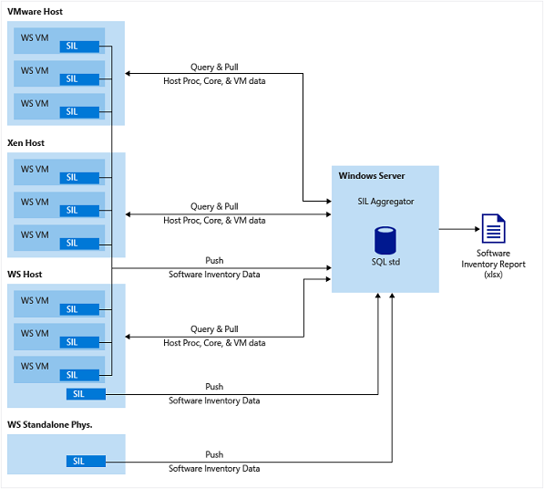

# Software Inventory Logging Aggregator

>Applies To: Windows Server 2012 R2

## What is Software Inventory Logging Aggregator?
Software Inventory Logging Aggregator (SILA) receives, aggregates, and produces basic reports of the number and types of Microsoft enterprise software installed on Windows Servers in a data center.

SILA is software that you install on Windows Server, but is not included in the Windows Server installation. To install the software, first download it for free from the Windows Download Center: [Software Inventory Logging Aggregator 1.0 for Windows Server](https://www.microsoft.com/download/details.aspx?id=49046)

The Software Inventory Logging framework is intended to reduce the operational costs of inventorying Microsoft software deployed across many servers in an IT environment. This framework consists of two components, this SIL Aggregator, and the Windows Server feature, introduced in Windows Server 2012 R2, Software Inventory Logging (SIL). This Software Inventory Logging Aggregator 1.0 will install on one server and receive inventory data from any Windows Server configured to forward data to it via SIL. The design allows data center administrators to enable SIL in master Windows Server images intended for wide distribution across their environment.  This software package is the target point and intended for customers to install on their premises for easy logging of inventory data over time. This software also allows for periodic creation of basic inventory reports in Microsoft Excel. Software Inventory Logging Aggregator 1.0 reports include counts of installations of Windows Server, System Center, and SQL Server.

> [!IMPORTANT]
> No Data is sent to Microsoft with the use of this software.

### Data SIL Collects Over Time
Once deployed correctly, the following data can be viewed at the SIL Aggregator:

-   Unique Windows Server installs in your data center

-   FQDN

-   Identifying GUIDs

-   Number of physical processors and cores

-   Number of virtual processors (if a VM)

-   Model and Type of physical processors

-   If hyper threading is enabled on physical processors or not

-   Chassis serial number

-   High-water mark count, and identity, of simultaneously running Windows Server VMs (if a host running a hypervisor) on each host, over time

-   High-water mark count, and host name, of simultaneously running managed \(System Center agent present\) Windows Server VMs on each host, over time

-   Name of System Center agents installed on VMs counted in managed high\-water mark

-   Count and location of SQL Server installations over time \(only SKUs and editions that require a license\)

-   Lists of software installed in Add\/Remove Programs

### Who will use SIL?

-   **IT Pros, or data center administrators**, looking for a low cost method of collecting valuable software inventory data, automatically, over time.

-   **CIOs and Finance Controllers**, who need to report usage of Microsoft enterprise software in their organizations' IT deployments.

## Getting Started
**Prerequisites**

Software Inventory Logging Aggregator (SIL Aggregator) on a minimum of one server for aggregation and reports, either in a VM or on physical hardware):

-   **Windows Server 2012 R2** (Standard or Datacenter Edition)

-   **The IIS server role,** with .Net Framework 4.5, WCF Services, and HTTP Activation, all in the same selection tree in **Add Roles and Features Wizard**.

-   **SQL Server** 2012 Sp2 Standard Edition or SQL Server 2014 Standard Edition

-   **64 bit Microsoft Excel** 2013 (optional for installation but needed for creating reports)

-   Optional: **VMware PowerCLI 5.5.0.5836** (needed in VMware environments)

>[!Note]
>When using the Windows Management Framework, there is a known compatibility issue with WMF release 5.1, on the SIL Aggregator only.  It is not necessary to exceed WMF version 4.0 on servers with SIL Aggregator installed.

Software Inventory Logging (SIL) exists in Windows Server versions with the following updates installed:

-   **Windows Server 2016**, or higher

-   **Windows Server 2012 R2** (Standard or Datacenter Edition)

    -   Windows Server 2012 R2 update **KB3000850** (November, 2014)

    -   Windows Server 2012 R2 update **KB3060681** (June, 2015)(May appear as an optional update on Windows Update)

### Security and Account Types
**Certificate requirement**

SIL and the SIL Aggregator rely on SSL certificates for authenticated communication. The common implementation of this will be to install SIL Aggregator with one certificate (server name and certificate name match) for hosting the web service that receives inventory data. Then, Windows Servers to be inventoried using the SIL feature will use a different client certificate, to push data to the SIL Aggregator. A PowerShell cmdlet (Set-SilAggregator, more details below) needs to be used to add certificate thumbprints to the SIL Aggregator's list of approved certificates from which the Aggregator will accept associated data. The SIL Aggregator proceeds with processing and insertion into its database after authentication of each payload of data with a certificate. See the **SIL Aggregator Cmdlets Detail** section for more specific details on how this works.

### Polling Account Setup
When adding credentials to the SIL Aggregator to enable polling operations, you should use a least privileged account approach. Also, as a security best practice, you shouldn't use the same credentials for all, or many, hosts in a data center or other IT deployment.

On a Windows Server host that you want to set up for polling by the SIL Aggregator, and to avoid using a user in the administrators group, follow these steps to give just enough access to a user account:

##### To setup a polling account

1.  On the Windows Server Hyper-V host you want to poll from your SIL Aggregator, create a local user account using **Computer Management** in Windows (be sure to uncheck the box that forces a password change at first logon).

2.  Add this user to the **Remote Management Users** group.

3.  Add this user to the **Hyper-V Administrators** group.

4.  Open **WMIMgmt.msc** with **Start**->**Run**.

5.  Click **More Actions** in the **Actions** section and select **Properties**.

6.  Click **Security**.

7.  Select **cimv2 namespace** in the **Namespace** treeview.

8.  Click **Security** (button) .

9. Add the **Remote Management Users** group in the format **machinename\group name**

10. Click **OK**.

11. Back in the Security for **root\cimv2** window, select the **Remote Management Users**.

12. In the permissions section at the bottom, ensure that the **Remote Enable** is checked.

13. Click **Apply** and then click **OK**.

14. Click **OK** in the **Properties** window.

### Installing SIL Aggregator
There are some things you need to make sure of before installing SIL Aggregator on a Windows Server:

-   **You have a valid SSL certificate** that you want to use to host this software's web service.

    -   Certificate should be in **.pfx** format

    -   The Windows Server name and the certificate name should match.

-   **SQL Server Standard Edition is installed**, or is installed on a remote server you intend to be used with this software.

    -   SIL Aggregator works with both SQL Server 2012 sp2 and SQL Server 2014. There is nothing out of the ordinary needed when making selections during SQL Server installation.

    -   The account used to install SIL Aggregator must be a sysadmin role on SQL in order to be able to create the database during install.

    -   The account used to install SIL Aggregator should be added as an administrator on SQL Analysis Services before SIL Aggregator is installed.

    -   Once installed, the SQL Server Agent should be configured to run automatically.

-   **The IIS server role is added** with .Net Framework 4.5, WCF Services, and HTTP Activation, all in the same selection tree in **Add Roles and Features Wizard**.

-   You are **logged on to the server with an account that has administrative privileges** on the server.

-   You are **logged on to the server with an account that has sysadmin privileges on the SQL Server**, if Windows Authentication is desired

    OR

    If SQL Authentication is desired, **you have the password for an account that has SQL administrative privileges**.

##### To install Software Inventory Logging Aggregator

1.  Double-click **Setup.exe** to start the installation.

2.  Click **Next** on the welcome window.

3.  If you accept the EULA, check the box accepting the agreement and then click **Next**.

4.  In **Choose Features**, select **Install Software Inventory Logging Aggregator and Reporting Module**, and then click **Next**.

    For more information on installing the reporting module only, see `Publish-SilReport` under the **SIL Aggregator Cmdlet Details** section.

5.  After all prerequisites are verified, click **Next**.

6.  In **Choose an Account Type**, select either **local user** or **gMSA**, depending on your preference.

    Choosing the local user account option will create a local user with an auto generated strong password. This account will be used for all SIL Aggregator services and task operations on the local server.  Using Group Managed Service Accounts (gMSA) is recommended if the Aggregator is part of an Active Directory domain (Windows Server 2012 and above). For more information on gMSA, see: [Group Managed Service Accounts Overview](https://technet.microsoft.com/library/hh831782.aspx)

    -   The gMSA account option must be used if you plan to run the SQL Server database on a separate server from the SIL Aggregator.

    -   Don't forget to reboot the server after adding the computer account to the gMSA enabled security group in Active Directory.

7.  In **Choose a SQL Server**, enter the SQL Server where your SQL instance is installed, or **localhost**, if it is installed on the local server.

    Only one SIL Aggregator per SQL instance is supported.

8.  Select the authentication type and click **Verify SQL**.

9. Click **Next**, and then in **Internet Information Services Server Details**, select a port number or keep the default.

10. Browse for the **.pfx** file location, type the password for the .pfx file, and then click **Next**.

11. The final screen will show installation progress. Once completed successfully, click **Finish**.

### Uninstalling SIL Aggregator

##### To uninstall Software Inventory Logging Aggregator

1.  Open **PowerShell** as an administrator and then type `Stop-SilAggregator`. When the prompt returns, SIL Aggregator has stopped.

    By design, SIL Aggregator will process files after 20 minutes or 100 files are received.  In high scale environments this scenario will never occur, but at low scale, some files may remain to be processed before the aggregator can be stopped. Use the `–Force` parameter if keeping these files and data is unnecessary.

2.  Go to **Control Panel**, click **Programs and Features**, click **Uninstall Programs**, click **Software Inventory Logging Aggregator**, and then click **Uninstall**.

    Software Inventory Logging Aggregator will open a window to prompt you to choose between deleting all data in the database, or keeping all data in the database. The default selection is to keep (if a reinstall is desired, you can attach to the existing database to pick up where the Aggregator left off).

3.  Select either **Keep** or **Delete**, and then click **Next**.

4.  After the progress bar completes, click **Finish**.

### Start using SIL and the SIL Aggregator

#### Introduction to SIL Aggregator PowerShell cmdlets
The following commands can be run from the Windows PowerShell console as an administrator.

|Windows PowerShell Cmdlet|Function|
|-----------------------------|------------|
|`Start-SilAggregator`|Starts all Software Inventory Logging Aggregator services and tasks. This is required for the Aggregator to receive data over HTTPS from servers with SIL Logging started.|
|`Stop-SilAggregator`|Stops all Software Inventory Logging Aggregator services and tasks. If tasks or services are in the middle of operations, there could be a delay to the completion of this command.|
|`Set-SilAggregator`|Allows the administrator to make configuration changes to Software Inventory Logging Aggregator.|
|`Add-SilVmHost`|Used to add specific host names, or an array of host names, to be polled on a regular interval \(default is one hour intervals\).|
|`Remove-SilVmHost`|Used to remove specific host names, or an array of host names, to be polled on a regular interval.|
|`Get-SilVMHost`|Used to retrieve the list of physical hosts Software Inventory Logging Aggregator is configured to poll for ongoing VM running state data.|
|`Get-SILAggregatorData`|Used to retrieve data from the database to the PowerShell console.|
|`Publish-SilReport`|Use to create reports from the database of Software Inventory Logging data. **Note:** Cube processing on the Aggregator occurs once a day. So data captured at the Aggregator will not appear in reports until the following day.|

#### Suggested Order to Start
Once you have Software Inventory Logging Aggregator installed on your server, open PowerShell as an administrator.

-   On your SIL Aggregator:

    -   Run `Start-SilAggregator`

        This is required for your Aggregator to actively receive data being forwarded to it over HTTPS from your servers you have (or will) set up to be inventoried. Note that even if you have enabled your servers to forward to this Aggregator first, it is ok, as they will cache their data payloads locally for up to 30 days. Once the Aggregator, their "targeturi" is up and running, all cached data will be forwarded at once to the Aggregator and all data will be processed.

    -   Run `Add-SilVMHost`

        Example: `add-silvmhost –vmhostname contoso1 –hostcredential get-credential`

        -   In this example, **contoso1** is the network name (or IP address) of the physical host server that you want your Aggregator to poll for regular updates as to which VMs are running on it in order to track this data over time. Get-Credential will prompt the logged on user to enter an account to be used to poll this host from that point forward. Running the same command, on the same host, will allow you to update the account used at any time. Beware of account password changes and expirations over time. If credentials change or expire, polling on the host will fail.

        -   By default, polling will commence hourly, starting one hour after `Start-SilAggregator` is run, or one hour after a host is newly added to the polling list.  The polling interval can be changed by using the `Set-SilAggregator cmdlet`.

        -   This cmdlet will auto detect from a preset list of options (see **SIL Aggregator Cmdlets Detail** section), which HostType and HyperVisorType is correct for the host you are adding. If it is unable to recognize these or the credentials provided are incorrect, a prompt will be displayed. If you accept with a **Y** entry, the host will be added, listed as **Unknown**, but it will not be polled.

    -   Run `Set-SilAggregator –AddCertificateThumbprint` "your client certificate's thumbprint"

        This is required to receive data over HTTPS from Windows Servers with SIL Logging enabled. The thumbprint will be added to the list of thumbprints that the SIL Aggregator will accept data from. The SIL Aggregator is designed to accept valid enterprise client authentication certificates. The certificate used will need to be installed in the **\\localmachine\MY (Local Computer -> Personal**) store on the server forwarding the data.

-   On your Windows Servers to be inventoried, open PowerShell as an administrator and run these commands:

    -   Run `Set-SilLogging –TargetUri "https://contososilaggregator" –CertificateThumbprint "your client certificate's thumbprint"`

        -   This will tell SIL in Windows Server where to send inventory data and which certificate to use for authentication.

            > [!IMPORTANT]
            > Make sure "https://' is in the TargetUri value.

        -   The enterprise client certificate with this thumbprint needs to be installed in **\localmachine\MY** or use **certmgr.msc** to install the certificate in **Local Computer -> Personal** store.

            > [!IMPORTANT]
            > If these values are not correct, or if the certificate is not installed in the correct store (or is invalid), forwards to the target will fail when SIL Logging is started. Data will be cached locally for up to 30 days.

    -   Run `Start-SilLogging`

        This starts SIL Logging. Each hour, at random intervals within the hour, SIL will forward its inventory data to the Aggregator specified with the `–targeturi` parameter. The first forward will be a complete set of data. Each subsequent forward will be more of a "heartbeat" with just identifying data that nothing has changed. If there is any change to the data set, another complete set of data will be forwarded.

    -   Run `Publish-SilData`

        -   The first time SIL is enabled for logging, this step is optional.

        -   This is a manual, one-time forward of a complete set of data.

        -   If SIL Logging has been started for some time and a new SIL Aggregator is designated with `Set-SilLogging`, then it is required to run this cmdlet, one time only, to send a complete set of data to the new Aggregator.

Once you have followed these steps to add physical hosts running virtual Windows Server machines, AND you have enabled Software Inventory Logging (or SIL Logging) inside those Windows Servers, you can run `Publish-SilReport –OpenReport` at any time on the SIL Aggregator (requires Excel 2013). Note however, that the SQL Server Analysis Services cube processes once a day, so data is not available in reports on the same day.

## Architectural Overview
SIL works in both push and pull modes and consists of two components working in parallel: The Software Inventory Logging (SIL) feature in Windows Server, and the Software Inventory Logging Aggregator (SILA) downloadable MSI. The servers to be inventoried push software inventory data over HTTPS, using SIL, to the SIL Aggregator (every hour at random points within each hour). The Aggregator in turn, polls, or queries, the physical hypervisor hosts to pull hardware inventory data each hour. Both push and pull need to be configured properly to enable full functionality of SIL. These can be configured in any order. However, cube processing on the Aggregator occurs once a day, so data captured at the aggregator, via either push or pull, will not appear in reports until the following day.

> [!IMPORTANT]
> No data is sent to Microsoft with the use of this software.

## Enable SIL on multiple servers
There are several ways to enable SIL in a distributed server infrastructure, such as in a private cloud of virtual machines.  Following is an example of one way to set up Windows Server images to automatically send inventory data to a SIL Aggregator when they start up on the network for the first time.

Run the following cmdlets in the PowerShell console as an administrator on each running VM or physical computer/device that has Windows Server installed (see the **Prerequisites** section), :

You will need a valid client SSL certificate in .pfx format to use these steps.  The thumbprint of this certificate will need to be added to your SIL Aggregator using the `Set-SILAggregator –AddCertificateThumbprint` cmdlet. This client certificate does not need to match the name of your SIL Aggregator.

-   `$secpasswd = ConvertTo-SecureString "`**<password for the account with permissions to the network location holding your client pfx file>**`" -AsPlainText –Force`

-   `$mycreds = New-Object System.Management.Automation.PSCredential ("`**<user account with permissions to the network location holding your client  pfx file>**`", $secpasswd)`

-   `$driveLetters = ([int][char]'C')..([int][char]'Z') | % {[char]$_}`

-   `$occupiedDriveLetters = Get-Volume | % DriveLetter`

-   `$availableDriveLetters = $driveLetters | ? {$occupiedDriveLetters -notcontains $_}`

-   `$firstAvailableDriveLetter = $availableDriveLetters[0]`

-   `New-PSDrive -Name $firstAvailableDriveLetter -PSProvider filesystem -root` **<\\server\path to share which holds your pfx certificate file>** `-credential $mycreds`

-   `Copy-Item ${firstAvailableDriveLetter}:\`**<certificatename.pfx file in directory of new drive> c:\<location of your choice>**

-   `Remove-PSDrive –Name $firstAvailableDriveLetter`

-   `$mypwd = ConvertTo-SecureString -String "`**<password for the certificate pfx file>**`" -Force –AsPlainText`

-   `Import-PfxCertificate -FilePath c:\`**<location\\certificatename.pfx>** `cert:\localMachine\my -Password $mypwd`

-   `Set-sillogging –targeturi "https://`**<machinename of your SIL Aggregator>** `–certificatethumbprint`

> [!NOTE] 
> Use the Certificate thumbprint from your client pfx file and added to your SIL Aggregator using the **Set-SilAggregator `-AddCertificateThumbprint** cmdlet.

-   `Start-sillogging`

Whenever a SIL Aggregator cannot be reached, SIL inventory data will cache locally on Windows Servers for up to 30 days. Once a successful push is made to the Aggregator, all cached data is forwarded.

Add `Publish-SilData` to the above list if pushing SIL data to a new SIL Aggregator after successful pushes to an old aggregator (this will send a complete complement of SIL data, which the new aggregator will need for this machine).

## Software Inventory Logging Aggregator Reports

### Cube Processing
On a Software Inventory Logging Aggregator, the SQL Server Analysis Services cube will be processed once a day at 3:00:00 AM local system time. Reports will reflect all data up until that time, but nothing after that time on the same day.

### High-Water Mark
A fundamental aspect of Software Inventory Logging Aggregator reports is the capture of what is commonly referred to as a "high-water mark" of simultaneously running Windows Servers. This applies to Windows Server and System Center counts in these reports. For Windows Server, each physical host has a point in time (regardless of the OS type on the host), over the course of a month, when the most Windows Server VMs are running simultaneously. This is the high-water mark for the month. Additionally, for System Center, there is a point in time in the month when the most managed Windows Servers are simultaneously running per physical host (a managed server is identified when one or more System Center agents are present). Only the most recent high-water mark for any physical host will be shown in the report. No data after the high-water mark will be shown. and it can be assumed that the number of Windows Server VMs (WS tabs), or managed Windows Server VMs (SC tabs), has fallen below the high-water mark after that point. This manner of tracking and representing usage is intended to help with capacity planning as well as aligning with license models for these products.

On SQL related tabs in the report, SQL Server installs are counted cumulatively; not by hig-water mark. Totals are a running count of SQL Server installs.

> [!NOTE]
> Use of Software Inventory Logging does not replace the obligation to accurately report usage of Microsoft software under applicable license terms.

### Poll Date Time
When using Software Inventory Logging Aggregator, it is important to understand that aggregation for high-water mark counts is poll driven. In other words, a high-water mark can only be captured by a poll of the underlying physical host. Thus high-water mark counts are directly associated with a corresponding "Poll Date Time." While poll interval is adjustable, the fidelity of high-water marks captured will be impacted if a higher interval value is used. The higher the interval, the less representative the data will be of actual usage.

### Reports Are Month by Month
All reports, even yearly reports, are represented as month by month reports. High-water marks, totals, as well as machine data, are reset at the beginning of each calendar month.

Report data impacted by the switch to a new month includes:

-   All high-water marks for all hosts are reset at the start of a new month.

-   If the Aggregator receives at least one full payload from a VM (over HTTPS), but stops receiving heartbeats, all polls of the underlying host within that month will assume the association between host, VM, and VM data as that VM is running or stopped throughout the month. At the start of the new month, this association is cleared until either a full payload or heartbeat is received from that VM.

### Additional Notes on Report Behavior

-   Summary tabs are meant to be quick reference lists of inventory. Hosts and their VMs are listed in the same column.

-   Ignore all values that are grey or dim. These are artifacts of the report creation from the SSAS cube.

-   If a VM is listed with "Unknown OS," it means that the Aggregator has not received a full data payload from that VM via SIL over HTTPS.

-   VMs listed under "Unknown Host" are Windows Server VMs successfully forwarding inventory data over HTTPS to the Aggregator, but the Aggregator is not actively or successfully polling the underlying host for that VM. Counts will always be zero for these entries since the underlying host is unknown. Use the `Add-SilVMHost` cmdlet, with correct credentials, to add the host (or all hosts) to SIL Aggregator for polling. Once polled successfully, the VM data and the host data will be associated on reports moving forward.

-   All dates and times are local to the SIL Aggregator system time and locale. This includes inventory data received over HTTPS from SIL enabled systems. When these files are processed (no more than 20 minutes after receiving) the data is inserted into the database with the local system time.

-   "SIL Aggregator" will be denoted on any server machine that has Software Inventory Logging Aggregator installed.

-   If a physical host changes either number of processors or amount of physical memory, a new row will appear in the report along with the old row. Polling updates will cease on the old row and proceed on the new row as if it is a newly added host.

-   On **Summary** and **Detail** tabs, the total listed in columns for Simultaneously Running Windows Servers or managed Windows Servers indicate a total of all the high-water marks for all hosts below. These include Windows Servers that are not hypervisor hosts and have no VMs running, as well as servers that may have VMs running but they are "Unknown," as no data is being received from within the VM from SIL via HTTPS. These are totaled for convenience.

-   In the **SQL Server** section of the **Dashboard** tab, total SQL Server installation count is a summary of all the edition totals on the Dashboard.  This can lead to a discrepancy between the total seen on the **SQL Detail** tab in cases where multiple editions of SQL are installed on a single server.  The Dashboard would count these separately on each server, the **Detail** tab does not.  Multiple SQL editions installed on one Windows Server is always counted as a count of one,  per licensing terms.

-   In the **Windows Server** section of the **Dashboard** tab, rows for **Other Hypervisor Hosts** and **Total Hypervisor Hosts** include physical Windows Server hosts that may or may NOT be running Hyper-V.

### Column Descriptions
Following are descriptions of each column on the **Windows Server Detail** tab of the Excel based report SIL Aggregator creates. Other data tabs are either the same or a subset of these columns. The one exception would be the "Install Count" on the SQL Server tabs (see **High-Water Mark** section).

|Column Header|Description|
|-----------------|---------------|
|Calendar Month|Data in reports is grouped by month, most recent first. Data within the month is not listed in a specific order.|
|Host Name|Network name, or FQDN, of the physical host the SIL Aggregator is successfully polling.  Use the Get-SilVMHost cmdlet to find hosts that have been added but are not, or no longer, being polled successfully. The last successful poll will be displayed.|
|Host Type|Operating System manufacturer on the physical host.|
|Hypervisor Type|Hypervisor manufacturer on the physical host.|
|Processor Manufacturer|Processor manufacturer of the processors on the physical host.|
|Processor Model|Processor model of the processors on the physical host.|
|Is Hyper Threading Enabled?|Displays as either True or False depending on if hyper threading is enabled on the processors of the physical host.|
|VM Name|The network name, or FQDN, of the Windows Server virtual machine. If the Aggregator has not received data from this machine over HTTPS, the friendly name of the VM in the hypervisor is listed.|
|Simultaneously Running Windows Server VMs by host|Count of simultaneously running Windows Server VMs on the host. The highest number in the month for that host is the high-water mark count listed and captured at that point in time.  See **High-Water Mark** section of this documentation.  Physical hosts with Windows Server installed, or with Windows Server installed and no known Windows Server VMs running, will always have a count of one. If at least one known Windows Server VM is running on the host, and Windows Server is running on the host itself, the host OS is not part of the count.|
|Physical Processor Count|Number of physical processors installed on the physical host.|
|Physical Core Count|Number of physical processor cores installed on the physical host.|
|Virtual Processor Count|Number of virtual processors that Windows recognizes within the VM. This value only comes from data forwarded over HTTPS using SIL in a Windows Server.|
|Poll Date Time|Date and time of the latest high-water mark point of Windows Server VMs simultaneously running on that physical host.  See **Poll Date Time** section of this documentation.|
|VM Last Seen Date Time|Date and time when the Aggregator last received data inventory over HTTPS from this Windows Server VM.|
|Host Last Seen Date Time|Date and time when the Aggregator last received data inventory over HTTPS from this Windows Server physical host.  It is supported to have physical hosts, running Windows Server and HyperV, to enable SIL and forward inventory data over HTTPS to a SIL Aggregator.|

## SIL Aggregator Cmdlets Detail
Following are details of the SIL Aggregator cmdlets. For the full cmdlet documentation, see: [SIL Aggregator PowerShell cmdlets](https://technet.microsoft.com/library/mt548455.aspx)

### Publish-SilReport

-   This cmdlet, used as is, will create a Software Inventory Logging Report and place it in the logged in user's Documents directory (Excel 2013 is required on the machine where the cmdlet is run).

-   Used with the `–OpenReport` parameter, it will create the report and open it in Excel for viewing.

-   You will notice when installing SIL Aggregator that there is an option to install the reporting module only. It is possible to install the reporting module on a Windows client operating system, such as Windows 8.1 or Windows 10. This allows a thin client, like a laptop or tablet, to connect to an SIL Aggregator database server to publish SIL reports directly.

    -   The following example will prompt for credentials to use, connect to a SIL Aggregator database server named SILContoso, and create and open an SIL report on the local computer.

        `Publish-SilReport -DBServerName "SILContoso" -DBServerCredential Get-Credential –OpenReport`

    -   Before connecting for the first time, in most cases you will need to open a port in the firewall on the SIL Aggregator database server to allow connections. IT Pros will want to set this up beforehand to allow their finance controllers or other inventory managers access to create their own reports. For steps to do this, see the link below. A typical default port for SQL Server Analysis Services is 2383.

### Add-SilVMHost
The following host types and hypervisor versions are supported when using the `Add-SilVMHost` cmdlet. Note that it is not required to specify these. The `Add-SilVMHost` cmdlet will automatically detect a supported combination. If it is unable to detect, or the credentials provided are incorrect, a prompt will be displayed. If the user accepts with a "Y" entry, the host will be added but it will not be polled. It will be added as "Unknown".

|Hypervisor Version|SIL Aggregator         HostType Value|SIL Aggregator HypervisorType Value|
|----------------------|-----------------------------------------|---------------------------------------|
|Windows Server, 2012 R2|Windows|HyperV|
|VMware 5.5|VMware|Esxi|
|Xen 4.x|Ubuntu, OpenSuse, or CentOS|Xen|
|XenServer 6.2|Citrix|XenServer|
|KVM|Ubuntu, OpenSuse, or CentOS|KVM|

Other versions of these hypervisor platforms and types may work as well.  SIL Aggregator ships with the sshnet version below.  This is used to communicate with Linux based virtualization platforms.

<pre>sshnet 2014.4.6-beta1
https://sshnet.codeplex.com/releases/view/120504
Copyright (c) 2010, RENCI</pre>

### Get-SilAggregator
`Get-SilAggregator` provides configuration information for your Software Inventory Logging Aggregator application. The following example output shows:

-   Application is running

-   Polling interval is every hour (can be changed in hour increments)

-   Polling start time

-   Target URI that other machines should set to forward data to this aggregator

-   Certificate thumbprints this Aggregator accepts SIL data from

-   Account type specified at install

    `PS C:\Windows\system32> Get-SilAggregator`

    ``

    `State          : Running HostPollIntervalInHours : Every 1 Hour(s)`

    `PollStartTime      : 8/24/2015 5:07:33 AM`

    `TargetURI        : https://SilContoso`

    `CertificateThumbprint  : 3efc6b8ce7d5eefba5107ede9d1caca550417452, 2dc4ea8bfb64b1246a8c1ffa1b701cd1042a3412`

    `UserProfile       : Local`

### Set-SilAggregator
With the `Set-SilAggregator` cmdlet you can:

-   Change the hourly interval for which polling will occur.

-   Change the start date and time for polling to start at the interval specified.

-   Add or remove certificate thumbprints which the SIL Aggregator will accept data from, or associated with.

### Get-AggregatorData

-   Used alone, this cmdlet displays the contents of the Windows Server Detail tab of a SIL Aggregator Excel report.

-   Used with parameters, this cmdlet will retrieve data directly from the database intended to assist with customized uses of the SIL overall solution.

-   Note that the `–StartTime` and `–Endtime` parameters will show report data from the first of the month of start date and the last of the month of the end date.

### Get-SilVMHost

-   This cmdlet outputs the list of physical hosts the SIL Aggregator is configured to poll, the most recent successful poll date and time, and the HostType (or OS manufacturer), and the HypervisorType (hypervisor manufacturer). See the Add-SilVMHost details for more information on HostType and HypervisorType.

    If a host has no poll date and time, but has a supported HostType and HypervisorType, this means polling has not yet commenced or has not yet been successful.

-   This cmdlet will also list any host names that have been added via the data coming from VMs themselves, if available from the VM. These will appear in the list but will not have any HostType or HypervisorType. This data can help match up VMs and hosts that may not be setup for polling.

-   Use the `–StartTime` and`–EndTime` parameters to assist with understanding when hosts were first added or last polled.

### Remove-SilVMHost

-   This cmdlet will remove any host from the list of hosts to be polled. If a host is removed, it is possible that a VM on the host will re-add the host to the list, but the host will not be polled with correct credentials being specified using the `Add-SilVMHost` cmdlet.

-   If a host is removed, it will be removed from polling but it will not be removed from reports. Since polling will cease, the host will not be present in reports on the following month(s).

-   Use the `–StartTime` and`–EndTime` parameters individually to assist with removing groups of hosts successfully polled up to a date, or successfully polled from a date.

## Avoid these errors and issues with SIL and SIL Aggregator (Troubleshooting Guide)

-   Things to check if `SilLogging` or `Publish-Sildata` cmdlet fail or error:

    -   Be sure the **targeturi** has **https://** in the entry.

    -   Be sure all required updates for Windows Server are installed (see Prerequisites for SIL).  A quick way to check is to look for these using the following cmdlet:	`Get-SilWindowsUpdate *3060*, *3000*`

    -   Be sure the certificate being used to authenticate with the aggregator is installed in the correct store on the local server to be inventoried with SilLogging (see Getting Started section).

    -   On the SIL Aggregator, be sure the certificate thumbprint of the certificate being used to authenticate with the aggregator is added to list using the `Set-SilAggregator –AddCertificateThumbprint` cmdlet (see Getting Started section).

    -   If using enterprise certificates, check that the server with SIL enabled is joined to the domain for which the cert was created, or is otherwise verifiable with a root authority. If a certificate is not trusted on the local machine attempting to forward/push data to an Aggregator, this action will fail with an error.

    -   If all of the above has been checked, you can check that the certificate used to install the SIL Aggregator is healthy and matches the name of the SIL Aggregator server itself (this step is unnecessary if other machines are successfully forwarding to the same SIL Aggregator).

    -   You can check the following location for cached SIL files on the server attempting to forward/push, \Windows\System32\\Logfiles\\SIL. If `SilLogging` has started and has been running for more than an hour, or `Publish-SilData` has been run recently, and there are no files in this directory, than logging to the aggregator has been successful.

-   Confirm that the logged in user has SQL database and Analysis Services access.

    -   This is required when installing SIL Aggregator.

    -   This is required when using PowerShell remotely to manage SIL Aggregator.

-   To publish SIL Aggregator reports from a client desktop OS.

    -   Use the option to install the Reporting Module only on your Windows client (8.1/10).

    -   If you encounter issues when trying to create a report using powershell remotely, you likely need to have a firewall port opened on the SIL Aggregator you are trying to connect to (see `Publish-SilReport` Cmdlet under SIL Aggregator Cmdlets Detail section).

-   When using gMSA option:

    -   Don't forget to reboot the server after joining it to the gMSA enabled machine group in Active Directory.

    -   In the installation process, don't use fully qualified domain when entering domain\user. For example, use **mydomain\gmsaaccount**. Don't enter **mydomain.<i></i>com\gmsaaccount**.

-   When using the Windows Management Framework in your environment:

    -   Be sure the server(s) with SILA installed do not have WMF 5.1 installed.  It is possible to hit an error in the event log regarding the DLL **'mpunits.dll'**.  This will prevent proper operation.  SILA only requires WMF 4.0.

## Managing SIL Over Time

### Uninstall/Reinstall SIL Aggregator
If it becomes necessary to uninstall and then reinstall SIL Aggregator, you can do so without losing existing and historical inventory data. Simply uninstall (following steps provided in this documentation)  and select the option to keep the Software Inventory Logging database. Then reinstall SIL Aggregator (following the steps provided in this documentation) and select the option to attach to an existing database.

After performing this operation, it is necessary to update the credentials using the `Add-SilVMHost` cmdlet on any hosts that were previously being polled by SIL Aggregator (assuming that continuing to collect data from these hosts is desired). In addition, to avoid duplicate entries for the same host on reports, it is necessary to re-add hosts for polling using the same network address as was originally added. Here are the three supported vmhostname types that can be used to add a host using the `Add-SilVMHost` cmdlet:

-   IP Address

-   Fully Qualified Domain Name (FQDN)

-   Netbios Name

### Changing SIL Aggregators
When you want to start inventorying servers in your environment with a different SIL Aggregator, simply use the SIL cmdlet on these servers to change the targeturi (and certificate thumbprint if necessary), `Set-SilLogging –TargetUri`. Note that after doing this it is necessary to use the `Publish-SilData` cmdlet at least once to forward a full inventory to the newly specified SIL Aggregator.

### Changing or Updating Certificates
**IMPORTANT STEPS TO AVOID DATA LOSS:** If it is necessary to change the certificate that servers are using to forward data to an SIL Aggregator, but the target Aggregator will remain the same, use these steps to avoid potential data loss in transit to the Aggregator:

-   On the SIL Aggregator use the `Set-SilAggregator –AddCertificateThumbprint` cmdlet to add the new thumbprint the SIL Aggregator.

-   On ALL servers forwarding data, install the new certificate to be used in **\LOCALMACHINE\MY** using your preferred method.

-   On ALL servers forwarding data, use the `Set-SilLogging –CertificateThumbprint` cmdlet to update to the thumbprint of the new certificate.

-   **CRITICAL: Only after all servers forwarding data have been updated, remove the old thumbprint** from the SIL Aggregator using `Set-SilAggregator –RemoveCertificateThumbprint` cmdlet. If a server forwarding data continues to forward using an old certificate that has been removed from the SIL Aggregator **data will be lost** and not inserted in the database on the Aggregator. This only impacts scenarios where a server has previously successfully forwarded data to a SIL Aggregator and the certificate is then removed from the SIL Aggregator's list of thumbprints to accept data from.

## Release Notes

-   There is a known issue that SIL Aggregator will not process and report on the presence of SQL Server Standard Edition installs.  Here are the steps to correct this:

    1.  Open SQL Server Management Studio on your SIL Aggregator.

    2.  Connect to the Database Engine.

    3.  Expand the SoftwareInventoryLogging database, and then Tables, in the selection tree.

    4.  Right click **dbo.SqlServerEdition**, and then select ‘**Edit Top 200 Rows**'.

    5.  Change the PropertyNumValue next to "Standard Edition" to **2760240536** (from -1534726760).

    6.  Close the query to save the change.

    7.  For any server running SIL that has already logged data to this Aggregator, it may be necessary to run the `Publish-SilData` Cmdlet one time for the Aggregator to correctly process the presence of SQL Server Standard Edition.

-   In SIL generated reports, all processor core counts include the count of threads if hyper-threading is enabled on the physical server.  To get actual physical core counts on servers with hyperthreading enabled, it is necessary to reduce these counts by half.

-   Totals in the rows (on **Dashboard** tab) and columns (on **Summary and Detail** tabs) labeled "**Simultaneously Running**…", for both Windows Server and System Center don't exactly match between the two locations. On the **Dashboard** tab, it is necessary to add "**Windows Server Devices (with no known VMs**)" value to the "**Simultaneously Running**…" value to equal this number on the **Summary and Detail** tabs.

-   See **IMPORTANT STEPS TO AVOID DATA LOSS** when changing or updating certificates under the **Managing SIL Over Time** section of this documentation.

-   While it is possible to add Windows Server 2008 R2 and Windows Server 2012 hosts to the polling host list, this version (1.0) of SIL Aggregator only supports polling Windows Server 2012 R2, for Windows/Hyper-V based hosts, to have success with all features and functionality.  In particular, it is known that when polling Windows Server 2008 R2 hosts, virtual machines and hosts may not match up in the SIL Aggregator reports.

## See Also
[Software Inventory Logging Aggregator 1.0 for Windows Server](https://www.microsoft.com/download/details.aspx?id=49046) 
[SIL Aggregator PowerShell cmdlets](https://technet.microsoft.com/library/mt548455.aspx) 
[SIL PowerShell cmdlets](https://technet.microsoft.com/library/dn283390.aspx) 
[An Overview of SIL](https://technet.microsoft.com/library/dn268301.aspx) 
[Managing SIL](https://technet.microsoft.com/library/dn383584.aspx)

