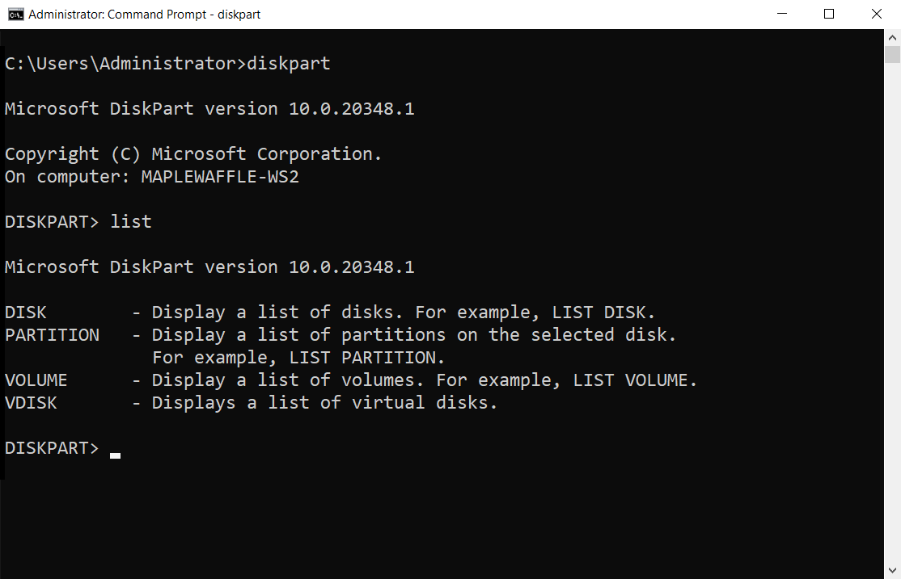
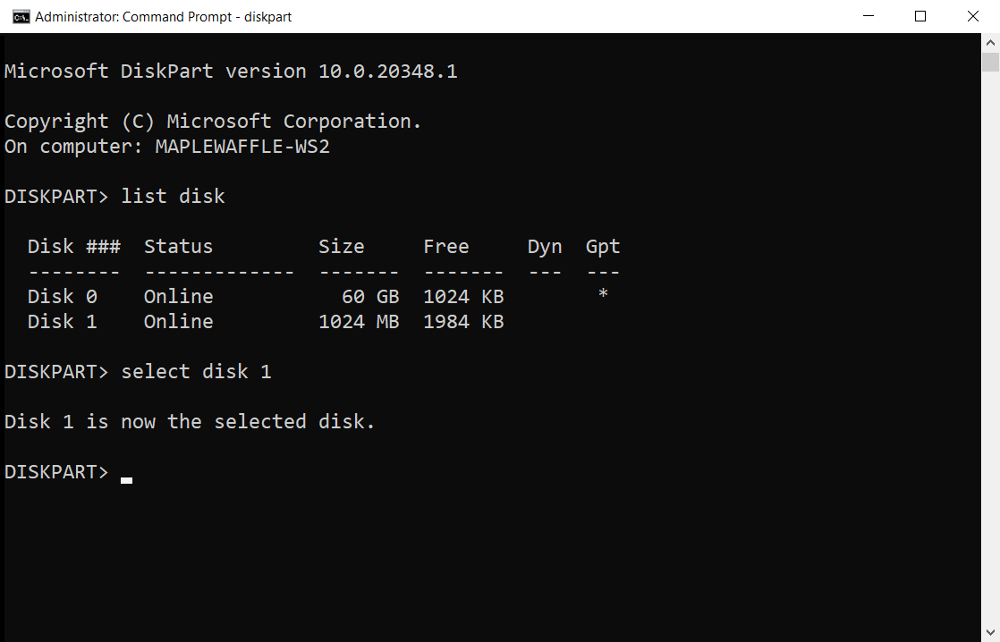
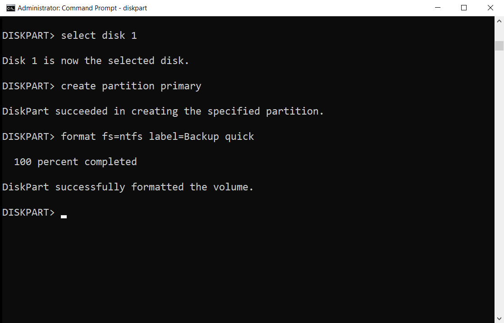

# diskpart

> Applies to: Windows Server 2022, Windows 10, Windows 8.1, Windows 8, Windows 7, Windows Server 2019, Windows Server 2016, Windows Server 2012 R2, Windows Server 2012, and Windows Server 2008 R2, Windows Server 2008

The diskpart command interpreter helps you manage your computer's drives (disks, partitions, volumes, or virtual hard disks).

Before you can use **diskpart** commands, you must first list, and then select an object to give it focus. After an object has focus, any diskpart commands that you type will act on that object.

## Determine focus

When you select an object, the focus remains on that object until you select a different object. For example, if the focus is set on disk 0 and you select volume 8 on disk 2, the focus shifts from disk 0 to disk 2, volume 8.

Some commands automatically change the focus. For example, when you create a new partition, the focus automatically switches to the new partition.

You can only give focus to a partition on the selected disk. After a partition has focus, the related volume (if any) also has focus. After a volume has focus, the related disk and partition also have focus if the volume maps to a single specific partition. If this isn't the case, focus on the disk and partition are lost.

## Syntax

To start the diskpart command interpreter, at the command prompt type:

```cmd
diskpart <parameter>
```

> [!IMPORTANT]
> You must be in your local **Administrators** group, or a group with similar permissions, to run diskpart.

### Parameters

You can run the following commands from the Diskpart command interpreter:

| Command | Description |
| ------- | ----------- |
| [active](active.md) | Marks the disk's partition with focus, as active. |
| [add](add.md) | Mirrors the simple volume with focus to the specified disk. |
| [assign](assign.md) | Assigns a drive letter or mount point to the volume with focus. |
| [attach vdisk](attach-vdisk.md) | Attaches (sometimes called mounts or surfaces) a virtual hard disk (VHD) so that it appears on the host computer as a local hard disk drive. |
| [attributes](attributes.md) | Displays, sets, or clears the attributes of a disk or volume. |
| [automount](automount.md) | Enables or disables the automount feature. |
| [break](break.md) | Breaks the mirrored volume with focus into two simple volumes. |
| [clean](clean.md) | Removes any and all partition or volume formatting from the disk with focus. |
| [compact vdisk](compact-vdisk.md) | Reduces the physical size of a dynamically expanding virtual hard disk (VHD) file. |
| [convert](convert.md) | Converts file allocation table (FAT) and FAT32 volumes to the NTFS file system, leaving existing files and directories intact. |
| [create](create.md) | Creates a partition on a disk, a volume on one or more disks, or a virtual hard disk (VHD). |
| [delete](delete.md) | Deletes a partition or a volume. |
| [detach vdisk](detach-vdisk.md) | Stops the selected virtual hard disk (VHD) from appearing as a local hard disk drive on the host computer. |
| [detail](detail.md) | Displays information about the selected disk, partition, volume, or virtual hard disk (VHD). |
| [exit](exit.md) | Exits the diskpart command interpreter. |
| [expand vdisk](expand-vdisk.md) | Expands a virtual hard disk (VHD) to the size that you specify. |
| [extend](extend.md) | Extends the volume or partition with focus, along with its file system, into free (unallocated) space on a disk. |
| [filesystems](filesystems.md) | Displays information about the current file system of the volume with focus and lists the file systems that are supported for formatting the volume. |
| [format](/previous-versions/windows/it-pro/windows-server-2012-r2-and-2012/cc753770(v=ws.11)) | Formats a disk to accept files. |
| [gpt](gpt.md) | Assigns the gpt attribute(s) to the partition with focus on basic GUID partition table (gpt) disks. |
| [help](help.md) | Displays a list of the available commands or detailed help information on a specified command. |
| [import](import_1.md) | Imports a foreign disk group into the disk group of the local computer. |
| [inactive](inactive.md) | Marks the system partition or boot partition with focus as inactive on basic master boot record (MBR) disks. |
| [list](list.md) | Displays a list of disks, of partitions in a disk, of volumes in a disk, or of virtual hard disks (VHDs). |
| [merge vdisk](merge-vdisk.md) | Merges a differencing virtual hard disk (VHD) with its corresponding parent VHD. |
| [offline](offline.md) | Takes an online disk or volume to the offline state. |
| [online](online.md) | Takes an offline disk or volume to the online state. |
| [recover](recover.md) | Refreshes the state of all disks in a disk group, attempt to recover disks in an invalid disk group, and resynchronizes mirrored volumes and RAID-5 volumes that have stale data. |
| [rem](rem.md) | Provides a way to add comments to a script. |
| [remove](remove.md) | Removes a drive letter or mount point from a volume. |
| [repair](repair.md) | Repairs the RAID-5 volume with focus by replacing the failed disk region with the specified dynamic disk. |
| [rescan](rescan.md) | Locates new disks that may have been added to the computer. |
| [retain](retain.md) | Prepares an existing dynamic simple volume to be used as a boot or system volume. |
| [san](san.md) | Displays or sets the storage area network (san) policy for the operating system. |
| [select](select.md) | Shifts the focus to a disk, partition, volume, or virtual hard disk (VHD). |
| [set id](set-id.md) | Changes the partition type field for the partition with focus. |
| [shrink](shrink.md) | Reduces the size of the selected volume by the amount you specify. |
| [uniqueid](uniqueid.md) | Displays or sets the GUID partition table (GPT) identifier or master boot record (MBR) signature for the disk with focus. |

## Listing available objects

You can view a list of options associated to each command by running the main command followed by what is available to that specific command. Running **list** by itself will display the four parameters below:



> [!NOTE]
> After you run the **list** command, an asterisk (__*__) appears next to the object of focus.

### Examples

To see available disk(s), run **list disk**:

```cmd
list disk
```

To select a disk, run **select disk** followed by the disk number. For example:

```cmd
select disk 1
```



Before disk 1 can be utilized, a partition will need to be created by running **create partition primary**:

```cmd
create partition primary
```

Lastly, we can perform a quick format of disk 1 to NTFS with the label "Backup" by running **format fs=ntfs label=Backup quick** as seen below:

```cmd
format fs=ntfs label=Backup quick
```



## Related links

- [Command-Line Syntax Key](command-line-syntax-key.md)

- [Disk management overview](../../storage/disk-management/overview-of-disk-management.md)

- [Storage Cmdlets in Windows PowerShell](/powershell/module/storage/)
