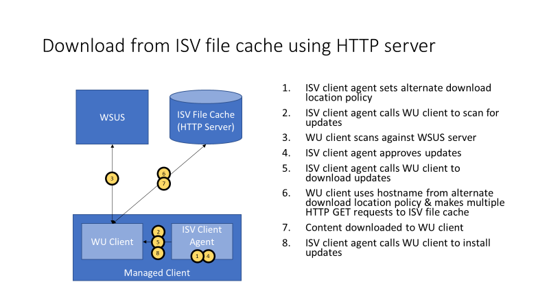

# Express update delivery ISV support

>Applies To: Windows 10, Windows Server 2016

Windows 10 Update downloads can be large because every package contains all previously released fixes to ensure consistency and simplicity.  

Since version 7, Windows has been able to reduce the size of Windows Update downloads with a feature called [Express](https://technet.microsoft.com/library/cc708456(v=ws.10).aspx#Anchor_2), and although consumer devices support it by default, Windows 10 enterprise devices require Windows Server Update Services (WSUS) to take advantage of Express.

## How Microsoft supports Express

- **Express on WSUS Standalone**

    Express update delivery is already [available on all supported versions of WSUS](https://technet.microsoft.com/library/cc708456(v=ws.10).aspx).

- **Express on Devices Directly Connected to Windows Update** 

    Consumer devices support Express download: they use the Windows Update (WU) client to scan, download and install updates. During the download phase, the WU client requests Express packages and downloads the appropriate byte ranges.

-  **Enterprise devices managed using [Windows Update for Business](https://technet.microsoft.com/itpro/windows/manage/waas-manage-updates-wufb)** also get the benefit of Express update delivery support without any change in configuration.

## How ISVs can take advantage of Express

ISVs can use WSUS and the WU client to support Express update delivery. Microsoft recommends the following three steps, each discussed in more detail in the sections below:

1.  [**Configure WSUS**](#BKMK_1)

    WSUS server is required for scan & update synchronizations (additional information can be found [here](https://technet.microsoft.com/library/dn800972(v=ws.11).aspx))

2.  [**Specify and populate an ISV file cache**](#BKMK_2)

    An ISV file cache is recommended to host the update content, which includes the update cabinet files (.cab files) and the Express packages (.psf files).

3.  [**Set up an ISV client agent to direct WU client operations**](#BKMK_3)

>[!NOTE]
>Requires Cumulative Update for Windows 10 Version 1607 release in (or after) January 2017 ([KB3213986 (OS Build 14393.693)](https://support.microsoft.com/help/4009938/january-10-2017-kb3213986-os-build-14393-693) to be installed.
    
   - The ISV client agent determines which updates to approve, and when do download and install updates
   - The WU client determines byte ranges to download and initiates the download request

### Step 1: Configure WSUS

WSUS serves as the interface to Windows Update and manages all metadata describing Express packages that need to be downloaded. If you need to deploy, see [**Overview of Windows Server Update Services 3.0 SP2**](https://technet.microsoft.com/library/dd939931(v=ws.10).aspx). Once WSUS has been deployed, the primary consideration is whether or not to store update content locally on the WSUS server. When configuring WSUS, we recommend not storing updates locally. This assumes that you already have software directing deployment of these packages in your environment. For more about how to configure WSUS local storage, see [**Determine Where to Store Updates**](https://technet.microsoft.com/library/cc720494(v=ws.10).aspx).

### Step 2: Specify and Populate the ISV File Cache 

#### Specify the ISV File Cache

New client-side Group Policy and Mobile Device Management (MDM) settings detailed in the [**Configuration service provider reference**](https://msdn.microsoft.com/windows/hardware/commercialize/customize/mdm/configuration-service-provider-reference) define the location of the ISV file cache.

| **Name**                                              | **Description**                                                                                                                                                      |
|-------------------------------------------------------|----------------------------------------------------------------------------------------------------------------------------------------------------------------------|
| Configure an alternate download location for updates. | Specifies an alternate intranet server to host updates from Microsoft Update. You can then use this update service to automatically update computers on your network |

There are two options when setting up the alternate download location for the ISV file cache:

1. **Specify an ISV HTTP server hostname**, which is the ISV file cache
    
    This approach configures the WU client to make download requests to the HTTP server specified in the policy

2. **Specify localhost**
 
    This approach configures the WU client to make download requests to localhost. This allows the ISV client agent to handle these requests and route as appropriate to fulfill the download request.

> [!IMPORTANT]
> The ISV file cache requires the following:                                                          
> - The server must be HTTP 1.1 compliant per the RFC: <http://www.w3.org/Protocols/rfc2616/rfc2616.html>                                                                                                                                                                
> Specifically, the web server needs to support                                                                                                                                                                                                                                       [**HEAD**](http://www.w3.org/Protocols/rfc2616/rfc2616-sec9.html) and [**GET**](http://www.w3.org/Protocols/rfc2616/rfc2616-sec9.htm) requests                                                                                                                                                                                                                                                                                                   - Partial Range requests                                                                                                                                                                                                                                                                                                                                                                                                                                                                                                                                                    - Keep-alive                                                                                                                                                                                                                                                                                                                                                                                                                             - Do not use "Transfer-Encoding:chunked"                                                                                                 

#### Populate the ISV File Cache

The ISV file cache must be populated with files associated with the updates to be installed on managed clients. 

**To populate the ISV file cache:**

1. Use [WSUS APIs](https://msdn.microsoft.com/library/windows/desktop/microsoft.updateservices.administration.updatefile(v=vs.85).aspx) to access the update's file path and file name for the MU service.

    The metadata for each update on WSUS server contains the update's file path and file name on Microsoft Update as follows (Microsoft Update hostname in bold, followed by file path and filename): **<http://download.windowsupdate.com>**/c/msdownload/update/software/updt/2016/09/windows10.0-kb3195781-x64_0c06079bccc35cba35a48bd2b1ec46f818bd2e74.msu

2. Download files from Microsoft Update and store them in the ISV file cache using one of these two methods: 

   - Store files using the **same folder path as on the MU service**

   - Store files using an **ISV-defined folder path**

     Have HTTP server (or localhost) redirect **HTTP GET** requests, which reference the MU folder path and file name, to the ISV file location.

### Step 3: Set up an ISV client agent to direct WU client operations

The ISV client agent orchestrates the download and installation of approved updates using the following recommended workflow:

1.  The ISV client agent calls the WU client to scan against  the WSUS server

2.  The scan returns the set of applicable updates to the WU client

3.  The ISV client determines which updates to approve, download and install

4.  The ISV client agent calls WU client to download the approved updates

5.  Once the updates have been downloaded, the ISV client agent calls the WU client to install the approved updates

See [Searching, Downloading, and Installing Updates](https://msdn.microsoft.com/library/windows/desktop/aa387102(v=vs.85).aspx) for additional information about using the WU client to scan, download and install updates.

### Download workflow options

Following are two illustrations of download workflow options from an ISV file cache:

### How Express download works

- For OS updates that support Express, there are two versions of the file payload stored on the service:

  - **Full-file version** -- essentially replacing the local versions of the update binaries

  - **Express version** -- containing the deltas needed to patch the existing binaries on the device. 

    Both the full-file version and the Express version are referenced in the update's metadata, which has been downloaded to the client as part of the Scan phase. 

    **Express download works as follows:**

    The WU client will try to download Express first, and under certain situations fall back to full-file if needed (for example, if going through a proxy that doesn't support byte range requests).

  1. When the WU client initiates an Express download, **the WU client first downloads a stub**, which is part of the Express package.

  2. **The WU client passes this stub to the Windows installer**, which uses the stub to do a local inventory, comparing the deltas of the file on the device with what is needed to get to the latest version of the file being offered.

  3. The **Windows installer then requests the WU client to download the ranges** which have been determined to be required.

  4. **The WU client downloads these ranges and passes them to the Windows installer**, which applies the ranges and then determines if additional ranges are needed. This repeats until the Windows installer tells the WU client that all necessary ranges have been downloaded.

  At this point, the download is complete and the update is ready to be installed.

### How Delivery Optimization reduces bandwidth consumption

Delivery Optimization (DO) is a self-organizing distributed cache solution for businesses looking to reduce bandwidth consumption for operating system updates, operating system upgrades, and applications. DO allows clients to download those elements from alternate sources (such as other peers on the network) in conjunction with the specified download location (the ISV file cache in this scenario).

By default in Windows 10 Enterprise and Education, DO allows peer-to-peer sharing on the organization's own network only, but you can configure it differently using Group Policy and mobile device management (MDM) settings.

Refer to [Configure Delivery Optimization for Windows 10 updates](https://technet.microsoft.com/itpro/windows/manage/waas-delivery-optimization) for more information about DO.
