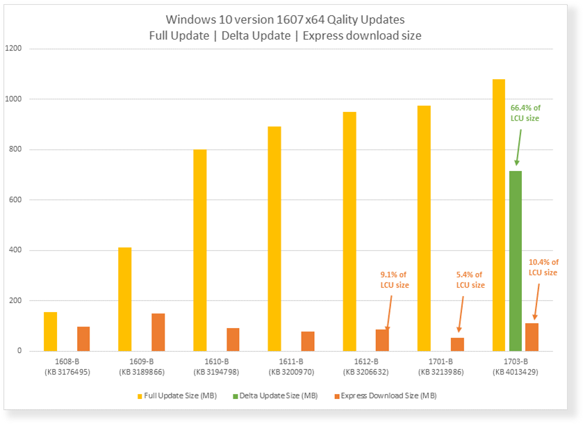
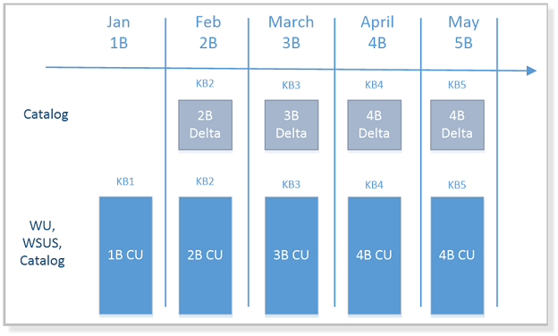

>Applies To: Windows 10 1607, Windows Server 2016

#Monthly Delta update ISV support without WSUS

Windows 10 Update downloads can be large because every package contains all previously released fixes to ensure consistency and simplicity.  

Since version 7, Windows has been able to reduce the size of Windows Update downloads with a feature called [Express](https://technet.microsoft.com/en-us/library/cc708456(v=ws.10).aspx#Anchor_2), and although consumer devices support it by default, Windows 10 enterprise devices require Windows Server Update Services (WSUS) to take advantage of Express. If you have WSUS available, see [Express update delivery ISV support](express-update-delivery-ISV-support.md). We recommend using it to to enable Express update delivery. 

If you do not currently have WSUS installed, but you need smaller update package sizes in the interim, you can use Monthly Delta update. Delta update reduces package sizes substantially, but not as much as with WSUS Express update delivery. We recommend that you deploy WSUS Express update whenever possible for the greatest reduction in package sizes. Following is a chart comparing Delta, Cumulative and Express download sizes for Windows 10 version 1607:

##What is Monthly Delta update?

There are two variants of the monthly security update: Delta and Cumulative.

Monthly Delta update is new, and an interim solution for ISVs who do not have WSUS available to help reduce update package sizes.

>[!IMPORTANT]
>**Delta update will only be available for servicing of Windows 10 Anniversary (1607) and Creator (1704) releases**. For releases after 1704, you will need to implement a deployment infrastructure that supports [Express update delivery](express-update-delivery-ISV-support.md) to continue taking advantage of incremental updates.

By using Monthly Delta update, packages will only contain one month’s updates. Monthly Cumulative contains all the updates up to that update release, resulting in a large file that grows each month. Both Delta and Monthly updates are released on the second Tuesday of each month, also known as "Update Tuesday." The following table compares Delta and Cumulative updates:

|                    | Monthly **Delta** update                                                                                                                                                                                                       | Monthly **Cumulative** update                                                                                                                                                                                             |
|--------------------|--------------------------------------------------------------------------------------------------------------------------------------------------------------------------------------------------------------------------------|---------------------------------------------------------------------------------------------------------------------------------------------------------------------------------------------------------------------------|
| **Scope**          | Single update with **only new fixes for that month**                                                                                                                                                                           | Single update with all new fixes for that month and all previous months                                                                                                                                                   |
| **Application**    | Can only be applied if the previous month’s update was applied (Cumulative or Delta)                                                                                                                                           | Can be applied at any time                                                                                                                                                                                                |
| **Delivery**       | **Published only to Windows Update Catalog** where it can be downloaded for use with other tools or processes. Not offered to PCs that are connected to Windows Update                                                         | Published to Windows Update (where all consumer PCs will install it), WSUS, and the Windows Update Catalog                                                                                                                |

Delta and Cumulative have the same KB number, with the same classification, and release at the same time. Updates can be distinguished by either the update title in the catalog, or by the name of the msu:

- 2017-02 *\***Delta Update**\** for Windows 10 Version 1607 for x64-based Systems (KB1234567)
- 2017-02 *\***Cumulative Update**\** for Windows 10 Version 1607 for x86-based Systems (KB1234567)                                                                                                                                                                                                                                                                                                                                                                                                                                                                                                                                                                                                                                                                                                                                                                                                                                                                                      

### When to use Monthly Delta Update

If size of the update to the client device is a concern, we recommend using Delta update on the devices that have the previous month’s update, and Cumulative update on the devices that are falling behind. This way, all devices only require a single update to bring them up to date. This requires a small adjustment in the overall update management process, as you will have to deploy different updates based on how up-to-date the devices are in the organization:

### What happens if both monthly updates get installed

Since Delta update and Cumulative update are available at the same time, it’s important to understand what happens if you deploy both updates in the same month.

If you approve and deploy the same version of the Delta and Cumulative update, you will generate additional network traffic, since both will be downloaded to the PC. But how are the updates applied? It depends on the installation sequence:

**If the device is up-to-date (last month’s update)**

- If Cumulative installs first, the Delta update subset is not applicable since the Cumulative update included the Delta files and they are already installed. In this case, it would have been best to apply the Delta update instead, since it is considerably smaller.

- If Delta installs first, Cumulative is no longer applicable since the device is already up-to-date.  

**If the device is not up-to-date (falling behind)**

- If Cumulative installs first, the Delta update subset is not applicable since the Cumulative update included the Delta files and they are already installed.

- If Delta installs first, it won't be applied since it requires the previous month’s update as a prerequisite.

Either way, as long as you install Delta or Cumulative update, the devices will get the security fixes released that month.

>[!IMPORTANT]
>**Delta update will only be available for servicing of Windows 10 Anniversary (1607) and Creator (1704) releases**. For releases after 1704, you will need to implement a deployment infrastructure that supports [Express update delivery](express-update-delivery-ISV-support.md) to continue taking advantage of incremental updates.

