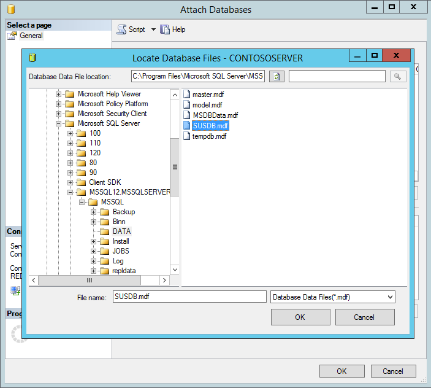
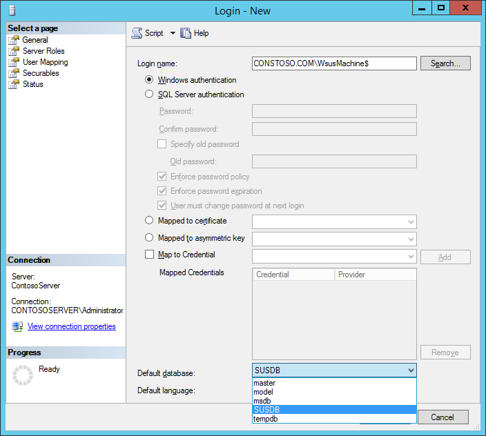

# Migrating the WSUS Database from WID to SQL

>Applies to: Windows Server 2022, Windows Server 2019, Windows Server 2012, Windows Server 2012 R2, Windows Server 2016

Use the following steps to migrate the WSUS database (SUSDB) from a Windows Internal Database instance to a Local or Remote instance of SQL Server.

## Prerequisites

- SQL Instance. This can be the default **MSSQLServer** or a custom Instance.
- SQL Server Management Studio
- WSUS with WID role installed
- IIS (This is normally included when you install WSUS through Server Manager). It is not already installed, it will need to be.

## Migrating the WSUS database

### Stop the IIS and WSUS services on the WSUS server

From PowerShell (elevated), run:

```powershell
    Stop-Service IISADMIN
    Stop-Service WsusService
```

### Detach SUSDB from the Windows Internal Database

#### Using SQL Management Studio

1. Right-click **SUSDB** -&gt; **Tasks** -&gt; click **Detach**:
    
2. Check **Drop Existing Connections** and click **OK** (optional, if active connections exist).
    

#### Using Command Prompt

> [!IMPORTANT]
> These steps show how to detach the WSUS database (SUSDB) from the Windows Internal Database instance by using the **sqlcmd** utility. For more information about the **sqlcmd** utility, see [sqlcmd Utility](/sql/tools/sqlcmd-utility).
> 1. Open an elevated command prompt
> 2. Run the following SQL command to detach the WSUS database (SUSDB) from the Windows Internal Database instance by using the **sqlcmd** utility:

```batchfile
        sqlcmd -S \\.\pipe\Microsoft##WID\tsql\query
        use master
        GO
        alter database SUSDB set single_user with rollback immediate
        GO
        sp_detach_db SUSDB
        GO
```

### Copy the SUSDB files to the SQL Server

1. Copy **SUSDB.mdf** and **SUSDB\_log.ldf** from the WID Data Folder (**%SystemDrive%**\\**Windows\\WID\\Data**) to the SQL Instance Data Folder.

> [!TIP]
> For example, if your SQL Instance Folder is **C:\Program Files\Microsoft SQL Server\MSSQL12.MSSQLSERVER\MSSQL**, and the WID Data folder is **C:\Windows\WID\Data,** copy the SUSDB files from **C:\Windows\WID\Data** to **C:\Program Files\Microsoft SQL Server\MSSQL12.MSSQLSERVER\MSSQL\Data**

### Attach SUSDB to the SQL Instance

1. In **SQL Server Management Studio**, under the **Instance** node, right-click **Databases**, and then click **Attach**.
    
2. In the **Attach Databases** box, under **Databases to attach**, click the **Add** button and locate the **SUSDB.mdf** file (copied from the WID Folder), and then click **OK**.
    
    

> [!TIP]
> This is also able to be done using Transact-Sql.  Please see the [SQL documentation for attaching a database](/sql/relational-databases/databases/attach-a-database) for its instructions.
>
> Example (using paths from previous example):
> ```sql
>    USE master;
>    GO
>    CREATE DATABASE SUSDB
>    ON
>        (FILENAME = 'C:\Program Files\Microsoft SQL Server\MSSQL12.MSSQLSERVER\MSSQL\Data\SUSDB.mdf'),
>        (FILENAME = 'C:\Program Files\Microsoft SQL Server\MSSQL12.MSSQLSERVER\MSSQL\Log\SUSDB_Log.ldf')
>        FOR ATTACH;
>    GO
>```

### Verify SQL Server and Database Logins and Permissions

#### SQL Server Login Permissions

After attaching the SUSDB, verify that **NT AUTHORITY\NETWORK SERVICE** has login permissions to the instance of SQL Server by doing the following:

1. Go into SQL Server Management Studio
2. Opening the Instance
3. Click **Security**
4. Click **Logins**

The **NT AUTHORITY\NETWORK SERVICE** account should be listed. If it is not, you need to add it by adding New Login Name.

> [!IMPORTANT]
> If the SQL Instance is on a different machine from WSUS, the WSUS Server's computer account should be listed in the format **[FQDN]\\[WSUSComputerName]$**.  If not, the steps below can be used to add it, replacing **NT AUTHORITY\NETWORK SERVICE** with the WSUS Server's computer account (**[FQDN]\\[WSUSComputerName]$**)  This would be ***in addition to*** granting rights to **NT AUTHORITY\NETWORK SERVICE**

##### Adding NT AUTHORITY\NETWORK SERVICE and granting it rights

1. Right Click **Logins** and click **New Login…**
    
2. On the **General** page, fill out the **Login name** (**NT AUTHORITY\NETWORK SERVICE**), and set the **Default database** to SUSDB.
    
3. On the **Server Roles** page, ensure **public** and **sysadmin** are selected.
    
4. On the **User Mapping** page:
    - Under **Users mapped to this login**: select **SUSDB**
    - Under **Database role membership for: SUSDB**, ensure the following are checked:
        - **public**
        - **webService**
            
5. Click **OK**

You should now see **NT AUTHORITY\NETWORK SERVICE** under Logins.


#### Database Permissions

1. Right-click the SUSDB
2. Select **Properties**
3. Click **Permissions**

The **NT AUTHORITY\NETWORK SERVICE** account should be listed.

1. If it is not, add the account.
2. On the Login name textbox, enter the WSUS machine in the following format:
    > [**FQDN]\\[WSUSComputerName]$**
3. Verify that the **Default database** is set to **SUSDB**.

    > [!TIP]
    > In the following example, the FQDN is **Contosto.com** and the WSUS machine name is **WsusMachine**:
    >
    > 

4. On the **User Mapping** page, select the **SUSDB** Database under **Users mapped to this login**
5. Check **webservice** under the **Database role membership for: SUSDB**:
    
6. Click  **OK** to save settings.
    > [!NOTE]
    > You may need to restart the SQL Service for the changes to take effect.

### Edit the registry to point WSUS to the SQL Server Instance

> [!IMPORTANT]
> Follow the steps in this section carefully. Serious problems might occur if you modify the registry incorrectly. Before you modify it, [back up the registry for restoration](https://support.microsoft.com/help/322756) in case problems occur.

1. Click **Start**, click **Run**, type **regedit**, and then click **OK**.
2. Locate the following key: **HKEY_LOCAL_MACHINE\SOFTWARE\Microsoft\UpdateServices\Server\Setup\SqlServerName**
3. In the **Value** text box, type **[ServerName]\\[InstanceName]**, and then click **OK**. If the instance name is the default instance, type **[ServerName]**.
4. Locate the following key: **HKEY_LOCAL_MACHINE\SOFTWARE\Microsoft\Update Services\Server\Setup\Installed Role Services\UpdateServices-WidDatabase**
    
5. Rename the Key to **UpdateServices-Database**
    

    > [!NOTE]
    > If you do not update this key, then **WsusUtil** will attempt to service the WID rather than the SQL Instance to which you have migrated.

### Start the IIS and WSUS services on the WSUS server

From PowerShell (elevated), run:

```powershell
    Start-Service IISADMIN
    Start-Service WsusService
```

> [!NOTE]
> If you are using the WSUS Console, close and restart it.

## Uninstalling the WID role (not recommended)

> [!WARNING]
> Removing the WID role also removes a database folder (**%SystemDrive%\Program Files\Update Services\Database**) that contains scripts required by WSUSUtil.exe for post-installation tasks. If you choose to uninstall the WID role, make sure you back up the **%SystemDrive%\Program Files\Update Services\Database** folder beforehand.

Using PowerShell:

```powershell
Uninstall-WindowsFeature -Name 'Windows-Internal-Database'
```

After the WID role is removed, verify that the following registry key is present: **HKEY_LOCAL_MACHINE\SOFTWARE\Microsoft\Update Services\Server\Setup\Installed Role Services\UpdateServices-Database**
