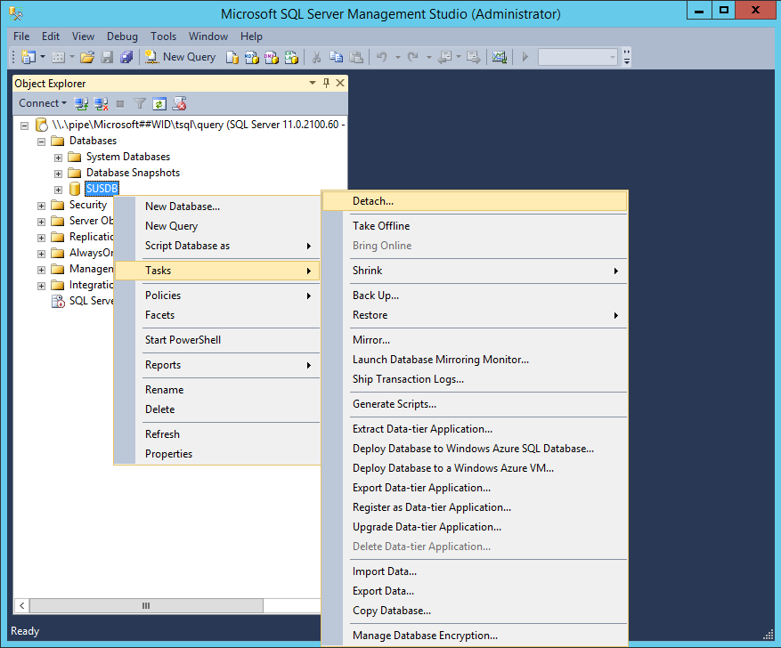
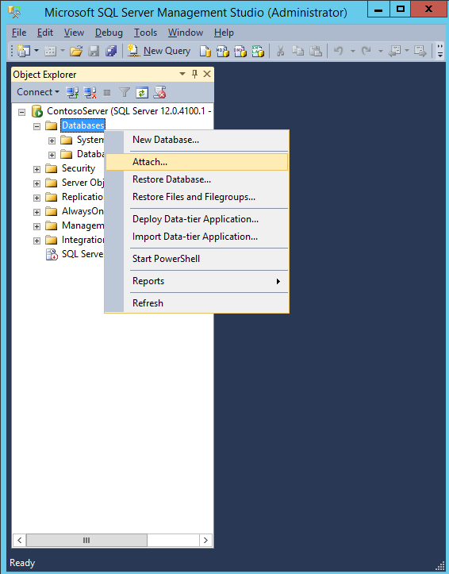
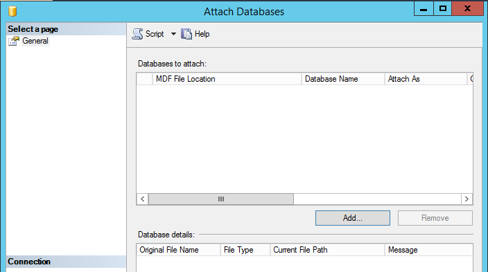
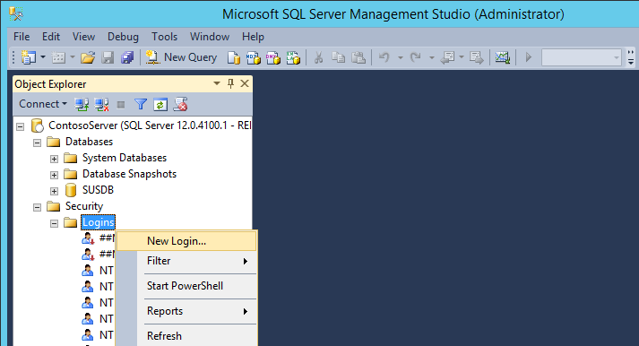
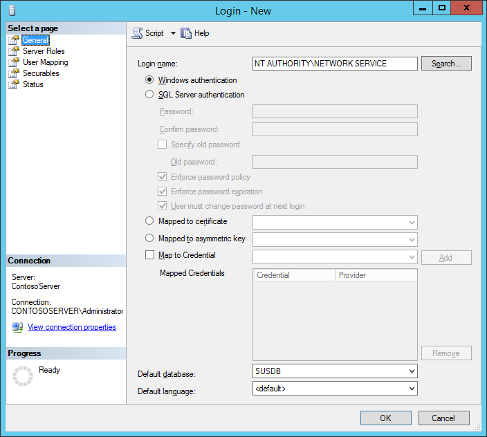
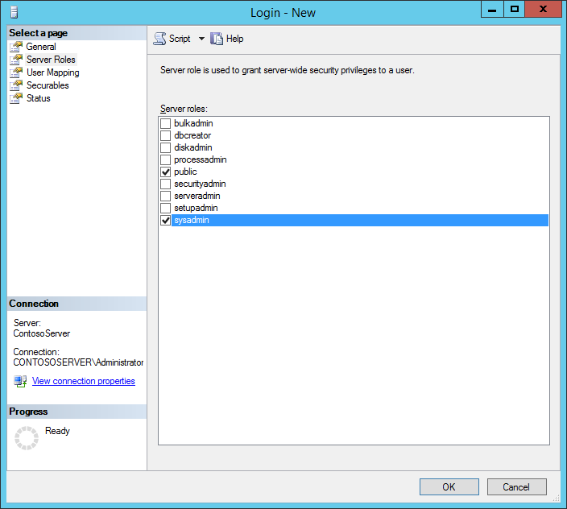
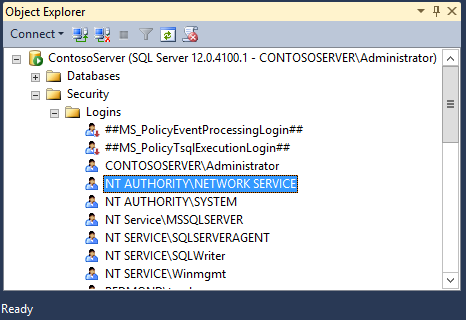
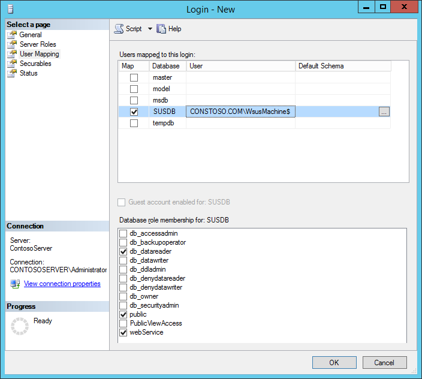
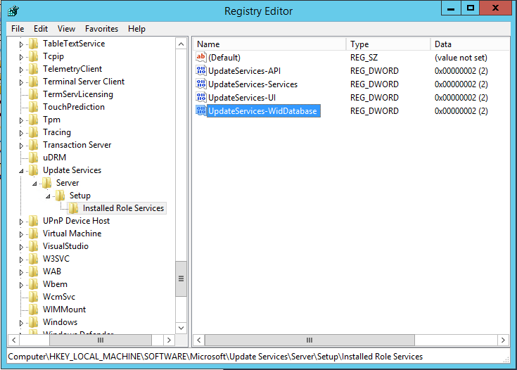

>Applies to: Windows Server 2012, Windows Server 2012 R2, Windows Server 2016

#Migrating the WSUS Database from WID to SQL

Use the following steps to migrate the WSUS database (SUSDB) from a Windows Internal Database instance to a Local or Remote instance of SQL Server.

**Prerequisites:**

- SQL Instance. This can be the default **MSSQLServer** or a custom Instance.

- SQL Server Management Studio

- WSUS with WID role installed

- IIS (This is normally included when you install WSUS through Server Manager). It is not already installed, it will need to be.

##To migrate the WSUS database

1.  Stop the **IISAdmin** and **WSUS** Services on the WSUS Server

     From PowerShell (elevated), run:

  1. **Stop-Service IISADMIN**
  2. **Stop-Service WsusService**

2. Detach the SUSDB from the Windows Internal Database. This can be done from SQL Management Studio or from a command prompt (elevated):

    Using SQL Management Studio:

 1. Right-click **SUSDB** -&gt; **Tasks** -&gt; click **Detach**:

       

      Check **Drop Existing Connections** and click **OK** (optional, if active connections exist).

      

 2. From a  command prompt (Administrator mode):

    Run the following SQL command to detach the WSUS database (SUSDB) from the Windows Internal Database instance by using the **sqlcmd** utility. For more information about the **sqlcmd** utility, see [sqlcmd Utility](http://go.microsoft.com/fwlink/?LinkId=81183).

       `cmd -S \\.\pipe\Microsoft\#\#WID\tsql\query use master`

       `alter database SUSDB set single_user with rollback immediate`

       `GO`

       `sp_detach_db SUSDB`

       `GO`

3.  Copy **SUSDB.mdf** and **SUSDB\_log.ldf** from the WID Data Folder (**%SystemDrive%**\**Windows\WID\Data**) to the SQL Instance Data Folder. 

    For example, if your SQL Instance Folder is **C:\Program Files\Microsoft SQL Server\MSSQL12.MSSQLSERVER\MSSQL**, and the WID Data folder is **C:\Windows\WID\Data,** copy the SUSDB files from **C:\Windows\WID\Data** to **C:\Program Files\Microsoft SQL Server\MSSQL12.MSSQLSERVER\MSSQL\Data**

4.  Attach SUSDB to the SQL Instance

    1.  In **SQL Server Management Studio**, under the **Instance** node, right-click **Databases**, and then click **Attach**.
    
        

    2. In the **Attach Databases** box, under **Databases to attach**, click the **Add** button and locate the **SUSDB.mdf** file (copied from the WID Folder), and then click **OK**.
    
        

        

5.  After attaching the SUSDB, verify that **NT AUTHORITY\NETWORK SERVICE** has login permissions to the instance of SQL Server:

    In SQL Server Management Studio, open the instance, click **Security**, and then click **Logins**. The **NT AUTHORITY\NETWORK SERVICE** account should be listed. If it is not, you need to add it by adding New Login Name: 

       1.  Right Click **Logins** and click **New Login…**

            

       2.  On the **General** page, fill out the **Login name** (**NT AUTHORITY\NETWORK SERVICE**), and set the **Default database** to SUSDB.

             

       3.  On the **Server Roles** page, ensure **public** and **sysadmin** are selected.

             

       4.  On the **User Mapping** page:
             - Under **Users mapped** to this login**: select **SUSDB**
             - Under **Database role membership for: SUSDB**, ensure **public** and **webService** are checked.

            

       5.  Click **OK**. You should now see **NT AUTHORITY\NETWORK SERVICE** under Logins.
           
            

6.  Verify permissions on the database:

    Right-click the SUSDB, select **Properties**, and then click **Permissions**. The NT AUTHORITY\NETWORK SERVICE account should be listed. If it is not, you need to add it.

    If both WSUS and SQL Instance are on the same machine skip to step 8. Otherwise proceed to step 7.

7.  For remote SQL instances, you will also need to grant the WSUS server rights to connect to the remote SQL Server Instance.  In **SQL Server Management Studio**, connect to the SQL instance, click **Security**, and then click **Logins**. The WSUS Server account should be listed. If it is not, you need to add it.    

 1. On the Login name textbox, enter the WSUS machine in the following format: [**FQDN]\[WSUSComputerName]$**. Verify that the **Default database** is set to **SUSDB**.

         In the following example, the FQDN is **Contosto.com** and the WSUS machine name is **WsusMachine**: 

           

  2. On the **User Mapping** page, select the **SUSDB** Database under **"Users mapped to this login"**, and check **webservice** under the **"Database role membership for: SUSDB"**: 

         

    3. Click  **OK** to save settings. You may need to restart the SQL Service for the changes to take effect.  

8.  Edit the registry to point WSUS to the instance of SQL Server that now holds the WSUS database and to recognize the new database for future WSUS updates. If you have not already done so, export the keys in the registry that you plan to edit or back up the whole registry.

    1.  Click **Start**, click **Run**, type **regedit**, and then click **OK**.
    2.  Locate the following key: **HKEY_LOCAL_MACHINE\SOFTWARE\Microsoft\UpdateServices\Server\Setup\SqlServerName**

        In the **Value** text box, type **[ServerName] \ [InstanceName]**, and then click **OK**. If the instance name is the default instance, type **[ServerName]**.

    3.  Locate the following key: **HKEY_LOCAL_MACHINE\SOFTWARE\Microsoft\Update Services\Server\Setup\Installed Role Services\UpdateServices-WidDatabase**

        

    4. Rename the Key to **UpdateServices-Database**

         

        >[!NOTE]
        >If you do not update this key, then **WsusUtil** will attempt to service the WID rather than the SQL Instance to which you have migrated.

9.  Start **IISAdmin** and **WSUS** Services:

    From Task Manager:
    1. Ctrl + Shift + Esc**,** click **More details**, and then click **Services**
    2. Right-click **IISAdmin**, and then click **Start**
    3. Right-click **WsusService**, and then click **Start**  

    From PowerShell, run:
    1. **Start-Service IISADMIN**
    2. **Start-Service WsusService**  

10.  If you are using the WSUS Console, close and restart it.

11.  Uninstalling the WID Role (Not Recommended):

     Removing the WID Role also removes a Database Folder (**%SystemDrive%\Program Files\Update Services\Database**) which contains scripts required by WSUSUtil.exe for post-installation tasks. If you choose to uninstall the WID role, make sure you back up the **%SystemDrive%\Program Files\Update Services\Database** folder beforehand.

     After the WID role is removed, verify that the following registry key is present: **HKEY_LOCAL_MACHINE\SOFTWARE\Microsoft\Update Services\Server\Setup\Installed Role Services\UpdateServices-Database**
