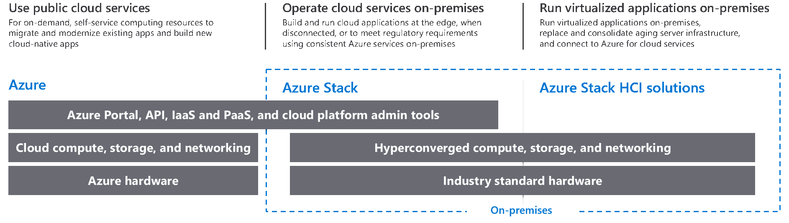

# Azure Stack HCI overview

>Applies to: Windows Server 2019

Azure Stack HCI is a hyper-converged Windows Server 2019 cluster that uses validated hardware to run virtualized workloads on-premises, optionally connecting to Azure services for cloud-based backup, site-recovery and more. Azure Stack HCI solutions use Microsoft-validated hardware to ensure optimal performance and reliability, and include support for technologies such as NVMe drives, persistent memory, and remote-direct memory access (RDMA) networking.

## The Azure Stack family

Azure Stack HCI is part of the Azure and Azure Stack family, using the same software-defined compute, storage, and networking software as Azure Stack. Here's a quick summary of the different solutions:

- [Azure](https://azure.microsoft.com) - Use public cloud services
- [Azure Stack](https://azure.microsoft.com/overview/azure-stack) - Operate cloud services on-premises
- [Azure Stack HCI](https://azure.microsoft.com/overview/azure-stack/hci) - Run virtualized apps on-premises, with optional connections to Azure

To learn more:

- Register for our [Hybrid Cloud Virtual Event](https://info.microsoft.com/ww-landing-building-a-successful-hybrid-cloud-strategy.html) on March 28, 2019.
- Learn more at our [Azure Stack HCI](https://azure.microsoft.com/overview/azure-stack/hci) solutions website.
- Watch Microsoft experts Jeff Woolsey and Vijay Tewari [discuss the new Azure Stack HCI solutions](https://aka.ms/AzureStackOverviewVideo).

## Hardware partners

You can purchase validated Azure Stack HCI solutions that run Windows Server 2019 from 15 partners. Your preferred Microsoft partner gets you up and running without lengthy design and build time and offers a single point of contact for implementation and support services.

Visit the [Azure Stack HCI website](https://azure.microsoft.com/overview/azure-stack/hci) to view our 70+ Azure Stack HCI solutions currently available from these Microsoft partners: ASUS, Axellio, bluechip, DataON, Dell EMC, Fujitsu, HPE, Hitachi, Huawei, Lenovo, NEC, primeLine Solutions, QCT, SecureGUARD and Supermicro.

## FAQ

### What do Azure Stack and Azure Stack HCI solutions have in common? 
Azure Stack HCI solutions feature the same Hyper-V based software-defined compute, storage, and networking technologies as Azure Stack. Both offerings meet rigorous testing and validation criteria to ensure reliability and compatibility with the underlying hardware platform.

### How are they different?
With Azure Stack, you run cloud services on-premises. You can run Azure IaaS and PaaS services on-premises to consistently build and run cloud applications anywhere, managed with the Azure Portal on-premises.

With Azure Stack HCI, you run virtualized workloads on-premises, managed with Windows Admin Center and familiar Windows Server tools. You can optionally connect to Azure for hybrid scenarios such as cloud-based site recovery, monitoring, and others.

### Why is Microsoft bringing its HCI offering to the Azure Stack family? 
Microsoft’s hyperconverged technology is already the foundation of Azure Stack. 

Many Microsoft customers have complex IT environments and our goal is to provide solutions that meet them where they are with the right technology for the right business need. Azure Stack HCI is an evolution of the Windows Server 2016-based Windows Server Software-Defined (WSSD) solutions previously available from our hardware partners. We brought it into the Azure Stack family because we have started to offer new options to connect seamlessly with Azure for infrastructure management services. 

### Will I be able to upgrade from Azure Stack HCI to Azure Stack? 
No, but customers can migrate their workloads from Azure Stack HCI to Azure Stack or Azure.

### How do I buy Azure Stack HCI solutions?
Follow these steps:

1. Buy a Microsoft-validated hardware system from your preferred hardware partner.
1. Install Windows Server 2019 Datacenter edition and Windows Admin Center for management and the ability to connect to Azure for cloud services
1. Optionally use your Azure account to attach cloud-based management and security services to your workloads.

### How does the cost of Azure Stack HCI compare to Azure Stack?

This depends on many factors.

Azure Stack HCI solutions follow a traditional pricing model. Validated hardware can be purchased from Azure Stack HCI partners and software (Windows Server 2019 Datacenter edition with software-defined datacenter capabilities and Windows Admin Center) can be purchased from various existing channels. For any optional Azure services that you choose to use, you pay with an Azure subscription. 

By comparison, Azure Stack is sold as a fully integrated system that includes services and support. It can be purchased as a system you manage, or as a fully managed service from our partners. In addition to the base system, any Azure services that run on Azure Stack or Azure are sold on a pay-as-you-use basis.

We recommend working with your Microsoft partner or account team for pricing details.