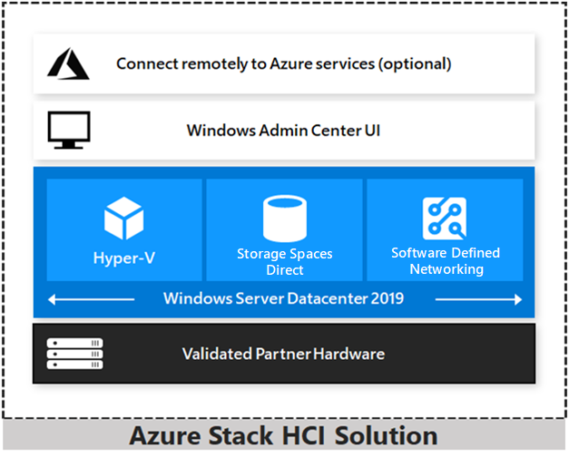

# Azure Stack HCI overview

>Applies to: Windows Server 2019, Windows Server 2016

Azure Stack HCI is a hyper-converged Windows Server 2019 cluster that uses validated hardware to run virtualized workloads on-premises, optionally connecting to Azure services for cloud-based backup, site-recovery and more. Azure Stack HCI solutions use Microsoft-validated hardware to ensure optimal performance and reliability, and include support for technologies such as NVMe drives, persistent memory, and remote-direct memory access (RDMA) networking.

Azure Stack HCI is a solution that combines several products:

- Hardware from an OEM partner

- Windows Server 2019 Datacenter edition

- Windows Admin Center

- Azure services (optional)

Azure Stack HCI is Microsoft’s hyperconverged solution available from a wide range of hardware partners. Consider the following scenarios for a hyperconverged solution to help you determine if Azure Stack HCI is the solution that best suits your needs:

- **Refresh aging hardware.** Replace older servers and storage infrastructure and run Windows and Linux virtual machines on-premises and at the edge with existing IT skills and tools.

- **Consolidate virtualized workloads.** Consolidate legacy apps on an efficient, hyperconverged infrastructure. Tap into the same types of cloudefficiencies used to run hyper-scale datacenters such as Microsoft Azure.

- **Connect to Azure for hybrid cloud services.** Streamline access to cloud management and security services in Azure, including offsite backup, site recovery, cloud-based monitoring, and more.

## The Azure Stack family

Azure Stack HCI is part of the Azure and Azure Stack family, using the same software-defined compute, storage, and networking software as Azure Stack. Here's a quick summary of the different solutions:

- [Azure](https://azure.microsoft.com) - Use public cloud services
- [Azure Stack](https://azure.microsoft.com/overview/azure-stack) - Operate cloud services on-premises
- [Azure Stack HCI](https://azure.microsoft.com/overview/azure-stack/hci) - Run virtualized apps on-premises, with optional connections to Azure

|Azure: Use public cloud services|Azure Stack: Operate cloud services on-premises|Azure Stack HCI: Run virtualized apps on-premises|
|-----------------|-----------------|-----------------|
|For on-demand, self-service computing resources to migrate and modernize existing apps and build new cloud-native apps.|Build and run cloud applications at the edge, when disconnected, or to meet regulatory requirements, using consistent Azure services on-premises.| Run virtualized applications on-premise, replace and consolidate aging server infrastructure, and connect to Azure for cloud services.|
|More than 100 services available in 54 regions around the globe|Azure VMs For Windows and Linux, Azure Web Apps and Functions, Azure Key Vault, Azure Resource Manager, Azure Marketplace, Containers, Azure IoT and Event Hubs, Admin tools (plans, offers, RBAC)|Validated HCI solutions powered by Hyper V and Storage Spaces Direct with Windows Server 2019 and Windows Admin Center for management and integrated access to Azure services.|

To learn more:

- Learn more at our [Azure Stack HCI](https://azure.microsoft.com/overview/azure-stack/hci) solutions website.
- Watch Microsoft experts Jeff Woolsey and Vijay Tewari [discuss the new Azure Stack HCI solutions](https://aka.ms/AzureStackOverviewVideo).

## Hyperconverged efficiencies

Azure Stack HCI solutions bring together highly virtualized compute, storage, and networking on industry-standard x86 servers and components. Combining resources in the same cluster makes it easier for you to deploy, manage, and scale. Manage with your choice of command-line automation or Windows Admin Center.

Achieve industry-leading virtual machine performance for your server applications with Hyper-V, the foundational hypervisor technology of the Microsoft cloud, and Storage Spaces Direct technology with built-in support for NVMe, persistent memory, and remote-direct memory access (RDMA) networking.

Help keep apps and data secure with shielded virtual machines, network microsegmentation, and native encryption for data at rest and in transit.

## Hybrid capabilities

You can take advantage of cloud and on-premises working together with a hyperconverged infrastructure platform in public cloud. Your team can start building cloud skills with built-in integration to Azure infrastructure management services:

- Azure Site Recovery for high availability and disaster recovery as a service (DRaaS).

- Azure Monitor, a centralized hub to track what’s happening across your applications, network and infrastructure – with advanced analytics powered by AI.

- Cloud Witness, to use Azure as the lightweight tie breaker for cluster quorum.

- Azure Backup for offsite data protection and to protect against ransomware.

- Azure Update Management for update assessment and update deployments for Windows VMs running in Azure and on-premises.

- Azure Network Adapter to connect resources on-premises with your VMs in Azure via a point-to-site VPN.

- Sync your file server with the cloud, using [Azure File Sync](../manage/windows-admin-center/azure/azure-file-sync.md).

## Management tools and System Center

Azure Stack HCI uses the same virtualization and software-defined storage and networking software as Azure Stack. With Azure Stack HCI you have full admin rights on the cluster: you can use Windows Admin Center, System Center and any feature of Hyper-V, Storage Spaces Direct, PowerShell, and third-party tools, such as 5Nine Manager.

Microsoft Azure runs on the same Windows Server and Hyper-V platform that are included in Windows Server. Windows Server and System Center include improvements and best practices from Microsoft's experience in operating global scale datacenter networks like Microsoft Azure to you so that you can deploy the same technologies for flexibility, automation, and control when using software designed networking technologies.

Deploy and manage the infrastructure with System Center Virtual Machine Management (VMM) and System Center Operations Manager. With VMM, you provision and manage the resources needed to create and deploy virtual machines and services to private clouds. With Operations Manager, you monitor services, devices, and operations across your enterprise to identify problems for immediate action.

## Hardware partners

You can purchase validated Azure Stack HCI solutions that run Windows Server 2019 from 15 partners. Your preferred Microsoft partner gets you up and running without lengthy design and build time and offers a single point of contact for implementation and support services.

Visit the [Azure Stack HCI website](https://azure.microsoft.com/overview/azure-stack/hci) to view our 70+ Azure Stack HCI solutions currently available from these Microsoft partners: ASUS, Axellio, bluechip, DataON, Dell EMC, Fujitsu, HPE, Hitachi, Huawei, Lenovo, NEC, primeLine Solutions, QCT, SecureGUARD and Supermicro.

## FAQ

### What do Azure Stack and Azure Stack HCI solutions have in common? 
Azure Stack HCI solutions feature the same Hyper-V based software-defined compute, storage, and networking technologies as Azure Stack. Both offerings meet rigorous testing and validation criteria to ensure reliability and compatibility with the underlying hardware platform.

### How are they different?
With Azure Stack, you run cloud services on-premises. You can run Azure IaaS and PaaS services on-premises to consistently build and run cloud applications anywhere, managed with the Azure Portal on-premises.

With Azure Stack HCI, you run virtualized workloads on-premises, managed with Windows Admin Center and familiar Windows Server tools. You can optionally connect to Azure for hybrid scenarios such as cloud-based site recovery, monitoring, and others.

### Why is Microsoft bringing its HCI offering to the Azure Stack family? 
Microsoft’s hyperconverged technology is already the foundation of Azure Stack.

Many Microsoft customers have complex IT environments and our goal is to provide solutions that meet them where they are with the right technology for the right business need. Azure Stack HCI is an evolution of the Windows Server 2016-based Windows Server Software-Defined (WSSD) solutions previously available from our hardware partners. We brought it into the Azure Stack family because we have started to offer new options to connect seamlessly with Azure for infrastructure management services. 

### Does Azure Stack HCI need to be connected to Azure?

No, it’s totally optional. You can take advantage of integration with Azure for hybrid scenarios such as off-site backup and disaster recovery, cloud-based monitoring and update management, but they are optional. We fully understand and accommodate you if you prefer or need to run disconnected.

### How does Azure Stack HCI relate to Windows Server?

Windows Server 2019 is the foundation of nearly every Azure product. All the features you value continue to ship and be supported in Windows Server. Azure Stack HCI is the recommended way to deploy HCI on-premises, using Microsoft-validated hardware from our partners.

### Will I be able to upgrade from Azure Stack HCI to Azure Stack? 

No, but customers can migrate their workloads from Azure Stack HCI to Azure Stack or Azure.

### What Azure services can I connect to Azure Stack HCI?

For an updated list of Azure services that you can connect Azure Stack HCI to, see [Connecting Windows Server to Azure hybrid services](../azure-hybrid-services/index.md).

### How does the cost of Azure Stack HCI compare to Azure Stack? 

Azure Stack is sold as a fully integrated system that includes services and support. You can purchase Azure Stack as a system you manage, or as a fully managed service from our partners. In addition to the base system, the Azure services that run on Azure Stack or Azure are sold on a pay-as-you-use basis.

Azure Stack HCI solutions follow the traditional purchasing model. You can purchase validated hardware from Azure Stack HCI partners and software (Windows Server 2019 Datacenter edition with software-defined datacenter capabilities and Windows Admin Center) from various existing channels. For Azure services that you can use with Windows Admin Center, you pay with an Azure subscription.

### How do I buy Azure Stack HCI solutions?
Follow these steps:

1. Buy a Microsoft-validated hardware system from your preferred hardware partner.
1. Install Windows Server 2019 Datacenter edition and Windows Admin Center for management and the ability to connect to Azure for cloud services
1. Optionally use your Azure account to attach cloud-based management and security services to your workloads.

## Compare Azure Stack and Azure Stack HCI

As your organization digitally transforms, you may find that you can move faster by using public cloud services to build on modern architectures and refresh legacy apps. However, for reasons that include technological and regulatory obstacles, many workloads must remain on-premises. The following table helps you determine which Microsoft hybrid cloud strategy provides what you need where you need it, delivering cloud innovation for workloads wherever they reside.

|Azure Stack|Azure Stack HCI|
|--------|-------|
|New skills, innovative processes|Same skills, familiar processes|
|Azure services in your datacenter|Connect your datacenter to Azure services|

### When to use Azure Stack

|Azure Stack|Azure Stack HCI|
|--------|-------|
|Use Azure Stack for self-service Infrastructure-as-a-Service (IaaS), with strong isolation and precise usage tracking and chargeback for multiple co-located tenants. Ideal for service providers and enterprise private clouds. Templates from the Azure Marketplace.|Azure Stack HCI does not natively enforce or provide for multi-tenancy.|
|Use Azure Stack to develop and run apps that rely on Platform-as-a-Service (PaaS) services like Web Apps, Functions, or Event Hubs on-premises. These services run on Azure Stack exactly like they do in Azure, providing a consistent hybrid development and runtime environment.|Azure Stack HCI does not run PaaS services on premises.
|Use Azure Stack to modernize app deployment and operation with DevOps practices like infrastructure as code, continuous integration and continuous deployment (CI/CD), and convenient features like Azure-consistent VM Extensions. Ideal for Dev and DevOps teams.|Azure Stack HCI does not natively include any DevOps tooling.

### When to use Azure Stack HCI
|Azure Stack HCI|Azure Stack|
|---------------|---------------|
|Azure Stack requires minimum 4 nodes and its own network switches.|Use Azure Stack HCI for the minimum footprint for remote-office / branch-office (ROBO). Start with just 2 server nodes and switchless back-to-back networking for peak simplicity and affordability. Hardware offers start at 4 drives, 64 GB of memory, well under $10k / node.
|Azure Stack constrains Hyper V configurability and feature set for consistency with Azure.|Use Azure Stack HCI for no-frills Hyper-V virtualization for classic enterprise apps like Exchange, SharePoint, and SQL Server, and to virtualize Windows Server roles like File Server, DNS, DHCP, IIS, and AD. Unrestricted access to all Hyper-V features like Shielded VMs.|
|Azure Stack does not expose these infrastructural technologies.|Use Azure Stack HCI to substitute software-defined infrastructure in place of aging storage arrays or network appliances, without major re-architecture. Built-in Storage Spaces Direct and Software-Defined Networking (SDN) offer frictionless integration with Hyper-V environments.|