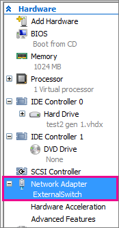

# Best practices for running FreeBSD on Hyper-V

>Applies To: Windows Server Technical Preview, Microsoft Hyper-V Server Technical Preview, Windows 10, Windows Server 2012, Windows Server 2012 R2, Windows Server 2008 R2, Hyper-V Server 2012, Hyper-V Server 2012 R2, Windows 8, Windows 8.1

This topic contains a list of recommendations for running FreeBSD virtual machine on Hyper-V.  
  
## Enable CARP in FreeBSD 10.2 on Hyper-V  
The Common Address Redundancy Protocol (CARP) allows multiple hosts to share the same IP address and Virtual Host ID (VHID) to help provide high availability for one or more services. If one or more hosts fail, the other hosts transparently take over so users won't notice a service failure.  To use CARP in FreeBSD 10.2, follow the instructions in the [FreeBSD handbook](https://www.freebsd.org/doc/en/books/handbook/carp.html) and do the following in Hyper-V Manager.  
  
-   Verify the virtual machine has a Network Adapter and it's assigned a virtual switch. Select the virtual machine and select **Actions** > **Settings**.  
  
      
  
-   Enable MAC address spoofing. To do this,  
  
    1.  Select the virtual machine and select **Actions** > **Settings**.  
  
    2.  Expand **Network Adapter** and select **Advanced Features**.  
  
    3.  Select **Enable MAC Address spoofing**.  
  
## <a name="BKMK_UUID"></a>Add UUIDs for all devices listed in fstab  
When the Hyper-V storage integration service is installed, some device names may change and their corresponding entries in fstab will no longer be valid. To avoid issues with fstab you can replace the device names with UUIDs.  
  
> [!IMPORTANT]  
> Make a backup copy of your fstab before making any changes.  
  
1.  Check fstab contents and make note of the device names. In this example, the root device name is ada0p2 and the swap device name is ada0p3.  
  
    ```  
    # cat /etc/fstab  
    # Device        Mountpoint      FStype  Options Dump    Pass#  
    /dev/ada0p2     /               ufs     rw      1       1  
    /dev/ada0p3     none            swap    sw      0       0  
    ```  
  
2.  Identify the UUIDs for freebsd-ufs and freebsd-swap using the **gpart list** command.  
  
    ```  
    # gpart list | grep -A 11 'ada0p2\|ada0p3' | grep 'rawuuid\|type\|Name'  
  
       Name: ada0p2  
       rawuuid: d1241bc9-1b9e-11e3-8dae-00155ddc3f35  
       rawtype: 516e7cb6-6ecf-11d6-8ff8-00022d09712b  
       type: freebsd-ufs  
       Name: ada0p3  
       rawuuid: d126e943-1b9e-11e3-8dae-00155ddc3f35  
       rawtype: 516e7cb5-6ecf-11d6-8ff8-00022d09712b  
       type: freebsd-swap  
    ```  
  
    The UUID (rawuuid) for ada0p2 is d1241bc9-1b9e-11e3-8dae-00155ddc3f35 and the UUID for ada0p3 is d126e943-1b9e-11e3-8dae-00155ddc3f35.  
  
3.  Replace device names in fstab with the UUIDs.  
  
    ```  
    # vi /etc/fstab  
    # Device  Mountpoint          FStype  Options Dump    Pass#  
    /dev/gptid/d1241bc9-1b9e-11e3-8dae-00155ddc3f35 /               ufs     rw      1       1  
    /dev/gptid/d126e943-1b9e-11e3-8dae-00155ddc3f35 none            swap    sw      0       0  
    ```  
  
    Reboot your system to ensure that the UUIDs are functional. If you need to undo any changes, you can restore your fstab by mounting the partition under a different FreeBSD system.  
  
## <a name="BKMK_IDE"></a>Disable the Fast IDE Driver  
The Fast IDE driver conflicts with the Hyper-V IDE driver which results in the CDROM being disabled. Disable the Fast IDE driver in order to enable the CD-ROM.  
  
1.  Boot the virtual machine.  
  
2.  On FreeBSD boot menu, select 6. Escape to the loader prompt.  
  
3.  At the boot loader prompt, enter the following command:  
  
    ```  
    set hw.ata.disk_enable=1  
    boot  
    ```  
  
    > [!NOTE]  
    > Step 3 disables the Fast IDE driver and has the ATA driver take over control of the IDE. The virtual machine should now start without Fast IDE support.  
  
## <a name="BKMK_GEOM"></a>Create GEOM labels on FreeBSD 8.x  
During startup, device nodes are created as new devices are discovered. This can mean that device names can change when new devices are added. If you get a ROOT MOUNT ERROR during startup, you should create permanent GEOM labels for each IDE partition to avoid conflicts and changes.  
  
1.  Reboot the system into single user mode. This can be accomplished by selecting boot menu option 4, or performing a 'boot -s' from the boot prompt. Alternatively, you can boot a specific kernel by specifying "boot -s". Note the ordering of the last command.  
  
2.  In Single user mode, create GEOM labels for each of the IDE disk partitions listed in your fstab (both root and swap). For example:  
  
    ```  
    # cat /etc/fstab  
    # Device                Mountpoint      FStype  Options         Dump    Pass#  
    /dev/ad0s1b             none            swap    sw              0       0  
    /dev/ad0s1a             /               ufs     rw              1       1  
    /dev/acd0               /cdrom          cd9660  ro,noauto       0       0  
    # glabel label rootfs /dev/ad0s1a  
    # glabel label swap /dev/ad0s1b  
    # glabel status  
    Name  Status  Components  
    rootfs N/A    ad0s1a  
    swap   N/A    ad0s1b  
    ```  
  
    Additional information on GEOM labels can be found at: [19.7. Labeling Disk Devices](http://www.freebsd.org/doc/handbook/geom-glabel.html).  
  
3.  Reboot into multiuser mode (default). Edit your /etc/fstab to include the labels. For example:  
  
    ```  
    # Device           Mountpoint  FStype   Options     Dump  Pass#  
    /dev/label/swap    none        swap     sw          0     0  
    /dev/label/rootfs  /           ufs      rw          1     1  
    /dev/acd0          /cdrom      cd9660   ro,noauto   0     0  
    ```  
  
## See also  
[Supported FreeBSD virtual machines on Hyper-V](Supported-FreeBSD-virtual-machines-on-Hyper-V.md)  
  


