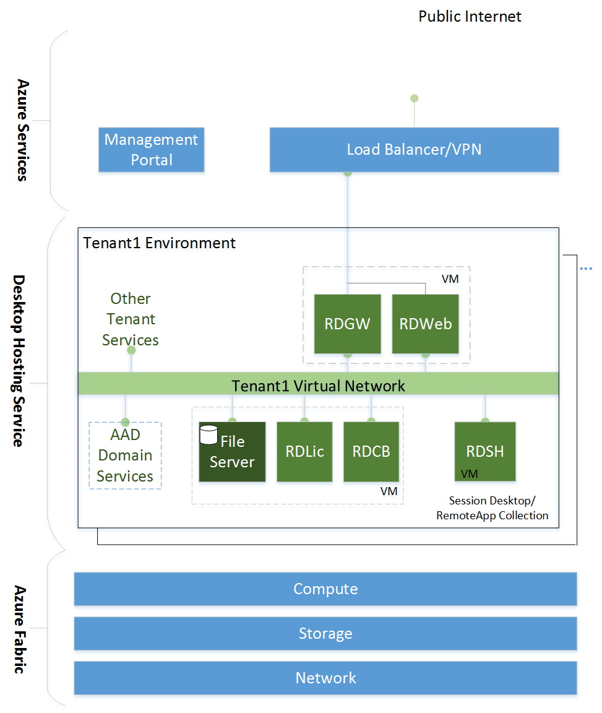
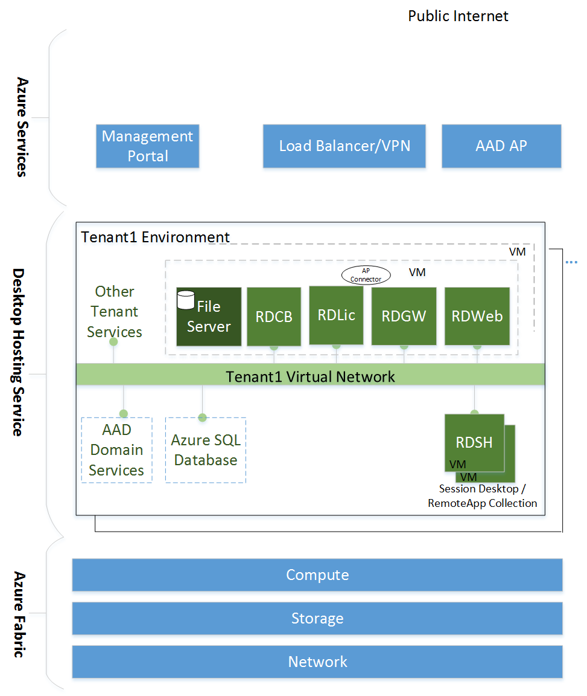

# Desktop hosting logical architecture
A logical architecture diagram of the software components for a basic desktop hosting service in Microsoft Azure is shown in Diagram 1.   
  
  
  
The logical architecture diagram shows a two-layer architecture with the following layer definitions:  
  
- **Desktop Hosting Service**: Virtual machines, networks, and storage that make up the functional service for each tenant.  
- **Azure Services**: Consists of the Azure portal, Load Balancer, VPN gateway, Windows Server operating system instances running the Hyper-V role used to virtualize the physical servers, storage units, networks switches, routers, and so on that make up the Azure Infrastructure Services. Azure Services allow the VMs, networks, storage, and applications to be created independently from underlying hardware.   
  
The basic desktop hosting service can be extended in two ways:  
1.	By adding both desktop and RemoteApp collections  
2.	By duplicating the components, allowing for higher availability and allowing the service to scale out to larger numbers of users  
  
A logical architecture diagram of the software components for an extended desktop hosting service in Microsoft Azure is shown in Diagram 2.  
  
   
  
Both the security of the extended desktop hosting service and the overall footprint of the deployment can be improved by utilizing Azure Active Directory Application Proxy (AAD Application Proxy). With AAD Application Proxy, users connect to the reverse-proxy solution hosted by Azure, removing the requirement of internet-facing RD Web and Gateway servers. A logical architecture diagram of the software components for an extended desktop hosting service with AAD Application Proxy in Microsoft Azure is shown in Diagram 3.  
  
  

