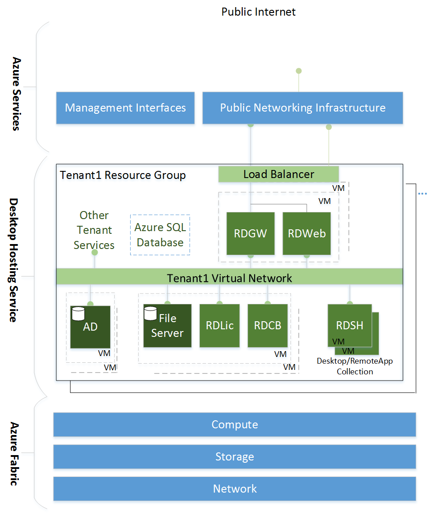
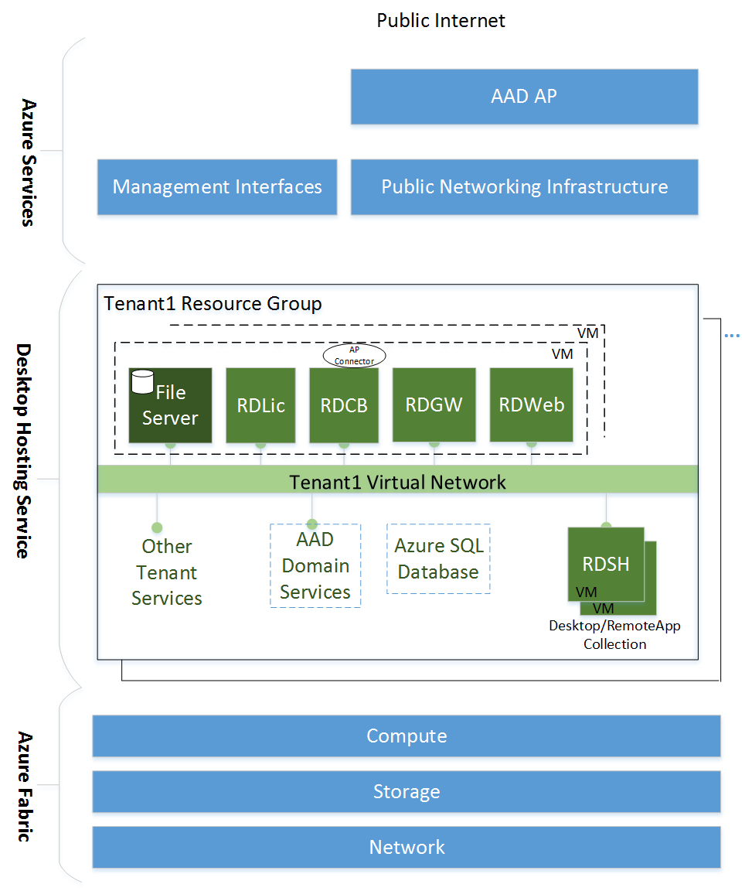

# Desktop hosting logical architecture

>Applies To: Windows Server 2016

A logical architecture diagram of the software components for a basic desktop hosting service in Microsoft Azure is shown in Diagram 1.   
  
  
  
The logical architecture diagram shows a two-layer architecture with the following layer definitions:  
  
- **Desktop Hosting Service**: Virtual machines, networks, and storage that make up the functional service for each tenant.  
- **Azure Services**: Consists of the Azure portal, along with all of the components (load balancers, storage units, networks switches, etc.) that make up the Azure Infrastructure Services. Azure Services allow the VMs, networks, storage, and applications to be created independently from underlying hardware.   
  
You can extend the basic desktop hosting service in two ways:

1.  By adding both desktop and RemoteApp collections
2.  By duplicating the components, allowing for higher availability and allowing the service to scale out to larger numbers of users  
  
A logical architecture diagram of the software components for an extended desktop hosting service in Microsoft Azure is shown in Diagram 2.  
  
   
  
For tenants with small numbers of users, you can reduce the overall deployment footprint and maintain the same secure environment with the help of two Azure services:

1. **Azure Active Directory Domain Services (AAD Domain Services)**: Creates a domain and domain controllers based on the tenant's Azure Active Directory, meaning you maintain less VMs but have the same management experience you see in Azure AD.
2. **Azure Active Directory Application Proxy (AAD AP)**: Acts as a reverse proxy which maintains a permanent connection originating from the virtual machine running RD Web and RD Gateway, allowing you to collocate these roles with the RD Connection Broker and reduce the overall number of virtual machines in the environment.  

A logical architecture diagram of the software components for an extended desktop hosting service with a reduced footprint in Microsoft Azure is shown in Diagram 3.  
  
  

