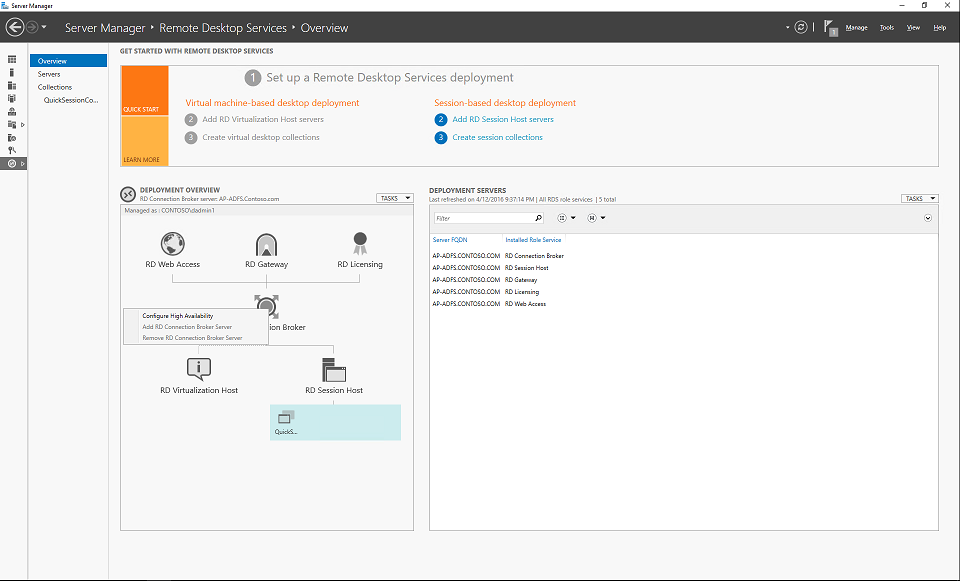
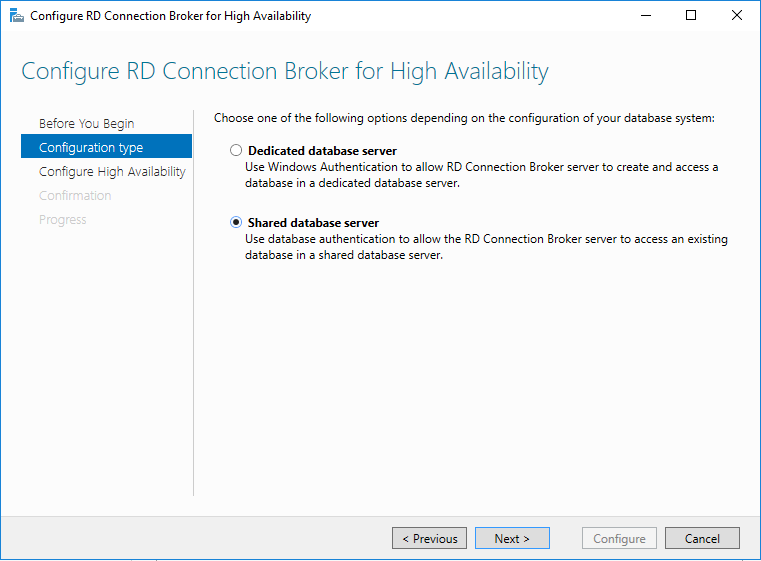
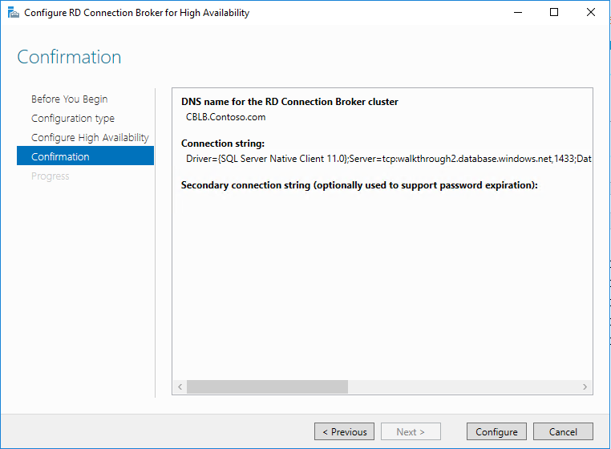

# Use an Azure SQL database to enable high availability for your Connection Broker

>Applies To: Windows Server 2016

The following article demonstrates the steps necessary to use Azure SQL Database to create a highly available environment for the Remote Desktop Connection Broker in a Remote Desktop Services (RDS) deployment. These steps serve to outline the new capabilities and features of RDS in Windows Server 2016 and do not highlight all of the steps necessary for end-to-end configuration of high availability; for a full list of steps, see [Add the RD Connection Broker server to the deployment and configure high availability](Add-the-RD-Connection-Broker-server-to-the-deployment-and-configure-high-availability.md).  
  
1. [Create an Azure SQL database](Create-an-Azure-SQL-database-for-the-RD-Connection-Broker.md).  
2. [Configure load balancing](#configure-load-balancing).  
3. [Configure high availability](#configure-high-availability).  
  
## Configure load balancing  
  
In order for the RD Connection Broker machines to be highly available, they must be in a load-balanced set. There are multiple ways to do this:   
1. [DNS Round Robin](https://technet.microsoft.com/library/cc772506.aspx)   
2. [Azure Load Balancer](https://azure.microsoft.com/documentation/articles/load-balancer-get-started-ilb-arm-portal/)   
  
After configuring a load-balancing mechanism, ensure the following:   
  
1. A DNS entry exists in the DNS records with the name for the RD Connection Broker cluster. With the Azure Load Balancer, you may need to manually create a DNS record with the static IP address   
  
2. The RD Connection Broker cluster name can resolve to the IP address for each RD Connection Broker in the deployment   
  
## Configure high availability  
  
With an Azure SQL Database deployed and load-balancing configured for the RD Connection Broker machines, connect to the machine that currently manages the RDS deployment, which is typically the first RD connection broker machine. use the following steps to configure high availability:  
  
1. In Server Manager, click **Remote Desktop Services > Overview**. Right-click the RD Connection Broker icon in the **Deployment Overview** section, and then click **Configure High Availability**.    
  
2. Skip the **Before you Begin** page. On the **Configuration type** page, select **Shared database server** to let your Connection Broker connect to the Azure SQL database. Then click **Next**.    
    
3. On the Configure High Availability page, enter the following data, and then click **Next**:  
- DNS name for the RD Connection Broker cluster: The DNS name that routes to the Azure load balancer or the DNS name used in DNS round-robin.  
- Connection string: The connection string for the database. See step 2 in [Create an Azure SQL database](Create-an-Azure-SQL-database-for-the-RD-Connection-Broker.md) for more information.   
  
    > [!NOTE]
    > Replace *your_password_here* with the administrative password.    
        
      
3. You may see a warning regarding the DNS name when using an Azure Load Balancer. Double-check that the name of the record for the RD Connection Broker cluster corresponds to the IP address of the Azure Load Balancer. After doing so, you can safely ignore the warning. Click **Configure**.  
   
  
When the deployment is complete, you'll see the updated deployment in Server Manager:  

