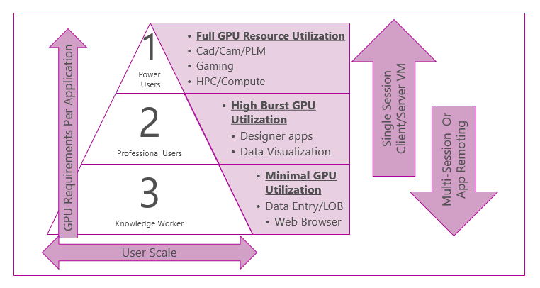
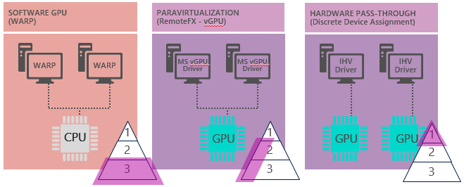

# Which graphics virtualization technology is right for you?

You have a range of options when it comes to enabling graphics rendering in Remote Desktop Services. When you are planning your virtualization environment, the following considerations drive which graphics rendering technology you choose:

In Windows Server 2016, you have two graphics virtualization technologies available with Hyper-V that let you leverage the GPU hardware:

- [Discrete Device Assignment (DDA)](#discrete-device-assignment) - For the highest performance using one or more GPUs dedicated to a VM providing native GPU driver support inside the VM. The density is low because it is limited by the number of physical GPUs available in the server. 
- [Remote FX vGPU](#remotefx-vgpu-improvements-in-windows-server-2016) - For knowledge worker and high-burst GPU scenarios where multiple VMs leverage one or more GPUs through para-virtualization. This solution provides higher user density per server.

The following illustration shows the graphics virtualization options in Windows Server 2016.

## Discrete Device Assignment
Discrete Device Assignment (DDA) is a new hardware pass-through solution that provides the best performance, given that the VM has full access to the GPU using the native driver. Your VM user can access the full capabilities of their device as well the device’s native driver. This means the features and capabilities of running the device in a VM mirror running the same device on bare metal.

For more information about DDA, check out [Plan for deploying Discrete Device Assignment](../hyper-v/plan/plan-for-deploying-devices-using-discrete-device-assignment.md).

## RemoteFX vGPU improvements in Windows Server 2016
RemoteFX vGPU was introduced in Windows Server 2008 R2 and initially focused on delivering typical knowledge worker scenarios (see the first graphic above). Windows Server 2016 provides further enhancements for GPU burst scenarios, for example for designer applications and data visualization. We've also enhanced application compatibility with OpenGL/CL support. Windows Server 2016 added the following new features to RemoteFX vGPU.

For installation and configuration steps, see [Set up and configure RemoteFX vGPU for Remote Desktop Services](rds-remotefx-vgpu.md).

### OpenGL 4.4 and OpenCL 1.1 API support 
Before Windows Server 2016, running a virtual machine on Hyper-V limited you to OpenGL 1.1 with CPU acceleration and no support for OpenCL regardless of the presence of a capable GPU. This limited delivering a virtual desktop for users with applications like Adobe Photoshop, Autodesk Maya, Blender, and SideFX Houdini, which require the OpenCL APIs. With a capable GPU on a Hyper-V host, RemoteFX vGPU now delivers support for OpenGL up to version 4.4 and OpenCL 1.1 in a Windows virtual machine. Some OpenGL applications like Adobe Photoshop include features that use OpenCL for compute/GPGPU tasks, which is now supported. 

> [!NOTE] 
> Some GPU vendors may limit access to OpenGL APIs to their professional line of GPUs, based on detection of a virtual environment. Contact your GPU vendor for more information. 

### Configurable, larger dedicated video memory 

In Windows Server 2012 R2, the RemoteFX video adapter was limited to a maximum of 256MB dedicated VRAM. The amount of dedicated VRAM was also tied to the number of monitors and resolution. Windows Server 2016 decouples this - you can now increase VRAM without assigning specific resolutions or number of monitors. VRAM for the RemoteFX vGPU VM is backed by system memory and is therefore not the same as the VRAM available on the physical GPU. 

In addition, the 256MB of dedicated VRAM limit caused some applications to limit features or disable hardware acceleration because of insufficient dedicated video memory. For instance, Adobe Photoshop requires a minimum of 512MB to enable hardware acceleration. Some applications may check for minimum VRAM and if condition is not met will simply revert to Software Rendering. The increased VRAM support in Windows Server 2016 unblocks these applications. 

The RemoteFX adapter now provides two capabilities in regard to VRAM:  

- A larger dedicated VRAM amount (currently up to 1GB) – You can now configure a VM to obtain up to 1GB of dedicated video memory. Depending on the amount of system memory assigned to the VM, this can provide up to a total of 2GB of VRAM (1GB dedicated and 1GB shared).
   > [!NOTE] 
   > When 1GB dedicated VRAM is required, for best results, use a 64-bit guest VM instead of 32-bit (x86).

- Configurable dedicated VRAM – Previously, VRAM for a VM was set dynamically based on the number of monitors and resolution configured for a VM. Dedicated VRAM can now be configured independent of a VMs number of monitors or resolution.  

### Support for Windows Server 2016 as Guest VM 

If you want to make available applications that require RemoteFX vGPU and higher density, you can do so by using Windows Server 2016 as your Guest VM. 

> [!NOTE] 
> Remote Desktop Session Host is not supported in this scenario, only 1 session can be hosted per Windows Server 2016 guest VM. 

### Support for Generation 2 VMs 

Windows Server 2016 added support for Generation 2 VMs - this gives you access to features like Secure Boot, UEFI Firmware support, boot from SCSI hard disk (VHDX). Support is only available for Windows 10 or Windows Server 2016 Guest VMs with RemoteFX vGPU. 

See [Should I create a generation 1 or 2 virtual machine in Hyper-V?](../hyper-v/plan/should-i-create-a-generation-1-or-2-virtual-machine-in-hyper-v.md) for more information.

### Improved frame rate and reduced jitter with AVC444

Frame throughput has been improved with the H.264/AVC based compression, resulting in a better user experience. You can use this mode with the built-in Windows 10 Remote Desktop Client. 

### Additional performance improvements
 
- Multiple DirectX performance improvements 
- Improved our VM-to-Host transport to use a performant VMBus implementation  
- Stability and application compatibility improvements 
- Added support for Windows Client Hyper-V
- VM Connect Enhanced Session Mode lets you use features such as USB and Clipboard Redirection in VM Connect in combination with a RemoteFX vGPU enabled VM 

## Which should you use?

For the decision to use RemoteFX vGPU or DDA, here are some key considerations:

- Do you need native driver support (for example, Cuda, or anything greater than OpenCL 1.1)? 
- Does your application only support and recognize specific graphics cards for graphics acceleration? 
- Do you want the highest performance possible on the VM for either visualization (VDI, Remote Desktop) or compute (machine learning workloads) workloads? 
 
If you answered yes to any of these questions, DDA might be the preferred option for you. Otherwise, RemoteFX vGPU might work best for you to scale out your graphics virtualization to a wider base of users.