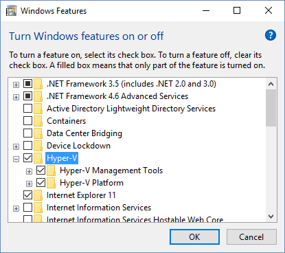

# Set up and configure RemoteFX vGPU for Remote Desktop Services


The vGPU feature of RemoteFX makes it possible for multiple virtual machines to share a physical graphics adapter. The virtual machines are able to offload rendering of graphic information from the processor to the dedicated graphics adapter. This will decrease the CPU load and improve the scalability for graphic intense workloads that run in the VDI virtual machines. 

## RemoteFX vGPU requirements

Requirements for host systems: 

- Windows Server 2016 or Windows 10
- DX 11.0 compatible GPU with WDDM 1.2 compatible driver 
- Windows Server RD Virtualization Host role enabled (enables Hyper-V Role) 
- Server with a CPU that supports SLAT (Second Level Address Translation) 

Guest VM requirements:

- Guest VM running a Windows Enterprise client (Windows 7 with Service Pack 1, Windows 8.1, Windows 10) or Windows Server (Windows Server 2012 R2 or Windows Server 2016). For additional OS support see [Supported configuration for Remote Desktop Services](rds-supported-config.md).

Additional considerations for guest VMs:

- OpenGL and OpenCL functionality is only available in Windows 10 or Windows Server 2016.  
- DirectX 11.0 is only available with Windows 8 or newer guest VMs. 
- Remote Desktop Session Host is only supported with RemoteFX vGPU if it is running as a [personal session desktop](rds-personal-session-desktops.md).

For guest VMS, make sure to review [VDI deployment - supported guest OSs](rds-supported-config.md#vdi-deployment--supported-guest-oss).

## Install RemoteFX vGPU

Use the following steps to install and configure RemoteFX on the host for Windows Server 2016 and Windows 10:

1. Install the operating system.
2. Install the latest Windows 10/Windows Server 2016 GPU drivers available from the graphics card vendor site.
3. Install RemoteFX vGPU on the Windows 10/Windows Server 2016 host:
   1. On a Windows 10 host, enable the Hyper-V feature in the Control Panel (go to Control Panel/Programs and Features/Turn Windows Features on or off):

      

   2. On a Windows Server 2016 host, install the Remote Desktop Virtualization Host (RDVH) role.
   

4. Now, create and configure a guest VM:
   1. Create a VM with Windows 10 Enterprise or Windows Server 2016.
   2. Add the RemoteFX 3D graphics adapter. See [Configure the RemoteFX vGPU 3D adapter](#configure-the-remotefx-vgpu-3d-adapter) for information on how to do that with either Hyper-V Manager or PowerShell cmdlets. 

RemoteFX vGPU will use all GPUs when there are more than one available. However, in certain cases you might want to limit which GPUs are used by RemoteFX. In the Hyper-V environment, you control this by specifically selecting which GPUs should *not* be used by RemoteFX. Use the following steps: 

   1. Navigate to the Hyper-V settings in Hyper-V Manager.
   2. Click **Physical GPUs** in Hyper-V Settings.
   3. Select the GPU that you don’t want to use, and then clear **Use this GPU with RemoteFX**.


### Configure the RemoteFX vGPU 3D adapter
You can use either the Hyper-V Manager UI or PowerShell cmdlets to configure the RemoteFX vGPU 3D graphics adapter. 

#### Through Hyper-V Manager:

1. Ensure the system has been set up with Hyper-V and has a VM configured.  
2. Stop the VM, if it is running. 
3. In Hyper-V Manager navigate to the **VM Settings**, and then click **Add Hardware**.
4. Select **RemoteFX 3D Graphics Adapter**, and click **Add**. 
5. Set the maximum number of monitors, maximum monitor resolution, and dedicated video memory, or leave the default values.

   > [!NOTE]
   > Setting higher values for any of these options will have impact to scale, so you should only set what is absolutely necessary. 
6. Click **OK** to finish the configuration.

#### With PowerShell cmdlets:

Run the following cmdlets to add, review, and configure the adapter: 

```powershell
Add-VMRemoteFx3dVideoAdapter [-CimSession <CimSession[]>] [-ComputerName <String[]>] [-Credential <PSCredential[]>] [-VMName] <String[]> [-Passthru] [-WhatIf] [-Confirm] [<CommonParameters>]
```

For details see [Add-VMRemoteFx3dVideoAdapter](https://technet.microsoft.com/itpro/powershell/windows/hyper-v/add-vmremotefx3dvideoadapter).

```powershell
Get-VMRemoteFx3dVideoAdapter [-CimSession <CimSession[]>] [-ComputerName <String[]>]  [-Credential <PSCredential[]>] [-VMName] <String[]> [<CommonParameters>]
```

For details see [Get-VMRemoteFx3dVideoAdapter](https://technet.microsoft.com/itpro/powershell/windows/hyper-v/get-vmremotefx3dvideoadapter)

```powershell
Set-VMRemoteFx3dVideoAdapter [-CimSession <CimSession[]>] [-ComputerName <String[]>] [-Credential <PSCredential[]>] [-VMName] <String[]> [[-MonitorCount] <Byte>] [[-MaximumResolution] <String>] [[-VRAMSizeBytes] <UInt64>] [-Passthru] [-WhatIf] [-Confirm] [<CommonParameters>]
```

For details see [Set-VMRemoteFx3dVideoAdapter](https://technet.microsoft.com/itpro/powershell/windows/hyper-v/set-vmremotefx3dvideoadapter).

Run the following cmdlet to review the physical GPUs:

```powershell
Get-VMRemoteFXPhysicalVideoAdapter [-ComputerName <String[]>] [-Credential <PSCredential[]>] [[-Name] <String[]>] [<CommonParameters>]  
```

For details see [Get-VMRemoteFXPhysicalVideoAdapter](https://technet.microsoft.com/itpro/powershell/windows/hyper-v/get-vmremotefxphysicalvideoadapter).

## Monitor performance

The performance and scale of a VDI system are determined by a variety of factors such as GPU’s total memory, amount of system memory and memory speed, number of CPU cores and CPU clock frequency, storage speed, and NUMA implementation.

Remote vGPU support in RDS includes the following performance counters, which you can view in Performance Monitor (perfmon.exe) to gather information about frame rate throughput.

- RemoteFX Graphics - counters for Remote Desktop Protocol graphics compression. For example, if you want to look at the number of frames being presented to RDP for compression, look at the **Input Frames/Second** counter.
- RemoteFX Network - counters for Remote Desktop Protocol network traffic. For example, **Round Trip Time (RTT)**.
- RemoteFX Root GPU Management - Measures VRAM available and reserved.
- RemoteFX Software - Provides counters for capture rate, GPU response time, and others.

For more low-level performance monitoring, particularly for troubleshooting, you can use the following additional performance counters:

- RemoteFX Synth3D VSC VM Device 
- RemoteFX Synth3D VSC VM Transport Channel 
- RemoteFX Synth3D VSP 
- RemoteFX Synth3D VSP VM Device 
- RemoteFX Synth3D VSP VM Channel
