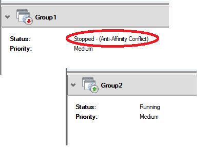

# Cluster affinity

> Applies to: Windows Server 2019, Windows Server 2016

A failover cluster can hold numerous roles that can move between nodes and run.  There are times when certain roles (i.e. virtual machines, resource groups, etc) should not run on the same node.  This could be due to resource consumption, memory usage, etc.  For example, there are two virtual machines that are memory and CPU intensive and if the two virtual machines are running on the same node, one or both of the virtual machines could have performance impact issues.  This article will explain cluster antiaffinity levels and how you can use them.

## What is Affinity and AntiAffinity?

Affinity is a rule you would set up that establishes a relationship between two or more roles (i,e, virtual machines, resource groups, etc) to keep them together.  AntiAffinity is the same but is used to try and keep the specified roles apart from each other.  Failover Clusters use AntiAffinity for its roles.  More specifically, the [AntiAffinityClassNames](https://docs.microsoft.com/previous-versions/windows/desktop/mscs/groups-antiaffinityclassnames) parameter defined on the roles so they do not run on the same node.  

## AntiAffinityClassnames

When looking at the properties of a group, there is the parameter AntiAffinityClassNames and it is blank as a default.  In the examples below, Group1 and Group2 should be separated from running on the same node.  To view the property, the PowerShell command and result would be:

    PS> Get-ClusterGroup Group1 | fl AntiAffinityClassNames
    AntiAffinityClassNames : {}

    PS> Get-ClusterGroup Group2 | fl AntiAffinityClassNames
    AntiAffinityClassNames : {}

Since AntiAffinityClassNames are not defined as a default, these roles can run together or apart.  The goal is to keep them to be separated.  The value for AntiAffinityClassNames can be whatever you want them to be, they just have to be the same.  Say that Group1 and Group2 are domain controllers running in virtual machines and they would be best served running on different nodes.  Since these are domain controllers, I will use DC for the class name.  To set the value, the PowerShell command and results would be:

    PS> $AntiAffinity = New-Object System.Collections.Specialized.StringCollection
    PS> $AntiAffinity.Add("DC")
    PS> (Get-ClusterGroup -Name "Group1").AntiAffinityClassNames = $AntiAffinity
    PS> (Get-ClusterGroup -Name "Group2").AntiAffinityClassNames = $AntiAffinity

    PS> Get-ClusterGroup "Group1" | fl AntiAffinityClassNames
    AntiAffinityClassNames : {DC}

    PS> Get-ClusterGroup "Group2" | fl AntiAffinityClassNames
    AntiAffinityClassNames : {DC}

Now that they are set, failover clustering will attempt to keep them apart.  

The AntiAffinityClassName parameter is a "soft" block.  Meaning, it will try to keep them apart, but if it cannot, it will still allow them to run on the same node.  For example, the groups are running on a two-node failover cluster.  If one node needs to go down for maintenance, it would mean both groups would be up and running on the same node.  In this case, it would be okay to have this.  It may not be the most ideal, but both virtial machines will still running within acceptable performance ranges.

## I need more

As mentioned, AntiAffinityClassNames is a soft block.  But what if a hard block is needed?  The virtual machines cannot be run on he same node; otherwise, performance impact will occur and cause some services to possibly go down.

For those cases, there is an additional cluster property of ClusterEnforcedAntiAffinity.  This antiaffinity level will prevent at all costs any of the same AntiAffinityClassNames values from running on the same node.

To view the property and value, the PowerShell command (and result) would be:

    PS> Get-Cluster | fl ClusterEnforcedAntiAffinity
    ClusterEnforcedAntiAffinity : 0

The value of "0" means it is disabled and not to be enforced.  The value of "1" enables it and is the hard block.  To enable this hard block, the command (and result) is:

    PS> (Get-Cluster).ClusterEnforcedAntiAffinity = 1
    ClusterEnforcedAntiAffinity : 1

When both of these are set, the group will be prevented from coming online together.  If they are on the same node, this is what you would see in Failover Cluster Manager.

In a PowerShell listing of the groups, you would see this:

    PS> Get-ClusterGroup

    Name       State
    ----       -----
    Group1     Offline(Anti-Affinity Conflict)
    Group2     Online

## Additional Comments

- Ensure you are using the proper AntiAffinity setting depending on the needs.
- Keep in mind that in a two-node scenario and ClusterEnforcedAntiAffinity, if one node is down, both groups will not run.  

- The use of Preferred Owners on groups can be combined with AntiAffinity in a three or more node cluster.
- The AntiAffinityClassNames and ClusterEnforcedAntiAffinity settings will only take place after a recycling of the resources. I.E. you can set them, but if both groups are online on the same node when set, they will both continue to remain online.

