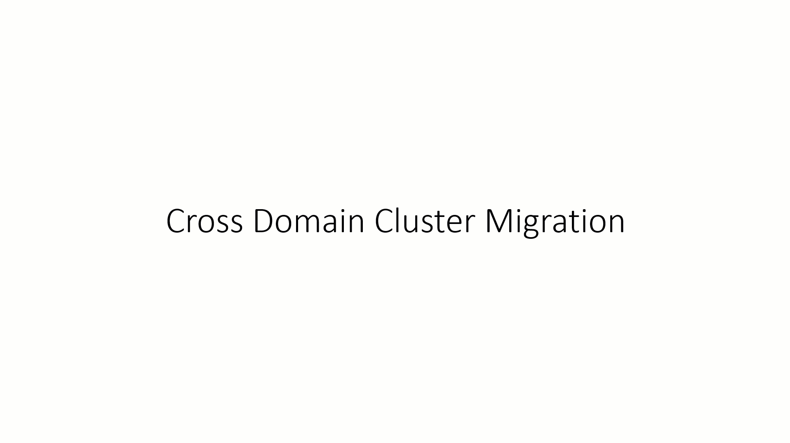

# Failover Cluster domain migration

> Applies to: Windows Server 2019, Windows Server 2016

This topic provides an overview for moving Windows Server failover clusters from one domain to another.

## Why migrate between domains

There are several scenarios where migrating a cluster from one doamin to another is necessary.

- CompanyA merges with CompanyB and must move all clusters into CompanyA domain
- Clusters are built in the main datacenter and shipped out to remote locations
- Cluster was built as a workgroup cluster and now needs to be part of a domain
- Cluster was built as a domain cluster and now needs to be part of a workgroup
- Cluster is being moved to one area of the company to another and is a different subdomain

Microsoft doesn't provide support to administrators who try to move resources from one domain to another if the underlying application operation is unsupported. For example, Microsoft doesn't provide support to administrators who try to move a Microsoft Exchange server from one domain to another.

   > [!WARNING]
   > We recommend that you perform a full backup of all shared storage in the cluster before you move the cluster.

## Windows Server 2016 and earlier

In Windows Server 2016 and earlier, the Cluster service didn't have the capability of moving from one domain to another.  This was due to the increased dependence on Active Directory Domain Services and the virtual names created.   

## Options

In order to do such a move, there are two options.

The first option involves destroying the cluster and rebuilding it in the new domain.


As the animation shows, this option is destructive with the steps being:

1. Destroy the Cluster.
2. Change the domain membership of the nodes into the new domain.
3. Recreate the Cluster as new in the updated domain.  This would entail having to recreate all the resources.

The second option is less destructive but requires additional hardware as a new cluster would need to be built in the new domain.  Once the cluster is in the new domain, run the Cluster Migration Wizard to migrate the resources. Note that this doesn't migrate data - you'll need to use another tool to migrate data, such as [Storage Migration Service](../storage/storage-migration-service/overview.md)(once cluster support is added).


As the animation shows, this option is not destructive but does require either different hardware or a node from the existing cluster than has been removed.

1. Create a new clusterin the new domain while still having the old cluster available.
2. Use the [Cluster Migration Wizard](https://docs.microsoft.com/previous-versions/windows/it-pro/windows-server-2008-R2-and-2008/cc754481(v=ws.10)) to migrate all the resources to the new cluster. Reminder, this does not copy data, so will need to be done separately.
3. Decommission or destroy the old cluster.

In both options, the new cluster would need to have all [cluster-aware applications](https://technet.microsoft.com/aa369082(v=vs.90)) installed, drivers all up-to-date, and possibly testing to ensure all will run properly.  This is a time consuming process if data also needs to be moved.

## Windows Server 2019

In Windows Server 2019, we introduced cross cluster domain migration capabilities.  So now, the scenarios listed above can easily be done and the need of rebuilding is no longer needed.  

Moving a cluster from one domain is a straight-forward process. To accomplish this, there are two new PowerShell commandlets.

**New-ClusterNameAccount** – creates a Cluster Name Account in Active Directory
**Remove-ClusterNameAccount** – removes the Cluster Name Accounts from Active Directory

The process to accomplish this is to change the cluster from one domain to a workgroup and back to the new domain.  The need to destroy a cluster, rebuild a cluster, install applications, etc is not a requirement. For example, it would look like this:



## Migrating a cluster to a new domain

In the following steps, a cluster is being moved from the Contoso.com domain to the new Fabrikam.com domain.  The cluster name is *CLUSCLUS* and with a file server role called *FS-CLUSCLUS*.

1. Create a local Administrator account with the same name and password on all servers in the cluster.  This may be needed to log in while the servers are moving between domains.
2. Sign in to the first server with a domain user or administrator account that has Active Directory permissions to the Cluster Name Object (CNO), Virtual Computer Objects (VCO), has access to the Cluster, and open PowerShell.
3. Ensure all Cluster Network Name resources are in an Offline state and run the below command.  This command will remove the Active Directory objects that the cluster may have.

   ```PowerShell
   Remove-ClusterNameAccount -Cluster CLUSCLUS -DeleteComputerObjects
   ```
4. Use Active Directory Users and Computers to ensure the CNO and VCO computer objects associated with all clustered names have been removed.

   > [!NOTE]
   > It's a good idea to stop the Cluster service on all servers in the cluster and set the service startup type to Manual so that the Cluster service doesn't start when the servers are restarting while changing domains.

   ```PowerShell
   Stop-Service -Name ClusSvc

   Set-Service -Name ClusSvc -StartupType Manual
   ```

5. Change the servers' domain membership to a workgroup, restart the servers, join the servers to the new domain, and restart again.
6. Once the servers are in the new domain, sign in to a server with a domain user or administrator account that has Active Directory permissions to create objects, has access to the Cluster, and open PowerShell. Start the Cluster Service, and set it back to Automatic.

   ```PowerShell
   Start-Service -Name ClusSvc

   Set-Service -Name ClusSvc -StartupType Automatic
   ```
7. Bring the Cluster Name and all other cluster Network Name resources to an Online state.

   ```PowerShell
   Start-ClusterResource -Name "Cluster Name"

   Start-ClusterResource -Name FS-CLUSCLUS
   ```

8. Change the cluster to be a part of the new domain with associated active directory objects. To do this, the command is below and the network name resources must be in an online state.  What this command will do is recreate the name objects in Active Directory.

   ```PowerShell
   New-ClusterNameAccount -Name CLUSTERNAME -Domain NEWDOMAINNAME.com -UpgradeVCOs
   ```

    NOTE: If you do not have any additional groups with network names (i.e. a Hyper-V Cluster with only virtual machines), the -UpgradeVCOs parameter switch is not needed.

9. Use Active Directory Users and Computers to check the new domain and ensure the associated computer objects were created. If they have, then bring the remaining resources in the groups online.

   ```PowerShell
   Start-ClusterGroup -Name "Cluster Group"

   Start-ClusterGroup -Name FS-CLUSCLUS
   ```

## Known issues

If you are using the new USB witness feature, you will be unable to add the cluster to the new domain.  The reasoning is that the file share witness type must utilize Kerberos for authentication.  Change the witness to none before adding the cluster to the domain.  Once it is completed, recreate the USB witness.  The error you will see is:

```
New-ClusternameAccount : Cluster name account cannot be created.  This cluster contains a file share witness with invalid permissions for a cluster of type AdministrativeAccesssPoint ActiveDirectoryAndDns. To proceed, delete the file share witness.  After this you can create the cluster name account and recreate the file share witness.  The new file share witness will be automatically created with valid permissions.
```

