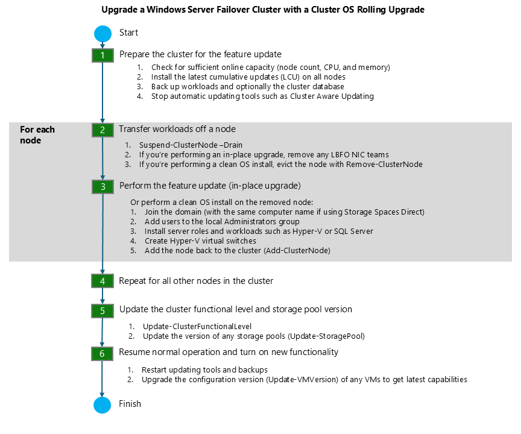

# Cluster operating system rolling upgrade

>Applies to: Windows Server 2022, Windows Server 2019, Windows Server 2016

Cluster OS Rolling Upgrade enables an administrator to upgrade the operating system of cluster nodes Hyper-V or Scale-Out File Server workloads without stopping them. Using this feature, the downtime penalties against Service Level Agreements (SLA) can be avoided.

Cluster OS Rolling Upgrade provides the following benefits:

- Failover clusters running Hyper-V virtual machine and Scale-out File Server (SOFS) workloads can be upgraded from a version of Windows Server, starting with Windows Server 2012 R2, to a newer version of Windows Server. For example you can upgrade Windows Server 2016 (running on all cluster nodes of the cluster) to Windows Server 2019 (running on all nodes in the cluster) without downtime.
- It doesn't require any additional hardware. In small clusters, you can add additional cluster nodes temporarily to improve availability of the cluster during the Cluster OS Rolling Upgrade process.
- The cluster doesn't need to be stopped or restarted.
- A new cluster is not required. The existing cluster is upgraded. In addition, existing cluster objects stored in Active Directory are used.
- The upgrade process is reversible until the final step, when all cluster nodes are running the newer version of Windows Server and the `Update-ClusterFunctionalLevel` PowerShell cmdlet is run.
- The cluster can support patching and maintenance operations while running in the mixed-OS mode.
- It supports automation via PowerShell and WMI.
- The cluster public property *ClusterFunctionalLevel* property indicates the state of the cluster on Windows Server 2016 and later cluster nodes. This property can be queried using the PowerShell cmdlet from a cluster node that belongs to a failover cluster:

    ```PowerShell
    Get-Cluster | Select ClusterFunctionalLevel
    ```

    The table below shows the values and each corresponding functional level:

    | Value | Functional level |
    |--|--|
    | 8 | Windows Server 2012 R2 |
    | 9 | Windows Server 2016 |
    | 10 | Windows Server 2019 |

This guide describes the various stages of the Cluster OS Rolling Upgrade process, installation steps, feature limitations, and frequently asked questions (FAQs), and is applicable to the following Cluster OS Rolling Upgrade scenarios in Windows Server:

- Hyper-V clusters
- Scale-Out File Server clusters

The following scenario is not supported:

- Cluster OS Rolling Upgrade of guest clusters using virtual hard disk (.vhdx file) as shared storage.

Cluster OS Rolling Upgrade is fully supported by System Center Virtual Machine Manager (SCVMM). If you are using SCVMM, see [Perform a rolling upgrade of a Hyper-V host cluster to Windows Server 2016 in VMM](/system-center/vmm/hyper-v-rolling-upgrade?view=sc-vmm-1807&preserve-view=true) for guidance on upgrading the clusters and automating the steps that are described in this document.

## Requirements

Complete the following requirements before you begin the Cluster OS Rolling Upgrade process:

- Start with a Failover Cluster running Windows Server 2012 R2 or newer. You can upgrade to the next version, for example from Windows Server 2016 to Windows Server 2019.
- Verify that the Hyper-V nodes have CPUs that support Second-Level Addressing Table (SLAT) using one of the following methods;
        - Review the [Are you SLAT Compatible? WP8 SDK Tip 01](/archive/blogs/devfish/are-you-slat-compatible-wp8-sdk-tip-01) article that describes two methods to check if a CPU supports SLATs
        - Download the [Coreinfo v3.31](/sysinternals/downloads/coreinfo) tool to determine if a CPU supports SLAT.

## Cluster transition states during Cluster OS Rolling Upgrade

This section describes the various transition states of the Windows Server cluster that is being upgraded to the next version of Windows Server using Cluster OS Rolling Upgrade.

In order to keep the cluster workloads running during the Cluster OS Rolling Upgrade process, moving a cluster workload from a node running an older version of Windows Server to a node running a newer version of Windows Server works by using a compatibility mode. This compatibility mode makes the nodes running the newer version of Windows Server appear as if they are running the the same older version of Windows Server. For example, when upgrading a Windows Server 2016 cluster to Windows Server 2019, Windows Server 2019 nodes operate in a Windows Server 2016 compatibility mode as a temporary measure. A new conceptual cluster mode, called *mixed-OS mode*, allows nodes of different versions to exist in the same cluster (see Figure 1).


**Figure 1: Cluster operating system state transitions**

A Windows Server cluster enters mixed-OS mode when a node running a newer version of Windows Server is added to the cluster. The process is fully reversible at this point - newer Windows Server nodes can be removed from the cluster and nodes running the existing version of Windows Server can be added to the cluster in this mode. The process is not reversible once the `Update-ClusterFunctionalLevel` PowerShell cmdlet is run on the cluster. In order for this cmdlet to succeed, all nodes must be running the newer version of Windows Server, and all nodes must be online.

## Transition states of a four-node cluster while performing Rolling OS Upgrade

This section illustrates and describes the four different stages of a cluster with shared storage whose nodes are upgraded from Windows Server 2012 R2 to Windows Server 2016. The process is the same for later versions of Window Server.

"Stage 1" is the initial state - we start with a Windows Server 2012 R2 cluster.


**Figure 2: Initial State: Windows Server 2012 R2 Failover Cluster (Stage 1)**

In "Stage 2", two nodes have been paused, drained, evicted, reformatted, and installed with Windows Server 2016.


**Figure 3: Intermediate State: Mixed-OS mode: Windows Server 2012 R2 and Windows Server 2016 Failover cluster (Stage 2)**

At "Stage 3", all of the nodes in the cluster have been upgraded to Windows Server 2016, and the cluster is ready to be upgraded with `Update-ClusterFunctionalLevel` PowerShell cmdlet.

> [!NOTE]
> At this stage, the process can be fully reversed, and  Windows Server 2012 R2  nodes can be added to this cluster.


**Figure 4: Intermediate State: All nodes upgraded to Windows Server 2016, ready for Update-ClusterFunctionalLevel (Stage 3)**

After the `Update-ClusterFunctionalLevel` cmdlet is run, the cluster enters "Stage 4", where new Windows Server 2016 cluster features can be used.


**Figure 5: Final State: Windows Server 2016 Failover Cluster (Stage 4)**

## Cluster OS Rolling Upgrade Process

This section describes the workflow for performing Cluster OS Rolling Upgrade.


**Figure 6: Cluster OS Rolling Upgrade Process Workflow**

Cluster OS Rolling upgrade includes the steps below for upgrading from Windows Server 2012 R2 to Windows Server 2016, however the process is the same for later versions of Window Server.

1. Prepare the cluster for the operating system upgrade as follows:
    1. Cluster OS Rolling Upgrade requires removing one node at a time from the cluster. Check if you have sufficient capacity on the cluster to maintain HA SLAs when one of the cluster nodes is removed from the cluster for an operating system upgrade. In other words, do you require the capability to failover workloads to another node when one node is removed from the cluster during  the process of Cluster OS Rolling Upgrade? Does the cluster have the capacity to run the required workloads when one node is removed from the cluster for Cluster OS Rolling Upgrade?
    2. For Hyper-V workloads, check that all Windows Server Hyper-V hosts have CPU support for Second-Level Address Table (SLAT). Only SLAT-capable machines can use the Hyper-V role in Windows Server 2016 and newer.
    3. Check that any workload backups have completed, and consider backing-up the cluster. Stop backup operations while adding nodes to the cluster.
    4. Check that all cluster nodes are online /running/up using the [`Get-ClusterNode`](/powershell/module/failoverclusters/Get-ClusterNode) cmdlet (see Figure 7).

        
        **Figure 7: Determining node status using Get-ClusterNode cmdlet**

    5. If you are running Cluster Aware Updates (CAU), verify if CAU is currently running by using the **Cluster-Aware Updating** UI, or the [`Get-CauRun`](/powershell/module/clusterawareupdating/Get-CauRun) cmdlet (see Figure 8). Stop CAU using the [`Disable-CauClusterRole`](/powershell/module/clusterawareupdating/Disable-CauClusterRole) cmdlet (see Figure 9) to prevent any nodes from being paused and drained by CAU during the Cluster OS Rolling Upgrade process.

        
        **Figure 8: Using the [`Get-CauRun`](/powershell/module/clusterawareupdating/Get-CauRun) cmdlet to determine if Cluster Aware Updates is running on the cluster**

        
        **Figure 9: Disabling the Cluster Aware Updates role using the [`Disable-CauClusterRole`](/powershell/module/clusterawareupdating/Disable-CauClusterRole) cmdlet**

2. For each node in the cluster, complete the following:
    1. Using Cluster Manager UI, select a node and use the **Pause | Drain** menu option to drain the node (see Figure 10) or use the [`Suspend-ClusterNode`](/powershell/module/failoverclusters/Suspend-ClusterNode) cmdlet (see Figure 11).

        
        **Figure 10: Draining roles from a node using Failover Cluster Manager**

        
        **Figure 11: Draining roles from a node using the [`Suspend-ClusterNode`](/powershell/module/failoverclusters/Suspend-ClusterNode) cmdlet**

    2. Using Cluster Manager UI, **Evict** the paused node from cluster, or use the [`Remove-ClusterNode`](/powershell/module/failoverclusters/Remove-ClusterNode) cmdlet.

        
        **Figure 12: Remove a node from the cluster using [`Remove-ClusterNode`](/powershell/module/failoverclusters/Remove-ClusterNode) cmdlet**

    3. Reformat the system drive and perform a "clean operating system install" of Windows Server 2016 on the node using the **Custom: Install Windows only (advanced)** installation (See Figure 13) option in setup.exe. Avoid selecting the **Upgrade: Install Windows and keep files, settings, and applications** option since Cluster OS Rolling Upgrade doesn't encourage in-place upgrade.

        
        **Figure 13: Available installation options for Windows Server 2016**

    4. Add the node to the appropriate Active Directory domain.
    5. Add the appropriate users to the Administrators group.
    6. Using the Server Manager UI or Install-WindowsFeature PowerShell cmdlet, install any server roles that you need, such as Hyper-V.

        ```PowerShell
        Install-WindowsFeature -Name Hyper-V
        ```

    7. Using the Server Manager UI or Install-WindowsFeature PowerShell cmdlet, install the Failover Clustering feature.

        ```PowerShell
        Install-WindowsFeature -Name Failover-Clustering
        ```

    8. Install any additional features needed by your cluster workloads.
    9. Check network and storage connectivity settings using the Failover Cluster Manager UI.
    10. If Windows Firewall is used, check that the Firewall settings are correct for the cluster. For example, Cluster Aware Updating (CAU) enabled clusters may require Firewall configuration.
    11. For Hyper-V workloads, use the Hyper-V Manger UI to launch the Virtual Switch Manager dialog (see Figure 14).

        Check that the name of the Virtual Switch(s) used are identical for all Hyper-V host nodes in the cluster.

        
        **Figure 14: Virtual Switch Manager**

    12. On a Windows Server 2016 node (do not use a Windows Server 2012 R2 node), use the Failover Cluster Manager (see Figure 15) to connect to the cluster.

        
        **Figure 15: Adding a node to the cluster using Failover Cluster Manager**

    13. Use either the Failover Cluster Manager UI or the [`Add-ClusterNode`](/powershell/module/failoverclusters/Add-ClusterNode) cmdlet (see Figure 16) to add the node to the cluster.

        
        **Figure 16: Adding a node to the cluster using [`Add-ClusterNode`](/powershell/module/failoverclusters/Add-ClusterNode) cmdlet**

        > [!NOTE]
        > When the first Windows Server 2016 node joins the cluster, the cluster enters "Mixed-OS" mode, and the cluster core resources are moved to the Windows Server 2016 node. A "Mixed-OS" mode cluster is a fully functional cluster where the new nodes run in a compatibility mode with the old nodes. "Mixed-OS" mode is a transitory mode for the cluster. It is not intended to be permanent and customers are expected to update all nodes of their cluster within four weeks.

    14. After the Windows Server 2016 node is successfully added to the cluster, you can (optionally) move some of the cluster workload to the newly added node in order to rebalance the workload across the cluster as follows:

        
        **Figure 17: Moving a cluster workload (cluster VM role) using [`Move-ClusterVirtualMachineRole`](/powershell/module/failoverclusters/Move-ClusterVirtualMachineRole) cmdlet**

        1. Use **Live Migration** from the Failover Cluster Manager for virtual machines or the [`Move-ClusterVirtualMachineRole`](/powershell/module/failoverclusters/Move-ClusterVirtualMachineRole) cmdlet (see Figure 17) to perform a live migration of the virtual machines.

            ```PowerShell
            Move-ClusterVirtualMachineRole -Name VM1 -Node robhind-host3
            ```

        2. Use **Move** from the Failover Cluster Manager or the [`Move-ClusterGroup`](/powershell/module/failoverclusters/Move-ClusterGroup) cmdlet for other cluster workloads.

3. When every node has been upgraded to Windows Server 2016 and added back to the cluster, or when any remaining Windows Server 2012 R2 nodes have been evicted, do the following:

    > [!IMPORTANT]
    >
    > - After you update the cluster functional level, you cannot go back to Windows Server 2012 R2 functional level and Windows Server 2012 R2 nodes cannot be added to the cluster.
    > - Until the [`Update-ClusterFunctionalLevel`](/powershell/module/failoverclusters/Update-ClusterFunctionalLevel) cmdlet is run, the process is fully reversible and Windows Server 2012 R2 nodes can be added to this cluster and Windows Server 2016 nodes can be removed.
    > - Some cluster operations, such as node drain can lead to a node becoming isolated for a short period of time. This behavior can occur when the [`Update-ClusterFunctionalLevel`](/powershell/module/failoverclusters/Update-ClusterFunctionalLevel) operation hasn't been run.
    > - After the [`Update-ClusterFunctionalLevel`](/powershell/module/failoverclusters/Update-ClusterFunctionalLevel) cmdlet is run, new features will be available.

    1. Using the Failover Cluster Manager UI or the [`Get-ClusterGroup`](/powershell/module/failoverclusters/Get-ClusterGroup) cmdlet, check that all cluster roles are running on the cluster as expected. In the following example, Available Storage is not being used, instead CSV is used, hence, Available Storage displays an **Offline** status (see Figure 18).

        
        **Figure 18: Verifying that all cluster groups (cluster roles) are running using the [`Get-ClusterGroup`](/powershell/module/failoverclusters/Get-ClusterGroup) cmdlet**

    2. Check that all cluster nodes are online and running using the [`Get-ClusterNode`](/powershell/module/failoverclusters/Get-ClusterNode) cmdlet.
    3. Run the [`Update-ClusterFunctionalLevel`](/powershell/module/failoverclusters/Update-ClusterFunctionalLevel) cmdlet - no errors should be returned (see Figure 19).

        
        **Figure 19: Updating the functional level of a cluster using PowerShell**

    4. After the [`Update-ClusterFunctionalLevel`](/powershell/module/failoverclusters/Update-ClusterFunctionalLevel) cmdlet is run, new features are available.

4. Resume normal cluster updates and backups:

    1. If you were previously running CAU, restart it using the CAU UI or use the [`Enable-CauClusterRole`](/powershell/module/clusterawareupdating/Enable-CauClusterRole) cmdlet (see Figure 20).

        
        **Figure 20: Enable Cluster Aware Updates role using the [`Enable-CauClusterRole`](/powershell/module/clusterawareupdating/Enable-CauClusterRole) cmdlet**

    2. Resume backup operations.

5. Enable and use the Windows Server 2016 features on Hyper-V Virtual Machines.

    1. After the cluster has been upgraded to Windows Server 2016 functional level, many workloads like Hyper-V VMs will have new capabilities. For a list of new Hyper-V capabilities. see [Migrate and upgrade virtual machines](../virtualization/hyper-v/deploy/upgrade-virtual-machine-version-in-hyper-v-on-windows-or-windows-server.md)

    2. On each Hyper-V host node in the cluster, use the [`Get-VMHostSupportedVersion`](/powershell/module/hyper-v/Get-VMHostSupportedVersion) cmdlet to view the Hyper-V VM configuration versions that are supported by the host.

        
        **Figure 21: Viewing the Hyper-V VM configuration versions supported by the host**

    3. On each Hyper-V host node in the cluster, Hyper-V VM configuration versions can be upgraded by scheduling a brief maintenance window with users, backing up, turning off virtual machines, and running the [`Update-VMVersion`](/powershell/module/hyper-v/Update-VMVersion) cmdlet (see Figure 22). This will update the virtual machine version, and enable new Hyper-V features, eliminating the need for future Hyper-V Integration Component (IC) updates. This cmdlet can be run from the Hyper-V node that is hosting the VM, or the `-ComputerName` parameter can be used to update the VM Version remotely. In this example, here we upgrade the configuration version of VM1 from 5.0 to 7.0 to take advantage of many new Hyper-V features associated with this VM configuration version such as Production Checkpoints (Application Consistent backups), and binary VM configuration file.

       
       **Figure 22: Upgrading a VM version using the Update-VMVersion PowerShell cmdlet**

6. Storage pools can be upgraded using the [Update-StoragePool](/powershell/module/storage/Update-StoragePool) PowerShell cmdlet - this is an online operation.

Although we are targeting Private Cloud scenarios, specifically Hyper-V and Scale-out File Server clusters, which can be upgraded without downtime, the Cluster OS Rolling Upgrade process can be used for any cluster role.

## Restrictions / Limitations

- This feature works only for versions of Windows Server starting with Windows Server 2012 R2. This feature cannot upgrade earlier versions of Windows Server such as Windows Server 2008, Windows Server 2008 R2, or Windows Server 2012.
- Each Windows Server 2016 node should be reformatted/new installation only. *In-place* or *upgrade* installation types are discouraged.
- A node running the newer version of Windows Server must be used to add the new nodes to the cluster.
- When managing a mixed-OS mode cluster, always perform the management tasks from an up-level node that is running Windows Server 2016. Downlevel Windows Server nodes cannot use UI or management tools against newer versions of Windows Server.
- We encourage customers to move through the cluster upgrade process quickly because some cluster features are not optimized for mixed-OS mode.
- Avoid creating or resizing storage on newer Windows Server nodes while the cluster is running in mixed-OS mode because of possible incompatibilities on failover from a newer Windows Server node to down-level Windows Server nodes.

## Frequently asked questions

**How long can the failover cluster run in mixed-OS mode?**
    We encourage customers to complete the upgrade within four weeks. We have successfully upgraded Hyper-V and Scale-out File Server clusters with zero downtime in less than four hours total.

**Will you port this feature back to Windows Server 2012, Windows Server 2008 R2, or Windows Server 2008?**
    We do not have any plans to port this feature back to previous versions. Cluster OS Rolling Upgrade is our vision for upgrading Windows Server clusters.

**Do the nodes running the older Windows Server version need to have all the software updates installed before starting the Cluster OS Rolling Upgrade process?**
    Yes, before starting the Cluster OS Rolling Upgrade process, verify that all cluster nodes are updated with the latest software updates.

**Can I run the [`Update-ClusterFunctionalLevel`](/powershell/module/failoverclusters/Update-ClusterFunctionalLevel) cmdlet while nodes are Off or Paused?**
    No. All cluster nodes must be on and in active membership for the [`Update-ClusterFunctionalLevel`](/powershell/module/failoverclusters/Update-ClusterFunctionalLevel) cmdlet to work.

**Does Cluster OS Rolling Upgrade work for any cluster workload? Does it work for SQL Server?**
    Yes, Cluster OS Rolling Upgrade works for any cluster workload. However, it is only zero-downtime for Hyper-V and Scale-out File Server clusters. Most other workloads incur some downtime (typically a couple of minutes) when they failover, and failover is required at least once during the Cluster OS Rolling Upgrade process.

**Can I automate this process using PowerShell?**
    Yes, we have designed Cluster OS Rolling Upgrade to be automated using PowerShell.

**For a large cluster that has extra failover capacity, can I upgrade multiple nodes simultaneously?**
    Yes. When one node is removed from the cluster to upgrade the OS, the cluster will have one less node for failover, hence will have a reduced failover capacity. For large clusters with enough workload and failover capacity, multiple nodes can be upgraded simultaneously. You can temporarily add cluster nodes to the cluster to provide improved workload and failover capacity during the Cluster OS Rolling Upgrade process.

**What if I discover an issue in my cluster after [`Update-ClusterFunctionalLevel`](/powershell/module/failoverclusters/Update-ClusterFunctionalLevel) has been run successfully?**
    If you have backed-up the cluster database with a System State backup before running [`Update-ClusterFunctionalLevel`](/powershell/module/failoverclusters/Update-ClusterFunctionalLevel), you should be able to perform an Authoritative restore on a node running the previous version of Windows Server and restore the original cluster database and configuration.

**Can I use in-place upgrade for each node instead of using clean-OS install by reformatting the system drive?**
    We do not encourage the use of in-place upgrade of Windows Server, but we are aware that it works in some cases where default drivers are used. Please carefully read all warning messages displayed during in-place upgrade of a cluster node.

**If I am using Hyper-V replication for a Hyper-V VM on my Hyper-V cluster, will replication remain intact during and after the Cluster OS Rolling Upgrade process?**
    Yes, Hyper-V replica remains intact during and after the Cluster OS Rolling Upgrade process.

**Can I use System Center Virtual Machine Manager (SCVMM) to automate the Cluster OS Rolling Upgrade process?**
    Yes, you can automate the Cluster OS Rolling Upgrade process using VMM in System Center.
