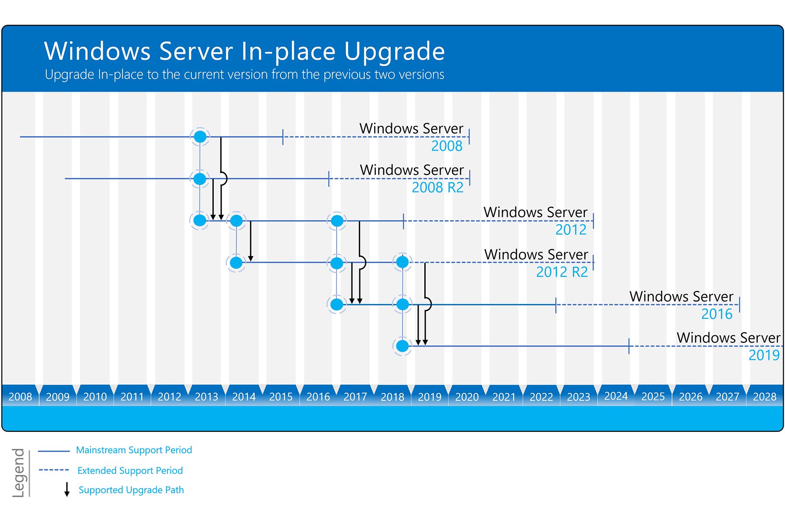
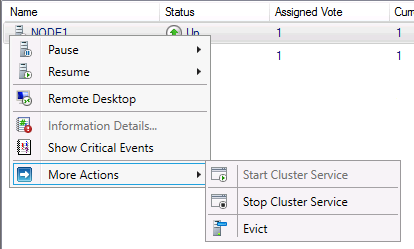
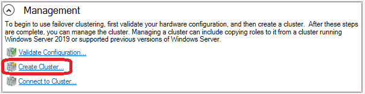
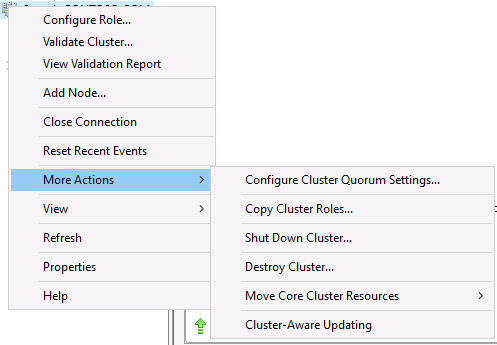
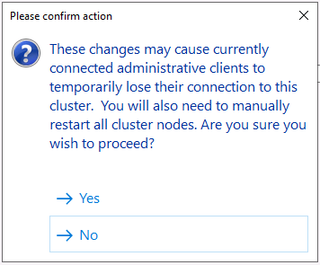

# Upgrading Failover Clusters on the same hardware

> Applies to: Windows Server 2019, Windows Server 2016

A failover cluster is a group of independent computers that work together to increase the availability of applications and services. The clustered servers (called nodes) are connected by physical cables and by software. If one of the cluster nodes fails, another node begins to provide service (a process known as failover). Users experience a minimum of disruptions in service.

This guide describes the steps for upgrading the cluster nodes to Windows Server 2019 or Windows Server 2016 from an earlier version using the same hardware.

## Overview

Upgrading the operating system on an existing failover cluster is only supported when going from Windows Server 2016 to Windows 2019.  If the failover cluster is running an earlier version, such as Windows Server 2012 R2 and earlier, upgrading while the cluster services are running will not allow joining nodes together.  If using the same hardware, steps can be taken to get it to the newer version.  

Before any upgrade of your failover cluster, please consult the [Windows Server upgrade content](../upgrade/upgrade-overview.md).  When you upgrade a Windows Server in-place, you move from an existing operating system release to a more recent release while staying on the same hardware. Windows Server can be upgraded in-place at least one, and sometimes two versions forward. For example, Windows Server 2012 R2 and Windows Server 2016 can be upgraded in-place to Windows Server 2019.  Also keep in mind that the [Cluster Migration Wizard](https://blogs.msdn.microsoft.com/clustering/2012/06/25/how-to-move-highly-available-clustered-vms-to-windows-server-2012-with-the-cluster-migration-wizard/) can be used but is only supported up to two versions back. The following graphic shows the upgrade paths for Windows Server. Downward pointing arrows represent the supported upgrade path moving from earlier versions up to Windows Server 2019.

The following steps are an example of going from a Windows Server 2012 failover cluster server to Windows Server 2019 using the same hardware.  

Before starting any upgrade, please ensure a current backup, including system state, has been done.  Also ensure all drivers and firmware have been updated to the certified levels for the operating system you will be using.  These two notes will not be covered here.

In the example below, the name of the failover cluster is CLUSTER and the node names are NODE1 and NODE2.

## Step 1: Evict first node and upgrade to Windows Server 2016

1. In Failover Cluster Manager, drain all resources from NODE1 to NODE2 by right mouse clicking on the node and selecting **Pause** and **Drain Roles**.  Alternatively, you can use the PowerShell command [SUSPEND-CLUSTERNODE](https://docs.microsoft.com/powershell/module/failoverclusters/suspend-clusternode).

    

2. Evict NODE1 from the Cluster by right mouse clicking the node and selecting **More Actions** and **Evict**.  Alternatively, you can use the PowerShell command [REMOVE-CLUSTERNODE](https://docs.microsoft.com/powershell/module/failoverclusters/remove-clusternode).

    

3. As a precaution, detach NODE1 from the storage you are using.  In some cases, disconnecting the storage cables from the machine will suffice.  Check with your storage vendor for proper detachment steps if needed.  Depending on your storage, this may not be necessary.

4. Rebuild NODE1 with Windows Server 2016.  Ensure you have added all the necessary roles, features, drivers and security updates.

5. Create a new cluster called CLUSTER1 with NODE1.  Open Failover Cluster Manager and in the **Management** pane, choose **Create Cluster** and follow the instructions in the wizard.

    

6. Once the Cluster is created, the roles will need to be migrated from the original cluster to this new cluster.  On the new cluster, right mouse click on the cluster name (CLUSTER1) and selecting **More Actions** and **Copy Cluster Roles**.  Follow along in the wizard to migrate the roles.

    

7.  Once all the resources have been migrated, power down NODE2 (original cluster) and disconnect the storage so as to not cause any interference.  Connect the storage to NODE1.  Once all is connected, bring all the resources online and ensure they are functioning as should.

## Step 2: Rebuild second node to Windows Server 2019

Once you have verified everything is working as it should, NODE2 can be rebuilt to Windows Server 2019 and joined to the Cluster.

1. Perform a clean installation of Windows Server 2019 on NODE2. Ensure you have added all the necessary roles, features, drivers and security updates.

2. Now that the original cluster (CLUSTER) is gone, you can leave the new cluster name as CLUSTER1 or go back to the original name.  If you wish to go back to the original name, follow these steps:
   
   a. On NODE1, in Failover Cluster Manager right mouse click the name of the cluster (CLUSTER1) and choose **Properties**.
   
   b. On the **General** tab, rename the cluster to CLUSTER.

   c. When choosing OK or APPLY, you will see the below dialog popup.

    

    d. The Cluster Service will be stopped and needed to be started again for the rename to complete.

3. On NODE1, open Failover Cluster Manager.  Right mouse click on **Nodes** and select **Add Node**.  Go through the wizard adding NODE2 to the Cluster.

4. Attach the storage to NODE2. This could include reconnecting the storage cables. 

5. Drain all resources from NODE1 to NODE2 by right mouse clicking on the node and selecting **Pause** and **Drain Roles**.  Alternatively, you can use the PowerShell command [SUSPEND-CLUSTERNODE](https://docs.microsoft.com/powershell/module/failoverclusters/suspend-clusternode).  Ensure all resources are online and they are functioning as should.

## Step 3: Rebuild first node to Windows Server 2019

1. Evict NODE1 from the cluster and disconnect the storage from the node in the manner from which you previously .

2. Rebuild or upgrade NODE1 to Windows Server 2019.  Ensure you have added all the necessary roles, features, drivers and security updates.

3. Re-attach the storage and add NODE1 back to the cluster.

4. Move all the resources to NODE1 and ensure they come online and function as necessary.

5. The current cluster functional level remains at Windows 2016.  Update the functional level to Windows 2019 with the PowerShell command [UPDATE-CLUSTERFUNCTIONALLEVEL](https://docs.microsoft.com/powershell/module/failoverclusters/update-clusterfunctionallevel).

You are now running with a fully functional Windows Server 2019 Failover Cluster.

## Additional notes

- As explained previously, disconnecting the storage may or may not be necessary.  In our documentation, we want to err on the side of caution.  Please consult with your storage vendor.
- If your starting point is Windows Server 2008 or 2008 R2 clusters, an additional run through of steps may be needed.
- If the cluster is running virtual machines, ensure you upgrade the virtual machine level once the cluster functional level has been done with the PowerShell command [UPDATE-VMVERSION](https://docs.microsoft.com/powershell/module/hyper-v/update-vmversion).
- Please note that if you are running an application such as SQL Server, Exchange Server, etc, the application will not be migrated with the Copy Cluster Roles wizard.  You should consult your application vendor for proper migration steps of the application.