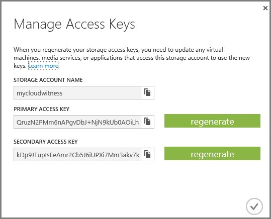

# Deploy a Cloud Witness for a Failover Cluster

> Applies to: Windows Server 2019, Windows Server 2016

Cloud Witness is a type of Failover Cluster quorum witness that uses Microsoft Azure to provide a vote on cluster quorum. This topic provides an overview of the Cloud Witness feature, the scenarios that it supports, and instructions about how to configure a cloud witness for a Failover Cluster.

## <a name="CloudWitnessOverview"></a>Cloud Witness overview

Figure 1 illustrates a multi-site stretched Failover Cluster quorum configuration with Windows Server 2016. In this example configuration (figure 1), there are 2 nodes in 2 datacenters (referred to as Sites). Note, it is possible for a cluster to span more than 2 datacenters. Also, each datacenter can have  more than 2 nodes. A typical cluster quorum configuration in this setup (automatic failover SLA) gives each node a vote. One extra vote is given to the quorum witness to allow cluster to keep running even if either one of the datacenter experiences a power outage. The math is simple - there are 5 total votes and you need 3 votes for the cluster to keep it running.  

  
**Figure 1: Using a File Share Witness as a quorum witness**  

In case of power outage in one datacenter, to give equal opportunity for the cluster in other datacenter to keep it running, it is recommended to host the quorum witness in a location other than the two datacenters. This typically means requiring a third separate datacenter (site) to host a File Server that is backing the File Share which is used as the quorum witness (File Share Witness).  

Most organizations do not have a third separate datacenter that will host File Server backing the File Share Witness. This means organizations primarily host the File Server in one of the two datacenters, which by extension, makes that datacenter the primary datacenter. In a scenario where there is power outage in the primary datacenter, the cluster would go down as the other datacenter would only have 2 votes which is below the quorum majority of 3 votes needed. For the customers that have third separate datacenter to host the File Server, it is an overhead to maintain the highly available File Server backing the File Share Witness. Hosting virtual machines in the public cloud that have the File Server for File Share Witness running in Guest OS is a significant overhead in terms of both setup & maintenance.  

Cloud Witness is a new type of Failover Cluster quorum witness that leverages Microsoft Azure as the arbitration point (figure 2). It uses Azure Blob Storage to read/write a blob file which is then used as an arbitration point in case of split-brain resolution.  

There are significant benefits which this approach:
1. Leverages Microsoft Azure (no need for third separate datacenter).  
2. Uses standard available Azure Blob Storage (no extra maintenance overhead of virtual machines hosted in public cloud).  
3. Same Azure Storage Account can be used for multiple clusters (one blob file per cluster; cluster unique id used as blob file name).  
4. Very low on-going $cost to the Storage Account (very small data written per blob file, blob file updated only once when cluster nodes' state changes).  
5. Built-in Cloud Witness resource type.  

  
**Figure 2: Multi-site stretched clusters with Cloud Witness as a quorum witness**  

As shown in figure 2, there is no third separate site that is required. Cloud Witness, like any other quorum witness, gets a vote and can participate in quorum calculations.  

## <a name="CloudWitnessSupportedScenarios"></a>Cloud Witness: Supported scenarios for single witness type
If you have a Failover Cluster deployment, where all nodes can reach the internet (by extension of Azure), it is recommended that you configure a Cloud Witness as your quorum witness resource.  

Some of the scenarios that are supported use of Cloud Witness as a quorum witness are as follows:  
- Disaster recovery stretched multi-site clusters (see figure 2).  
- Failover Clusters without shared storage (SQL Always On etc.).  
- Failover Clusters running inside Guest OS hosted in Microsoft Azure Virtual Machine Role (or any other public cloud).  
- Failover Clusters running inside Guest OS of Virtual Machines hosted in private clouds.
- Storage clusters with or without shared storage, such as Scale-out File Server clusters.  
- Small branch-office clusters (even 2-node clusters)  

Starting with Windows Server 2012 R2, it is recommended to always configure a witness as the cluster automatically manages the witness vote and the nodes vote with Dynamic Quorum.  

## <a name="CloudWitnessSetUp"></a> Set up a Cloud Witness for a cluster
To set up a Cloud Witness as a quorum witness for your cluster, complete the following steps:
1. Create an Azure Storage Account to use as a Cloud Witness
2. Configure the Cloud Witness as a quorum witness for your cluster.

## Create an Azure Storage Account to use as a Cloud Witness

This section describes how to create a storage account and view and copy endpoint URLs and access keys for that account.

To configure Cloud Witness, you must have a valid Azure Storage Account which can be used to store the blob file (used for arbitration). Cloud Witness creates a well-known Container **msft-cloud-witness** under the Microsoft Storage Account. Cloud Witness writes a single blob file with corresponding cluster's unique ID used as the file name of the blob file under this **msft-cloud-witness** container. This means that you can use the same Microsoft Azure Storage Account to configure a Cloud Witness for multiple different clusters.

When you use the same Azure Storage Account for configuring Cloud Witness for multiple different clusters, a single **msft-cloud-witness** container gets created automatically. This container will contain one-blob file per cluster.

### To create an Azure storage account

1. Sign in to the [Azure Portal](https://portal.azure.com).
2. On the Hub menu, select New -> Data + Storage -> Storage account.
3. In the Create a storage account page, do the following:
    1. Enter a name for your storage account.
    <br>Storage account names must be between 3 and 24 characters in length and may contain numbers and lowercase letters only. The storage account name must also be unique within Azure.
        
    2. For **Account kind**, select **General purpose**.
    <br>You can't use a Blob storage account for a Cloud Witness.
    3. For **Performance**, select **Standard**.
    <br>You can't use Azure Premium Storage for a Cloud Witness.
    2. For **Replication**, select **Locally-redundant storage (LRS)** .
    <br>Failover Clustering uses the blob file as the arbitration point, which requires some consistency guarantees when reading the data. Therefore you must select **Locally-redundant storage** for **Replication** type.

### View and copy storage access keys for your Azure Storage Account

When you create a Microsoft Azure Storage Account, it is associated with two Access Keys that are automatically generated - Primary Access key and Secondary Access key. For a first-time creation of Cloud Witness, use the **Primary Access Key**. There is no restriction regarding which key to use for Cloud Witness.  

#### To view and copy storage access keys

In the Azure Portal, navigate to your storage account, click **All settings** and then click **Access Keys** to view, copy, and regenerate your account access keys. The Access Keys blade also includes pre-configured connection strings using your primary and secondary keys that you can copy to use in your applications (see figure 4).

  
**Figure 4: Storage Access Keys**

### View and copy endpoint URL Links  
When you create a Storage Account, the following URLs are generated using the format: `https://<Storage Account Name>.<Storage Type>.<Endpoint>`  

Cloud Witness always uses **Blob** as the storage type. Azure uses **.core.windows.net** as the Endpoint. When configuring Cloud Witness, it is possible that you configure it with a different endpoint as per your scenario (for example the Microsoft Azure datacenter in China has a different endpoint).  

> [!NOTE]  
> The endpoint URL is generated automatically by Cloud Witness resource and there is no extra step of configuration necessary for the URL.  

#### To view and copy endpoint URL links
In the Azure Portal, navigate to your storage account, click **All settings** and then click **Properties** to view and copy your endpoint URLs (see figure 5).  

  
**Figure 5: Cloud Witness endpoint URL links**

For more information about creating and managing Azure Storage Accounts, see [About Azure Storage Accounts](https://azure.microsoft.com/documentation/articles/storage-create-storage-account/)

## Configure Cloud Witness as a quorum witness for your cluster
Cloud Witness configuration is well-integrated within the existing Quorum Configuration Wizard built into the Failover Cluster Manager.  

### To configure Cloud Witness as a Quorum Witness
1. Launch Failover Cluster Manager.
2. Right-click the cluster -> **More Actions** -> **Configure Cluster Quorum Settings** (see figure 6). This launches the Configure Cluster Quorum wizard.  
    
    **Figure 6. Cluster Quorum Settings**

3. On the **Select Quorum Configurations** page, select **Select the quorum witness** (see figure 7).  

      
    **Figure 7. Select the Quorum Configuration**

4. On the **Select Quorum Witness** page, select **Configure a cloud witness** (see figure 8).  

      
    **Figure 8. Select the Quorum Witness**  

5. On the **Configure Cloud Witness** page, enter the following information:  
   1. (Required parameter) Azure Storage Account Name.  
   2. (Required parameter) Access Key corresponding to the Storage Account.  
       1. When creating for the first time, use Primary Access Key (see figure 5)  
       2. When rotating the Primary Access Key, use Secondary Access Key (see figure 5)  
   3. (Optional parameter) If you intend to use a different Azure service endpoint (for example the Microsoft Azure service in China), then update the endpoint server name.  

        
      **Figure 9: Configure your Cloud Witness**

6. Upon successful configuration of Cloud Witness, you can view the newly created witness resource in the Failover Cluster Manager snap-in (see figure 10).

      
    **Figure 10: Successful configuration of Cloud Witness**

### Configuring Cloud Witness using PowerShell  
The existing Set-ClusterQuorum PowerShell command has new additional parameters corresponding to Cloud Witness.  

You can configure Cloud Witness using the [`Set-ClusterQuorum`](https://technet.microsoft.com/library/ee461013.aspx) following PowerShell command:  

```PowerShell
Set-ClusterQuorum -CloudWitness -AccountName <StorageAccountName> -AccessKey <StorageAccountAccessKey>
```

In case you need to use a different endpoint (rare):  

```PowerShell
Set-ClusterQuorum -CloudWitness -AccountName <StorageAccountName> -AccessKey <StorageAccountAccessKey> -Endpoint <servername>  
```

### Azure Storage Account considerations with Cloud Witness  
When configuring a Cloud Witness as a quorum witness for your Failover Cluster, consider the following:
* Instead of storing the Access Key, your Failover Cluster will generate and securely store a Shared Access Security (SAS) token.  
* The generated SAS token is valid as long as the Access Key remains valid. When rotating the Primary Access Key, it is important to first update the Cloud Witness (on all your clusters that are using that Storage Account) with the Secondary Access Key before regenerating the Primary Access Key.  
* Cloud Witness uses HTTPS REST interface of the Azure Storage Account service. This means it requires the HTTPS port to be open on all cluster nodes.

### Proxy considerations with Cloud Witness  
Cloud Witness uses HTTPS (default port 443) to establish communication with Azure blob service. Ensure that HTTPS port is accessible via network Proxy.

## See Also
- [What's New in Failover Clustering in Windows Server](whats-new-in-failover-clustering.md)
