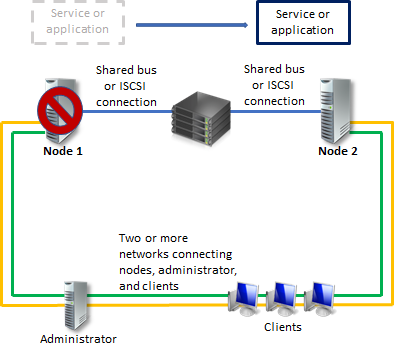
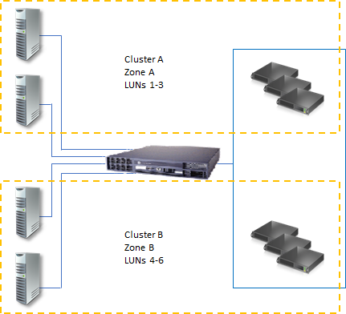
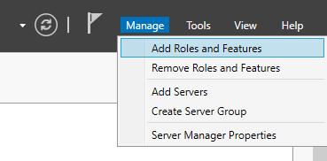
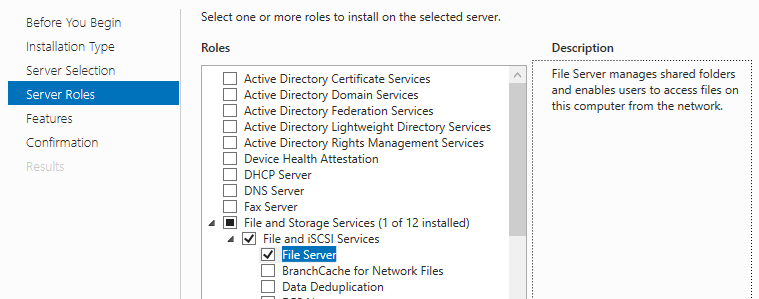
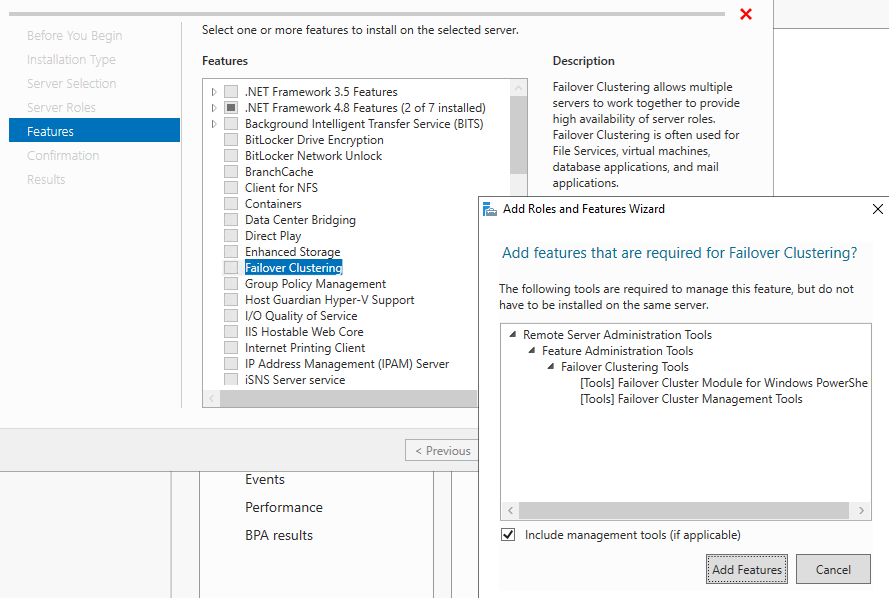

# Deploying a two-node clustered file server

>Applies to: Windows Server 2022, Windows Server 2019, Windows Server 2016

A failover cluster is a group of independent computers that work together to increase the availability of applications and services. The clustered servers, called *nodes*, are connected by both physical cables and software. If one of the cluster nodes fails, another node begins to provide service, which is a process known as *failover*. Because of this process, users experience minimal disruptions in service. For more information about how to use failover clusters in Azure Stack HCI, see [Create an Azure Stack HCI cluster using Windows Admin Center](/azure-stack/hci/deploy/create-cluster).

This guide describes how to install and configure a general purpose file server failover cluster with two nodes. With these instructions, you can learn about failover clusters and familiarize yourself with the Failover Cluster Management snap-in interface in Windows Server 2019 or Windows Server 2016.

## Overview for a two-node file server cluster

<!--This title...can we change it?-->

Servers in a failover cluster can function in a variety of roles, including the roles of file server, Hyper-V server, or database server. They can also provide high availability for a variety of other services and applications.

A failover cluster usually includes a storage unit that's physically connected to all servers within the cluster, although only one server at a time can access the volumes in the storage. The following diagram shows a two-node failover cluster connected to a storage unit.



<!--Reformat this image-->

Storage volumes or logical unit numbers (LUNs) exposed to the nodes in a cluster must not be exposed to other servers, including servers in another cluster. The following diagram illustrates this.

<!--Illustrates what?-->



<!--Reformat this image-->

To guarantee maximum availability for any server, it's important to follow best practices for server management. For example, you should carefully manage the physical environment of the servers by testing software changes before fully implementing them and tracking software updates and configuration changes on all clustered servers.

The following scenario describes one way to configure a file server failover cluster. The files the server shares are on the cluster storage, and either clustered server can act as the file server that shares them.

<!--It feels like something's missing in this transition between sections. I think we should describe the scenario first before launching into a list.-->

## Shared folders in a failover cluster

<!--What is this section trying to describe? It doesn't sound like a specific scenario as multiple scenarios. What are these specific scenarios meant to illustrate?-->

The following list describes shared folder configuration functionality integrated into failover clustering:

- Display is scoped to clustered shared folders only (no mixing with non-clustered shared folders): When a user views shared folders by specifying the path of a clustered file server, the display will include only the shared folders that are part of the specific file server role. It will exclude non-clustered shared folders and shares part of separate file server roles that happen to be on a node of the cluster.

- Access-based enumeration: You can use access-based enumeration to hide a specified folder from users' view. Instead of allowing users to see the folder but not access anything on it, you can choose to prevent them from seeing the folder at all. You can configure access-based enumeration for a clustered shared folder in the same way as for a non-clustered shared folder.

- Offline access: You can configure offline access (caching) for a clustered shared folder in the same way as for a nonclustered shared folder.

- Clustered disks are always recognized as part of the cluster: Whether you use the failover cluster interface, Windows Explorer, or the Share and Storage Management snap-in, Windows recognizes whether a disk has been designated as being in the cluster storage. If such a disk has already been configured in Failover Cluster Management as part of a clustered file server, you can then use any of the previously mentioned interfaces to create a share on the disk. If such a disk has not been configured as part of a clustered file server, you cannot mistakenly create a share on it. Instead, an error indicates that the disk must first be configured as part of a clustered file server before it can be shared.

- Integration of Services for Network File System: The File Server role in Windows Server includes the optional role service called Services for Network File System (NFS). By installing the role service and configuring shared folders with Services for NFS, you can create a clustered file server that supports UNIX-based clients.

## Requirements for a two-node failover cluster

<!--Prerequisites? If so, this needs to go first.-->

You must meet the following requirements for your failover cluster in Windows Server 2019 or 2016 to be officially supported by Microsoft:

- All hardware and software components must meet the qualifications for the appropriate logo. For Windows Server 2016, this is the "Certified for Windows Server 2016" logo. For Windows Server 2019, this is the "Certified for Windows Server 2019" logo. For more information about what hardware and software systems have been certified, please visit the Microsoft [Windows Server Catalog](https://www.windowsservercatalog.com/default.aspx) site.

- The fully configured solution (servers, network, and storage) must pass all tests in the validation workflow, which is included with the failover cluster snap-in.

In order to use a two-node failover cluster, you'll need to meet the requirements in the following sections.

### Servers

We recommend using matching computers with the same or similar components. Servers for a two-node failover cluster must run the same version of Windows Server. They should also have the same software updates.

### Network adapters and cables

The network hardware, like other components in the failover cluster solution, must be compatible with Windows Server 2016 or Windows Server 2019.

If you use iSCSI, you must dedicate the network adapters to either network communication or iSCSI, not both.

In the network infrastructure that connects your cluster nodes, avoid having single points of failure. There are two ways you can avoid having a single point of failure:

- Connect your cluster nodes with multiple, distinct networks.
- Connect your cluster nodes with one network constructed with teamed network adapters, redundant switches, redundant routers, or similar hardware that removes single points of failure.

   > [!NOTE]
   > If you connect the cluster nodes with a single network, the network will pass the redundancy requirement in the Validate a Configuration workflow. However, the report will include a warning that the network shouldn't have a single point of failure.

### Device Controllers or appropriate adapters for storage

If you're using a Serial Attached SCSI or Fibre Channel, in all clustered servers, all components of the storage stack should be identical. The multipath I/O (MPIO) software and Device Specific Module (DSM) software components must be identical. We recommend the mass-storage device controllers that you attach to cluster storage, including the host bus adapter (HBA), HBA drivers, and HBA firmware, are also identical. If you don't have identical HBAs, you should verify with the storage vendor that you're following their supported or recommended configurations.

If you're using iSCSI, each clustered server must have one or more network adapters or host bus adapters that are dedicated to the ISCSI storage. You shouldn't use the network you're already using for iSCSI for network communication. In all clustered servers, the network adapters you use to connect to the iSCSI storage target should be identical, and we recommend that you use Gigabit Ethernet or higher.

### Storage requirements

You must use shared storage that's certified for Windows Server 2016 or Windows Server 2019.

For a two-node failover cluster, the storage should contain at least two separate volumes (LUNs) if you're using a witness disk for quorum. The witness disk is a disk in the cluster storage that's designated to hold a copy of the cluster configuration database.

For this two-node cluster example, the quorum configuration will be Node and Disk Majority. Node and Disk Majority means that the nodes and the witness disk each contain copies of the cluster configuration, and the cluster has quorum as long as a majority (two out of three) of these copies are available. The other volume (LUN) will contain the files that are being shared to users.

Additional storage requirements you should consider:

- You must use basic disks to use the native disk support included in failover clustering, not dynamic disks.
- We recommend you format partitions with NTFS. For witness disks, you must format the partition with NTFS instead.
- For the partition style of the disk, you can use either master boot record (MBR) or GUID partition table (GPT).
- The storage must respond correctly to specific SCSI commands. Storage must also follow the standard called SCSI Primary Commands-3 (SPC-3). In particular, the storage must support Persistent Reservations as specified in the SPC-3 standard.
- The miniport driver the storage uses must be compatible with Microsoft Storport storage drivers.

## Deploying storage area networks with failover clusters

When deploying a storage area network (SAN) with a failover cluster, you must follow these guidelines:

- Use the [Windows Server Catalog](https://www.windowsservercatalog.com/default.aspx) site to confirm the vendor's storage, including drivers, firmware, and software, are certified for Windows Server 2016 or Windows Server 2019.

- Isolate storage devices, one cluster per device. Servers from different clusters must not be able to access the same storage devices. In most cases, you should isolate a LUN you use for one set of cluster servers from all other servers by using LUN masking or zoning.

- Consider using multipath I/O software. In a highly available storage fabric, you can deploy failover clusters with multiple host bus adapters by using multipath I/O software. This configuration provides the highest level of redundancy and availability. However, you must base your multipath solution on Microsoft Multipath I/O (MPIO). Your storage hardware vendor may also supply an MPIO device-specific module (DSM) for your hardware, although Windows Server 2016 and Windows Server 2019 include one or more DSMs as part of the operating system.

## Network infrastructure and domain account requirements

<!--This just keeps going. How should I arrange all this information?-->

In order to use two-node failover clusters, you'll need the following infrastructure and domain permissions:

<!--Why are these two lumped together?-->

<!--Let's come back to this later.-->

- **Network settings and IP addresses:** When you use identical network adapters for a network, you must also use identical communication settings on those adapters (for example, Speed, Duplex Mode, Flow Control, and Media Type). Also, compare the settings between the network adapter and the switch it connects to and make sure that no settings are in conflict.

    If you have private networks that are not routed to the rest of your network infrastructure, ensure that each of these private networks uses a unique subnet. This is necessary even if you give each network adapter a unique IP address. For example, if you have a cluster node in a central office that uses one physical network, and another node in a branch office that uses a separate physical network, do not specify 10.0.0.0/24 for both networks, even if you give each adapter a unique IP address.

    For more information about the network adapters, see Hardware requirements for a two-node failover cluster, earlier in this guide.

- **DNS:** The servers in the cluster must be using Domain Name System (DNS) for name resolution. The DNS dynamic update protocol can be used.

- **Domain role:** All servers in the cluster must be in the same Active Directory domain. As a best practice, all clustered servers should have the same domain role (either member server or domain controller). The recommended role is member server.

- **Domain controller:** We recommend that your clustered servers be member servers. If they are, you need an additional server that acts as the domain controller in the domain that contains your failover cluster.

- **Clients:** As needed for testing, you can connect one or more networked clients to the failover cluster that you create, and observe the effect on a client when you move or fail over the clustered file server from one cluster node to the other.

- **Account for administering the cluster:** When you first create a cluster or add servers to it, you must be logged on to the domain with an account that has administrator rights and permissions on all servers in that cluster. The account does not need to be a Domain Admins account, but can be a Domain Users account that is in the Administrators group on each clustered server. In addition, if the account is not a Domain Admins account, the account (or the group that the account is a member of) must be given the **Create Computer Objects** and **Read All Properties** permissions in the domain organizational unit (OU) that is will reside in.

## Install a two-node file server cluster

Follow the directions in the following sections to install a two-node file server cluster.

If you've already installed the cluster nodes and want to configure a file server failover cluster, see [Configure a two-node file server cluster](#configure-a-file-server-failover-cluster).

### Step 1: Connect the cluster servers to the networks and storage

For a failover cluster network, avoid having single points of failure. There are multiple ways of accomplishing this. You can connect your cluster nodes by multiple, distinct networks. Alternatively, you can connect your cluster nodes with one network that is constructed with teamed network adapters, redundant switches, redundant routers, or similar hardware that removes single points of failure (If you use a network for iSCSI, you must create this network in addition to the other networks).

For a two-node file server cluster, when you connect the servers to the cluster storage, you must expose at least two volumes (LUNs). You can expose additional volumes as needed for thorough testing of your configuration. Do not expose the clustered volumes to servers that are not in the cluster.

To connect the cluster servers to the networks and storage:

1. Review the details about networks in [Hardware requirements for a two-node failover cluster](#requirements-for-a-two-node-failover-cluster) and [Network infrastructure and domain account requirements](#network-infrastructure-and-domain-account-requirements) for a two-node failover cluster.

1. Connect and configure the networks that the servers in the cluster will use.

1. If your test configuration includes clients or a non-clustered domain controller, make sure these computers can connect to the clustered servers through at least one network.

1. Follow the manufacturer's instructions for physically connecting the servers to the storage.

1. Ensure that the disks (LUNs) you want to use in the cluster are exposed to the servers that you plant to cluster, and only those servers. You can use any of the following interfaces to expose disks or LUNs:

    - The interface provided by the manufacturer of the storage.

    - If you're using iSCSI, use an appropriate iSCSI interface.

1. If you purchased software that controls the format or function of the disk, follow the vendor's instructions about how to use that software with Windows Server.

1. On one of the servers that you want to cluster, go to **Start** > **Administrative Tools** > **Computer Management** > **Disk Management**.

1. If the User Account Control dialog box appears, confirm that the action it displays is what you want, then select **Continue**.

1. In **Disk Management**, confirm that the cluster disks are visible.

1. (Optional) If you want a storage volume larger than 2 terabytes and you're using the Windows interface to control the format of the disk, convert that disk to the partition style called *GUID partition table (GPT)*. To do this:
   - Back up any data on the disk.
   - Delete all volumes on the disk.
   - In **Disk Management**, right-click the disk (not a partition) and select **Convert to GPT Disk**.
   - For volumes smaller than 2 terabytes, instead of using GPT, you can use the partition style called *master boot record (MBR)*.

1. Check the format of any exposed volume or LUN. We recommend you use NTFS for the format. For the witness disk, you must use NTFS.

### Step 2: Install the file server role and failover cluster feature

Next, you need to install the file server role and failover cluster feature. Both servers must be running either Windows Server 2016 or Windows Server 2019.

#### [Server Manager](#tab/server-manager)

1. Open **Server Manager**, then open the the **Manage** drop-down menu and select **Add Roles and Features**.

   

1. If the **Before you begin** window opens, select **Next**.

1. For the **Installation Type**, select **Role-based or feature-based installation**.

1. Select **Next**.

1. Select **Select a server from the server pool** and the name of the machine you plan to use.

1. Select **Next**.

1. For the Server Role, from the list of roles, open **File Services** and select **File Server**.

   

1. Select **Next**.

1. In **Features**, select **Failover Clustering** from the list of features. A window will appear showing a list of all administration tools currently being installed. Make sure not to unselect any currently selected features, then select **Add Features**, then select **Next**.

   

1. On the **Confirmation** page, select **Install**.

1. Once the installation finishes, restart the computer.

1. Repeat this process on the second server machine.

#### [PowerShell](#tab/powershell)

1. Open an administrative PowerShell session by right-clicking the **Start** button and  selecting **Windows PowerShell (Admin)**.

1. Run this command to install the File Server Role:

    ```PowerShell
    Install-WindowsFeature -Name FS-FileServer
    ```

1. Run this command to install the Failover Clustering feature and its management tools:

    ```PowerShell
    Install-WindowsFeature -Name Failover-Clustering -IncludeManagementTools
    ```

1. Once the installation process is done, verify installation was successful by running these commands:

    ```PowerShell
    Get-WindowsFeature -Name FS-FileServer
    Get-WindowsFeature -Name Failover-Clustering
    ```

1. Run this command to restart the machine:

    ```PowerShell
    Restart-Computer
    ```

1. Repeat this process on the second server.

---

### Step 3: Validate the cluster configuration

Before creating a cluster, we highly recommend that you validate your configuration. Validation helps you confirm that the configuration of your servers, network, and storage meets a set of specific requirements for failover clusters.

#### [Server Manager](#tab/server-manager)

1. Open **Server Manager**, then open the **Tools** drop-down menu and select **Failover Cluster Manager**.

1. In **Failover Cluster Manager**, go to the middle column under **Management** and select **Validate Configuration**.

1. If the **Before you begin** window opens, select **Next**.

1. In the **Select Servers or a Cluster** window, enter the names of the two machines that you plan to make the new nodes for the cluster.  For example, if your planned node names are NODE1 and NODE2, enter those names and select **Add**.  You can also choose the **Browse** button to search Active Directory for the names of existing nodes you can use. Once both nodes are listed under **Selected Servers**, select **Next**.

5. In the **Testing Options** window, select **Run all tests (recommended)**, and **Next**.

6. On the **Confirmation** page, it will give you the listing of all the tests it will check.  Choose **Next** and the tests will begin.

7. Once completed, the **Summary** page appears after the tests run. To view Help topics that will help you interpret the results, click **More about cluster validation tests**.

8. While still on the Summary page, click View Report and read the test results. Make any necessary changes in the configuration and rerun the tests. <br>To view the results of the tests after you close the wizard, see *SystemRoot\Cluster\Reports\Validation Report date and time.html*.

9. To view Help topics about cluster validation after you close the wizard, in Failover Cluster Management, click Help, click Help Topics, click the Contents tab, expand the contents for the failover cluster Help, and click Validating a Failover Cluster Configuration.

#### [PowerShell](#tab/powershell)

1. Open an administrative PowerShell session by right-clicking the Start button and then selecting **Windows PowerShell (Admin)**.

2. To validate the machines (for example, the machine names being NODE1 and NODE2) for Failover Clustering, run the command:

    ```PowerShell
    Test-Cluster -Node "NODE1","NODE2"
    ```

4. To view the results of the tests after you close the wizard, see the file specified (in SystemRoot\Cluster\Reports\), then make any necessary changes in the configuration and rerun the tests.

---

For more info, see [Validating a Failover Cluster Configuration](/previous-versions/windows/it-pro/windows-server-2012-r2-and-2012/jj134244(v=ws.11)).

### Step 4: Create the Cluster

The following will create a cluster out of the machines and configuration you have.

#### [Server Manager](#tab/server-manager)

1. From **Server Manager**, choose the **Tools** drop down and select **Failover Cluster Manager**.

2. In **Failover Cluster Manager**, go to the middle column under **Management** and choose **Create Cluster**.

3. If the **Before you begin** window opens, choose **Next**.

4. In the **Select Servers** window, add in the names of the two machines that will be the nodes of the cluster.  For example, if the names are NODE1 and NODE2, enter the name and select **Add**.  You can also choose the **Browse** button to search Active Directory for the names.  Once both are listed under **Selected Servers**, choose **Next**.

5. In the **Access Point for Administering the Cluster** window, input the name of the cluster you will be using.  Please note that this is not the name you will be using to connect to your file shares with.  This is for simply administrating the cluster.

   > [!NOTE]
   > If you are using static IP Addresses, you will need to select the network to use and input the IP Address it will use for the cluster name.  If you are using DHCP for your IP Addresses, the IP Address will be configured automatically for you.

6. Choose **Next**.

7. On the **Confirmation** page, verify what you have configured and select **Next** to create the Cluster.

8. On the **Summary** page, it will give you the configuration it has created.  You can select View Report to see the report of the creation.

#### [PowerShell](#tab/powershell)

1. Open an administrative PowerShell session by right-clicking the Start button and then selecting **Windows PowerShell (Admin)**.

2. Run the following command to create the cluster if you are using static IP Addresses.  For example, the machine names are NODE1 and NODE2, the name of the cluster will be CLUSTER, and the IP Address will be 1.1.1.1.

   ```PowerShell
    New-Cluster -Name CLUSTER -Node "NODE1","NODE2" -StaticAddress 1.1.1.1
   ```

3. Run the following command to create the cluster if you are using DHCP for IP Addresses.  For example, the machine names are NODE1 and NODE2, and the name of the cluster will be CLUSTER.

   ```PowerShell
   New-Cluster -Name CLUSTER -Node "NODE1","NODE2"
   ```

---

### Configure a file server failover cluster

To configure a file server failover cluster, follow the below steps.

1. From **Server Manager**, choose the **Tools** drop down and select **Failover Cluster Manager**.

2. When Failover Cluster Manager opens, it should automatically bring in the name of the cluster you created.  If it does not, go to the middle column under **Management** and choose **Connect to Cluster**.  Input the name of the cluster you created and **OK**.

3. In the console tree, click the ">" sign next to the cluster that you created to expand the items underneath it.

4. Right mouse click on **Roles** and select **Configure Role**.

5. If the **Before you begin** window opens, choose **Next**.

6. In the list of roles, choose **File Server** and **Next**.

7. For the File Server Type, select **File Server for general use** and **Next**.<br>For info about Scale-Out File Server, see [Scale-Out File Server overview](sofs-overview.md).

   

8. In the **Client Access Point** window, input the name of the file server you will be using.  Please note that this is not the name of the cluster.  This is for the file share connectivity.  For example, if I want to connect to \\SERVER, the name inputted would be SERVER.

   > [!NOTE]
   > If you are using static IP Addresses, you will need to select the network to use and input the IP Address it will use for the cluster name.  If you are using DHCP for your IP Addresses, the IP Address will be configured automatically for you.

9. Choose **Next**.

10. In the **Select Storage** window, select the additional drive (not the witness) that will hold your shares, and click **Next**.

11. On the **Confirmation** page, verify your configuration and select **Next**.

12. On the **Summary** page, it will give you the configuration it has created.  You can select View Report to see the report of the file server role creation.

   > [!NOTE]
   > If the role does not add or start correctly, the CNO (Cluster Name Object) may not have permission to create objects in Active Directory. The File Server role requires a Computer object of the same name as the "Client Access Point" provided in Step 8.

13. Under **Roles** in the console tree, you will see the new role you created listed as the name you created.  With it highlighted, under the **Actions** pane on the right, choose **Add a share**.

14. Run through the share wizard inputting the following:

    - Type of share it will be
    - Location/path the folder shared will be
    - The name of the share users will connect to
    - Additional settings such as Access-based enumeration, caching, encryption, etc.
    - File level permissions if they will be other than the defaults

15. On the **Confirmation** page, verify what you have configured, and select **Create** to create the file server share.

16. On the **Results** page, select Close if it created the share.  If it could not create the share, it will give you the errors incurred.

17. Choose **Close**.

18. Repeat this process for any additional shares.
