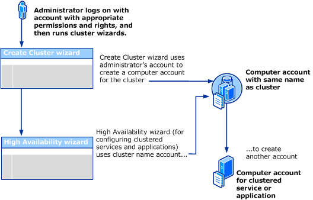
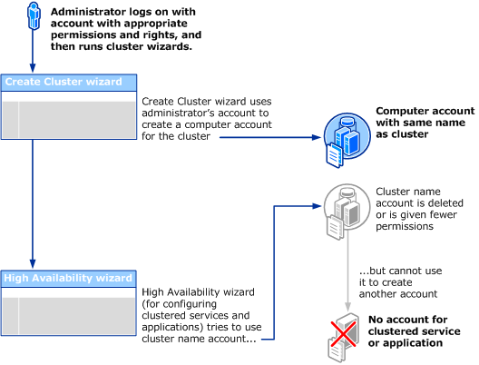

# Failover cluster accounts overview

When you set up a failover cluster in Windows Server, the cluster creation and configuration wizards automatically generate the required Active Directory (AD) computer accounts, known as computer objects, and assign the necessary permissions. This includes creating a computer account for the cluster itself called the cluster name object (CNO) and for most clustered services and applications, separate computer accounts for each (except for Hyper-V virtual machines, which don't require a dedicated account). These permissions are configured by the wizards to ensure proper cluster operation. If permissions are modified after creation, they must be restored to meet cluster requirements and avoid service disruptions.

## AD accounts needed by a failover cluster

This section outlines the AD computer accounts required for a failover cluster:

- **The user account used to create the cluster**: This is the user account used to start the Create Cluster Wizard. This account is important because it provides the basis from which a computer account is created for the cluster itself.

- **The cluster name account**: The computer account of the cluster itself, also called the CNO. This account is created automatically by the Create Cluster Wizard and has the same name as the cluster. The cluster name account is important because through this account, other accounts are automatically created as you configure new services and applications on the cluster. If the cluster name account is deleted or permissions are taken away from it, other accounts can't be created as required by the cluster until the cluster name account is restored or the correct permissions are reinstated.

  For example, if you create a cluster called **Cluster1** and then try to configure a clustered print server called **PrintServer1** on your cluster, the **Cluster1** account in AD needs to retain the correct permissions so that it can be used to create a computer account called **PrintServer1**.

  The cluster name account is created in the default container for computer accounts in AD. By default this is the "Computers" container, but the domain administrator can choose to redirect it to another container or organizational unit (OU).

- **The computer account of a clustered service or application**: These accounts are created automatically by the High Availability Wizard as part of the process of creating most types of clustered services or application, the exception being a Hyper-V virtual machine. The cluster name account is granted the necessary permissions to control these accounts.

  For example, if you have a cluster called **Cluster1** and then you create a clustered file server called **FileServer1**, the High Availability Wizard creates an AD computer account called **FileServer1**. The High Availability Wizard also gives the **Cluster1** account the necessary permissions to control the **FileServer1** account.

The following table describes the permissions required for these accounts.

| Account | Details about permissions |
|---------|--------------------------|
| **Account used to create the cluster** | Requires administrative permissions on the servers that become cluster nodes. Also requires **Create Computer objects** and **Read All Properties** permissions in the container used for computer accounts in the domain. |
| **Cluster name account (computer account of the cluster itself)** | When the Create Cluster Wizard is run, it creates the cluster name account in the default container for computer accounts in the domain. By default, the cluster name account can create up to 10 computer accounts in the domain.  If you prestage the cluster name account (cluster name object) before creating the cluster, you must give it **Create Computer objects** and **Read All Properties** permissions in the container used for computer accounts. You must also disable the account and give **Full Control** of it to the account used by the administrator who installs the cluster. |
| **Computer account of a clustered service or application** | When the High Availability Wizard is run to create a new clustered service or application, a computer account for the clustered service or application is created in AD (except for clustered Hyper-V virtual machines). The cluster name account is granted the necessary permissions to control this account.  If you prestage the computer account for a clustered service or application, you must configure it with the necessary permissions. |

> [!NOTE]
> In earlier versions of Windows Server, there was an account for the Cluster service. Since Windows Server 2008, however, the Cluster service automatically runs in a special context that provides the specific permissions and privileges necessary for the service (similar to the local system context, but with reduced privileges). Other accounts are needed, however, as described in this guide.

## How accounts are created through wizards in failover clustering

The following diagram illustrates the use and creation of computer accounts (AD objects) that are described in the previous subsection. These accounts come into play when an administrator runs the Create Cluster Wizard and then runs the High Availability Wizard (to configure a clustered service or application).

This diagram shows a single administrator running both the Create Cluster Wizard and the High Availability Wizard. However, this could be two different administrators using two different user accounts, if both accounts had sufficient permissions. The permissions are described in more detail in Requirements related to failover clusters, AD domains, and accounts, later in this guide.

## How problems can result if accounts needed by the cluster are changed

The following diagram illustrates how problems can result if the cluster name account (one of the accounts required by the cluster) is changed after it's automatically created by the Create Cluster Wizard.

If the type of problem shown in the diagram occurs, a certain event ID (1193, 1194, 1206, or 1207) is logged in Event Viewer. For more information about these events, see [Active Directory Permissions for Cluster Accounts](/previous-versions/windows/it-pro/windows-server-2008-R2-and-2008/cc756188(v=ws.10)).

A similar problem with creating an account for a clustered service or application can occur if the domain-wide quota for creating computer objects is reached. The default amount is 10 and increasing this quota should be changed only after careful consideration, and only after confirming that the preceding diagram doesn't describe your situation. For more information, see [Troubleshoot issues caused by changes in cluster-related Active Directory accounts](/troubleshoot/windows-server/high-availability/troubleshoot-issues-accounts-used-failover-clusters#troubleshoot-issues-caused-by-changes-in-cluster-related-active-directory-accounts).

## Requirements related to failover clusters, AD domains, and accounts

As described in the preceding three sections, certain requirements must be met before clustered services and applications can be successfully configured on a failover cluster. The most basic requirements concern the location of cluster nodes (within a single domain) and the level of permissions of the account of the person who installs the cluster. If these requirements are met, the other accounts required by the cluster can be created automatically by the failover cluster wizards. The following list provides details about these basic requirements.

- **Nodes**: All nodes must be in the same AD domain. The domain can't be based on Windows NT 4.0, which doesn't include AD.

- **Account of the person who installs the cluster**: The person who installs the cluster must use an account with the following characteristics:

  - The account must be a domain account. It doesn't have to be a domain administrator account. It can be a domain user account if it meets the other requirements in this list.

  - The account must have administrative permissions on the servers that become cluster nodes. The simplest way to provide this is to create a domain user account, and then add that account to the local Administrators group on each of the servers that become cluster nodes. The account (or the group that the account is a member of) must be given the **Create Computer objects** and **Read All Properties** permissions in the container that is used for computer accounts in the domain. For more information, see [Steps for configuring the account for the person who installs the cluster](configure-failover-cluster-accounts.md#configure-the-cluster-account).

  - If your organization chooses to prestage the CNO (computer account with the same name as the cluster), the prestaged cluster name account must give "Full Control" permission to the account of the person who installs the cluster. For other important details about how to prestage the cluster name account, see [Steps for prestaging the cluster name account](configure-failover-cluster-accounts.md#prestage-the-cluster-name-account).

## Planning ahead for password resets and other account maintenance

The administrators of failover clusters might sometimes need to reset the password of the cluster name account. This action requires a specific permission, the **Reset password** permission. Therefore, it's a best practice to edit the permissions of the cluster name account (by using the Active Directory Users and Computers snap-in) to give the administrators of the cluster the **Reset password** permission for the cluster name account. For more information, see [Troubleshoot password issues with the cluster name account](/troubleshoot/windows-server/high-availability/troubleshoot-issues-accounts-used-failover-clusters#troubleshoot-password-issues-with-the-cluster-name-account).

