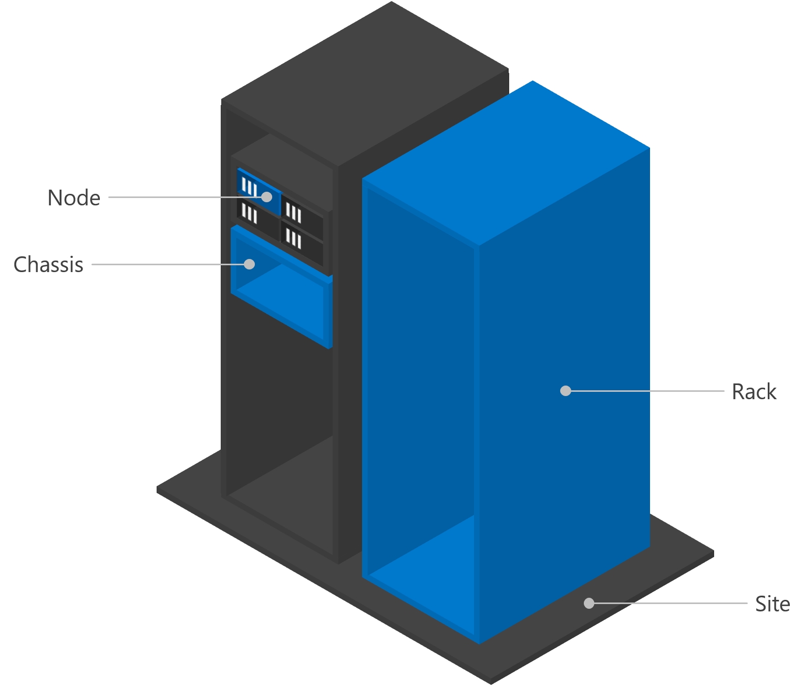

# Fault domain awareness

> Applies to: Windows Server 2019 and Windows Server 2016

Failover Clustering enables multiple servers to work together to provide high availability – or put another way, to provide node fault tolerance. But today's businesses demand ever-greater availability from their infrastructure. To achieve cloud-like uptime, even highly unlikely occurrences such as chassis failures, rack outages, or natural disasters must be protected against. That's why Failover Clustering in Windows Server 2016 introduced chassis, rack, and site fault tolerance as well.

## Fault domain awareness

Fault domains and fault tolerance are closely related concepts. A fault domain is a set of hardware components that share a single point of failure. To be fault tolerant to a certain level, you need multiple fault domains at that level. For example, to be rack fault tolerant, your servers and your data must be distributed across multiple racks.

This short video presents an overview of fault domains in Windows Server 2016:  
[](https://channel9.msdn.com/Blogs/windowsserver/Fault-Domain-Awareness-in-WS2016-Part-1-Overview)

### Fault domain awareness in Windows Server 2019

Fault domain awareness is available in Windows Server 2019 but it's disabled by default and must be enabled through the Windows Registry.

To enable fault domain awareness in Windows Server 2019, go to the Windows Registry and set the (Get-Cluster).AutoAssignNodeSite registry key to 1.

```Registry
    (Get-Cluster).AutoAssignNodeSite=1
```

To disable fault domain awareness in Windows 2019, go to the Windows Registry and set the (Get-Cluster).AutoAssignNodeSite registry key to 0.

```Registry
    (Get-Cluster).AutoAssignNodeSite=0
```

## Benefits
- **Storage Spaces, including Storage Spaces Direct, uses fault domains to maximize data safety.**  
    Resiliency in Storage Spaces is conceptually like distributed, software-defined RAID. Multiple copies of all data are kept in sync, and if hardware fails and one copy is lost, others are recopied to restore resiliency. To achieve the best possible resiliency, copies should be kept in separate fault domains.

- **The [Health Service](health-service-overview.md) uses fault domains to provide more helpful alerts.**  
    Each fault domain can be associated with location metadata, which will automatically be included in any subsequent alerts. These descriptors can assist operations or maintenance personnel and reduce errors by disambiguating hardware.  

- **Stretch clustering uses fault domains for storage affinity.** Stretch clustering allows faraway servers to join a common cluster. For the best performance, applications or virtual machines should be run on servers that are nearby to those providing their storage. Fault domain awareness enables this storage affinity.   

## Levels of fault domains  
There are four canonical levels of fault domains - site, rack, chassis, and node. Nodes are discovered automatically; each additional level is optional. For example, if your deployment does not use blade servers, the chassis level may not make sense for you.  



## Usage  
You can use PowerShell or XML markup to specify fault domains. Both approaches are equivalent and provide full functionality.

>[!IMPORTANT]
> Specify fault domains before enabling Storage Spaces Direct, if possible. This enables the automatic configuration to prepare the pool, tiers, and settings like resiliency and column count, for chassis or rack fault tolerance. Once the pool and volumes have been created, data will not retroactively move in response to changes to the fault domain topology. To move nodes between chassis or racks after enabling Storage Spaces Direct, you should first evict the node and its drives from the pool using `Remove-ClusterNode -CleanUpDisks`.

### Defining fault domains with PowerShell
Windows Server 2016 introduces the following cmdlets to work with fault domains:
* `Get-ClusterFaultDomain`
* `Set-ClusterFaultDomain`
* `New-ClusterFaultDomain` 
* `Remove-ClusterFaultDomain`

This short video demonstrates the usage of these cmdlets.
[](https://channel9.msdn.com/Blogs/windowsserver/Fault-Domain-Awareness-in-WS2016-Part-2-Using-PowerShell)

Use `Get-ClusterFaultDomain` to see the current fault domain topology. This will list all nodes in the cluster, plus any chassis, racks, or sites you have created. You can filter using parameters like **-Type** or **-Name**, but these are not required.

```PowerShell
Get-ClusterFaultDomain
Get-ClusterFaultDomain -Type Rack
Get-ClusterFaultDomain -Name "server01.contoso.com"
```

Use `New-ClusterFaultDomain` to create new chassis, racks, or sites. The `-Type` and `-Name` parameters are required. The possible values for `-Type` are `Chassis`, `Rack`, and `Site`. The `-Name` can be any string. (For `Node` type fault domains, the name must be the actual node name, as set automatically).

```PowerShell
New-ClusterFaultDomain -Type Chassis -Name "Chassis 007"
New-ClusterFaultDomain -Type Rack -Name "Rack A"
New-ClusterFaultDomain -Type Site -Name "Shanghai"
```

> [!IMPORTANT]  
> Windows Server cannot and does not verify that any fault domains you create correspond to anything in the real, physical world. (This may sound obvious, but it's important to understand.) If, in the physical world, your nodes are all in one rack, then creating two `-Type Rack` fault domains in software does not magically provide rack fault tolerance. You are responsible for ensuring the topology you create using these cmdlets matches the actual arrangement of your hardware.

Use `Set-ClusterFaultDomain` to move one fault domain into another. The terms "parent" and "child" are commonly used to describe this nesting relationship. The `-Name` and `-Parent` parameters are required. In `-Name`, provide the name of the fault domain that is moving; in `-Parent`, provide the name of the destination. To move multiple fault domains at once, list their names.

```PowerShell
Set-ClusterFaultDomain -Name "server01.contoso.com" -Parent "Rack A"
Set-ClusterFaultDomain -Name "Rack A", "Rack B", "Rack C", "Rack D" -Parent "Shanghai"
```

> [!IMPORTANT]  
> When fault domains move, their children move with them. In the above example, if Rack A is the parent of server01.contoso.com, the latter does not separately need to be moved to the Shanghai site – it is already there by virtue of its parent being there, just like in the physical world.

You can see parent-child relationships in the output of `Get-ClusterFaultDomain`, in the `ParentName` and `ChildrenNames` columns.

You can also use `Set-ClusterFaultDomain` to modify certain other properties of fault domains. For example, you can provide optional `-Location` or `-Description` metadata for any fault domain. If provided, this information will be included in hardware alerting from the Health Service. You can also rename fault domains using the `-NewName` parameter. Do not rename `Node` type fault domains.

```PowerShell
Set-ClusterFaultDomain -Name "Rack A" -Location "Building 34, Room 4010"
Set-ClusterFaultDomain -Type Node -Description "Contoso XYZ Server"
Set-ClusterFaultDomain -Name "Shanghai" -NewName "China Region"
```

Use `Remove-ClusterFaultDomain` to remove chassis, racks, or sites you have created. The `-Name` parameter is required. You cannot remove a fault domain that contains children – first, either remove the children, or move them outside using `Set-ClusterFaultDomain`. To move a fault domain outside of all other fault domains, set its `-Parent` to the empty string (""). You cannot remove `Node` type fault domains. To remove multiple fault domains at once, list their names.

```PowerShell
Set-ClusterFaultDomain -Name "server01.contoso.com" -Parent ""
Remove-ClusterFaultDomain -Name "Rack A"
```

### Defining fault domains with XML markup
Fault domains can be specified using an XML-inspired syntax. We recommend using your favorite text editor, such as Visual Studio Code (available for free *[here](https://code.visualstudio.com/)*) or Notepad, to create an XML document which you can save and reuse.  

This short video demonstrates the usage of XML Markup to specify fault domains.

[](https://channel9.msdn.com/Blogs/windowsserver/Fault-Domain-Awareness-in-WS2016-Part-3-Using-XML)

In PowerShell, run the following cmdlet: `Get-ClusterFaultDomainXML`. This returns the current fault domain specification for the cluster, as XML. This reflects every discovered `<Node>`, wrapped in opening and closing `<Topology>` tags.  

Run the following to save this output to a file.  

```PowerShell
Get-ClusterFaultDomainXML | Out-File <Path>  
```

Open the file, and add `<Site>`, `<Rack>`, and `<Chassis>` tags to specify how these nodes are distributed across sites, racks, and chassis. Every tag must be identified by a unique **Name**. For nodes, you must keep the node's name as populated by default.  

> [!IMPORTANT]  
> While all additional tags are optional, they must adhere to the transitive Site &gt; Rack &gt; Chassis &gt; Node hierarchy, and must be properly closed.  
In addition to name, freeform `Location="..."` and `Description="..."` descriptors can be added to any tag.  

#### Example: Two sites, one rack each  

```XML
<Topology>  
  <Site Name="SEA" Location="Contoso HQ, 123 Example St, Room 4010, Seattle">  
    <Rack Name="A01" Location="Aisle A, Rack 01">  
      <Node Name="Server01" Location="Rack Unit 33" />  
      <Node Name="Server02" Location="Rack Unit 35" />  
      <Node Name="Server03" Location="Rack Unit 37" />  
    </Rack>  
  </Site>  
  <Site Name="NYC" Location="Regional Datacenter, 456 Example Ave, New York City">  
    <Rack Name="B07" Location="Aisle B, Rack 07">  
      <Node Name="Server04" Location="Rack Unit 20" />  
      <Node Name="Server05" Location="Rack Unit 22" />  
      <Node Name="Server06" Location="Rack Unit 24" />  
    </Rack>  
  </Site>  
</Topology> 
``` 

#### Example: two chassis, blade servers  
```XML
<Topology>  
  <Rack Name="A01" Location="Contoso HQ, Room 4010, Aisle A, Rack 01">  
    <Chassis Name="Chassis01" Location="Rack Unit 2 (Upper)" >  
      <Node Name="Server01" Location="Left" />  
      <Node Name="Server02" Location="Right" />  
    </Chassis>  
    <Chassis Name="Chassis02" Location="Rack Unit 6 (Lower)" >  
      <Node Name="Server03" Location="Left" />  
      <Node Name="Server04" Location="Right" />  
    </Chassis>  
  </Rack>  
</Topology>  
```

To set the new fault domain specification, save your XML and run the following in PowerShell.  

```PowerShell
$xml = Get-Content <Path> | Out-String  
Set-ClusterFaultDomainXML -XML $xml
```

This guide presents just two examples, but the `<Site>`, `<Rack>`, `<Chassis>`, and `<Node>` tags can be mixed and matched in many additional ways to reflect the physical topology of your deployment, whatever that may be. We hope these examples illustrate the flexibility of these tags and the value of freeform location descriptors to disambiguate them.  

### Optional: Location and description metadata

You can provide optional **Location** or **Description** metadata for any fault domain. If provided, this information will be included in hardware alerting from the Health Service. This short video demonstrates the value of adding such descriptors.

[](https://channel9.msdn.com/Blogs/windowsserver/Fault-Domain-Awareness-in-WS2016-Part-4-Location-Description)

## See Also  
- [Get started with Windows Server 2019](https://docs.microsoft.com/windows-server/get-started-19/get-started-19)  
- [Get started with Windows Server 2016](https://docs.microsoft.com/windows-server/get-started/server-basics)  
-   [Storage Spaces Direct Overview](../storage/storage-spaces/storage-spaces-direct-overview.md) 
