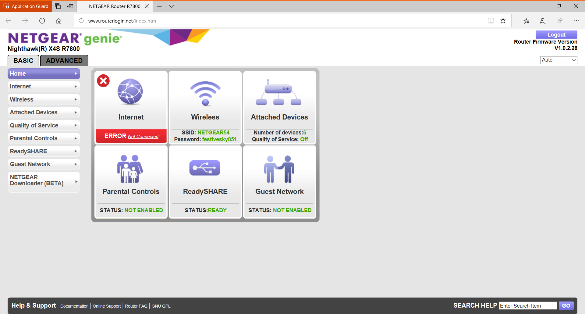
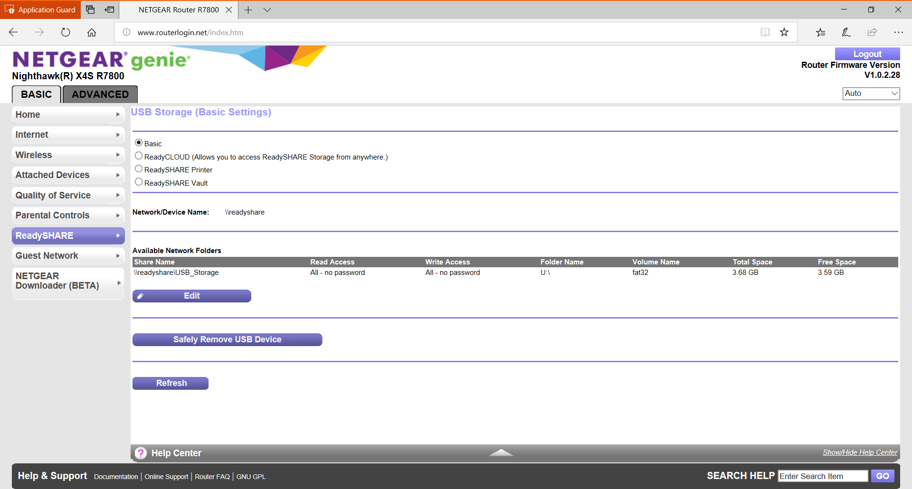
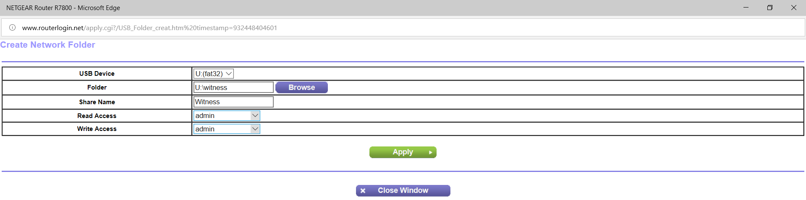
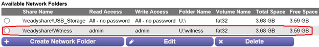

# Deploy a file share witness

> Applies to: Windows Server 2019, Windows Server 2016, Windows Server 2012 R2, Windows Server 2012

A file share witness is an SMB share that Failover Cluster uses as a vote in the cluster quorum. This topic provides an overview of the technology and the new functionality in Windows Server 2019, including using a USB drive connected to a router as a file share witness.

File share witnesses are handy in the following circumstances:  

- A cloud witness can't be used because not all servers in the cluster have a reliable Internet connection
- A disk witness can't be used because there aren't any shared drives to use for a disk witness. This could be a Storage Spaces Direct cluster, SQL Server Always On Availability Groups (AG), Exchange Database Availability Group (DAG), etc.  None of these types of clusters use shared disks.

## File share witness requirements

You can host a file share witness on a domain-joined Windows server, or if your cluster is running Windows Server 2019, any device that can host an SMB 2 or later file share.

|File server type                 | Supported clusters |
|---------------------------------|--------------------|
|Any device w/an SMB 2 file share | Windows Server 2019|
|Domain-joined Windows Server     | Windows Server 2008 and later|

If the cluster is running Windows Server 2019, here are the requirements:

- An SMB file share *on any device that uses the SMB 2 or later protocol*, including:
    - Network-attached storage (NAS) devices
    - Windows computers joined to a workgroup
    - Routers with locally-connected USB storage
- A local account on the device for authenticating the cluster
- If you're instead using Active Directory for authenticating the cluster with the file share, the Cluster Name Object (CNO) must have write permissions on the share, and the server must be in the same Active Directory forest as the cluster
- The file share has a minimum of 5 MB of free space

If the cluster is running  Windows Server 2016 or earlier, here are the requirements:

- SMB file share *on a Windows server joined to the same Active Directory forest as the cluster*
- The Cluster Name Object (CNO) must have write permissions on the share
- The file share has a minimum of 5 MB of free space

Other notes:
- To use a file share witness hosted by devices other than a domain-joined Windows server, you currently must use the **Set-ClusterQuorum -Credential** PowerShell cmdlet to set the witness, as described later in this topic.
- For high availability, you can use a file share witness on a separate Failover Cluster
- The file share can be used by multiple clusters
- The use of a Distributed File System (DFS) share or replicated storage is not supported with any version of failover clustering.  These can cause a split brain situation where clustered servers are running independently of each other and could cause data loss.

## Creating a file share witness on a router with a USB device

At [Microsoft Ignite 2018](https://azure.microsoft.com/ignite/), [DataOn Storage](http://www.dataonstorage.com/) had a Storage Spaces Direct Cluster in their kiosk area.  This cluster was connected to a [NetGear](https://www.netgear.com) Nighthawk X4S WiFi Router using the USB port as a file share witness similar to this.


The steps for creating a file share witness using a USB device on this particular router are listed below.  Note that steps on other routers and NAS appliances will vary and should be accomplished using the vendor supplied directions.


1. Log into the router with the USB device plugged in.

   

2. From the list of options, select ReadySHARE which is where shares can be created.

   

3. For a file share witness, a basic share is all that is needed.  Selecting the Edit button will pop up a dialog where the share can be created on the USB device.

   

4. Once selecting the Apply button, the share is created and can be seen in the list.

   

5. Once the share has been created, creating the file share witness for Cluster is done with PowerShell.

   ```PowerShell
   Set-ClusterQuorum -FileShareWitness \\readyshare\Witness -Credential (Get-Credential)
   ```

   This displays a dialog box to enter the local account on the device.

These same similar steps can be done on other routers with USB capabilities, NAS devices, or other Windows devices.
