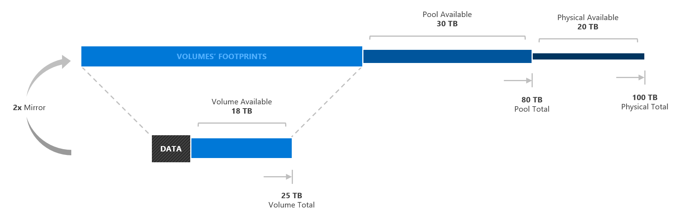

# Health Service reports
> Applies to Windows Server 2016

The Health Service is a new feature in Windows Server 2016 that improves the day-to-day monitoring and operational experience for clusters running Storage Spaces Direct.

## Reports  

The Health Service reduces the work required to get live performance and capacity information from your Storage Spaces Direct cluster. One new cmdlet provides a curated list of essential metrics, which are collected efficiently and aggregated dynamically across nodes, with built-in logic to detect cluster membership. All values are real-time and point-in-time only.  

### Coverage

In Windows Server 2016, the Health Service provides the following metrics:  
-   **IOPS** (Read, Write, Total)  
-   **IO Throughput** (Read, Write, Total)  
-   **IO Latency** (Read, Write)  
-   **Physical Capacity** (Total, Remaining)  
-   **Pool Capacity** (Total, Remaining)  
-   **Volume Capacity** (Total, Remaining)  
-   **CPU Utilization %**, All Machines Average  
-   **Memory**, All Machines (Total, Available)  

### Usage  

Use the following PowerShell cmdlet to get metrics for the entire Storage Spaces Direct cluster:

```PowerShell
Get-StorageSubSystem Cluster* | Get-StorageHealthReport
```

The optional **Count** parameter indicates how many sets of values to return, at one second intervals.  

```PowerShell
Get-StorageSubSystem Cluster* | Get-StorageHealthReport -Count <Count>  
```

You can also get metrics for one specific volume or node using the following cmdlets:  

```PowerShell
Get-Volume -FileSystemLabel <Label> | Get-StorageHealthReport -Count <Count>  

Get-StorageNode -Name <Name> | Get-StorageHealthReport -Count <Count>
```

> [!NOTE]
> The metrics returned in each case will be the subset applicable to that scope.  

### Capacity: Putting it all together  

The notion of available capacity in Storage Spaces is nuanced. To help you plan effectively, the Health Service provides six distinct metrics for capacity. Here is what each represents:  

-   **Physical Capacity Total**: The sum of the raw capacity of all physical storage devices managed by the cluster.
-   **Physical Capacity Available**: The physical capacity which is not in any non-primordial storage pool.
-   **Pool Capacity Total**: The amount of raw capacity in storage pools.
-   **Pool Capacity Available**: The pool capacity which is not allocated to the footprint of volumes.
-   **Volume Capacity Total**: The total usable ("inside") capacity of existing volumes.
-   **Volume Capacity Available**: The amount of additional data which can be stored in existing volumes.

The following diagram illustrates the relationship between these quantities.  

  

## See also

- [Health Service in Windows Server 2016](health-service-overview.md)
- [Storage Spaces Direct in Windows Server 2016](../storage/storage-spaces/storage-spaces-direct-overview.md)
