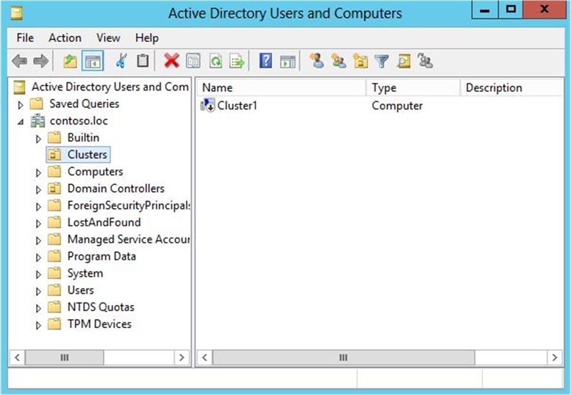
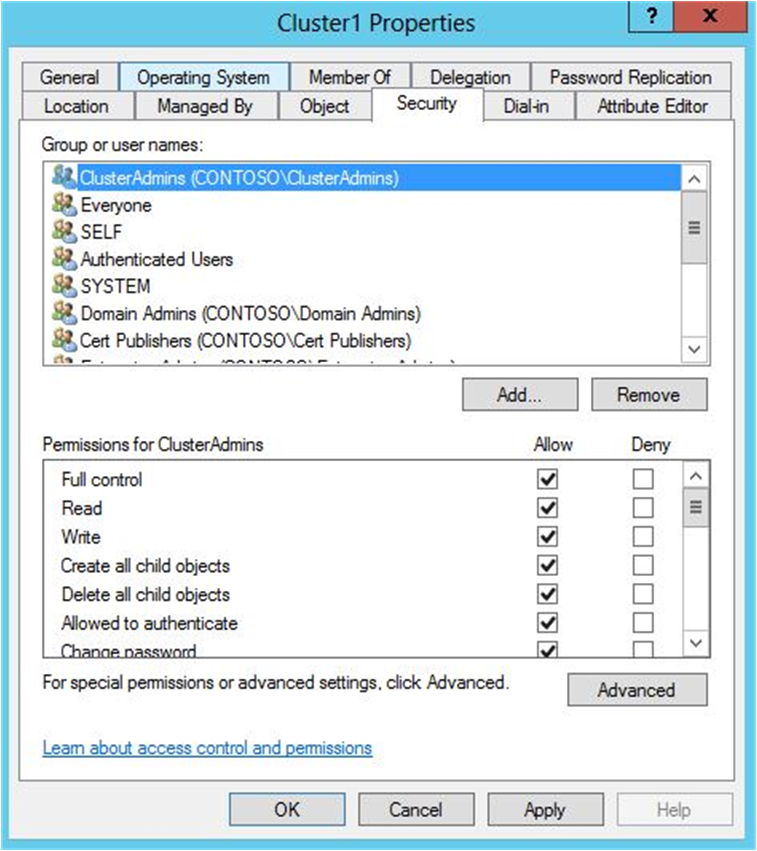
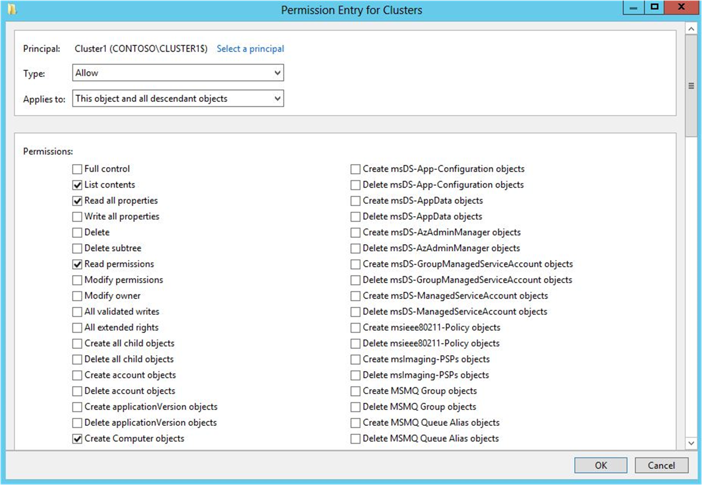

# Prestage cluster computer objects in Active Directory Domain Services

>Applies to: Windows Server 2019, Windows Server 2016, Windows Server 2012 R2, Windows Server 2012

This topic shows how to prestage cluster computer objects in Active Directory Domain Services (AD DS). You can use this procedure to enable a user or group to create a failover cluster when they do not have permissions to create computer objects in AD DS.

When you create a failover cluster by using the Create Cluster Wizard or by using Windows PowerShell, you must specify a name for the cluster. If you have sufficient permissions when you create the cluster, the cluster creation process automatically creates a computer object in AD DS that matches the cluster name. This object is called the *cluster name object* or CNO. Through the CNO, virtual computer objects (VCOs) are automatically created when you configure clustered roles that use client access points. For example, if you create a highly available file server with a client access point that is named *FileServer1*, the CNO will create a corresponding VCO in AD DS.

>[!NOTE]
>There is the option to create an Active Directory-detached cluster, where no CNO or VCOs are created in AD DS. This is targeted for specific types of cluster deployments. For more information, see [Deploy an Active Directory-Detached Cluster](<https://docs.microsoft.com/previous-versions/windows/it-pro/windows-server-2012-r2-and-2012/dn265970(v%3dws.11)>).

To create the CNO automatically, the user who creates the failover cluster must have the **Create Computer objects** permission to the organizational unit (OU) or the container where the servers that will form the cluster reside. To enable a user or group to create a cluster without having this permission, a user with appropriate permissions in AD DS (typically a domain administrator) can prestage the CNO in AD DS. This also provides the domain administrator more control over the naming convention that is used for the cluster, and control over which OU the cluster objects are created in.

## Step 1: Prestage the CNO in AD DS

Before you begin, make sure that you know the following:

- The name that you want to assign the cluster
- The name of the user account or group to which you want to grant rights to create the cluster

As a best practice, we recommend that you create an OU for the cluster objects. If an OU already exists that you want to use, membership in the **Account Operators** group is the minimum required to complete this step. If you need to create an OU for the cluster objects, membership in the **Domain Admins** group, or equivalent, is the minimum required to complete this step.

>[!NOTE]
>If you create the CNO in the default Computers container instead of an OU, you do not have to complete Step 3 of this topic. In this scenario, a cluster administrator can create up to 10 VCOs without any additional configuration.

### Prestage the CNO in AD DS

1. On a computer that has the AD DS Tools installed from the Remote Server Administration Tools, or on a domain controller, open **Active Directory Users and Computers**. To do this on a server, start Server Manager, and then on the **Tools** menu, select **Active Directory Users and Computers**.
2. To create an OU for the cluster computer objects, right-click the domain name or an existing OU, point to **New**, and then select **Organizational Unit**. In the **Name** box, enter the name of the OU, and then select **OK**.
3. In the console tree, right-click the OU where you want to create the CNO, point to **New**, and then select **Computer**.
4. In the **Computer name** box, enter the name that will be used for the failover cluster, and then select **OK**.

   >[!NOTE]
   >This is the cluster name that the user who creates the cluster will specify on the **Access Point for Administering the Cluster** page in the Create Cluster wizard or as the value of the *–Name* parameter for the **New-Cluster** Windows PowerShell cmdlet.

5. As a best practice, right-click the computer account that you just created, select **Properties**, and then select the **Object** tab. On the **Object** tab, select the **Protect object from accidental deletion** check box, and then select **OK**.
6. Right-click the computer account that you just created, and then select **Disable Account**. Select **Yes** to confirm, and then select **OK**.

   >[!NOTE]
   >You must disable the account so that during cluster creation, the cluster creation process can confirm that the account is not currently in use by an existing computer or cluster in the domain.

**Figure 1. Disabled CNO in the example Clusters OU**

## Step 2: Grant the user permissions to create the cluster

You must configure permissions so that the user account that will be used to create the failover cluster has Full Control permissions to the CNO.

Membership in the **Account Operators** group is the minimum required to complete this step.

Here's how to grant the user permissions to create the cluster:

1. In Active Directory Users and Computers, on the **View** menu, make sure that **Advanced Features** is selected.
2. Locate and then right-click the CNO, and then select **Properties**.
3. On the **Security** tab, select **Add**.
4. In the **Select Users, Computers, or Groups** dialog box, specify the user account or group that you want to grant permissions to, and then select **OK**.
5. Select the user account or group that you just added, and then next to **Full control**, select the **Allow** check box.
  
   
  
   **Figure 2. Granting Full Control to the user or group that will create the cluster**
6. Select **OK**.

After you complete this step, the user who you granted permissions to can create the failover cluster. However, if the CNO is located in an OU, the user cannot create clustered roles that require a client access point until you complete Step 3.

>[!NOTE]
>If the CNO is in the default Computers container, a cluster administrator can create up to 10 VCOs without any additional configuration. To add more than 10 VCOs, you must explicitly grant the **Create Computer objects** permission to the CNO for the Computers container.

## Step 3: Grant the CNO permissions to the OU or prestage VCOs for clustered roles

When you create a clustered role with a client access point, the cluster creates a VCO in the same OU as the CNO. For this to occur automatically, the CNO must have permissions to create computer objects in the OU.

If you prestaged the CNO in AD DS, you can do either of the following to create VCOs:

- Option 1: [Grant the CNO permissions to the OU](#grant-the-cno-permissions-to-the-ou). If you use this option, the cluster can automatically create VCOs in AD DS. Therefore, an administrator for the failover cluster can create clustered roles without having to request that you prestage VCOs in AD DS.

>[!NOTE]
>Membership in the **Domain Admins** group, or equivalent, is the minimum required to complete the steps for this option.

- Option 2: [Prestage a VCO for a clustered role](#prestage-a-vco-for-a-clustered-role). Use this option if it is necessary to prestage accounts for clustered roles because of requirements in your organization. For example, you may want to control the naming convention, or control which clustered roles are created.

>[!NOTE]
>Membership in the **Account Operators** group is the minimum required to complete the steps for this option.

### Grant the CNO permissions to the OU

1. In Active Directory Users and Computers, on the **View** menu, make sure that **Advanced Features** is selected.
2. Right-click the OU where you created the CNO in [Step 1: Prestage the CNO in AD DS](#step-1-prestage-the-cno-in-ad-ds), and then select **Properties**.
3. On the **Security** tab, select **Advanced**.
4. In the **Advanced Security Settings** dialog box, select **Add**.
5. Next to **Principal**, select **Select a principal**.
6. In the **Select User, Computer, Service Account, or Groups** dialog box, select **Object Types**, select the **Computers** check box, and then select **OK**.
7. Under **Enter the object names to select**, enter the name of the CNO, select **Check Names**, and then select **OK**. In response to the warning message that says that you are about to add a disabled object, select **OK**.
8. In the **Permission Entry** dialog box, make sure that the **Type** list is set to **Allow**, and the **Applies to** list is set to **This object and all descendant objects**.
9. Under **Permissions**, select the **Create Computer objects** check box.

   

   **Figure 3. Granting the Create Computer objects permission to the CNO**
10. Select **OK** until you return to the Active Directory Users and Computers snap-in.

An administrator on the failover cluster can now create clustered roles with client access points, and bring the resources online.

### Prestage a VCO for a clustered role

1. Before you begin, make sure that you know the name of the cluster and the name that the clustered role will have.
2. In Active Directory Users and Computers, on the **View** menu, make sure that **Advanced Features** is selected.
3. In Active Directory Users and Computers, right-click the OU where the CNO for the cluster resides, point to **New**, and then select **Computer**.
4. In the **Computer name** box, enter the name that you will use for the clustered role, and then select **OK**.
5. As a best practice, right-click the computer account that you just created, select **Properties**, and then select the **Object** tab. On the **Object** tab, select the **Protect object from accidental deletion** check box, and then select **OK**.
6. Right-click the computer account that you just created, and then select **Properties**.
7. On the **Security** tab, select **Add**.
8. In the **Select User, Computer, Service Account, or Groups** dialog box, select **Object Types**, select the **Computers** check box, and then select **OK**.
9. Under **Enter the object names to select**, enter the name of the CNO, select **Check Names**, and then select **OK**. If you receive a warning message that says that you are about to add a disabled object, select **OK**.
10. Make sure that the CNO is selected, and then next to **Full control**, select the **Allow** check box.
11. Select **OK**.

An administrator on the failover cluster can now create the clustered role with a client access point that matches the prestaged VCO name, and bring the resource online.

## More information

- [Failover Clustering](failover-clustering.md)
- [Configuring cluster accounts in Active Directory](configure-ad-accounts.md)