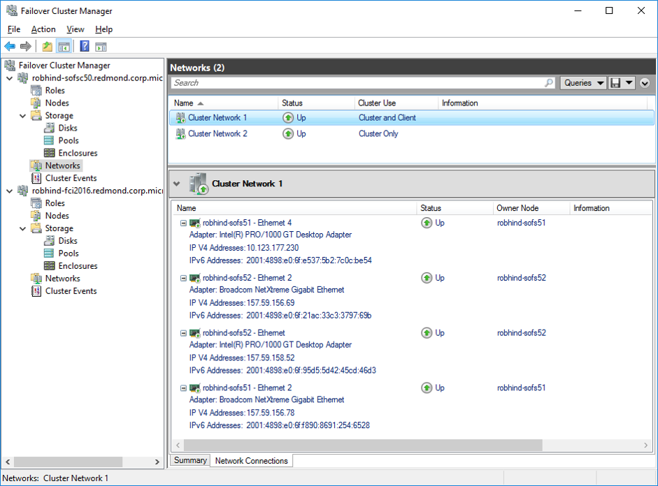
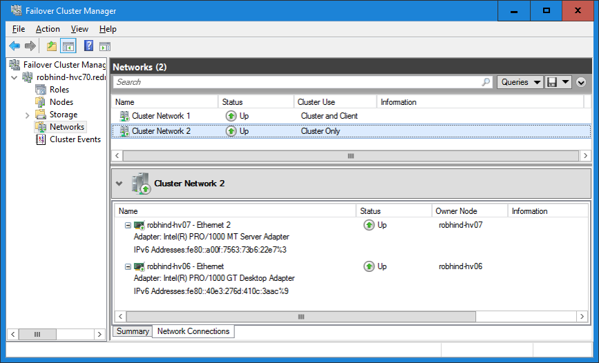
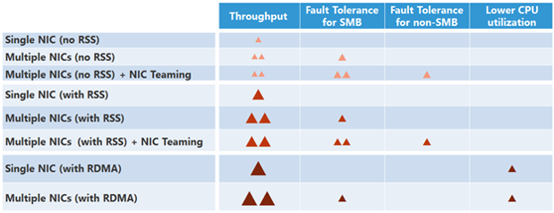

# Simplified SMB Multichannel and Multi-NIC Cluster Networks

> Applies to: Windows Server 2019, Windows Server 2016

Simplified SMB Multichannel and Multi-<abbr title="Network Interface Card">NIC</abbr> Cluster Networks is a feature that enables the use of multiple NICs on the same cluster network subnet, and automatically enables SMB Multichannel.

Simplified SMB Multichannel and Multi-NIC Cluster Networks provides the following benefits:  
- Failover Clustering automatically recognizes all NICs on nodes that are using the same switch / same subnet - no additional configuration needed.  
- SMB Multichannel is enabled automatically.  
- Networks that only have IPv6 Link Local (fe80) IP Addresses resources are recognized on cluster-only (private) networks.  
- A single IP Address resource is configured on each Cluster Access Point (CAP) Network Name (NN) by default.  
- Cluster validation no longer issues warning messages when multiple NICs are found on the same subnet.  

## Requirements  
-   Multiple NICs per server, using the same switch / subnet.  

## How to take advantage of multi-NIC clusters networks and simplified SMB multichannel  
This section describes how to take advantage of the new multi-NIC clusters networks and simplified SMB multichannel features.  

### Use at least two networks for Failover Clustering   
Although it is rare, network switches can fail - it is still best practice to use at least two networks for Failover Clustering. All networks that are found are used for cluster heartbeats. Avoid using a single network for your Failover Cluster in order to avoid a single point of failure. Ideally, there should be multiple physical communication paths between the nodes in the cluster, and no single point of failure.  

  
**Figure 1: Use at least two networks for Failover Clustering**  

### Use Multiple NICs across clusters  

Maximum benefit of the simplified SMB multichannel is achieved when multiple NICs are used across clusters - in both storage and storage workload clusters. This allows the workload clusters (Hyper-V, SQL Server Failover Cluster Instance, Storage Replica, etc.) to use SMB multichannel and results in more efficient use of the network. In a converged (also known as disaggregated) cluster configuration where a Scale-out File Server cluster is used for storing workload data for a Hyper-V or SQL Server Failover Cluster Instance cluster, this network is often called "the North-South subnet" / network. Many customers maximize throughput of this network by investing in RDMA capable NIC cards and switches.  

  
**Figure 2: To achieve maximum network throughput, use multiple NICs on both the Scale-out File Server cluster and the Hyper-V or SQL Server Failover Cluster Instance cluster - which share the North-South subnet**  

  
**Figure 3: Two clusters (Scale-out File Server for storage, SQL Server <abbr title="Failover Clustering Instance">FCI</abbr> for workload) both use multiple NICs in the same subnet to leverage SMB Multichannel and achieve better network throughput.** 

## Automatic recognition of IPv6 Link Local private networks  
When private (cluster only) networks with multiple NICs are detected, the cluster will automatically recognize IPv6 Link Local (fe80) IP addresses for each NIC on each subnet. This saves administrators time since they no longer have to manually configure IPv6 Link Local (fe80) IP Address resources.  

When using more than one private (cluster only) network, check the IPv6 routing configuration to ensure that routing is not configured to cross subnets, since this will reduce network performance.  

  
**Figure 4: Automatic IPv6 Link Local (fe80) Address resource configuration**  

## Throughput and Fault Tolerance  
Windows Server 2019 and Windows Server 2016 automatically detect NIC capabilities and will attempt to use each NIC in the fastest possible configuration. NICs that are teamed, NICs using RSS, and NICs with RDMA capability can all be used. The table below summarizes the trade-offs when using these technologies. Maximum throughput is achieved when using multiple RDMA capable NICs. For more information, see [The basics of SMB Mutlichannel](https://blogs.technet.microsoft.com/josebda/2012/06/28/the-basics-of-smb-multichannel-a-feature-of-windows-server-2012-and-smb-3-0/).

  
**Figure 5: Throughput and fault tolerance for various NIC conifigurations**   

## Frequently asked questions  
**Are all NICs in a multi-NIC network used for cluster heart beating?**  
    Yes.  

**Can a multi-NIC network be used for cluster communication only? Or can it only be used for client and cluster communication?**  
    Either configuration will work - all cluster network roles will work on a multi-NIC network.  

**Is SMB Multichannel also used for CSV and cluster traffic?**  
    Yes, by default all cluster and CSV traffic will use available multi-NIC networks. Administrators can use the Failover Clustering PowerShell cmdlets or Failover Cluster Manager UI to change the network role.  

**How can I see the SMB Multichannel settings?**  
    Use the **Get-SMBServerConfiguration** cmdlet, look for the value of the EnableMultiChannel property.  

**Is the cluster common property PlumbAllCrossSubnetRoutes respected on a multi-NIC network?**  
     Yes.  

## See also  
- [What's New in Failover Clustering in Windows Server](whats-new-in-failover-clustering.md)  
