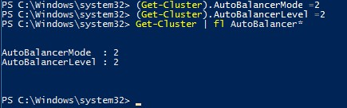

# Virtual Machine Load Balancing deep-dive

> Applies to: Windows Server 2019, Windows Server 2016

The [Virtual Machine Load Balancing feature](vm-load-balancing-overview.md) optimizes the utilization of nodes in a Failover Cluster. This document describes how to configure and control VM Load Balancing. 

## <a id="heuristics-for-balancing"></a>Heuristics for balancing
Virtual Machine Load Balancing evaluates a node's load based on the following heuristics:
1. Current **memory pressure**: Memory is the most common resource constraint on a Hyper-V host
2. CPU **utilization** of the Node averaged over a 5 minute window: Mitigates a node in the cluster becoming over-committed

## <a id="controlling-aggressiveness-of-balancing"></a>Controlling the aggressiveness of balancing
The aggressiveness of balancing based on the Memory and CPU heuristics can be configured using the by the cluster common property 'AutoBalancerLevel'. To control the aggressiveness run the following in PowerShell:

```PowerShell
(Get-Cluster).AutoBalancerLevel = <value>
```

| AutoBalancerLevel | Aggressiveness | Behavior |
|-------------------|----------------|----------|
| 1 (default) | Low | Move when host is more than 80% loaded |
| 2 | Medium | Move when host is more than 70% loaded |
| 3 | High | Average nodes and move when host is more than 5% above average | 



## Controlling VM Load Balancing
VM Load Balancing is enabled by default and when load balancing occurs can be configured by the cluster common property 'AutoBalancerMode'. To control when Node Fairness balances the cluster:

### Using Failover Cluster Manager:
1. Right-click on your cluster name and select the "Properties" option  
    

2.  Select the "Balancer" pane  
    

### Using PowerShell:
Run the following:
```powershell
(Get-Cluster).AutoBalancerMode = <value>
```

|AutoBalancerMode |Behavior| 
|:----------------:|:----------:|
|0| Disabled| 
|1| Load balance on node join| 
|2 (default)| Load balance on node join and every 30 minutes |

## VM Load Balancing vs. System Center Virtual Machine Manager Dynamic Optimization
The node fairness feature, provides in-box functionality, which is targeted towards deployments without System Center Virtual Machine Manager (SCVMM). SCVMM Dynamic Optimization is the recommended mechanism for balancing virtual machine load in your cluster for SCVMM deployments. SCVMM automatically disables the Windows Server VM Load Balancing when Dynamic Optimization is enabled.

## See Also
* [Virtual Machine Load Balancing Overview](vm-load-balancing-overview.md)
* [Failover Clustering](failover-clustering-overview.md)
* [Hyper-V Overview](../virtualization/hyper-v/Hyper-V-on-Windows-Server.md)
