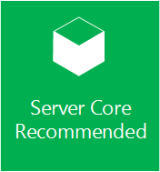
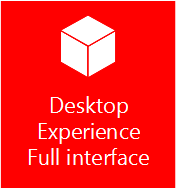

# Windows Server 2016 

<table border=0 width="100%">
  <tr>
    <td colspan='4' style='padding:0;'></td>
  </tr>
  <tr colspan='4'>
    [What's New in Windows Server 2016?](What-s-New-in-Windows-Server-2016-Technical-Preview-5.md)</tr>
  <tr style='text-align:center;'>
    <td style='width:25%'>
      
    [Get started](Server-Basics.md)</td>
    <td style='width:25%'>
      
    [Compute](../compute/Compute.md)</td>
    <td style='width:25%'>  [Failover clustering](../failover-clustering/failover-clustering-overview.md)
    </td>
    <td style='width:25%'>
      
    [Identity and Access](../identity/Identity-and-Access.md)</td>
  </tr>
  <tr style='text-align:center;'>
  <td style='width:25%'>
    
  [Security and Assurance](../security/Security-and-Assurance.md)</td>
  <td style='width:25%'>
    
  [Networking](windows-server-technology-area.md)</td>
  <td style='width:25%'>
    
  [Storage](../storage/storage.md)</td>
  <td style='width:25%'>
    
  [Management and  Automation](../management/Management-and-Automation.md)</td>
  </tr>
</table>

> [!Note]  
> To experience first-hand new features and functionality available in Windows Server 2016, you can download an evaluation version by visiting [Windows Server Evaluations](https://www.microsoft.com/en-us/evalcenter/evaluate-windows-server-2016?i=1).  
>   

## Windows Server 2016 editions

Windows Server 2016 is available in Standard, Datacenter, and Essentials editions. Windows Server 2016 Datacenter includes unlimited virtualization rights plus new features to build a software-defined datacenter. Windows Server 2016 Standard offers enterprise-class features with limited virtualization rights. Windows Server Essentials is an ideal cloud-connected first server. It has its own [extensive documentation](http://go.microsoft.com/fwlink/?LinkID=827171)—the content here focuses on Standard and Datacenter editions. The following table briefly summarizes the key differences between Standard and Datacenter editions:

|Feature|Datacenter|Standard|  
|-------------------|----------|-----------------------|  
|Core functionality of Windows Server| yes| yes|
|OSEs / Hyper-V containers|Unlimited|	2|
|Windows Server containers|Unlimited|	Unlimited|
|Host Guardian Service| yes| yes|
|Nano Server installation option| yes| yes|
|Storage features including Storage Spaces Direct and Storage Replica| yes| no|
|Shielded Virtual Machines| yes| no|
|Networking stack| yes| no|

For more information, see [Pricing and licensing for Windows Server 2016](https://www.microsoft.com/cloud-platform/windows-server-pricing) and [Compare features in Windows Server versions](https://www.microsoft.com/cloud-platform/windows-server-comparison).

## Installation options

Both Standard and Datacenter editions offer three installation options:

- **Server Core:** reduces the space required on disk, the potential attack surface, and especially the servicing requirements. This is the **recommended** option unless you have a particular need for additional user interface elements and graphical management tools.
- **Server with Desktop Experience:** installs the standard user interface and all tools, including client experience features that required a separate installation in Windows Server 2012 R2. Server roles and features are installed with Server Manager or by other methods.
- **Nano Server:** is a remotely administered server operating system optimized for private clouds and datacenters. It is similar to Windows Server in Server Core mode, but significantly smaller, has no local logon capability, and only supports 64-bit applications, tools, and agents. It takes up far less disk space, sets up significantly faster, and requires far fewer updates and restarts than the other options.

Now that you know which edition and installation option is right for you, click below to get started with Windows Server 2016.

<table border=0 width="100%">
  <tr style='text-align:center;'>
    <td style='width:34%'></td>
    <td style='width:33%'></td>
    <td style='width:33%'></td>
  </tr>
</table>