# Example: Troubleshooting Active Directory Based Activation (ADBA) clients that do not activate

> [!NOTE]
> This article was originally published as a TechNet blog on March 26, 2018.

Hello everyone! My name is Mike Kammer, and I have been a Platforms PFE with Microsoft for just over two years now. I recently helped a customer with deploying Windows Server 2016 in their environment. We took this opportunity to also migrate their activation methodology from a KMS Server to [Active Directory Based Activation](https://docs.microsoft.com/previous-versions/windows/hh852637(v=win.10)).

As proper procedure for making all changes, we started our migration in the customer’s test environment. We began our deployment by following the instructions in this excellent blog post by Charity Shelbourne, [Active Directory-Based Activation vs. Key Management Services](https://techcommunity.microsoft.com/t5/Core-Infrastructure-and-Security/Active-Directory-Based-Activation-vs-Key-Management-Services/ba-p/256016). The domain controllers in our test environment were all running Windows Server 2012 R2, so we did not need to prep our forest. We installed the role on a Windows Server 2012 R2 Domain Controller and chose Active Directory Based Activation as our volume activation method. We installed our KMS key and gave it a name of "KMS AD Activation ( ** LAB)". We pretty much followed the blog post step by step.

We started by building four virtual machines, two Windows 2016 Standard and two Windows 2016 Datacenter. At this point everything was great, and everyone was happy. We built a physical server running Windows 2016 Standard, and the machine activated properly. And that’s where our story ends.

Ha Ha! Just kidding! Nothing is ever that easy. Truthfully, the set up and configuration were super easy, so that part was simple and straight forward. I came back into the office on Monday, and all the virtual machines I had built the week prior showed that they weren’t activated. Hey! That’s not right! I went back to the physical machine and it was fine. I went to the customer to discuss what had happened. Of course, the first question was “What changed over the weekend?” And as usual the answer was “nothing.” This time, nothing really had been changed, and we had to figure out what was going on.

I went to one of my problem servers, opened a command prompt, and checked my output from the **slmgr /ao-list** command. The **/ao-list** switch displays all activation objects in Active Directory.

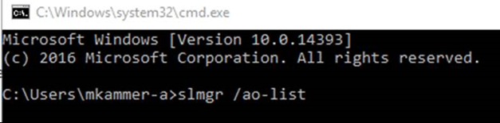

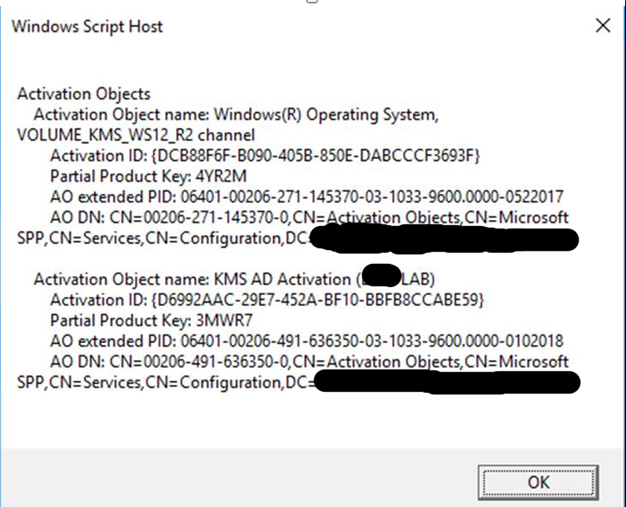

The results show that we have two Activation Objects: one for Server 2012 R2, and our newly created KMS AD Activation (** LAB) which is our Windows Server 2016 license. This confirms our Active Directory is correctly configured to activate Windows KMS Clients

Knowing that the **slmgr** command is my friend for license activation, I continued with different options. I tried the **/dlv** switch, which will display detailed license information. This looked fine to me, I was running the Standard version of Windows Server 2016, there’s an Activation ID, an Installation ID, a validation URL, even a partial Product Key.

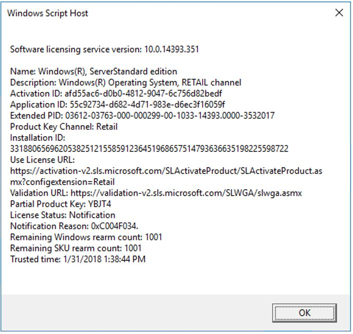

Does anyone see what I missed at this point? We’ll come back to it after my other troubleshooting steps but suffice it to say the answer is in this screenshot.

My thinking now is that for some reason the key is broken, so I use the **/upk** switch, which uninstalls the current key. While this was effective in removing the key, it is generally not the best way to do it. Should the server get rebooted before getting a new key it may leave the server in a bad state. I found that using the **/ipk** switch (which I do later in my troubleshooting) overwrites the existing key and is a much safer route to take. Learn from my missteps!

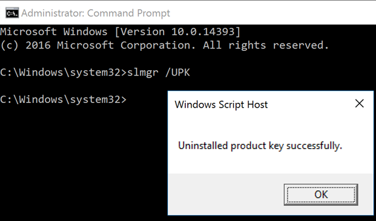

I ran the **/dlv** switch again, to see the detailed license information. Unfortunately for me that didn’t give me any helpful information, just a product key not found error. Because, of course, there’s no key since I just uninstalled it!

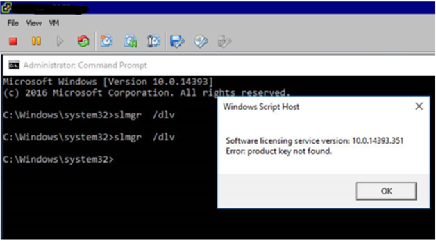

I figured it was a longshot, but I tried the **/ato** switch, which should activate Windows against the known KMS servers (or Active Directory as the case may be). Again, just a product not found error.

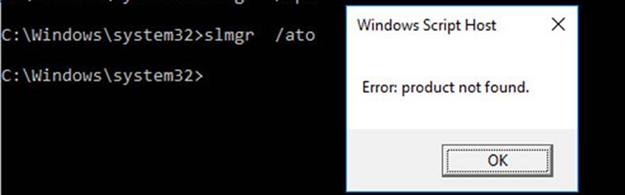

My next thought was that sometimes stopping and starting a service does the trick, so I tried that next. I need to stop and start the Microsoft Software Protection Platform Service (SPPSvc service). From an administrative command prompt, I use the trusty **net stop** and **net start** commands. I notice at first that the service isn’t running, so I think this must be it!

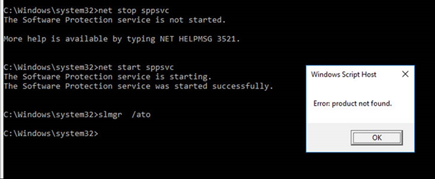

But no. After starting the service and attempting to activate Windows again, I still get the product not found error.

I then looked at the Application Event Log on one of the trouble servers. I find an error related to License Activation, Event ID 8198, that has a code of 0x8007007B.

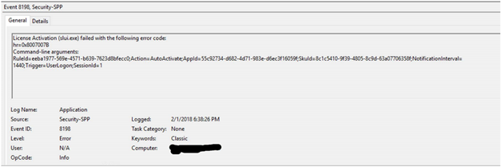

While looking up this code, I found an article that says my error code means that the file name, directory name, or volume label syntax is incorrect. Reading through the methods described in the article, it didn’t seem that any of them fit my situation. When I ran the **nslookup -type=all _vlmcs._tcp** command, I found the existing KMS server (still lots of Windows 7 and Server 2008 machines in the environment, so it was necessary to keep it around), but also the five domain controllers as well. This indicated that it was not a DNS problem and my issues were elsewhere.

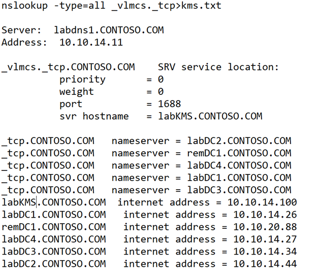

So I know DNS is fine. Active Directory is properly configured as a KMS activation source. My physical server has been activated properly. Could this be an issue with just VMs? As an interesting side note at this point, my customer informs me that someone in a different department has decided to build more than a dozen virtual Windows Server 2016 machines as well. So now I assume I’ve got another dozen servers to deal with that won’t be activating. But no! Those servers activated just fine.

Well, I headed back to my **slmgr** command to figure out how to get these monsters activated. This time I’m going to use the **/ipk** switch, which will allow me to install a product key. I went to [this site](https://docs.microsoft.com/previous-versions/windows/it-pro/windows-server-2012-R2-and-2012/jj612867(v=ws.11)) to get the appropriate keys for my Standard version of Windows Server 2016. Some of my servers are Datacenter, but I need to fix this one first.

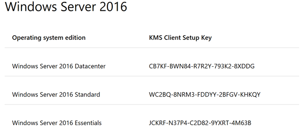

I used the **/ipk** switch to install a product key, choosing the Windows Server 2016 Standard key.

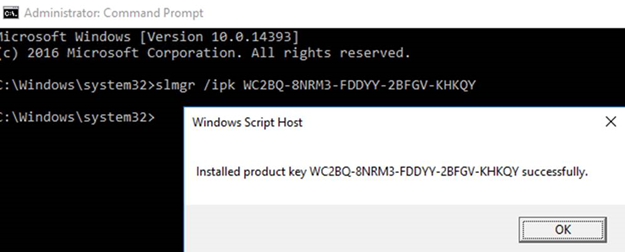

From here on out I only captured results from my Datacenter experiences, but they were the same. I used the **/ato** switch to force the activation. We get the awesome message that the product has been activated successfully!

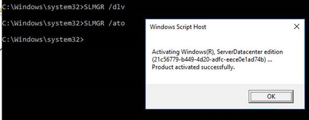

Using the **/dlv** switch again, we can see that now we have been activated by Active Directory.

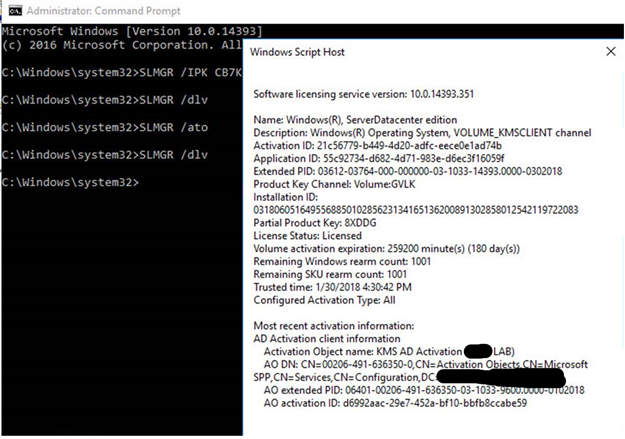

Now, what had gone wrong? Why did I have to remove the installed key and add those generic keys to get these machines to activate properly? Why did the other dozen or so machines activate with no issues? As I said earlier, I missed something key in the initial stages of looking at the issue. I was thoroughly confused, so reached out to Charity from the initial blog post to see if she could help me. She saw the problem right away and helped me understand what I had missed early on.

When I ran the first **/dlv** switch, in the description was the key. The description was Windows® Operating System, RETAIL Channel. I had looked at that and thought that RETAIL Channel meant that it had been purchased and was a valid key.

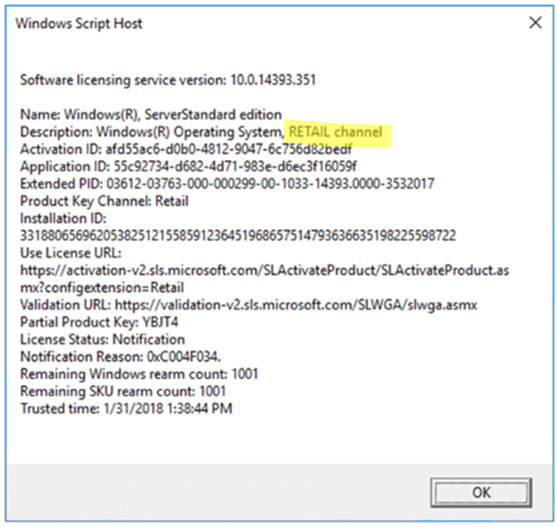

When we look at the output of the **/dlv** switch from a properly activated server, notice the description now states VOLUME_KMSCLIENT channel. This lets us know that it is indeed a volume license.

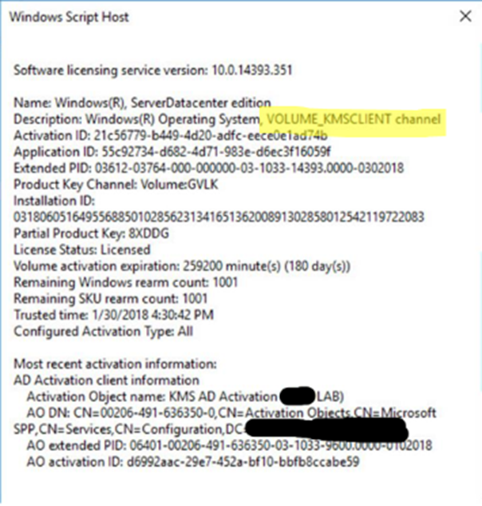

So what does that RETAIL channel mean then? Well, it means the media that was used to install the operating system was an MSDN ISO. I went back to my customer and asked if, by some chance, there was a second Windows Server 2016 ISO floating around the network. Turns out that yes, there was another ISO on the network, and it had been used to create the other dozen machines. They compared the two ISOs and sure enough the one that was given to me to build the virtual servers was, in fact, an MSDN ISO. They removed that MSDN ISO from their network and now we have all our existing servers activated and no more worries about the activation failing on future builds.

I hope this has been helpful and may save you some time going forward!

Mike
