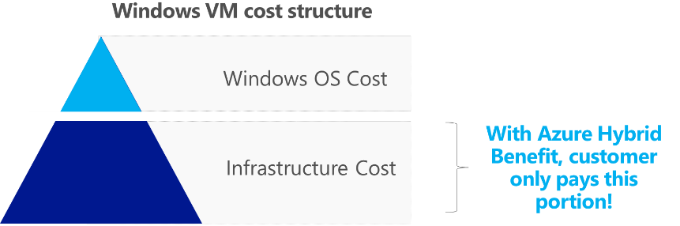
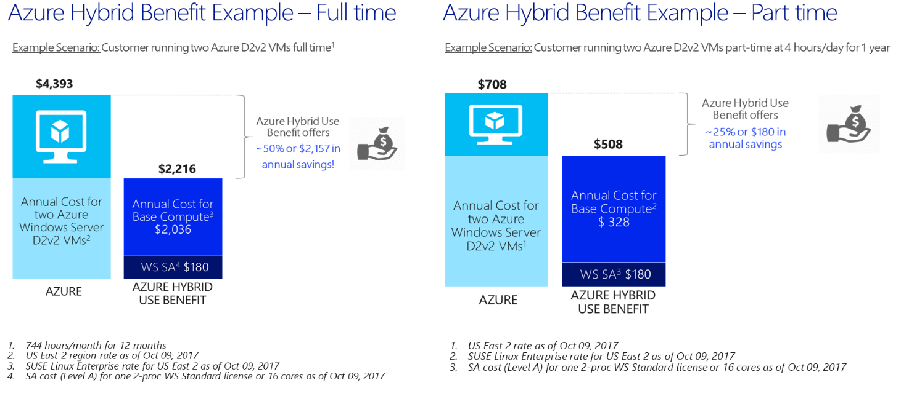
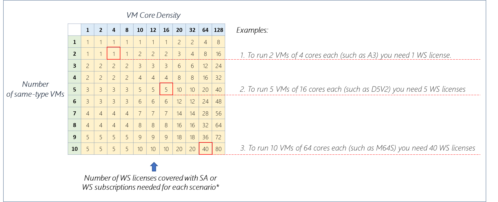
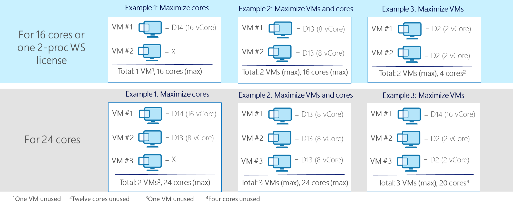
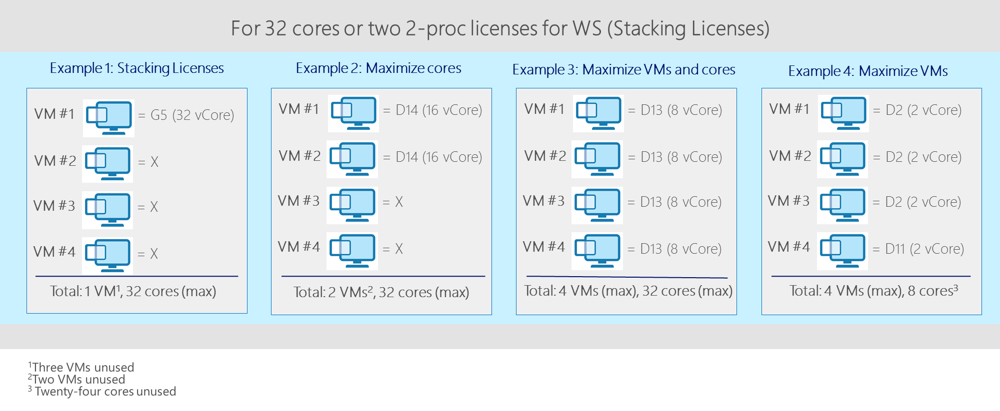
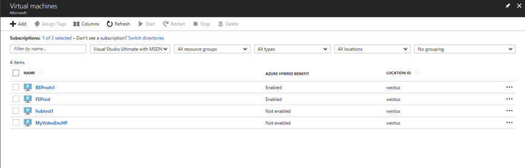

# Azure Hybrid Benefit for Windows Server

>Applies to: Windows Server 2019, Windows Server 2016, Windows Server 2012 R2

## Benefit description, rules, and use cases

The Azure Hybrid Benefit for Windows Server allows you to save up to 40% on Windows Server VMs in Azure by utilizing your on-premises Windows Server licenses with Software Assurance.  With this benefit, customers need to only pay for the infrastructure costs of the virtual machine because the licensing for Windows Server is covered by the Software Assurance benefit.  The benefit is applicable to both Standard and Datacenter editions of Windows Server for the Windows Server 2012 R2, Windows Server 2016, and Windows Server 2019 releases. This benefit is available across all regions and sovereign clouds.



All you need to qualify for the benefit is an active Software Assurance or Subscription License such as EAS, SCE subscription or Open Value Subscription on their Windows Server licenses.

Each Windows Server 2-processor license with active SA/Subscription, and each set of 16 Windows Server core licenses with SA/Subscription, entitles the customer to use Windows Server on Microsoft Azure on up to 16 virtual cores allocated across two or fewer Azure Base Instances (virtual machines). Each additional set of 8 core licenses with SA/Subscription entitles use on up to 8 virtual cores and one Base Instance (VM).

| License with SA/Subscription            | VMs and cores granted            | How they can be used                                |
|-----------------------------------------|----------------------------------|-----------------------------------------------------|
| WS Datacenter (16 cores or a 2-proc L)  | Up to two VMs and up to 16 cores | Run virtual machines both on premises and in Azure  |
| WS Standard (16 cores or a 2-proc L)    | Up to two VMs and up to 16 cores | Run virtual machines either on premises or in Azure |

VMs utilizing the Azure Hybrid Benefit can run in Azure only during the SA / Subscription term. When approaching SA/Subscription expiry time, the customer has an option to either renew their SA/subscription, turn off the hybrid benefit functionality for that VM or de-provision the VM using the hybrid benefit.

### Savings examples



Below you can find a reference table to assist you with understanding the benefit rules with more granularity.
The green column shows the quantity of same-type VMs and the blue row shows the core density of each VM. The yellow cells show the number of 2-proc licenses (or sets of 16 cores) one must have to deploy a certain number of VMs of a certain core density.

Windows Server with SA Requirements Reference Table:



The Azure Hybrid Benefit for Windows Server also allows flexibility to run configurations as per your needs as well as combining VMs of different types.

Example configurations for several licensing positions:





If you want to learn more about the Azure Hybrid Benefit for Windows Server, please go to the Azure Hybrid Benefit website.

## How to maintain compliance

Customers seeking to apply the Azure Hybrid Benefit to their Windows Server VMs need to verify the number of eligible licenses and respective coverage period of their SA/Subscription before any activation of this benefit and apply the guidelines above to deploy the correct number of VMs with the benefit.
If you already have VMs running with the Azure Hybrid Benefit, you will need to perform an inventory of how many units you are running, and check against the active SA licenses you have.  Please contact your Microsoft Enterprise Agreement licensing specialist to validate your SA licensing position.
To see and count all virtual machines deployed with Azure Hybrid Benefit for Windows Server in a subscription, you can do one of the below:

1. Configure the Microsoft Azure Portal to show Azure Hybrid Benefit for Windows Server utilization
Add the column “Azure Hybrid Benefit” in the list view of the virtual machines section in the Microsoft Azure Portal.

    

2.	Use PowerShell to list Azure Hybrid Benefit for Windows Server utilization

    ```
    $vms = Get-AzureRMVM
    foreach ($vm in $vms) {"VM Name: " + $vm.Name, "   Azure Hybrid Benefit for Windows Server: "+ $vm.LicenseType}
    ```

3.	Look at your Microsoft Azure bill to determine how many virtual machines with Azure Hybrid Benefit for Windows Server you are running. The information about the number of instances with the benefit shows under ‘Additional Info':

    ```
    "{"ImageType":"WindowsServerBYOL","ServiceType":"Standard_A1","VMName":"","UsageType":"ComputeHR"}"
    ```

Please note that billing does not apply in real time, i.e. there will be a few hours delay from the time you've activated a VM with the hybrid benefit before it shows on the bill.
You can then populate the results in the **Azure Hybrid Benefit for Windows Server SA Count Tool** below to get to the number of WS licenses covered with SA or Subscriptions that are required.

Be sure to perform an inventory in each subscription that you own to generate a comprehensive view of your licensing position.

> [Azure Hybrid Benefit WS SA Count Tool](https://download.microsoft.com/download/7/1/2/712FEFF0-155C-4ABF-96C0-CE4EC4DB0516/Azure_Hybrid_Benefit_Windows_Server_SA_Count_Tool.xlsx)

If you performed the above and confirmed you are fully licensed for the number of Azure Hybrid Benefit instances you are running, there is no need for any further action. If you discovered you can cover incremental VMs with the benefit, you may want to optimize your costs further by switching to running instances with the benefit vs full cost.

If you do not have enough eligible Windows Server licenses for the number of VMs already deployed, you either need to purchase additional Windows Server on-premises licenses covered with Software Assurance through one of the channels listed below, purchase Windows Server VMs at regular hourly rates or turn off the Hybrid Benefit functionality for some VMs. Please note that you may buy core licenses in the increment of 8 cores, to qualify for each additional Azure Hybrid Benefit VM.

Windows Server Software Assurance and/or Subscriptions are available for purchase through one of a combination of the following Microsoft licensing channels:

| Channel                      | Open     | OVS	     | Select/ Select Plus	| MPSA 	     | EA/EAS   |
|------------------------------|----------|----------|-----------------------|-----------|----------|
| Typical size (# of devices)  | 5-250    | 5-250    | >250                  | >250      | >500     |
| SA / Subscription            | Optional | Included | Optional              | Optional  | Included |

Microsoft reserves the right to audit end customer at any time to verify eligibility for Azure Hybrid Benefit utilization.

## Deployment guidance

We have enabled pre-built gallery images availability for all our customers who have eligible licenses, irrespective of where they bought them, as well as enabled partners to be able to perform the deployments on customers' behalf.

Please find the instructions for all available deployment options [here](https://azure.microsoft.com/pricing/hybrid-use-benefit/), including:
-	Detailed video highlighting the new deployment experience utilizing pre-built gallery images
-	Detailed instructions on uploading a custom-built VM
-	Detailed instructions on migrating existing virtual machines using Azure Site recovery using PowerShell.
