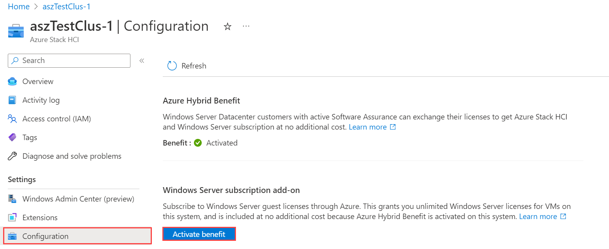

# Azure Hybrid Benefit for Windows Server

Azure Hybrid Benefit (AHB) is a cost saving benefit that lets you use your on-premises licenses with Software Assurance (SA) enabled in the cloud. This article focuses on benefits for Windows Server licenses with SA: cost savings for Windows Server virtual machines (VMs) in Azure, Azure Stack HCI, and Azure Kubernetes Service (AKS) on Azure Stack HCI and Windows Server.

For other benefits of AHB (for example, SQL Server), see [Azure Hybrid Benefit](https://azure.microsoft.com/pricing/hybrid-benefit/#why-azure-hybrid-benefit).

## What qualifies you for AHB?

To qualify for Azure Hybrid Benefit for Windows Server, you need on-premises core licenses for Windows Server with active Software Assurance. Software Assurance is only available as part of a commercial licensing agreement. To learn more about volume licensing and which agreements it's available with, see [Microsoft Software Assurance](https://www.microsoft.com/licensing/licensing-programs/software-assurance-default). To learn more about Windows Server core licenses, see [Windows Server product licensing](https://www.microsoft.com/licensing/product-licensing/windows-server?rtc=1).

> [!IMPORTANT]
> Workloads using Azure Hybrid Benefit can run only during the Software Assurance term. When the Software Assurance term approaches expiration, you must either renew your agreement with Software Assurance, disable the hybrid benefit functionality, or de-provision those workloads that are using Azure Hybrid Benefit.

## What's included in AHB for Windows Server?

Customers with Windows Server Software Assurance can use the Azure Hybrid Benefit to further reduce costs in the cloud and in datacenter and edge locations.

AHB includes the following cost savings:

- **Windows Server VMs on Azure:** The license for Windows Server is covered by AHB, so you only need to pay for the base compute rate of the virtual machine. The base compute rate is equal to the Linux rate for virtual machines.

- **Azure Stack HCI:** The Azure Stack HCI host fee and Windows Server subscription fee are waived with AHB. That is, unlimited virtualization rights are provided at no extra cost. You still pay other costs associated with Azure Stack HCI (for example, customer-managed hardware, Azure services, and workloads).

- **AKS:** Run AKS on Windows Server and Azure Stack HCI at no additional cost. You will still pay for the underlying host infrastructure and any licenses for Windows containers unless you're also eligible for AHB for Azure Stack HCI. With AHB for Azure Stack HCI, you can waive fees for the Azure Stack HCI host and Windows Server subscription.


## Pricing for AHB

To evaluate your potential cost savings, you can use these resources:

- **Windows VMs on Azure:** [Windows Virtual Machine Pricing](https://azure.microsoft.com/pricing/details/virtual-machines/windows). Use the Azure Hybrid Benefit Savings Calculator to estimate cost savings, or compare Windows VM pricing with and without AHB.  

- **Azure Stack HCI:** [Azure Stack HCI pricing](https://azure.microsoft.com/pricing/details/azure-stack/hci).  

- **Azure Kubernetes Service (AKS):** [AKS on Azure Stack HCI pricing](https://azure.microsoft.com/pricing/details/azure-stack/aks-hci).

## Getting AHB for Windows VMs in Azure

### Licensing prerequisites

#### Types of license

- Windows Server Standard with active Software Assurance, or
- Windows Server Datacenter with active Software Assurance, or
- An eligible Cloud Solution Provider (CSP) subscription

#### Number of licenses

- The minimum set of 16-core licenses, either Windows Server Datacenter or Windows Server Standard edition, entitles use on up to 16 virtual cores allocated across 2 or fewer virtual machines.

- Each additional set of 8-core licenses entitles use on up to 8 virtual cores on 1 virtual machine.

- *Stacking licenses:* To run a virtual machine with more than 16 cores, you can stack licenses. For example, with two 16-core license packs, you can run a virtual machine with up to 32 cores. Each virtual machine, regardless of its size, must be licensed with a minimum of 8 cores. You can then stack more core licenses on top, up to the number that you need.

#### Use rights

- **Windows Server Standard edition:** Licenses must be used either on-premises or in Azure, but not at the same time. The only exception is on a onetime basis, for up to 180 days, to allow you to migrate the same workloads to Azure.  

- **Windows Server Datacenter edition:** Licenses allow for simultaneous usage on-premises and in Azure. Dual Use Rights don't apply for licenses allocated for [Unlimited Virtualization Rights](#unlimited-virtualization), below.

#### Unlimited virtualization

Unlimited virtualization refers to the right to use any number of Windows Server VMs on a host.  

- **Windows Server Datacenter edition:** You can use your Windows Server licenses for any number of VMs on an Azure Dedicated Host, provided you allocate Windows Server Datacenter Licenses with SA for all of the physical cores available to you on that Azure server.

- **Windows Server Standard edition:** Unlimited Virtuallization Rights aren't available.  

### How to apply AHB for Windows VMs in Azure

To learn how to deploy Windows Server VMs in Azure with AHB, follow the steps in [Explore Azure Hybrid Benefit for Windows VMs](/azure/virtual-machines/windows/hybrid-use-benefit-licensing).

To activate your AHB benefit, sign in on the Azure Portal, and open your Azure Stack HCI cluster resource. Than select **Activate Benefit** on the **Configuration** pane, as shown below.



### How to maintain compliance

If you apply Azure Hybrid Benefit to your Windows Server VMs, you need to verify the number of eligible licenses and respective coverage period of your Software Assurance term before any activation of this benefit, and apply the guidelines above to ensure you deploy the correct number of Windows Server VMs with Azure Hybrid Benefit.

If you already have Windows Server VMs running with Azure Hybrid Benefit, you need to perform an inventory of how many units you are running, and check this against the Software Assurance licenses you have. Please contact your Microsoft licensing specialist to validate your Software Assurance licensing position.

To see and count all virtual machines deployed with Azure Hybrid Benefit for Windows Server in an Azure subscription, follow the steps in [Explore Azure Hybrid Benefit for Windows VMs](https://learn.microsoft.com/azure/virtual-machines/windows/hybrid-use-benefit-licensing.md) to [list all VMs and virtual machine scale sets](https://learn.microsoft.com/azure/virtual-machines/windows/hybrid-use-benefit-licensing.md#list-all-vms-and-virtual-machine-scale-sets-with-azure-hybrid-benefit-for-windows-server-in-a-subscription) with Azure Hybrid Benefit for Windows Server in a subscription.

You can also look at your Microsoft Azure bill to determine how many VMs with Azure Hybrid Benefit for Windows Server you are running. You'll find information about the number of instances with the benefit under **Additional Info**:

```json
"{"ImageType":"WindowsServerBYOL","ServiceType":"Standard_A1","VMName":"","UsageType":"ComputeHR"}"
```

Please note that billing does not apply in real time. There will be a delay of several hours from the time you've activated a Windows Server VM with Azure Hybrid Benefit before it shows on your bill.

Be sure to perform an inventory in each Azure subscription that you own to generate a comprehensive view of your licensing position. Once you have confirmed you are fully licensed for the number of Windows Server VMs you are running with Azure Hybrid Benefit, there is no need for any further action. You should perform an inventory regularly to ensure you are using any license benefits you are entitled to in order to reduce your costs, but also to make sure that you always have enough licenses to cover the number of Windows Server VMs you have deployed with Azure Hybrid Benefit.

If you do not have enough eligible Windows Server licenses for the number of VMs already deployed, you either need to purchase extra Windows Server licenses covered with Software Assurance through one of the commercial licensing agreements, purchase Windows Server VMs at regular Azure hourly rates by disabling Azure Hybrid Benefit for some VMs, or deallocate some VMs.

> [!NOTE]
> Microsoft reserves the right to audit customers at any time to verify eligibility for Azure Hybrid Benefit utilization.

## Getting AHB for Azure Stack HCI

### Licensing prerequisites

#### Types of license

- Windows Server Datacenter with active Software Assurance only

#### Number of licenses

- Each Windows Server core license entitles use on 1 physical core of Azure Stack HCI. You will need to allocate enough core licenses for all physical cores on servers in the Azure Stack HCI cluster.

#### Unlimited virtualization

- You may also use Windows Server in any number of VMs on the Azure Stack HCI cluster, provided you allocate enough core licenses for all physical cores on servers in the Azure Stack HCI cluster.

#### Use rights

- Licenses must be used either on-premises or on Azure Stack HCI, but not on both. You'll have 180 days of concurrent licensing to migrate your servers.

### How to apply AHB for Azure Stack HCI

You can learn how to deploy AHB for Azure Stack HCI by following the steps in [Azure Stack HCI billing and payment](/azure-stack/hci/concepts/billing).

## Getting AHB for AKS  

### Licensing prerequisites 

#### Eligible hosts

- Windows Server 2019 or later, or
- Azure Stack HCI

#### Types of license

- Windows Server Standard with active Software Assurance, or
- Windows Server Datacenter with active Software Assurance, or
- An eligible Cloud Solution Provider (CSP) subscription

#### Number of licenses

- Each Windows Server core license entitles use on 1 virtual core of AKS.  

#### Use rights

AHB for AKS is additive. Core licenses used for AHB for AKS can be used at the same time with any other uses, including AHB for other workloads, and on-premise server licensing.

### How to apply AHB for AKS

AHB for AKS will be available soon.

## FAQ

#### Which regions are eligible for Azure Hybrid Benefit?

AHB is available across all Azure regions and sovereign clouds.

#### What happens to my benefits if my Software Assurance expires?

To use these benefits, your Software Assurance or subscriptions must be active. If you choose not to renew your Software Assurance when it expires, you'll need to remove your benefits from your resources in the Azure portal.<!--What happens immediately to the resourcesIf they don't do this, billings resume automatically at non-AHB rates?-->

#### What is Software Assurance?

Software Assurance provides additional benefits to maximize your IT investments. Software Assurance is only available through [Volume Licensing](https://www.microsoft.com/en-us/Licensing/default) and is purchased when you buy or renew a Volume Licensing agreement. It is included with some agreements and is an optional purchase with others. Software Assurance benefits include new product version rights, support, license mobility rights, and a unique set of technologies and services. 

For information about volume licensing, see [Microsoft Licensing](https://www.microsoft.com/en-us/Licensing/default). To learn more about Software Assurance benefits, and how each benefit can contribute to your business needs, see [Software Assurance benefits](https://www.microsoft.com/en-us/Licensing/licensing-programs/software-assurance-by-benefits).

#### How can customers get Software Assurance?

You can purchase Software Assurance through Volume Licensing. Your Software Assurance benefits are activated in the [Volume Licensing Service Center (VLSC)](https://www.microsoft.com/Licensing/servicecenter/default.aspx). If your organization has a Microsoft Products and Services Agreement (MPSA), the [Business Center](https://businessaccount.microsoft.com/Customer/) is your destination for easy management of your Software Assurance benefits.

<!--REPLACED TEXT, ORIGINAL ARTICLE - Azure Hybrid Benefit for Windows Server allows you to make significant savings on Windows Server virtual machines (VMs) running in Azure by using your on-premises Windows Server licenses with Software Assurance (SA). With Azure Hybrid Benefit, you only need to pay for the infrastructure costs of the virtual machine because the license for Windows Server is covered by Software Assurance. Software Assurance is only available as part of a commercial licensing agreement. To learn more about Software Assurance and with which agreements it is available, see [Benefits of Software Assurance](https://www.microsoft.com/licensing/licensing-programs/software-assurance-by-benefits).

:::image type="content" source="media/ahb01.png" alt-text="Windows V M cost structure":::

Azure Hybrid Benefit is applicable to both Standard and Datacenter editions of Windows Server and is available across all Azure regions and sovereign clouds. It also includes VMs with additional software such as SQL Server or third-party marketplace software. You can save further on the infrastructure costs with [Azure Reserved Virtual Machine Instances](https://azure.microsoft.com/pricing/reserved-vm-instances/) by reserving VMs in advance.

## Rules and use cases

All you need to qualify for the benefit is Software Assurance for your Windows Server licenses that is currently active.

To begin, a minimum set of 16-core licenses for Windows Server with active Software Assurance entitles you to use Windows Server on Microsoft Azure with up to 16 virtual cores allocated across two or fewer Azure VMs. After that, a minimum of eight additional Windows Server core licenses with active Software Assurance entitles use on up to eight virtual cores and one Azure VM, where core licenses are sold in two-core packs and 16-core packs. For more information, see [Windows Server product licensing](https://www.microsoft.com/licensing/product-licensing/windows-server).

You can also run a virtual machine with more than 16 cores by stacking licenses. For example, with two 16-core license packs you may run a virtual machine with up to 32 cores. An Azure VM must be licensed with a minimum of eight cores, regardless of the size, then you can stack additional core licenses on top to the number you need.

There are differences in how Windows Server licenses can be used depending whether they are for Datacenter edition or Standard edition. The table below summarizes this:

| Right | Standard edition | Datacenter edition |
|--|--|--|
| Usage | You may either use your Windows Server licenses on Azure or licensed servers in your data centers, **but not at the same time**. The only exception to this is on a one-time basis, for up to 180 days, to allow you to migrate the same workloads to Azure. | *Dual Use Rights* allows you to use your Windows Server licenses on Azure and on licensed servers in your data centers **at the same time**. *Dual Use Rights* do not apply in the case of licenses allocated for *Unlimited Virtualization Rights*. |
| Unlimited Virtualization Rights | N/A | You may use your Windows Server licenses for any number of VMs on an Azure Dedicated Host, provided you allocate Windows Server Datacenter Licenses with SA for all of the physical cores available to you on that Azure server. |

> [!TIP]
> If your licenses qualify for use in Azure, you can run either Datacenter edition or Standard edition of Windows Server in Azure VMs, regardless of which edition the license is for.

> [!IMPORTANT]
> Windows Server VMs using Azure Hybrid Benefit can run in Azure only during the Software Assurance term. When the Software Assurance term is nearing expiry, you need to either renew your agreement with Software Assurance, disable the hybrid benefit functionality, or de-provision those VMs that are using Azure Hybrid Benefit.

For more information on the commercial licensing terms, see [Product terms for Microsoft Azure](https://www.microsoft.com/licensing/terms/productoffering/MicrosoftAzure/all), select a program from the dropdown menu, and see the heading **Azure Hybrid Benefit**.

## Azure Hybrid Benefit savings

You can use our [Azure Hybrid Benefit savings calculator](https://azure.microsoft.com/pricing/hybrid-benefit/#calculator) to estimate savings when using the Azure Hybrid Benefit for Windows Server licenses that include Software Assurance.

## How to use Azure Hybrid Benefit for Windows Server

We have enabled pre-built gallery images that are available for all our customers who have eligible licenses, irrespective of where they bought them, and enabled partners to be able to perform the deployments on customers' behalf. You can learn how to deploy Windows Server VMs with Azure Hybrid Benefit in Azure documentation for [Azure Hybrid Benefit for Windows Server](/azure/virtual-machines/windows/hybrid-use-benefit-licensing).

## How to maintain compliance

If you apply Azure Hybrid Benefit to your Windows Server VMs, you need to verify the number of eligible licenses and respective coverage period of your Software Assurance term before any activation of this benefit, and apply the guidelines above to ensure you deploy the correct number of Windows Server VMs with Azure Hybrid Benefit.

If you already have Windows Server VMs running with Azure Hybrid Benefit, you need to perform an inventory of how many units you are running, and check this against the Software Assurance licenses you have. Please contact your Microsoft licensing specialist to validate your Software Assurance licensing position.

To see and count all virtual machines deployed with Azure Hybrid Benefit for Windows Server in an Azure subscription, follow the steps in this Azure article to [list all VMs and Virtual Machine Scale Sets with Azure Hybrid Benefit for Windows Server in a subscription](/azure/virtual-machines/windows/hybrid-use-benefit-licensing#list-all-vms-and-vmss-with-azure-hybrid-benefit-for-windows-server-in-a-subscription). You can also look at your Microsoft Azure bill to determine how many virtual machines with Azure Hybrid Benefit for Windows Server you are running. The information about the number of instances with the benefit shows under **Additional Info**:

```json
"{"ImageType":"WindowsServerBYOL","ServiceType":"Standard_A1","VMName":"","UsageType":"ComputeHR"}"
```

Please note that billing does not apply in real time. There will be a delay of several hours from the time you've activated a Windows Server VM with Azure Hybrid Benefit before it shows on your bill.

Be sure to perform an inventory in each Azure subscription that you own to generate a comprehensive view of your licensing position. Once you have confirmed you are fully licensed for the number of Windows Server VMs you are running with Azure Hybrid Benefit, there is no need for any further action. You should perform an inventory regularly to ensure you are using any license benefits you are entitled to in order to reduce your costs, but also to make sure that you always have enough licenses to cover the number of Windows Server VMs you have deployed with Azure Hybrid Benefit.

If you do not have enough eligible Windows Server licenses for the number of VMs already deployed, you either need to purchase extra Windows Server licenses covered with Software Assurance through one of the commercial licensing agreements, purchase Windows Server VMs at regular Azure hourly rates by disabling Azure Hybrid Benefit for some VMs, or deallocate some VMs.

> [!NOTE]
> Microsoft reserves the right to audit customers at any time to verify eligibility for Azure Hybrid Benefit utilization.

If you want to learn more, including pricing, see [Azure Hybrid Benefit](https://azure.microsoft.com/pricing/hybrid-benefit/).-->
