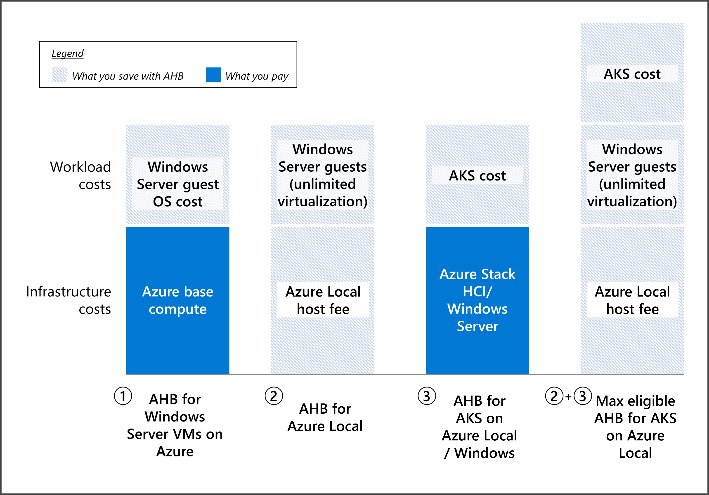

# Azure Hybrid Benefit for Windows Server

Azure Hybrid Benefit enables commercial customers to use their on-premises licenses that also have either active Software Assurance (SA) or a qualifying subscription to get Windows virtual machines (VMs) on Azure at a reduced cost. This article focuses on benefits for Windows Server licenses with SA or a qualifying subscription to get cost savings for Windows Server VMs in Azure, Azure Stack HCI, and Azure Kubernetes Service (AKS) hybrid deployments.

For other Azure hybrid benefits (for example, SQL Server), see [Azure Hybrid Benefit](https://azure.microsoft.com/pricing/hybrid-benefit/#why-azure-hybrid-benefit).

## What qualifies you for Azure Hybrid Benefit?

To qualify for Azure Hybrid Benefit for Windows Server, you need on-premises core licenses for Windows Server with active Software Assurance or qualifying subscription licenses. Software Assurance and qualifying subscription licenses are only available as part of Commercial Licensing agreements. To learn more about Commercial Licensing, see [Microsoft Licensing Resources](https://www.microsoft.com/licensing/default). To learn more about Windows Server core licenses, see [Windows Server product licensing](https://www.microsoft.com/licensing/product-licensing/windows-server?rtc=1).

> [!IMPORTANT]
> Workloads using Azure Hybrid Benefit can run only during the Software Assurance or subscription license term. When the Software Assurance or subscription license term approaches expiration, you must either renew your agreement with either Software Assurance or a subscription license, disable the hybrid benefit functionality, or deprovision those workloads that are using Azure Hybrid Benefit.

## What's included in Azure Hybrid Benefit?

Customers with Windows Server Software Assurance or qualifying subscription licenses can use Azure Hybrid Benefit to further reduce costs in the cloud and in datacenter and edge locations.

Azure Hybrid Benefit includes the following cost savings:

- **Windows Server VMs on Azure:** The license for Windows Server is covered by Azure Hybrid Benefit, so you only need to pay for the base compute rate of the VM. The base compute rate is equal to the Linux rate for VMs.

- **Azure Stack HCI:** The Azure Stack HCI host fee and Windows Server subscription fee are waived with Azure Hybrid Benefit. That is, unlimited virtualization rights are provided at no extra cost. You still pay other costs associated with Azure Stack HCI (for example, customer-managed hardware, Azure services, and workloads). Software Assurance must be active to use this benefit.

- **AKS:** Run AKS on Windows Server and Azure Stack HCI at no extra cost. You still pay for the underlying host infrastructure and any licenses for Windows containers unless you're also eligible for Azure Hybrid Benefit for Azure Stack HCI. With Azure Hybrid Benefit for Azure Stack HCI, you can waive fees for the Azure Stack HCI host and Windows Server subscription.



## Pricing for Azure Hybrid Benefit

To evaluate your potential cost savings, you can use these resources:

- **Windows VMs on Azure:** [Windows Virtual Machine Pricing](https://azure.microsoft.com/pricing/details/virtual-machines/windows). Use the [Azure Hybrid Benefit Savings Calculator](https://azure.microsoft.com/pricing/hybrid-benefit/) to estimate cost savings, or compare Windows VM pricing with and without Azure Hybrid Benefit.

- **Azure Stack HCI:** [Azure Stack HCI pricing](https://azure.microsoft.com/pricing/details/azure-stack/hci).  

- **Azure Kubernetes Service (AKS):** [AKS on Azure Stack HCI pricing](https://azure.microsoft.com/pricing/details/azure-stack/aks-hci).

## Getting Azure Hybrid Benefit for Windows VMs in Azure

Follow the guidance in this section to get and maintain Azure Hybrid Benefit for your Windows VMs in Azure.

### Licensing prerequisites

To qualify for Azure Hybrid Benefit for Windows VMs in Azure, you must meet the following licensing prerequisites.

#### Types of license

- Windows Server Standard with active Software Assurance.
- Windows Server Datacenter with active Software Assurance.

#### Number of licenses

You need a minimum of 8 core licenses (Datacenter or Standard edition) per VM. For example, 8 core licenses are still required if you run a 4-core instance. You may also run instances larger than 8 cores by allocating licenses equal to the core size of the instance. For example, 12 core licenses are required for a 12-core instance. For customers with processor licenses, each 2-core processor license is equivalent to 16 core licenses.

#### Use rights

- **Windows Server Standard edition:** Licenses must be used either on-premises or in Azure, but not at the same time. The only exception is on a one-time basis, for up to 180 days, to allow you to migrate the same workloads to Azure.  

- **Windows Server Datacenter edition:** Licenses allow simultaneous usage on-premises and in Azure. Dual Use Rights don't apply for licenses allocated for [Unlimited Virtualization Rights](#unlimited-virtualization).

#### Unlimited virtualization

Unlimited Virtualization Rights refers to the right to use any number of Windows Server VMs on a host.  

- **Windows Server Datacenter edition:** You can use any number of Windows Server VMs on an Azure dedicated host if you allocate Windows Server Datacenter licenses with active SA or subscription for all the available physical cores on that Azure server.

- **Windows Server Standard edition:** Unlimited Virtualization Rights aren't available.

### How to apply Azure Hybrid Benefit for Windows VMs in Azure

To learn how to deploy Windows Server VMs in Azure with Azure Hybrid Benefit, follow the steps in [Explore Azure Hybrid Benefit for Windows VMs](/azure/virtual-machines/windows/hybrid-use-benefit-licensing). One way to activate Azure Hybrid Benefit for a Windows Server VM is to check the box under **Licensing** during VM creation, as shown in the following screenshot.


### How to maintain compliance

If you apply Azure Hybrid Benefit to your Windows Server VMs, verify the number of eligible licenses and the Software Assurance (or subscription) coverage period before you activate this benefit. Use the preceding guidelines to make sure you deploy the correct number of Windows Server VMs with this benefit.

If you already have Windows Server VMs running with Azure Hybrid Benefit, perform an inventory to see how many units you're running, and check this number against your Software Assurance or subscription licenses. You can contact your Microsoft licensing specialist to validate your Software Assurance licensing position.

To see and count all VMs that are deployed with Azure Hybrid Benefit in an Azure subscription, [list all VMs and virtual machine scale sets](/azure/virtual-machines/windows/hybrid-use-benefit-licensing#list-all-vms-and-virtual-machine-scale-sets-with-azure-hybrid-benefit-for-windows-server-in-a-subscription) using the steps in [Explore Azure Hybrid Benefit for Windows VMs](/azure/virtual-machines/windows/hybrid-use-benefit-licensing).

You can also look at your Microsoft Azure bill to determine how many VMs with Azure Hybrid Benefit for Windows Server you're running. You can find information about the number of instances with the benefit under **Additional Info**:

```json
"{"ImageType":"WindowsServerBYOL","ServiceType":"Standard_A1","VMName":"","UsageType":"ComputeHR"}"
```

Billing isn't applied in real time. Expect a delay of several hours after you activate a Windows Server VM with Azure Hybrid Benefit before the VM shows on your bill.

To get a comprehensive view of your licensing position, perform an inventory in each of your Azure subscriptions. Confirm that you're fully licensed for the Windows Server VMs running with Azure Hybrid Benefit. You don't need to take any further action.

Perform an inventory regularly to make sure you're using any license benefits that you're entitled to. Regular inventories can help you reduce costs and make sure that you always have enough licenses to cover the Windows Server VMs you've deployed with Azure Hybrid Benefit.

If you don't have enough eligible Windows Server licenses for your deployed VMs, you have three choices:

- Purchase extra Windows Server licenses covered by Software Assurance or subscription through a commercial licensing agreement.
- Disable Azure Hybrid Benefit for some of your VMs and purchase them at regular Azure hourly rates.
- Deallocate some VMs.

> [!NOTE]
> Microsoft reserves the right to audit customers at any time to verify eligibility for Azure Hybrid Benefit utilization.

## Getting Azure Hybrid Benefit for Azure Stack HCI

Use the guidance in this section to get Azure Hybrid Benefit for your Azure Stack HCI infrastructure.

### Licensing prerequisites

To qualify for Azure Hybrid Benefit for Azure Stack HCI, you must meet the following licensing prerequisites.

#### Types of license

- Windows Server Datacenter with active Software Assurance licenses only. Software Assurance must be active to use this benefit.

#### Number of licenses

- Each Windows Server core license entitles use on one physical core of Azure Stack HCI. You need to allocate enough core licenses for all physical cores on servers in the Azure Stack HCI cluster.

#### Unlimited virtualization

- You can use any number of Windows Server VMs on the Azure Stack HCI cluster if you allocate enough core licenses for all physical cores on servers in the Azure Stack HCI cluster.

#### Use rights

- Licenses must be used either on-premises or on Azure Stack HCI, but not on both. You have 180 days of concurrent licensing to migrate your servers.

### How to apply Azure Hybrid Benefit for Azure Stack HCI

You can learn how to deploy Azure Hybrid Benefit for Azure Stack HCI by following the steps in [Azure Stack HCI billing and payment](/azure-stack/hci/concepts/azure-hybrid-benefit). One method is to activate the benefit from the **Configuration** pane of the Azure Stack HCI resource, as shown in the following screenshot.


## Getting Azure Hybrid Benefit for AKS

Follow the guidance in this section to get [Azure Hybrid Benefit for AKS](/azure/aks/hybrid/azure-hybrid-benefit).

### Licensing prerequisites

To qualify for Azure Hybrid Benefit for AKS, you must meet the following licensing prerequisites.

#### Eligible hosts

- Windows Server 2019 or later (Datacenter only), or
- Azure Stack HCI

#### Types of license

- Windows Server Standard with active Software Assurance or subscription.
- Windows Server Datacenter with active Software Assurance or subscription.

#### Number of licenses

- Each Windows Server core license entitles use on one virtual core of AKS.

#### Use rights

- Azure Hybrid Benefit for AKS is additive. Core licenses used for Azure Hybrid Benefit for AKS can be used at the same time with on-premises Windows Server licensing, as well as Azure Hybrid Benefit for other workloads in this article.

### How to apply Azure Hybrid Benefit for AKS

To get started with Azure Hybrid Benefit for AKS, see [Azure Hybrid Benefit for AKS](/azure/aks/hybrid/azure-hybrid-benefit).

## FAQ: Azure Hybrid Benefit

#### Which regions are eligible for Azure Hybrid Benefit?

Azure Hybrid Benefit is available across all Azure regions and sovereign clouds.

#### What happens to my benefits if my Software Assurance or subscription expires?

To use these benefits, your Software Assurance or qualifying subscription must be active. If you choose not to renew your Software Assurance or subscription when it expires, you need to remove your benefits from your resources in the Azure portal.

#### What is Software Assurance?

Software Assurance is a comprehensive Volume Licensing program. Software Assurance is only available through Volume Licensing and is purchased when you buy or renew a Volume Licensing agreement. It's included with some agreements and is an optional purchase with others. Software Assurance benefits include new product version rights, support, license mobility rights, and a unique set of technologies and services to maximize your IT investments.

For information about Volume Licensing, see [Microsoft Licensing](https://www.microsoft.com/en-us/Licensing/default). To learn more about Software Assurance benefits, and how each benefit can help meet your business needs, see [Software Assurance benefits](https://www.microsoft.com/Licensing/licensing-programs/software-assurance-by-benefits).

#### What is a subscription license?

Subscription licenses are licenses to run the software only during the term of the subscription. Subscription licenses don't include perpetual rights to run the software.

#### How can customers get Software Assurance?

You can purchase Software Assurance through Volume Licensing. Your Software Assurance benefits are activated in the [Volume Licensing Service Center (VLSC)](https://www.microsoft.com/Licensing/servicecenter/default.aspx). If your organization has a Microsoft Products and Services Agreement (MPSA), the [Business Center](https://businessaccount.microsoft.com/Customer/) is your destination for easy management of your Software Assurance benefits.

## See also

- [Azure Hybrid Benefit product page](https://azure.microsoft.com/pricing/hybrid-benefit)
- [Explore Azure Hybrid Benefit for Windows VMs](/azure/virtual-machines/windows/hybrid-use-benefit-licensing)
- [Azure Hybrid Benefit for Azure Stack HCI](/azure-stack/hci/concepts/azure-hybrid-benefit-hci)
